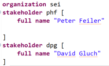
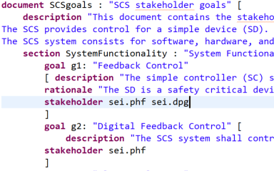
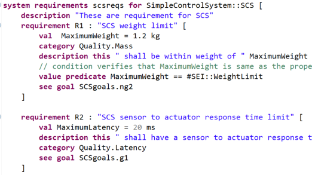
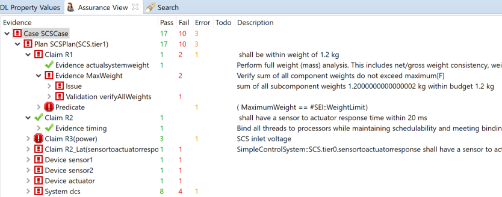

<!--
Copyright (c) 2004-2020 Carnegie Mellon University and others. (see Contributors file). 
All Rights Reserved.

NO WARRANTY. ALL MATERIAL IS FURNISHED ON AN "AS-IS" BASIS. CARNEGIE MELLON UNIVERSITY MAKES NO WARRANTIES OF ANY
KIND, EITHER EXPRESSED OR IMPLIED, AS TO ANY MATTER INCLUDING, BUT NOT LIMITED TO, WARRANTY OF FITNESS FOR PURPOSE
OR MERCHANTABILITY, EXCLUSIVITY, OR RESULTS OBTAINED FROM USE OF THE MATERIAL. CARNEGIE MELLON UNIVERSITY DOES NOT
MAKE ANY WARRANTY OF ANY KIND WITH RESPECT TO FREEDOM FROM PATENT, TRADEMARK, OR COPYRIGHT INFRINGEMENT.

This program and the accompanying materials are made available under the terms of the Eclipse Public License 2.0
which is available at https://www.eclipse.org/legal/epl-2.0/
SPDX-License-Identifier: EPL-2.0

Created, in part, with funding and support from the United States Government. (see Acknowledgments file).

This program includes and/or can make use of certain third party source code, object code, documentation and other
files ("Third Party Software"). The Third Party Software that is used by this program is dependent upon your system
configuration. By using this program, You agree to comply with any and all relevant Third Party Software terms and
conditions contained in any such Third Party Software or separate license file distributed with such Third Party
Software. The parties who own the Third Party Software ("Third Party Licensors") are intended third party benefici-
aries to this license with respect to the terms applicable to their Third Party Software. Third Party Software li-
censes only apply to the Third Party Software and not any other portion of this program or this program as a whole.
-->
# Getting Started

To get started, you create an AADL project for your architecture models
in AADL, for your requirement/verification specifications, and for other
specifications such as Resolute libraries used in the verification. You
also want to import the *AlisaPredefined* project
from
[https://github.com/osate/alisa-examples](https://github.com/osate/alisa-examples), which
provides predefined categories and a registry of all OSATE Analysis
plugins. You may also define Java projects that include
JUnit4 tests or Plug-in projects to Java based verification methods on
AADL models. Figure 1 shows a workspace with the imported
*AlisaPredefined* project, a project with JUnit tests, and the
 *SimpleControlSystem* project with a folder for the AADL model and
a separate folder for the requirements and verification plans.

If you have multiple projects, make sure you specify *Project
References* through the *Preferences* menu. Select a project, select
*Preferences* under the *Window* menu, (type *pref* into the search bar
of the preferences dialog and then specify the projects in which this
project will reference file content.

*Figure 1:* Alisa Project Dependencies

You will create stakeholder goals and system requirements. You will do
so in the context of an AADL model that represents the system of
interest in its operational context by explicitly modeling all the
entities in the operational environment that the system may be exposed
to and interact with.

Stakeholders are defined as members of an organization. Each
organization and its members is defined in a separate *.org* file (see
Figure 2).

*Figure 2:* Stakeholder Descriptions as Members of Organizations

Users can define a collection of stakeholder *goals* for a system (see
Figure 3). For each goal one or more stakeholders can be identified. In
the process the user want to utilize a use case notation such as the URN
Use Case Maps (UCM) - see
[jUCMNav](http://jucmnav.softwareengineering.ca/ucm/bin/view/ProjetSEG/WebHome).

 *Figure 3:* Stakeholder Goals

System *requirements* are specified in a system *requirement
specification* (see Figure 4). They are
traced to stakeholder goals and they identify the component type or
implementation in the AADL model the requirement is associated with.
Users can also specifies values as constants that can be used in
descriptions and as operands in assert expressions. Typically, those are
values that the user may want to change.

Requirements can be refined into requirements that are verifiable. All
*leaf* requirements are expected to be verifiable.

 *Figure 4:* System Requirements in Context of an AADL Model

For each system the user specifies a verification plan (see Figure 5).
The verification plan specifies a claim for each requirement of the
system of interest, identifying a collection of verification activities
and making the argument of sufficient evidence if these verification
activities applied to a system implementation pass. Users may impose an
order to indicate that some are dependent on the successful completion
of others, and specify that in case of an incomplete execution
(*error*, *timeout*), or returning a negative
result (*fail*) an alternative verification activity may be performed.

 *Figure 5:* Verification Plan for System Requirements

Typically the user will work with an existing *registry* of
*verification methods* for the OSATE plugins. Users can define
additional registries for methods they wrote in Resolute, Java/Xtend.

*Figure 6: Assurance Plans to Configure an Assurance Case*

Finally, the user will define the an *assurance case* for a
system (see Figure 6). For the top-level system the user defines an
*assurance plan* for verifying a system implementation.
An assurance plan identifies the verification plans to be used (*assure*
and identifies for
each of the subsystems whether they are verified separately (*assume subsystem*) or as part of the given
assurance case (*assure subsystem*).

The user may define filters on the assurance case (*assurance task*)
that specify selection criteria for a subset of the requirements and
verification activities in the assurance plan that are to be viewed and
performed at a given point in time. The selection criterion is expressed
in terms of category labels.

*Figure 7:* Results of an Assurance Case Execution

Users execute assurance cases through the Assurance View (see Figure 7). It shows assurance cases in the workspace and allows users to select an appropriate filter to be applied in the column next to the assurance cases. Verification is invoked through the context menu once an assurance case is selected. Verify All executes all verification activities present in the filter independent if whether they have been previously verified. Verify TBD execute only those verification activities that have not been verified yet (are in the state TBD). 

As the verification is running in the background the Assurance Progress view shows the verification activities being executed (the state of execution, the result, execution time).

The assurance case results are shown on the right in the Assurance View. In the left column users see the assurance case hierarchy with the assurance case and its assurance plan, which contains claims and their verification activities as well as any subsystems that are verified as part of the case. The second column shows the counts as percentage based bars. Green shows Success, red exclamation mark shows Fail, white exclamation mark shows Error, and dark blue shows ToDo. The results are aggregated in counts shown on the right (Pass, Fail, Error, ToDo). 

> Note: The Assurance View can be activated through Window/Show Views/Other/Alisa
