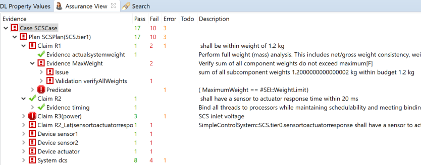

<!--
Copyright (c) 2004-2020 Carnegie Mellon University and others. (see Contributors file). 
All Rights Reserved.

NO WARRANTY. ALL MATERIAL IS FURNISHED ON AN "AS-IS" BASIS. CARNEGIE MELLON UNIVERSITY MAKES NO WARRANTIES OF ANY
KIND, EITHER EXPRESSED OR IMPLIED, AS TO ANY MATTER INCLUDING, BUT NOT LIMITED TO, WARRANTY OF FITNESS FOR PURPOSE
OR MERCHANTABILITY, EXCLUSIVITY, OR RESULTS OBTAINED FROM USE OF THE MATERIAL. CARNEGIE MELLON UNIVERSITY DOES NOT
MAKE ANY WARRANTY OF ANY KIND WITH RESPECT TO FREEDOM FROM PATENT, TRADEMARK, OR COPYRIGHT INFRINGEMENT.

This program and the accompanying materials are made available under the terms of the Eclipse Public License 2.0
which is available at https://www.eclipse.org/legal/epl-2.0/
SPDX-License-Identifier: EPL-2.0

Created, in part, with funding and support from the United States Government. (see Acknowledgments file).

This program includes and/or can make use of certain third party source code, object code, documentation and other
files ("Third Party Software"). The Third Party Software that is used by this program is dependent upon your system
configuration. By using this program, You agree to comply with any and all relevant Third Party Software terms and
conditions contained in any such Third Party Software or separate license file distributed with such Third Party
Software. The parties who own the Third Party Software ("Third Party Licensors") are intended third party benefici-
aries to this license with respect to the terms applicable to their Third Party Software. Third Party Software li-
censes only apply to the Third Party Software and not any other portion of this program or this program as a whole.
-->
# Configuration of Assurance Plans and Assurance Case Results

[TOC levels=2-4 bullet hierarchy]

The *Alisa* notation lets users specify *assurance cases* that consist of one or more *assurance plans*. Each assurance case is kept in a separate file with the extension *alisa*.

An *assurance plan* configures how a system is to be assured. It identifies the AADL model that represents an implementation to be verified against the requirements. It also indicates whether subsystems can be assumed to have been verified separately or whether their verification is part of this plan.

An *assurance task* allows users to focus on a subset of the requirements and verification activities at a time by specifying a set of filter criteria in terms of category labels.  

Assurance cases get automatically instantiated as *assurance case result instances*. Assurance case result instances are then executed to verify AADL instance models for the root system implementation specified in each assurance plan and the results are recorded. Assurance case result instances are represented by the Assure notation in files with the extension assure. 

## Assurance Case and Assurance Plans

Users will define at least one assurance case for a system. It specifies
the complete set of verification activities to be performed for the
system. Users can then specify filtered subsets of verification
activities as assurance tasks.

The assurance case may involve multiple AADL model instances, each with
a different level of fidelity, i.e., expanded out to different levels of
detail and properties. They are represented by separate assurance plans.

Users may define separate assurance cases and plans for subsystems of
the system. Such an assurance case specification allows the subsystem to
be verified separately. Users can then configure the assurance plans of
the system to include the verification of the subsystem, or assume that
the subsystem has been verified separately.

For each assurance plan the following verification plans will be
included to generate the assurance case result instance:

* Verification plans for the *system requirement set* of the component implementation that is the target of the assurance plan and those of all component classifiers that this classifier inherits from – according to the same inheritance rules as for features and properties in core AADL. This includes all component implementations that this classifier extends, and all component types and their extension ancestors.  

* Verification plans for global requirements that have been included in any of the system requirement specifications or are explicitly specified in an **assure global** declaration. They will be included for the target component and any subcomponent that matches the specified component categories. For those subsystems that are not listed in an **assume subsystem** declaration, this will be done for the complete instance model hierarchy.  

* If a subsystem assurance is not assumed, then the verification plans of the subsystem will be included according to the assurance plans for that subsystem. If no assurance case declaration can be found, all verifications associated with the system requirements of that subsystem classifier will be included – as well as verification plans for global requirements included in the system requirements declaration. Users can explicitly declare subsystems to be assured by **assure subsystem**.

Assurance case and assurance plan declarations have the following
syntax:

<pre>
AssuranceCase ::=
assurance case qualifiedname ( : "descriptive title" )? 
for <component type reference>
[
 ( description Description )? 
 AssurancePlan+
 AssuranceTask* 
]

AssurancePlan ::=
assurance plan name ( : "descriptive title" )?
for <component implementation reference>
[
 ( description Description )? 
 ( assure <verification plan reference>* )?
 ( assure global <global verification plan reference>* )?
 ( assure subsystem <assure subsystem reference>+ | all )?
 ( assume subsystem <assumed subsystem reference>+ | all )?
 ( issues "issue text"+ )?      
]
</pre>

The assurance case consists of:

* *Qualifiedname*: a &lt;dot&gt; separated sequence of identifiers. The assurance case name acts as qualifier for assurance plans and tasks.

* *Title*: a short descriptor of the verification method registry. This optional element may be used as more descriptive label than the name.

* *For*: component type reference that identifies the system to be assured by its type. The component implementations specified in the assurance plans must be an implementation of this type according to the extends hierarchy.  

* *Description*: a description of the verification method. 

* *AssurancePlan*: one or more assurance plans that make up the assurance case configuration.

* *AssuranceTask*: zero or more filtered views of the assurance case that specifies a subset of verification activities according to specified category labels.

The assurance plan consists of:

* *Name*: identifier of the plan. Assurance plan references are qualified with the enclosing assurance case name.  

* *Title*: a short descriptor of the verification method registry. This optional element may be used as more descriptive label than the name.

* *For*: component implementation reference that identifies the system implementation to be assured. The component implementation is the root of the instance model on which verification activities are executed.  

* *Description*: a description of the verification method. 

* *Assure*: optional list of references to verification plans for the system. This list can be derived by the workbench or explicitly specified.

* *Assure global*: optional list of references to global verification plans that are not included as part of the system.  

* *Assure subsystem*: names of subsystems in the component implementation whose assurance and verification plans should be included. All indicates all subsystems. The list of names is without commas.

* *Assume subsystem*: names of subsystems in the component implementation whose assurance and verification plans should be excluded. All indicates all subsystems. The list of names is without commas.

* *Issues*: allows users to record issues that may be encountered as a set of textual notes (Strings).

## Assurance Task

*Assurance tasks* specify a set of filter criteria for a focused verification of a subset of requirements, verification activities, and methods according to specified category labels. The assurance tasks apply to the assurance case they are contained in.

Assurance task declarations have the following syntax:

<pre>
AssuranceTask ::=
assurance task name ( : "descriptive title" )?
[
 ( description Description )? 

 ( category categorylabels | any )?
 ( issues "issue text"+ )?      
]
</pre>

The assurance task consists of:

* *Name*: identifier of the task. Assurance task references are qualified with the enclosing assurance case name.  

* *Title*: a short descriptor of the verification method registry. This optional element may be used as more descriptive label than the name.

* *Description*: a description of the verification method. 

* * Category*: list of selection category labels (without comma separation) , one of which must match the quality labels of requirement or verificaiton method. Any indicates that a requirement, verification method, or verification activity without category labels is considered a match.

* *Issues*: allows users to record issues that may be encountered as a set of textual notes (Strings).

## Assurance Case Results

The *Assure* notation is used to represent assurance case results for an instance of an assurance case associated with a set of AADL model instances. 

> Assurance results files are automatically generated from an assurance case specified in an *Alisa* file. The generated file has the extension assure and is placed in the assure folder.  

The *assurance case result instance* representation maintains the state of verification activities, preconditions, and validations as well as the cumulative state for individual claims as well as all claims for a specific system instance model as specified by assurance plans, and for the whole assurance case. The following *AssureResult* 
objects are maintained:

* *Assurance case result*: the results of the complete instance of an assurance case.

* *Model result*: the assurance results for a system according to an assurance plan. This includes claim results for the system as well as Assure results (model results or subsystem results) for any subsystem that is part of a given assurance plan. 

* *Subsystem result*: the assurance results for a subsystem according to its verification plans. For subsystems with explicit assurance plans Model result is used.

* *Claim result*: the claim results for a requirement of a system, i.e., all its verification activity results, any subclaims. The verification activities are executed, and their results evaluated according to the argument expression specified as part of the claim.  

* *Verification activity result*: the result of executing a verification activity. A verification activity may have preconditions that must be satisfied to be executed. The verification activity result validity may be determined by a validation activity.  

* *Precondition/validation result*: the result of executing a precondition/validation activity.  

* *then/else result*: the result of the then or else operator. The else result tracks whether the unsuccessful left hand operand was a fail, timeout, or error.

A verification activity, precondition, and validation maintains *execution state* and *result state*. 

The execution state has the following values:

* *todo*: verification activity is to be executed  

* *running*: execution of the verification activity is in progress  

* *completed*: execution is complete with results  

* *redo*: a verification activity, whose execution is in progress, must be re-executed due to user changes. When the execution completes the state transitions to todo. 

The result state has the following values:

* *tbd*: the result value is to be determined by executing the verification activity. In the viewer this state is shown as [tbd].  

* *pass*: the verification activity completed and the evaluated predicate returned a positive result.   

* *fail*: the verification activity completed and the evaluated predicate returned a negative result.   

* *error*: the verification activity did not complete, thus, the result is unknown. For example, the verification method crashed or threw an exception.   

* *timeout*: the verification activity did not complete because it exceeded the alloted time (see timeout limit in verification activity).  

Each of the Assure Result objects maintains cumulative metrics in terms various result counts for pass, fail, error, todo. 

## Viewing and Executing the Assurance Case

Users execute assurance cases through the Assurance View (see Figure 1). It shows assurance cases in the workspace and allows users to select an appropriate filter to be applied. Verify All executes all verification activities present in the filter independent if whether they have been previously verified. Verify TBD execute only those verification activities that have not been verified yet (are in the state ToDo). 

*Figure 1:* Results of an Assurance Case Execution

The result of verification activity execution are presented as follows:

* Success is shown as green checkmark. 

* Fail is shown as red exclamation mark inside a red outlined box. 

* Error is shown as a white exclamation mark in a red box. 

* ToDo is shown as a question mark in a blue circle.

The assurance case results are shown in the *Assurance View*.  

On the left users see the assurance case hierarchy with the assurance case and its assurance plan, which contains claims and their verification activities as well as any subsystems that are verified as part of the case. The next columns show the counts for Pass, Fail, Error, and Todo. The last column provides descirptive text.  

> Note: The Assurance View can be activated through Window/Show Views/Other/Alisa
