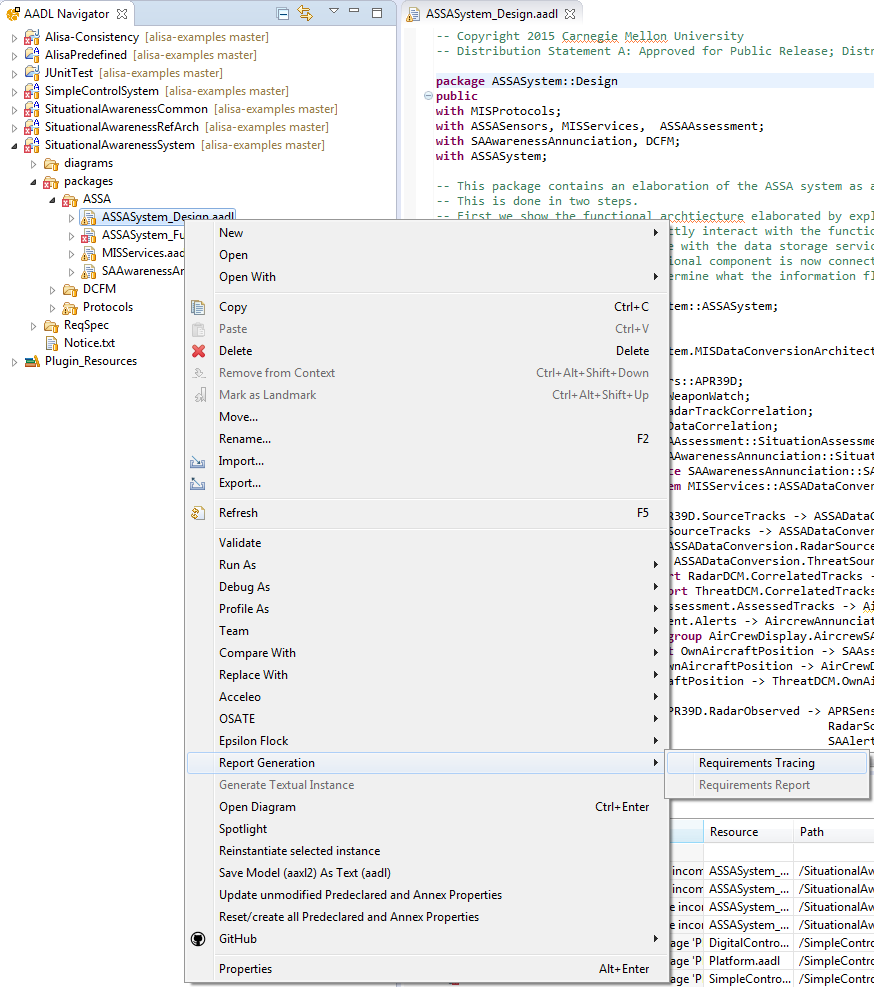
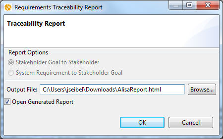
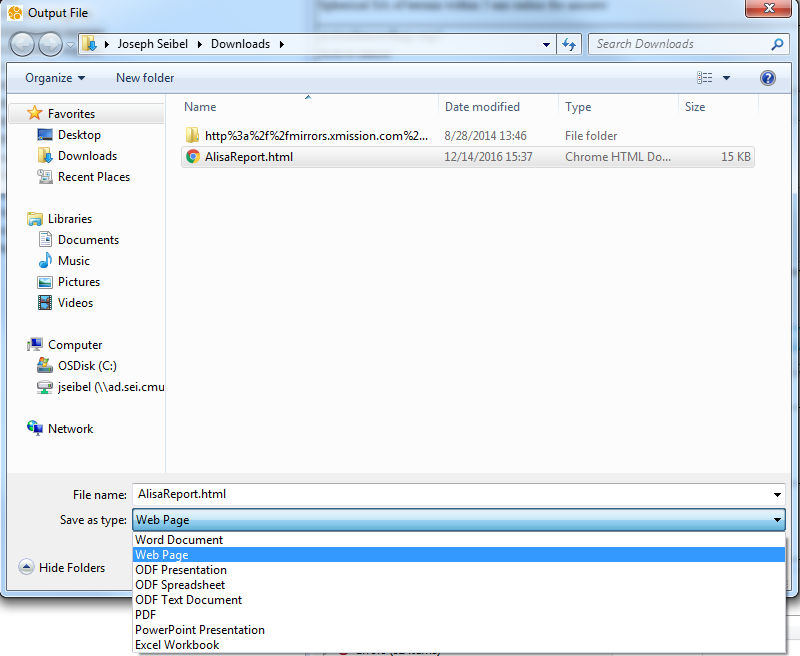
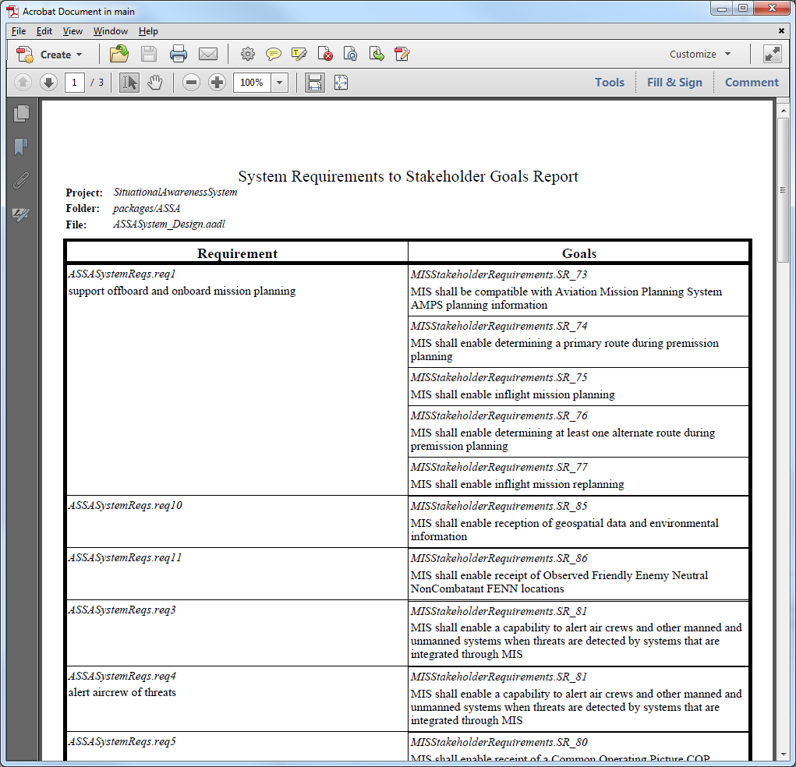
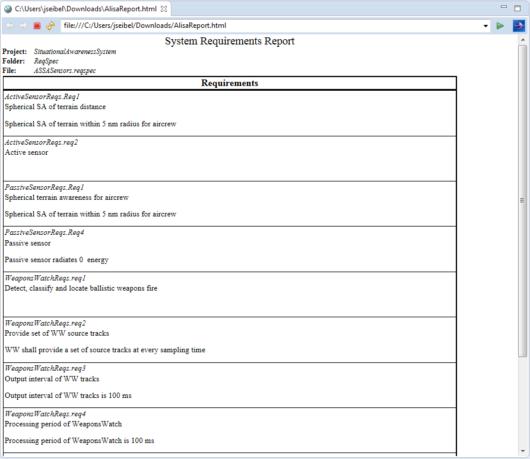

<!--
Copyright (c) 2004-2020 Carnegie Mellon University and others. (see Contributors file). 
All Rights Reserved.

NO WARRANTY. ALL MATERIAL IS FURNISHED ON AN "AS-IS" BASIS. CARNEGIE MELLON UNIVERSITY MAKES NO WARRANTIES OF ANY
KIND, EITHER EXPRESSED OR IMPLIED, AS TO ANY MATTER INCLUDING, BUT NOT LIMITED TO, WARRANTY OF FITNESS FOR PURPOSE
OR MERCHANTABILITY, EXCLUSIVITY, OR RESULTS OBTAINED FROM USE OF THE MATERIAL. CARNEGIE MELLON UNIVERSITY DOES NOT
MAKE ANY WARRANTY OF ANY KIND WITH RESPECT TO FREEDOM FROM PATENT, TRADEMARK, OR COPYRIGHT INFRINGEMENT.

This program and the accompanying materials are made available under the terms of the Eclipse Public License 2.0
which is available at https://www.eclipse.org/legal/epl-2.0/
SPDX-License-Identifier: EPL-2.0

Created, in part, with funding and support from the United States Government. (see Acknowledgments file).

This program includes and/or can make use of certain third party source code, object code, documentation and other
files ("Third Party Software"). The Third Party Software that is used by this program is dependent upon your system
configuration. By using this program, You agree to comply with any and all relevant Third Party Software terms and
conditions contained in any such Third Party Software or separate license file distributed with such Third Party
Software. The parties who own the Third Party Software ("Third Party Licensors") are intended third party benefici-
aries to this license with respect to the terms applicable to their Third Party Software. Third Party Software li-
censes only apply to the Third Party Software and not any other portion of this program or this program as a whole.
-->
# Report Generation
ALISA provides the ability to generate report documents with information related to the requirements for an AADL model.  These reports can be produced in a variety of formats including Word Document, Excel Spreadsheet, PowerPoint Presentation, PDF, HTML, and others.  Currently, there are two types of reports: **Requirements Tracing** and **Requirements Report**.

## Selecting the Report Type
The report type can be chosen by right clicking on an appropriate file or object in the **AADL Navigator**, then selecting the **Report Generation** sub-menu.  **Requirements Tracing** will be enabled if the selection in the **AADL Navigator** is an *Instance File*, a *ReqSpec File*, a *Goals File*, a *ReqDoc File*, a *GoalDoc File*, or an *AADL Package File*.  **Requirements Report** will be enabled if the selection in the **AADL Navigator** is a *ReqSpec File*, a *ReqDoc File*, or a *Component Classifier* within an *AADL Package File*.

## Requirements Tracing
When selecting **Requirements Tracing**, a dialog opens which allows for some customization of the report.  Depending on the selection in the **AADL Navigator**, you may be able to select which information is presented in the report.  The first option shows all of the *Stakeholder Goals* with their corresponding *Stakeholders*.  The second option shows all of the *System Requirements* with their corresponding *Stakeholder Goals*.  If a *Goals File* or a *GoalDoc File* was selected in the **AADL Navigator**, then the report will only show all *Stakeholder Goals* with their corresponding *Stakeholders*.  If a *ReqSpec File* or a *ReqDoc File* was selected in the **AADL Navigator**, then the report will only show all *System Requirements* with their corresponding *Stakeholder Goals*.

The dialog also requires that an output file is specified.  Click the **Browse...** button to choose where to save the report and what its format should be.

If **Open Generated Report** is selected, then the generated report will be opened for viewing either within OSATE or by an external application.

The following is an example of a **Requirements Tracing** report:

## Requirements Report
The **Requirements Report** will list all of the requirements associated with the selected object from the **AADL Navigator**.  The customization dialog is similar to the one for **Requirements Tracing**.  The following is an example of a **Requirements Report**:

