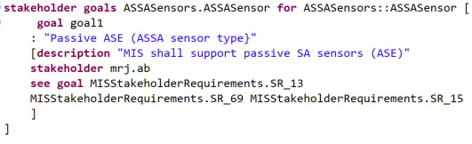
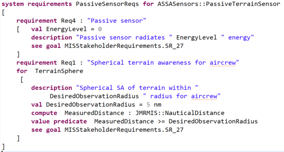

# Installation and Use of ReqSpec

This section describes the use of ReqSpec in OSATE. First, we describe
how ReqSpec files are created in OSATE. Then we illustrate several use
scenarios on an example.

### Installing ReqSpec and ALISA in OSATE

ReqSpec is part of ALISA which comes installed with OSATE. 

Users want to add a project called AlisaPredefined, which contains the predefined category types and a verification method registry for the analysis plugins available in OSATE. This project and example projects using ALISA are available at https://github.com/osate/alisa-examples. 

## ReqSpec Declarations in OSATE

In this section we describe how ReqSpec files are created, updated, and
analyzed through an Xtext-based textual editor. A navigator, forms and
graphics based user interface is currently in development.

Figure 1 shows the AADL Navigator on the left. The
SituationalAwarenessSystem project is shown as containing AADL model
packages organized into subfolders. In this example we have chosen to
put the ReqSpec files into a separate folder called *Requirements*. Note
the different extensions used to distinguish between different types of
ReqSpec files.

The right hand side shows a specification of system requirements. The
editor understands the syntax of the *Organization* notation. It
provides syntax coloring and ensures that each element of a stakeholder
specification, e.g., the phone number, is specified at most once. It
also supports content assist. When the user types &lt;control&gt;
&lt;spacebar&gt; the editor provides syntactically legal choices.

*Figure1* Project with ReqSpec and Organization Files

The ReqSpec files could be placed in a separate project if desirable. In that case the user will have to add a Project Reference into the project containing the ReqSpec files to reference the project containing the AADL models. This tells the ReqSpec tool where to find the AADL model.

Project references are set in the properties dialog for the project containing the ReqSpec files. It can be invoked by selecting the project in the AADL navigator and invoking it through the context menu. An example is shown in Figure 2.

*Figure2* Dialog to Set Project Preferences

New ReqSpec (reqspec, goals, reqdoc, goaldoc), Category (cat), or
Organization (org) files are created by invoking *File/New/File* and
specifying a file name with the appropriate extension.

Figure 3 shows a set of requirement specifications for the ASSA system.
These requirements originally came from a requirement document; using
the import tool, we migrated them into a ReqSpec annotation in an AADL
model.

*Figure* *3* Requirement Specification for the ASSA System

The top-level requirement specification (e.g. **for**
 ASSASystem::ASSASystem) identifies the classifier of the ASSA system.
The reference is qualified by the package name containing the
classifier. These references are hyperlinked to their target. When the
user holds down the &lt;control&gt; key while pausing the cursor over
the reference it is shown as hyperlink (i.e. underlined) that can be
followed by clicking on it. Navigation by hyperlink is tracked in a
navigation history. Users can return to the reference origin via
navigational commands or toolbar buttons.

The first requirement indicates that it is associated with an interface
feature of the ASSA system called the AMPSInterface. This association
reflects the fact that it is a requirement for the interaction between
the ASSA system and an Aviation Mission Planning System (AMPS). The *See
goal* elements identify several stakeholder goals that reflect the need
for an interaction between the ASSA system and AMPS.

The second requirement is for the same interface feature and in its
original text indicates the name of the interface for the interaction
with a mission planning system.

The third requirement is associated with a different interface feature
of the ASSA system.

Figure 4 illustrates a requirement with a parameterized value. The value
of the desired observation radius is captured in the variable called
*DesiredObservationRadius*. This variable is used in the requirement
description and in the requirement predicate. The requirement predicate
assures that any *MeasuredDistance* result from a verification activity
is at least as large as the desired observation radius. Finally, the
last line in this figure shows that the stakeholder requirement for this
system requirement can be found as a goal in an imported requirement
document.

*Figure 4* Requirement Predicate on Values

The ReqSpec/ALISA workbench performs consistency checks, such as
confirming traceability of a goal or requirement to a stakeholder and
ensuring that every component and interface feature has at least one
requirement associated with it.

## An Example System in ReqSpec

We are using ReqSpec in three ways for the ASSA system.

First, we have imported the content of the MIS stakeholder requirement
document and of the MIS system requirement specification document into
the OSATE environment (*MISStakeholderRequirements.goaldoc* and
*MIS-SSS.reqdoc*). In this case the requirements are initially not
associated with an AADL model. Once imported users can create an AADL
model and manually associated the requirements from the requirement
document with the model. In the process users may associate different
requirements from the same document section with different components in
the AADL model. The ReqSpec tool has an analysis that identifies
document sections that span multiple system components.

Second, we have created *stakeholder* *goals* sets and a *system
requirements* sets that are associated with different systems in the
architecture.  We have created separate files for each of the AADL
packages. The files contain sets of *goal* and *requirement*
specifications, one for each component specification in the AADL
package.

Figure 5 shows an example of a *stakeholder goals* set specified for
ASSASensor. The keyword *stakeholder goals* introduces a name for a set
of goals associated with the component *ASSASensor*. Each *goal*
specification has a unique name within the goal set. In our example it
includes a *title*, *description*, *stakeholder* reference, and a list
of references into the MIS stakeholder *requirement document*.

*Figure 5* Goal set for ASSA Sensors

Third, we illustrated requirement specifications that use variables to
parameterize the requirement and specify that a property in the AADL
model should have the same value as the variable or a particular value.
This practice ensures that a verification activity operating on the
model utilizes the correct values when performing the verification. In
Figure 6, we show two example scenarios.  One uses a constant in a
*value predicate* to indicate that the value of the variable and a
specific AADL property must be the same. In the other, the variable
value is passed as a parameter to a verification activity.

In our first example, the user has developed the model with a property
*JMRMIS::EnergyLevel*. In this case, we specify in a *value predicate*
that the constant value is consistent with the property value.

In the second example, the value of the requirement is defined by a
constant; in our example, it is called *DesiredObservationRadius*. This
value will then be used in a verification plan associated with the
requirements to indicate that its value is to be passed to a
verification method via a property in the AADL model. In this case, the
AADL model is automatically annotated with the appropriate property
value. Note that specifications of verification activities are expressed
by the *Verify* notation, which is part of the incremental lifecycle
assurance tool environment.

*Figure 6* Example of Requirement Specification Aligned with AADL
Model

## References

**\[ALISA 2016\]**

Architecture-Led Incremental System Assurance (ALISA) Workbench. 
https://github.com/osate/alisa

**\[Delange 2016\]**

Delange, J., Feiler, P., Ernst, N., *Incremental Life Cycle Assurance of Safety-Critical
Systems*, Proc. 8th European
Congress on Embedded Real Time Software and Systems, Jan 2016.
<https://hal.archives-ouvertes.fr/hal-01289468> 

**\[Eclipse 2015\]**

Eclipse. Xtend. 2015. http://www.eclipse.org/xtend

**\[FAA 2009\]**

Federal Aviation Administration. *Requirements Engineering Management Handbook*. DOT/FAA/AR-08/32. FAA. 2008.
<http://www.faa.gov/aircraft/air_cert/design_approvals/air_software/media/AR-08-32.pdf>

**\[Feiler 2015\]**

Feiler, Peter. *Requirements and Architecture Specification of the Joint
Multi-Role (JMR) Joint Common Architecture (JCA) Demonstration System*.
CMU/SEI-2015-SR-031. Software Engineering Institute, Carnegie Mellon
University. 2015.
http://resources.sei.cmu.edu/library/asset-view.cfm?assetid=447184

**\[IEEE 2009\]**

Institute of Electrical and Electronics Engineers. IEEE Standard
830-1998: Recommended Practice for Software Requirements Specifications.
IEEE Standards Association. 2009.

**\[Lamsweerde 2009\]**

van Lamsweerde, Axel van. *Requirements Engineering: From System Goals
to UML Models to Software Specifications*. Wiley. 2009.

**\[Nolan 2011\]**

Nolan, A. J.; Abrahao, S.; Clements, P.; and Pickard,
A. Managing Requirements Uncertainty in Engine Control Systems
Development. 259–264. *19th IEEE International
Requirements Engineering Conference (RE)*. Aug.
29–Sep. 2, 2011.
<http://ieeexplore.ieee.org/xpls/abs_all.jsp?arnumber=6051622&tag=1>

**\[OMG 2015\]**

Object Management Group. OMG Systems Modeling Language. OMG. 2015.
http://www.omgsysml.org

**\[OSATE 2016\]**

Open Source AADL Tool Environment (OSATE). 
https://wiki.sei.cmu.edu/aadl\#OSATE.

**\[SAE 1996\]**

SAE International. ARP4761: Guidelines and Methods for Conducting the
Safety Assessment Process on Civil Airborne Systems and Equipment. SAE.
1996.
