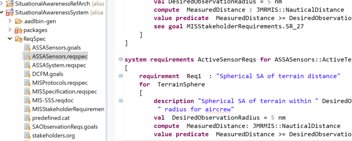
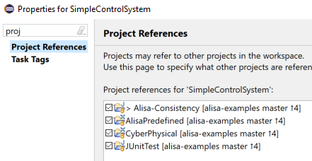
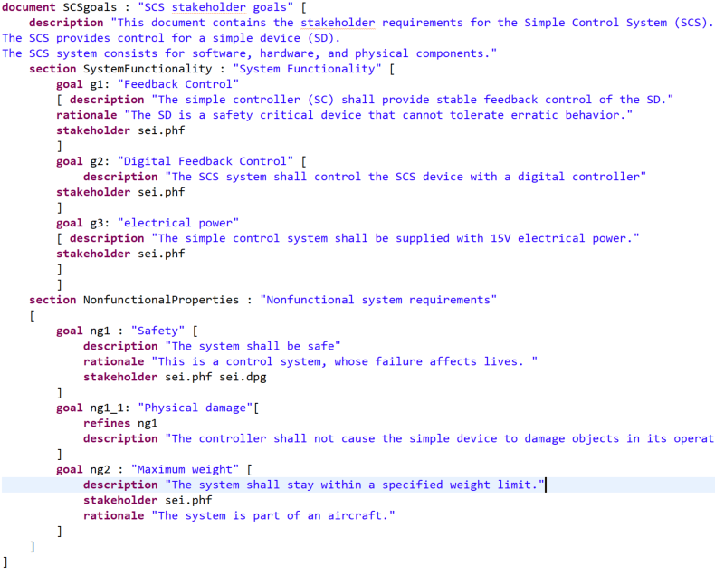
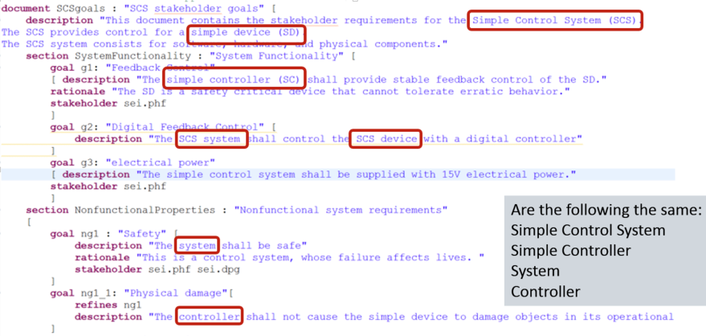
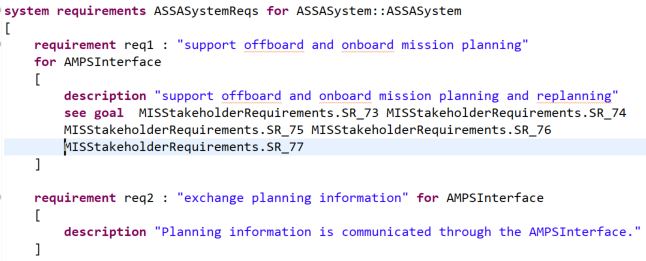
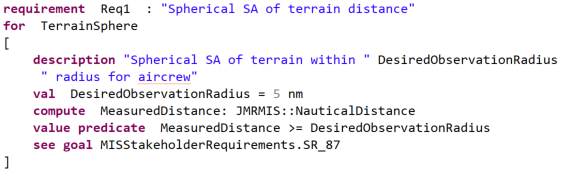

<!--
Copyright (c) 2004-2020 Carnegie Mellon University and others. (see Contributors file). 
All Rights Reserved.

NO WARRANTY. ALL MATERIAL IS FURNISHED ON AN "AS-IS" BASIS. CARNEGIE MELLON UNIVERSITY MAKES NO WARRANTIES OF ANY
KIND, EITHER EXPRESSED OR IMPLIED, AS TO ANY MATTER INCLUDING, BUT NOT LIMITED TO, WARRANTY OF FITNESS FOR PURPOSE
OR MERCHANTABILITY, EXCLUSIVITY, OR RESULTS OBTAINED FROM USE OF THE MATERIAL. CARNEGIE MELLON UNIVERSITY DOES NOT
MAKE ANY WARRANTY OF ANY KIND WITH RESPECT TO FREEDOM FROM PATENT, TRADEMARK, OR COPYRIGHT INFRINGEMENT.

This program and the accompanying materials are made available under the terms of the Eclipse Public License 2.0
which is available at https://www.eclipse.org/legal/epl-2.0/
SPDX-License-Identifier: EPL-2.0

Created, in part, with funding and support from the United States Government. (see Acknowledgments file).

This program includes and/or can make use of certain third party source code, object code, documentation and other
files ("Third Party Software"). The Third Party Software that is used by this program is dependent upon your system
configuration. By using this program, You agree to comply with any and all relevant Third Party Software terms and
conditions contained in any such Third Party Software or separate license file distributed with such Third Party
Software. The parties who own the Third Party Software ("Third Party Licensors") are intended third party benefici-
aries to this license with respect to the terms applicable to their Third Party Software. Third Party Software li-
censes only apply to the Third Party Software and not any other portion of this program or this program as a whole.
-->
# Guidelines for Requirements Modeling

* Copyright 2016 Carnegie Mellon University. See Notice.txt
* Distribution Statement A: Approved for Public Release; Distribution is Unlimited.

[TOC levels=2-4 bullet hierarchy]

This note provides some guidance on how to capture requirements using the ReqSpec notation and AADL, and to make requirements verifiable in Architecture-Led Incremental System Assurance (ALISA) capability of OSATE. ALISA is now part of OSATE. For more detailed documentation of ReqSpec we refer to the [ReqSpec Technical Report](https://resources.sei.cmu.edu/asset_files/TechnicalReport/2016_005_001_464378.pdf).

Several example models are available at [Github.com/osate/alisa-examples](https://github.com/osate/alisa-examples). The example model *Simple Control System* is used in this guidance.

The guidance approach is as follows. 
First we describe how users can organize AADL models and ALISA files into folders and projects. Then we discuss disfferent aspects of requirement capture and verification.

Elicitation of stakeholder requirements focuses on capturing the goals and desires of stakeholders. These requirements, which we refer to as **stakeholder goals**, should be traceable to specific stakeholders, may be refined into sub goals, they may evolve, and they may be in conflict with each other. 

In a separate phase we develop **system requirements**. They are derived from the stakeholder goals. System requirements become the contract that must be met by a system implementation, i.e., must be verifiable or satisfiable. Verification plans specify the verification activities necessary to show that a set of requirements are met.
ReqSpec allows goals and requirements to be organized in a document structure with sections and subsections, or into goal/requirement sets aligned with systems and subsystems expressed in an AADL model. 

In this guidance we recommend that stakeholder goals be organized in a document structure, which is a familiar format and does not require the creation of an AADL model. This allows the focus of stakeholder goal elicitation to be on capturing the information provided by the stakeholders. We recommend that in a second phase system requirements be organized around an AADL model of the system of interest, its operational context, and as appropriate any subsystems that are identified in the stakeholder goals. In the process ambiguities with respect to the system boundary, the consistency, completeness, and verifiability of requirements are resolved.
We proceed by illustrating each of the two phases. 
This is followed by a discussion of how verification plans can be specified and how users can define their own verification methods for verifying requirements.

## Organizing ReqSpec Files

Users create files that contain stakeholder goal sets,
system requirement sets, global requirement sets, goals and requirements
in document structured format, global constants, stakeholders in
organizations, and category types by creating files with the appropriate
extension. Users can place these files in folders within a project that
contains the AADL model; for instance, you can create a folder named
*requirements*
at the same level within a project as a folder
called *packages* that
contains AADL packages. 

Figure 1 shows the AADL Navigator on the left. The
SituationalAwarenessSystem project is shown as containing AADL model
packages organized into subfolders. In this example we have chosen to
put the ReqSpec files into a separate folder called *Requirements*. Note
the different extensions used to distinguish between different types of
ReqSpec files.

The right hand side shows a specification of system requirements. The
editor understands the syntax of the *Organization* notation. It
provides syntax coloring and ensures that each element of a stakeholder
specification, e.g., the phone number, is specified at most once. It
also supports content assist. When the user types &lt;control&gt;
&lt;spacebar&gt; the editor provides syntactically legal choices.

*Figure 1* Project with ReqSpec and Organization Files

The ReqSpec files could be placed in a separate project if desirable. In that case the user will have to add a Project Reference into the project containing the ReqSpec files to reference the project containing the AADL models. This tells the ReqSpec tool where to find the AADL model.

Project references are set in the properties dialog for the project containing the ReqSpec files. It can be invoked by selecting the project in the AADL navigator and invoking it through the context menu. An example is shown in Figure 2.

*Figure 2* Dialog to Set Project Preferences

New ReqSpec (reqspec, goals, reqdoc, goaldoc), Category (cat), or
Organization (org) files are created by invoking *File/New/File* and
specifying a file name with the appropriate extension.

##Stakeholder Goal Elicitation

Stakeholder goals are captured in files with the *goaldoc* extension. Users create such files with the *New .. File* command under the *File* menu.
The content of the file consists of a **document** with a name and a *title* string, followed by the document content in square brackets. 

> The document name acts the qualifier for external references to goals and is assumed to be unique within the OSATE workspace. 

The document content consists of a **description** as a multi-line string, a set of **section**, and **goal**. The description is intended as introductory text for the document before the first section or goal. 
A **section** consists of a section name, *title* string, and its content in square brackets. The content is a description, (sub)sections, and goals.
A **goal** consists of a name that is unique within the goal document, a *title* string and its content in square brackets. The goal content is a description and optionally a reference to a stakeholder.

With these three constructs users can create stakeholder goal documents that follow a traditional document structure that organizes goals into sections and subsections. 

> Goals have unique names within a goal document. They are referenced by their unique name within the same goal document and by qualifying the name with the goal document name if a goal in a different goal document is referenced. The placement of goals in sections does not affect how goals are referenced.

Stakeholder goals can be divided into sub goals. We do this by adding the sub goal as goal and referring to the original goal with **refines**.

*Figure 3:* Stakeholder Goals

### Defining Stakeholders

We can define stakeholders in a file with the extension *org*. Stakeholders are placed into an **organization**. A stakeholder entry has a name and a number of content fields. A stakeholder is referred to in goals by *organizationname.stakeholdername*.

*Figure 4:* Stakeholder Descriptions as Members of Organizations

##From Goals to System Requirements

When stakeholder goals are captured the system they apply to may be identified by different names. Figure 5 illustrates this for our example. Goals sometimes refer to elements in the operational environment or to different parts of a system. When we translate stakeholder goals into system requirements we want to make the requirements verifiable and we want to be clear about the system boundary.
In our above example we have a number of terms that potentially refer to the same entity (see highlights).

*Figure 5* Multiple Terms for same System Component

When defining system requirements we want to be explicit about the entity we are referring to. We do so by organizing requirements into **requirement sets**: one set for the system, one for each element in the operational environment, and one for each part within the system. This helps clarify the system boundary, i.e., clearly identifies what the requirement is for. 
We do this in two steps. One step is to identify the system of interest by name through a **for** statement in the requirement set. If the system of interest does not exist as an AADL model element yet, a warning is provided. In a second step we define a *system type* in an AADL model to represent the system of interest. For elements of the operational environment we may use an *abstract type*.

### Sets of System Requirements

We place requirement sets in files with the **reqspec** extension. A requirement set is declared as **system requirements** with a globally unique name (dotted name), a *title* string, a **for** statement identifying a component classifier, and its content in square brackets. The content is a *description* of the requirement set and a set of **requirement** declarations.

Each **requirement** has a name that is unique within the requirement set, a *title* string, an optional **for** statement, and content in square brackets. 
The content of a requirement consists of a **description**, an optional **rationale**, and an optional traceability link to a stakeholder goal (**see goal**).
Requirements can be refined into sub-requirements. We do this by adding the subrequirement as requirement and referring to the original requirement with **refines**. In this case both the original requirement and the refined requirement are associated with the same system. 
ReqSpec distinguishes different forms of *derived* requirements, such as refinement, decomposition into requirements on subcomponents (see below), etc. For more details see [ReqSpec Technical Report](https://resources.sei.cmu.edu/asset_files/TechnicalReport/2016_005_001_464378.pdf).

Figure 6 shows a set of requirement specifications for the ASSA system.
These requirements originally came from a requirement document; using
the import tool, we migrated them into a ReqSpec annotation in an AADL
model.

*Figure 6* Requirement Specification for the ASSA System

The top-level requirement specification (e.g. **for**
 ASSASystem::ASSASystem) identifies the classifier of the ASSA system.
The reference is qualified by the package name containing the
classifier. These references are hyperlinked to their target. When the
user holds down the &lt;control&gt; key while pausing the cursor over
the reference it is shown as hyperlink (i.e. underlined) that can be
followed by clicking on it. Navigation by hyperlink is tracked in a
navigation history. Users can return to the reference origin via
navigational commands or toolbar buttons.

The first requirement indicates that it is associated with an interface
feature of the ASSA system called the AMPSInterface. This association
reflects the fact that it is a requirement for the interaction between
the ASSA system and an Aviation Mission Planning System (AMPS). The *See
goal* elements identify several stakeholder goals that reflect the need
for an interaction between the ASSA system and AMPS.

The second requirement is for the same interface feature and in its
original text indicates the name of the interface for the interaction
with a mission planning system.

The third requirement is associated with a different interface feature
of the ASSA system.

### Dealing with Multiple Terms

If we want to keep track of different terms that refer to the same entity, we can make use of a user defined property that lets us associate multiple names with an AADL model element. An example definition is shown here.

<pre>
property set ACVIP is
  Aliases: list of aadlstring applies to (all); 
end ACVIP;
</pre>

The property is then used in the specification of the system type for SCS.

<pre>
system SCS
	features
		power: in feature PhysicalResources::Power;
		force: out feature;
	properties
		ACVIP::Aliases => ("SCS", "Simple Controller");
end SCS;
</pre>

### Requirement References

Users can reference requirements (and goals) by just their name if the
context uniquely identifies them. This is true when the referenced
requirement appears in the same system requirements set or when the
requirement is contained in a system requirements set that is associated
with a classifier in the *extends* hierarchy of the target classifier.

In some cases, requirements must be qualified with the name of the
enclosing system requirements set. This is the case for references from
system requirements of a subsystem to requirements of a system
(decomposed requirements) or from system requirements to stakeholder
goals. For qualified references, the system requirement set that
contains the requirement must be identified.

## Verifiable System Requirements

System requirements act as a contract that must be satisfied by a system implementation. In other words, system requirements must be specified precise enough to be verified. In other words an architecture model, detailed design, and implementation code must meet the requirement. 

We want to ensure that all aspects of a system are reflected in requirements to be verified. All system input and output, behavior and state, resource requirements, quality attributes, and incoming and outgoing fault propagation assumptions should be reflected in requirements. 

### Requirements on System Input and Output

Some requirements may be for a specific feature of a system, e.g., regarding its input or output. In this case we identify the feature through a **for** statement in the requirement.

<pre>
requirement R3 : "SCS inlet voltage" for power [
	description "The supplied electrical power shall be 12 volt"
]
</pre>

We also add the feature as an AADL abstract feature to the component type representing the system (see above). In the end we will have captured all the external interaction points of the system. 

> When looking at the specification of SCS we may notice that we have an interaction point for incoming electrical power, and for the applied force, but no representation for observations about the state of the controlled system (observed variable).

### Requirements on other System Elements

With the **for** declaration we can associate requirement with other elements of a component. They can be modes, connections, flows, and subcomponents.

### Parameterized Requirements

Often you will need to make adjustments to requirements, typically it is the change of a value rather than the full description of the requirement. We support this by allowing you to specify *constants*  that can then be referenced in the requirement description, a predicate specification, and as parameter to the invocation of a verification. 
Constants can be defined at the beginning of the requirement set to be referenced by any requirement in the set, or they can be defined local to a specific requirement. 

>We also support the definition of global constants. See [ReqSpec Technical Report](https://resources.sei.cmu.edu/asset_files/TechnicalReport/2016_005_001_464378.pdf) for details.

A constant declaration consists of the keyword **val**, optionally a type, and the desired value. Numeric values can have measurement units. Any of the unit literals defined by an AADL **units** property type can be used.

> The **description** can consists of a sequence of strings, referenced to constants, and the keyword **this**. **this** acts as placeholder for the name of the model element the requirement applies to.

Figure 7 illustrates a requirement with a parameterized value. The value
of the desired observation radius is captured in the variable called
*DesiredObservationRadius*. This variable is used in the requirement
description and in the requirement predicate. The requirement predicate
assures that any *MeasuredDistance* result from a verification activity
is at least as large as the desired observation radius. Finally, the
last line in this figure shows that the stakeholder requirement for this
system requirement can be found as a goal in an imported requirement
document.

*Figure 7* Requirement Predicate on Values

### Requirement Categorization

ReqSpec offers a way of categorizing requirements. Categories are the requirement **Kind**, **Quality** attribute, development **Phase**. The categories can be used to specify filters for viewing, verifying, and reporting on subsets of requirements.  

The categorization also allows us to assess requirements verification early and throughout the development life cycle. For
example, the ALISA workbench can assess whether every feature of a
component type has a requirement, whether requirements regarding the
state, e.g., in the form of AADL modes, and behavior has been specified,
whether quality attributes of interest and exceptional conditions
leading to safety hazards or security risks have been covered.
Similarly, categorization of verification activities according to phase
allows the ALISA workbench to ensure that potential issues in a system
design are discovered as early as possible through appropriate
verification activities.

Users can indicate whether a requirement is actually a requirement on the consistency between the requirement specification and the AADL model or within the AADL model (**Kind.Consistency**). In our example, we have a consistency requirement that all ports of leaf components in an AADL model must be connected.

<pre>
requirement Allconnected : "All features of all components are connected"[
	description "All features of leaf components are connected."
	category Kind.Consistency
	development stakeholder sei.phf
]
</pre>

> Note that in this example, we have specified a *development stakeholder* for the requirement. This requirement did not come from a stakeholder of the system as product, but from the development team and we want to track that as well.

Other requirement kinds are constraints on the implementation (**Kind.Constraint**), assumptions about input or use of resources (**Kind.Assumption**), and guarantees about output made to users of the system (**Kind.Guarantee**).

We can also categorize requirements according to quality attributes they represent. The example below represents a latency requirement. 

<pre>
requirement R2 : "SCS sensor to actuator response time limit" [
	val MaximumLatency = 20 ms
	description this " shall have a sensor to actuator response time within " MaximumLatency
	category Quality.Latency
	see goal SCSgoals.g1
] 
</pre>

> Users can introduce their own categories or extend existing categories with additional labels. They are defined in files with the extension *cat*. See [ReqSpec Technical Report](https://resources.sei.cmu.edu/asset_files/TechnicalReport/2016_005_001_464378.pdf) for details. 

### Component Extensions and Requirement Inheritance

Each component classifier (type or implementation) can have its own requirement set. All the requirements of the type as well as the implementation apply when we verify a particular component implementation.

In AADL a component type can be an extension of another component type. In this case both the original component type and the extension can have a requirement set, and the requirement set of the original applies to the extension. 

In our example, we have an extension of the SCS that operates with two redundant external power supplies. 

<pre>
system SCSDualPower extends SCS
	features
		backuppower: in feature PhysicalResources::Power;
end SCSDualPower;
</pre>

This extension has additional requirements to indicate that we expect two external power supplies that are redundant. They are constraints on the specification of SCS, i.e., on the component type of the dual redundant SCS (see *DualSCS.reqspe*).

<pre>
system requirements DualSCSreqs for SimpleControlSystem::SCSDualPower [
	requirement SR1: "dual power operation" [
		description this " shall operate with two external power supplies"
		rationale "One power supply acts as backup to the other power supply."
		category Kind.Constraint
		see goal SCSgoals.ng1
	]
	requirement SR1_1: "Two power inlets" [
		refines SR1
		description this " shall provide two power inlets"
		rationale "One power supply acts as backup to the other power supply."
		category Kind.Constraint
	]
	requirement SR1_2: "Same voltage" [
		refines SR1
		description "Both inlets shall operate with the same voltage"
		category Kind.Constraint
	]
	requirement SR1_3: "Same wattage" [
		refines SR1
		description "Both inlets shall operate with the same wattage"
		category Kind.Constraint
	]
]
</pre>

### Derived Requirements: Refinement, Decomposition
We distinguish between different types of derivation relationships between requirements.

First, we recognize requirement refinement. This is the case when a requirement is subdivided into one or more precise or verifiable requirements for the same system. This is expressed by a **refines** reference to another requirement of the same component, as shown in the previous example for requirements SR1_1, SR1_2, SR1_3. 

Second, we recognize requirement decomposition. In this case a requirement for a system determines requirements on subsystems of that system. This is expressed by a **decomposes** reference to the requirement of the enclosing component. More than one requirement can be referenced. We have two ways of recording such a decomposition.
1. We want to record the requirement in a particular use context, and then find a component from a library for each of those contexts. We do this by defining a requirement for a subcomponent in an implementation and reference a requirement for the enclosing system. We may get different requirements for a subcomponent of the same type in different use contexts. Each subcomponent may reference a component type. The component type with properties acts as a specification that must meet the requirement in each use context. This represents a use scenario where we first decompose the requirements and then try to find a component for each use context that meets those requirements.
2.  We want to accumulate requirements imposed by different use contexts for the same component in one place. In this case all subcomponents reference the same component type, which we may have to create for the first use context. As we identify those derived requirements we associate them with the component type as properties or as ReqSpec declarations associated with the component type. This helps us recognize when different use contexts place competing or conflicting requirements on the same component, and help us decide whether to resort to more than one variant of the component.
In the example below (see *SCSImplementationReqs.reqspec*), we show how we define decomposition requirements on subcomponents.

<pre>
system requirements SCSImplementationreqs for SimpleControlSystem::SCS.tier0 [
	requirement DCS_R1 : "DCS weight limit" for dcs [
		val  MaximumWeight = 0.6 kg
		category Quality.Mass
		description this " shall be within weight of " MaximumWeight
		decomposes scsreqs.R1
	]
</pre>

Third, a requirement may evolve - expressed by an **evolves** reference to the requirement it evolved from. One example is when the requirement evolves over time with a change in text or in its constant value. In this case the original requirement may be tagged as **dropped**. Another example is when a component type that extends another component type changes a requirement of the original component type, e.g., the constant value. In this case, the requirement associated with the extension sets a new **val** value. 

## Reusable and Global Requirements

Some requirements are not for a specific system, but should be applied to a system and all its components, or to different systems. An example are consistency requirements on the AADL model such as the one mentioned earlier about all ports being connected. Other examples are various types of security requirements that we want to define once and then apply them to specific system components, or across the whole system. 

### Specification of Reusable Requirements

Users can define such reusable requirements as *global requirement sets* in a separate file with the *reqspec* extension. 
In the example below we show a consistency requirement that all ports of a component are to be connected. For **for** indicates that it is applicable to components. 

User can specify that the requirement is applicable to specific component categories.
User can also specify requirements that are specific to connection, feature, mode, flow, to any element, or to the system root.

Users can associate these requirements with specific system components or across the whole system. An instance of the requirement and its verification plan will be included in the assurance case instance for each component it is associated with.   

<pre>
global requirements globalReq
[
	requirement connected : "All features of a component are connected" for component [
		description "All features of a component are connected."
		category Kind.Consistency
		development stakeholder sei.phf
	]
]
</pre>

### Conditional Requirements

System and global can be defined as conditional. The condition can be that the requirement applies only in particular modes or error states. 

Users can also specify that the requirement should only be included when a particular condition implemented by a Java method returning a boolean is satisfied. This capability can be used to include a requirement only for leaf component as illustrated with the global consistency requirement that all features of a component should be connected. We can also use it to associate certain security requirements only with those components that have certain security related properties. 

In our example above we want to make sure that the requirement is only applied to leaf components in the system.

<pre>
global requirements globalReq
[
	requirement connected : "All features of a component are connected"[
		description "All features of a component are connected."
		when alisa_consistency.ModelConditions.isLeafComponent()
		category Kind.Consistency
		development stakeholder sei.phf
	]
</pre>

> Note: The Java method referenced by the **when** statement is assumed to take a single parameter of type EObject and returns a boolean. The EObject parameter refers to the target element of the requirement. This is an element in the declarative AADL model, i.e., a component classifier, feature, etc.

### Specification of Global Requirements

Users can define global requirements that apply to the whole system. In this case they are associated with the root of the system instance and it is the responsibility of the verification method to traverse the instance model and verify a verification condition on each applicable model element. All results are expected to be returned in a Result report that represents the evidence for the claim that the requirement is satisfied.

<pre>
global requirements globalReq
[
	requirement Allconnected : "All features of all components are connected" for root [
		description "All features of leaf components are connected."
		category Kind.Consistency
		development stakeholder sei.phf
	]
]
</pre>

The example requirement is specified for the system as a whole. In this case it is associated with the top level system and the verification activity will traverse the model and verify each leaf component. 

The difference between a root requirement and a reusable requirement is that in the former case the assurance case instance has a single claim associated with the system instance and the evidence results reflect all checked model elements, while in the latter case a separate claim is included for each instance model element that the requirement is to be verified for.

### Use of Reusable and Global Requirements

Reusable and root requirements can be associated with specific components by the user adding an **include** statement in the system requirement set for the component. A whole global requirement set can be included or specific requirements from a global requirement set.

The include statement can indicate that the requirement applies to all components or other target model elements as specified by the **for** in the requirement (first declaration), only applies to the given component (second declaration), or to a specific model element within the component that matches the target type of the **for** in the requirement (third declaration).

<pre>
	include globalReq.connected  
	include globalReq.Allconnected for self
	include globalReq.securePort for inport1
</pre>

User can also configure the application of reusable and root requirement as part of an assuranc eplan declaration. 
In this case the user adds an **assure global** declaration identifying the global requiremetn set or a specific requirement in such a set. 

If the requirement is applicable to a root then it is included only for the system instance root. Otherwise the requirement is included for all model element that match the target type indicated by the **for** of the reuqirement.

## References

**\[ALISA 2016\]**

Architecture-Led Incremental System Assurance (ALISA) Workbench. 
https://github.com/osate/alisa

**\[Delange 2016\]**

Delange, J., Feiler, P., Ernst, N., *Incremental Life Cycle Assurance of Safety-Critical
Systems*, Proc. 8th European
Congress on Embedded Real Time Software and Systems, Jan 2016.
<https://hal.archives-ouvertes.fr/hal-01289468> 

**\[Eclipse 2015\]**

Eclipse. Xtend. 2015. http://www.eclipse.org/xtend

**\[FAA 2009\]**

Federal Aviation Administration. *Requirements Engineering Management Handbook*. DOT/FAA/AR-08/32. FAA. 2008.
<http://www.faa.gov/aircraft/air_cert/design_approvals/air_software/media/AR-08-32.pdf>

**\[Feiler 2015\]**

Feiler, Peter. *Requirements and Architecture Specification of the Joint
Multi-Role (JMR) Joint Common Architecture (JCA) Demonstration System*.
CMU/SEI-2015-SR-031. Software Engineering Institute, Carnegie Mellon
University. 2015.
http://resources.sei.cmu.edu/library/asset-view.cfm?assetid=447184

**\[IEEE 2009\]**

Institute of Electrical and Electronics Engineers. IEEE Standard
830-1998: Recommended Practice for Software Requirements Specifications.
IEEE Standards Association. 2009.

**\[Lamsweerde 2009\]**

van Lamsweerde, Axel van. *Requirements Engineering: From System Goals
to UML Models to Software Specifications*. Wiley. 2009.

**\[Nolan 2011\]**

Nolan, A. J.; Abrahao, S.; Clements, P.; and Pickard,
A. Managing Requirements Uncertainty in Engine Control Systems
Development. 259–264. *19th IEEE International
Requirements Engineering Conference (RE)*. Aug.
29–Sep. 2, 2011.
<http://ieeexplore.ieee.org/xpls/abs_all.jsp?arnumber=6051622&tag=1>

**\[OMG 2015\]**

Object Management Group. OMG Systems Modeling Language. OMG. 2015.
http://www.omgsysml.org

**\[OSATE 2016\]**

Open Source AADL Tool Environment (OSATE). 
https://osate.org.

**\[SAE 1996\]**

SAE International. ARP4761: Guidelines and Methods for Conducting the
Safety Assessment Process on Civil Airborne Systems and Equipment. SAE.
1996.
