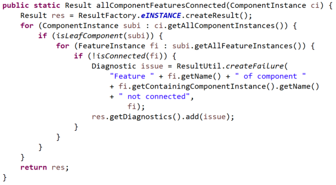

<!--
Copyright (c) 2004-2020 Carnegie Mellon University and others. (see Contributors file). 
All Rights Reserved.

NO WARRANTY. ALL MATERIAL IS FURNISHED ON AN "AS-IS" BASIS. CARNEGIE MELLON UNIVERSITY MAKES NO WARRANTIES OF ANY
KIND, EITHER EXPRESSED OR IMPLIED, AS TO ANY MATTER INCLUDING, BUT NOT LIMITED TO, WARRANTY OF FITNESS FOR PURPOSE
OR MERCHANTABILITY, EXCLUSIVITY, OR RESULTS OBTAINED FROM USE OF THE MATERIAL. CARNEGIE MELLON UNIVERSITY DOES NOT
MAKE ANY WARRANTY OF ANY KIND WITH RESPECT TO FREEDOM FROM PATENT, TRADEMARK, OR COPYRIGHT INFRINGEMENT.

This program and the accompanying materials are made available under the terms of the Eclipse Public License 2.0
which is available at https://www.eclipse.org/legal/epl-2.0/
SPDX-License-Identifier: EPL-2.0

Created, in part, with funding and support from the United States Government. (see Acknowledgments file).

This program includes and/or can make use of certain third party source code, object code, documentation and other
files ("Third Party Software"). The Third Party Software that is used by this program is dependent upon your system
configuration. By using this program, You agree to comply with any and all relevant Third Party Software terms and
conditions contained in any such Third Party Software or separate license file distributed with such Third Party
Software. The parties who own the Third Party Software ("Third Party Licensors") are intended third party benefici-
aries to this license with respect to the terms applicable to their Third Party Software. Third Party Software li-
censes only apply to the Third Party Software and not any other portion of this program or this program as a whole.
-->
# Guidance for System Verification

[TOC levels=2-4 bullet hierarchy]

* Copyright 2016 Carnegie Mellon University. See Notice.txt
* Distribution Statement A: Approved for Public Release; Distribution is Unlimited.

This note provides some guidance on how to specify and develop verification methods for use in verification plans in the Architecture-Led Incremental System Assurance (ALISA) capability of OSATE. A paper describes the capabilities of ALISA
\[<https://hal.archives-ouvertes.fr/hal-01289468>\].

An example model called *SimpleControlSystem* used in this guidance as well as other examples are available at [Github.com/osate/alisa-examples](https://github.com/osate/alisa-examples).

## Verification Plans for System and Global Requirement Sets

System requirements are expected to be verified. This is accomplished by defining a verification plan for each of the system requirement sets. A verification plan consists of a claim for each of the requirements. The claim consists of a set of verification activities, and an optional logical expression (**assure** clause) to represent the argument for meeting the claim. By default all verification activities must be met. Otherwise, users can express conditional relations between verification activities, e.g., one must be successful before a second one is performed, or a second verification activity is the backup in case the first does not succeed. For the full set of logic expressions see the [Verify notation](VerifyDoc.html#argument-expression).

In the example below (found in file *scsvplan.verify* of *SimpleControlSystem*) the first claim consists of two verification activities to verify the weight requirement. Both will be executed when the system is being verified. The first verification activity invokes an OSATE analysis plug-in, while the second invokes a Resolute claim function. 

The second claim also consists of two verification activities. In this case, the latency analysis is performed on the assumption that the system is schedulable. Therefore, we specify that the *timing* activity must complete successfully before the latency analysis is performed.

> Note: The call to the verification method does not explicitly specify the instance model element (Component Instance, Feature Instance, Connection Instance, etc) on which the verification is performed. It is automatically supplied to the Plugin, Java, or Resolute method as first parameter.

<pre>
verification plan scsvplan for scsreqs 
[
	claim R1 [
		activities
			actualsystemweight : Plugins.MassAnalysis() 
			   [ category Quality.Mass ]
			MaxWeight : Resolute.verifySCSReq1(MaximumWeight in kg) [ category Quality.Mass ]
	]
	
	claim R2 [
		activities
			responsetime : Plugins.FlowLatencyAnalysis() 
			timing: Plugins.ResourceAllocationScheduling()
		assert timing then responsetime

	]
</pre>

## Verification Activities and Methods

Verification activities are performed on AADL instance models. The AADL models themselves may be verified, or the verification may be invoked on an artifact referenced by the AADL model, e.g., a Simulink model of a detailed design, or actual source code associated with a thread.

Verification activities invoke verification methods. Method registries identify the methods available to the user. The verification results are tracked in the ALISA assurance case instance (file with the *assure* extension and displayed as assurance result).

### Using OSATE Plugin Verification Methods

One set of verification methods are the analysis plugins of OSATE. Their registry is called *Plugins* and can be found in the project *AlisaPredefined*. 

The analysis plugin is called with the system instance (instance model root) as its parameter. OSATE analysis plugins report their results through the Eclipse Marker mechanism - they are mapped into a set of result issues in the ALISA assurance case (Assure file). 

> Note that we may have several latency requirements - one for each end to end flow with the flow identified by the **for** of the requirement. In this case the latency analysis plugin is called only once, and the result for each end to end flow requirement is retrieved from the Eclipse markers. 

> Note that some of the analysis plugins are being converted to return an AnalysisResult object instead of reporting the results via Markers when invoked from ALISA. There is no difference to the user in how the analysis is invoked or the results are reported. Latency analysis is the first such analysis.

### Writing Verification Methods in Resolute

Resolute verification methods are written as *claim functions*. These claim functions are automatically invoked on the component instance for which the requirement being verified applies. 
Users do not have to include Resolute annex subclauses with *prove* statements into the AADL model. Instead the Resolute claim function (registered as verification method) is called on every component instance that has a requirement with a verification activity that calls the registered verification method. An example verification activity calling a registered Resolute verification method.

> Users can also write Resolute verification methods as *compute functions* that return a boolean value. They are registered the same way as claim functions.

`MaxWeight : Resolute.verifySCSReq1(MaximumWeight in kg)`

The claim function is assumed to have at least one parameter, the target instance model element (component instance, feature instance, etc.) that is automatically passed as first parameter. The Resolute claim function may take additional parameters. 

The Resolute claim function is defined in a Resolute annex library. Our example function is defined as follows:

<pre>
SCSReq1(self : component, max :real) <=
**  "R1: SCS shall be no heavier than " max%kg **
 AssureSubcomponentTotals(self, max) and
 AssureRecursivetotals(self, max) 
</pre>

> In the above example we have specified that the value is to be converted into *kg* before being passed in the call. The parameter value is a reference to a constant value defined as part of the requirement being verified (see requirement R1 of SCS earlier).

The verification method registry entry - declared in a file with the extension *methodregistry* is as follows:

<pre>
verification methods Resolute [
  	method verifySCSReq1 (max: real ): "Verify SCS weight is within specified maximum (Req1)" [
		resolute BudgetResolute.BudgetResolute_public.Resolute.Resolute.SCSReq1 
		description "SCS has a requirement not to exceed a specified weight of 'max' kg. This is verified by summing gross weights of direct subcomponents and by adding up gross weights all parts."
	validation validateWeightBudgetCoveragePercent()
   ]
</pre>

The method defines the formal parameters (other than the default first parameter) to be used in the call by a verification activity (in our example a real value). It then identifies the Resolute claim function by name.

> A Resolute claim or compute function is known by the following qualified name: &lt;package name&gt;.&lt;package name&gt;_public.Resolute.Resolute.&lt;function name&gt;. However, within Resolute users refer to a claim or compute function by just the name.

>  By using 'control' 'shift' 'F3' you get the global scope browser to see all globally defined entities.

The method specification in our example includes a **validation** call. The specified method is called to determine the validity of the verification result. Here we assess whether all components with a weight actually had a weight related property. 

> Any issue identified by the validation is included in the assurance case result, e.g., that 70% of components had weight assigned.

Resolute claim functions report successful (pass) or unsuccessful fail) execution of a predicate. In case of *fail* a specific *fail* message may be added through a resolute **fail** statement (see Resolute documentation). The Resolute results are mapped into the ALISA assurance case instance (Assure file).

A Resolute claim function may call other Resolute claim functions. The results are reported back as nested pass or fail results.

> **NOTE**: Resolute claim functions may query the AADL instance model for all threads, processes, or all component instances and then invoke a claim function on each element. In this case Resolute tracks the application of the actual verification in each element as a Resolute (sub-)result. Again all nested Resolute results are mapped back into the ALISA assurance case instance. One usage of such Resolute functions is to implement verification activities that apply to the instance model root (see [Global Reusable Requirement Specification](ReqSpecUsage.html#reusable-global-requirements)).

### Writing Verification Methods in Java

Users can also write verification methods in Java. You do this by creating a Plugin project. In out example Alisa-Consistency is such a project. You define dependencies on plugins from OSATE in MANIFEST.INF to have access to utility methods for operating on AADL models.

####Useful OSATE support methods
 
* The plugin *org.osate.aadl* gives you access to utility methods to access declarative AADL models and AADL instance models. The methods are associated with instance model classes and declarative model classes. You will mostly use methods dealing with instance model classes.

* The plugin *org.osate.xtext.aadl2.properties* gives you access to utility methods for retrieving property values from AADL models. See the classes *GetProperties* and *PropertyUtils*.

* The class *InstanceModelUtil* in the plugin *org.osate.xtext.aadl2.properties* provides methods that deal with bindings.

* The class *FlowLatencylUtil* in the plugin *org.osate.analysis.flow* provides methods that deal with ARINC653 related properties as well as other useful methods.

* The plugin *org.osate.results* provides methods for a common analysis result format (see [Analysis Result](ResultReport.html)), which we will use in one of our example methods. The Diagnostic object from this format is used in ALISA assurance case instances (Assure files).

Java methods can be written as static methods or non-static methods. 

####Target Model Elements for Methods

Methods can be written for verifying component instances, or for instances of elements inside components, i.e., feature instances, flow spec or end to end flow instances, connection instances.  The expected instance model element is defined as first parameter with the appropriate Java class from the AADL instance Meta model, i.e., *FeatureInstance*, *FlowSpecificationInstance*, *EndToEndFlowInstance*, *ConnectionInstance*.

> Note: Instance model elements other than component instance are useful for requirements that are specified for component elements via the **for** statement of the requirement.

####Expected Return Values

Java verification methods are expected to return true if the requirement is met (Success*) and false if not (*Failure*). They may also throw an *AssertionError* exception to indicate an unsuccessful evaluation of a condition (*Failure*). Exceptions of any other kind are interpreted as the method failing to complete execution, i.e., an *Error*.

Java verification methods can also return an AnalysisResult object, Result object, or Diagnostic object.

Finally, Java verification methods can return any Java object - either as single value or as a collection of *Value* objects in *Result* objects. In a verification activity those can be assigned to compute variables and they will be evaluated by the *value predicate* specified in the requirement.

####Example of a Verification Method acting as Predicate

In this case the verification method will return a boolean value (true or false).

The following example method operates on a Feature Instance, retrieves the property value for voltage and compares it against the value supplied as second parameter.

<pre>	
public static boolean hasVoltage(FeatureInstance fi, double v) {
	double volt = getVoltage(fi);
	return volt == v;
}
</pre>

The helper method getVoltage is defined as follows.

> Note that for predefined properties utility methods for retrieving property values exist in the class *GetProperties*. A second class *PropertyUtils* provides additional support methods.

<pre>
public static double getVoltage(final FeatureInstance fi) {
	Property voltage = GetProperties.lookupPropertyDefinition(fi, "Physical", "Voltage");
	UnitLiteral volts = GetProperties.findUnitLiteral(voltage, "V");
	return PropertyUtils.getScaledNumberValue(fi, voltage, volts, 0.0);
}
</pre>

The registry entry for the hasVoltage method takes on the following form

* the first parameter is expected to be a feature instance
* the second parameter is expected to be of VoltageType which is defined to be AadlReal with VoltageUnits. By indicating that the expected unit is *V* the parameter value is passed to the verification method as double in case of Java.

<pre>
method ConsistentVoltage (feature, voltage: Physical::Voltage_Type in V )  
	:"Ensure Voltage property value is consistent with required voltage value" [
	java alisa_consistency.ModelVerifications.hasVoltage
	description "Verify that the Voltage property has the same value as specified in the requirement"
]
</pre>

This method is then called in a verification activity as follows specifying only the second Java method parameter.

<pre>
hasvoltage: Alisa_Consistency.ConsistentVoltage(volts) 
</pre>
The requirement identifies the abstract feature *power*, which becomes the target of the verification activity.

<pre>
requirement R3 : "SCS inlet voltage" for power [
	val volts = 12.0 V
	compute actualvolt: real Physical::Voltage_Type
	value predicate volts == actualvolt
	see goal SCSgoals.g3
]
</pre>

####Example of a Verification Method returning a Compute Value

We can take advantage of the *value predicate* specified as part of requirement R3. We do so by registering getVoltage as a verification method that returns 
The registry entry for the hasVoltage method takes on the following form

* the first parameter is expected to be a feature instance
* the return value is specified to be of type VoltageType, which is defined as AadlReal with VoltageUnits. By specifying *in V* we indicate that in case of Java the retunred value is expected to be *double* and will be turned into the appropriate representation for the specified type VoltageType, i.e., am Aadl RealLiteral.

<pre>
method GetVoltage (feature ) returns (volts: Physical::Voltage_Type in V ) 
	:"Return the voltage value of the feature in specified unit" [
	java alisa_consistency.ModelVerifications.hasVoltage
	description "Verify that the Voltage property has the same value as specified in the requirement"
]
</pre>

This method is then called in a verification activity as follows specifying the returned value to be assigned to the compute variable *actualvolt*. The result is the evaluation of the value predicate specified in the requirement R3.

<pre>
consistentvoltage: actualvolt = Alisa_Consistency.GetVoltage() 
</pre>

####Example Method Returning AnalysisResult

A number of OSATE analyses provide a Java based interface that returns an AnalysisResult object. See [Result Interpretation in ALISA](VerifyDoc.html#interpretation-of-return-values) for further details about usage of AnalysisResult in ALISA.

Here we illustrate the example of a latency analysis.

OSATE provides a service interface for latency analysis on ComponentInstance and on EndToEndFlowInstance objects.

<pre>
public AnalysisResult invoke(ComponentInstance ci) {
	FlowLatencyAnalysisSwitch fla = new FlowLatencyAnalysisSwitch();
	EList<Result> results = fla.invoke(ci, null, true, true, true, true);
	return FlowLatencyUtil.recordAsAnalysisResult(results, ci, true, true, true, true);
}

public AnalysisResult invoke(EndToEndFlowInstance etef) {
	FlowLatencyAnalysisSwitch fla = new FlowLatencyAnalysisSwitch();
	EList<Result> results = fla.invoke(etef, null, true, true, true, true);
	return FlowLatencyUtil.recordAsAnalysisResult(results, etef, true, true, true, true);
}
</pre>

The appropriate method registration is as follows:
<pre>
method ComponentFlowLatencyAnalysis: "Verify all flow latencies directly specified in component instance" [
 category Quality.Latency
 description "Analysis of all end-to-end flows in a component instance or for a specific end-to-end flow."
 java org.osate.analysis.flows.LatencyAnalysisService.invoke
]
	
method EndToEndFlowLatencyAnalysis (flow): "Verify specified flow latency" [
 category Quality.Latency
 description "Analysis of a specific end-to-end flow."
 java org.osate.analysis.flows.LatencyAnalysisService.invoke
]
</pre>

This method is then called in a verification activity as follows. 

<pre>
	responsetime : Plugins.EndToEndFlowLatencyAnalysis()
</pre>

The requirement that the verification activity applies to identifies an end to end flow as target. That target is passed to the verification method. 

<pre>
requirement R2_Lat : "SCS sensor to actuator response time limit" for sensortoactuatorresponse
</pre>

#### Recording of Multiple Results in AnalysisResult

OSATE provides a common format for reporting analysis results. It provides the classes AnalysisResult, Result, and Diagnostic. See [Analysis Result](AnalysisResultFormat.html) and its [Usage in ALISA](VerifyDoc.html#interpretation-of-return-values) for details.  

Here we elaborate an example where a Java verification method may evaluate conditions on multiple instance model elements. In this case we want to report back all model elements that do not meet the condition. In our example, we check that all leaf components have all their features connected and we want to report any unconnected feature.

We first create a Result object, which reflects the overall result and collect any issues on specific features to be reported. We then traverse the instance model starting with the component instance to which the verification activity applies (the instance root). When we encounter a leaf component instance, i.e., one without sub component instances, we check that all its feature instances have incoming or outgoing connections. If we encounter one without connections we report this as an *Fail* issue.

This Java method is registered as follows:

<pre>
method AllComponentsConnected(): "Check that all features of all leaf components are connected" for root [
	java alisa_consistency.ModelVerifications.allComponentFeaturesConnected
	description "Check that all features of all leaf components are connected."
]
</pre>

### JUnit Verification Methods

ALISA supports running of JUnit tests as verification activities. This is accomplished by registering a JUnit test class. In our example we have a JUnit test class called *testme*.

<pre>
verification methods mymethods [
	method testJunit : "Run JUnit4" [
		junit junittest.testme 
	]
] 
</pre>

The primary purpose is to support execution of Java based tests of source code related to the system. JUnit test results are mapped into the ALISA assurance case instance representation. An exmple JUnitb test is shown here.

<pre>
@Test
public void testingCrunchifyAddition() {
	assertEquals("Here is test for Addition Result: ", 30, addition(27, 3));
}
</pre>

> JUnit tests are currently called without parameters. In other words, the test method is not passed a component instance to be verified.

## Value Predicates

Users can specify value predicates as part of a requirement specification. 

This predicate can specify a condition involving ReqSpec constants and property values in the model. This predicate is evaluated once for the requirement.

> This allows us to specify a condition that the requirement constant **val** value is the same as the value of a property. Here is an example:

<pre>
requirement R1 : "SCS weight limit" [
	val  MaximumWeight = 1.2 kg
	compute actualweight: real units SEI::WeightUnits
	category Quality.Mass
	description this " shall be within weight of " MaximumWeight
	// verify that MaximumWeight is same as the property value WeightLimit
	value predicate MaximumWeight == #SEI::WeightLimit
	see goal SCSgoals.ng2
]
</pre>

This predicate can also include **compute** variables. Compute variables are unbound variables, whose values are bound as result of executing a *compute function* that is called in a verification activity. 

> The second form allows us to specify the predicate condition once as part of the requirement without having to implement the predicate condition in each of the verification methods being called in verification activities.

The following is a requirement that specifies an unbound **compute** variable called *actualvolt*. It is compared in the **value predicate** against the specified *volts*.

<pre>
	requirement R3 : "SCS inlet voltage" for power [
		val volts = 12.0 V
		compute actualvolt: Physical::Voltage_Type
		value predicate volts == actualvolt
		see goal SCSgoals.g3
	]
</pre>

In the claim for this requirement (below) the second verification activity calls a *compute function* that returns a real value that gets bound to *actualvolt*. During the execution of the verification activity, the compute function is called and then the predicate is evaluated to determine the *Pass*/*Fail* result.

<pre>
claim R3  [
	activities
		hasvoltage: Alisa_Consistency.ConsistentVoltage(volts) 
		consistentvoltage: actualvolt = Alisa_Consistency.GetVoltage()
	]
</pre>
The compute function *GetVoltage* is registered by indicating that a *real* value is returned. 
>The method can return more than one value and each value will be bound to a separate **compute** variable specified in the call.

<pre>
method GetVoltage (feature) returns (volts: Physical::Voltage_Type in V )
	:"Return the Voltage property value" [
	java alisa_consistency.ModelVerifications.getVoltage
	description "Retrieve the Voltage property from the feature instance"
]
</pre>

The Java method implementation looks like this.

<pre>
public static double getVoltage(final FeatureInstance fi) {
	Property voltage = GetProperties.lookupPropertyDefinition(fi, "Physical", "Voltage");
	UnitLiteral volts = GetProperties.findUnitLiteral(voltage, "V");
	return PropertyUtils.getScaledNumberValue(fi, voltage, volts, 0.0);
}
</pre>

## Verification Parameters Passed via Properties

In some cases the verification method expects the values it operates on to be available as property values in the model. We can specify this fact as part of the verification method registration.

We use the *GetVoltage* Java method to illustrate this capability. We register a new method *SetGetVoltage* that will set the property value that is specified as part of a call and then call the GetVoltage Java method to retrieve it.  The registration is as follows.

<pre>
method SetGetVoltage (feature) properties(Physical::Voltage)returns (volts: Physical::Voltage_Type in V )
	:"Ensure Voltage property value is consistent with required voltage value" [
	java alisa_consistency.ModelVerifications.getVoltage
	description "Verify that the Voltage property has the same value as specified in the requirement, and set the property value if not present."
]
</pre>

> Note: We register the getVoltage method from above. The property will be set automatically as part of the verification activity execution. Then the *getVoltage* method is called and the predicate evaluated.

The call in the verification activity is specified as follows.

<pre>
matchvoltage: actualvolt = Alisa_Consistency.SetGetVoltage() property values (volts)
</pre>

> Note: The model element must not have a property value for the specified property or the value must be the same as the one specified in the call. If a property value already exists and it differs an *Error* issue will be reported.

