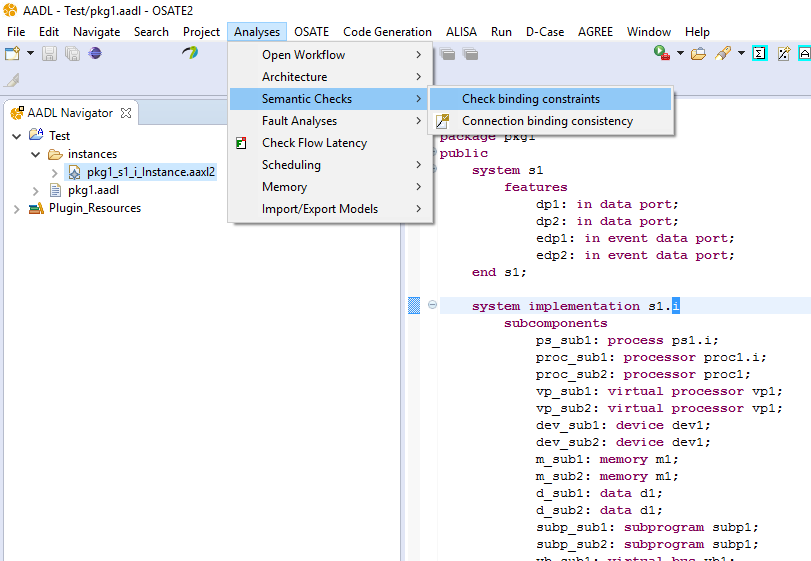

<!--
Copyright (c) 2004-2020 Carnegie Mellon University and others. (see Contributors file). 
All Rights Reserved.

NO WARRANTY. ALL MATERIAL IS FURNISHED ON AN "AS-IS" BASIS. CARNEGIE MELLON UNIVERSITY MAKES NO WARRANTIES OF ANY
KIND, EITHER EXPRESSED OR IMPLIED, AS TO ANY MATTER INCLUDING, BUT NOT LIMITED TO, WARRANTY OF FITNESS FOR PURPOSE
OR MERCHANTABILITY, EXCLUSIVITY, OR RESULTS OBTAINED FROM USE OF THE MATERIAL. CARNEGIE MELLON UNIVERSITY DOES NOT
MAKE ANY WARRANTY OF ANY KIND WITH RESPECT TO FREEDOM FROM PATENT, TRADEMARK, OR COPYRIGHT INFRINGEMENT.

This program and the accompanying materials are made available under the terms of the Eclipse Public License 2.0
which is available at https://www.eclipse.org/legal/epl-2.0/
SPDX-License-Identifier: EPL-2.0

Created, in part, with funding and support from the United States Government. (see Acknowledgments file).

This program includes and/or can make use of certain third party source code, object code, documentation and other
files ("Third Party Software"). The Third Party Software that is used by this program is dependent upon your system
configuration. By using this program, You agree to comply with any and all relevant Third Party Software terms and
conditions contained in any such Third Party Software or separate license file distributed with such Third Party
Software. The parties who own the Third Party Software ("Third Party Licensors") are intended third party benefici-
aries to this license with respect to the terms applicable to their Third Party Software. Third Party Software li-
censes only apply to the Third Party Software and not any other portion of this program or this program as a whole.
-->
# Check Connection Binding Consistency
The objective of this analysis is to check that there is a physical connection between the hardware components related to the source and destination of a connection.

# Invoking the Analysis
 * Select an instance model in the **AADL Navigator**
 * In the main menu, select **Analyses** -> **Semantic Checks** -> **Check connection binding consistency**

# The Checking

The connection binding consistency check ensures that for each logical connection, e.g., a port connection, there is a physical connection via a bus between the related hardware components.

If the source or destination of a connection instance is a software component, e.g., a thread, then the related hardware component is the physical processor or system the software component is bound to.
If the source or destination of a connection is a device then the device is the related hardware component.

# Results

The results of the analysis are reported in a report in the folder "instances/reports/ConnectionBindingConsistency". 

The result report includes the following:

* Warning if one of the connection endpoints does not have a related hardware component.
* Error if there is no explicit connection binding and the two hardware components are not connected by a bus.
* Error if there is a connection binding to a single bus and neither the source nor the destination hardware is connected to the bus.
* Error if there is a connection binding to multiple hardware components and the source is not connected to the first bus or the destination is not connected to the last bus.  

