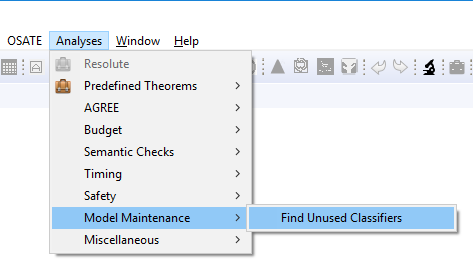
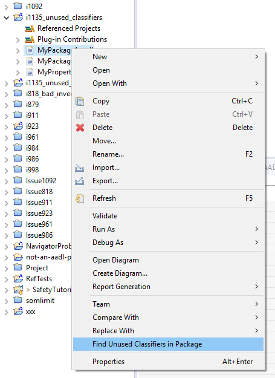
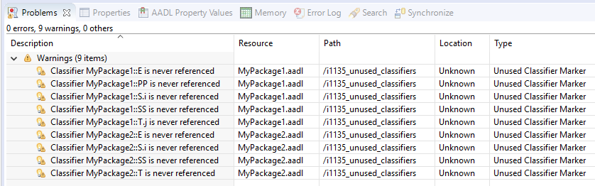
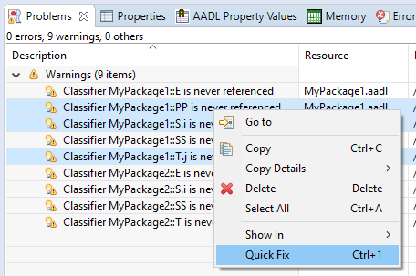
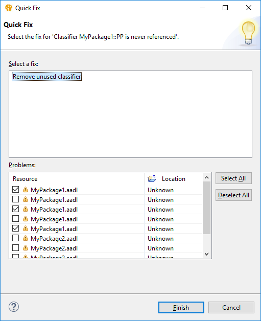

# Model Maintenance

The `Analysis > Model Maintenance` submenu in the main menubar contains analyses for simplifying, understanding, or otherwise "cleaning up" AADL models.  

## Find Unused Classifiers

The **Find Unused Classifiers** analysis scans one or more AADL package and marks each classifier (component type, component implementation, or feature group) that is not referenced from within the current Eclipse workspace.  

### Executing the Analysis

The analysis is found under the `Analysis > Model Maintenance` submenu in the main menubar, and in the context menu of the `AADL Navigator` view.  The analysis command is only available if 1 or more AADL package files are selected in the navigator.

When executed the analysis will search the Eclipse workspace for references to all the classifiers declared in the selected AADL packages.  

### Analysis Results

The analysis generates an Eclipse warning marker for each classifier that is not referenced in the workspace.  As is standard for Eclipse, these are visible in the `Problems` view.  The below shows the results of analysing two packages `MyPackage1` and `MyPackage2`:

Again, as is standard Eclipse practice, double-clicking on a marker in the view opens an Eclipse editor and highlights the entire classifier.

**Important:** Please note that a top-level system description will be marked as unused.  This is normal, and you must use your descretion to determine which classifiers represent instantiatable systems.

### Quick Fix

The markers support a "quick fix" that removes the unused classifier from the package.  Select 1 or more marker in the `Problems` view, and choose `Quick Fix` from the context menu.

A confirmation dialog appears indicating that you are going to be removing the classifier:

Click on `Finish` to remove the classifiers from the AADL package files.  

**Important:** _This operation is cannot be undone!_

