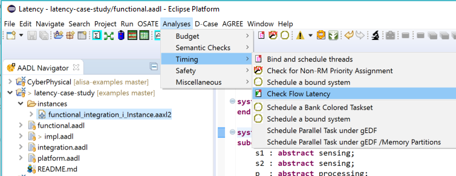
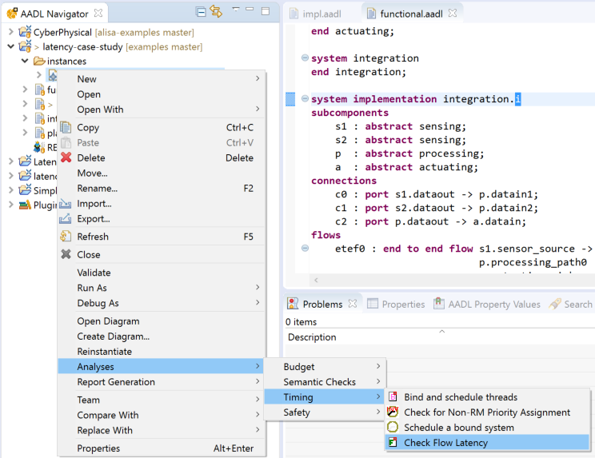
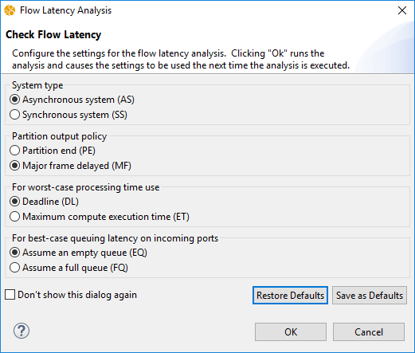
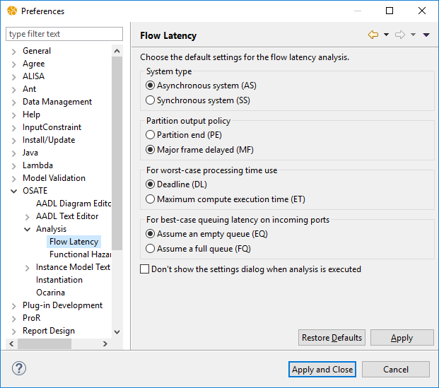
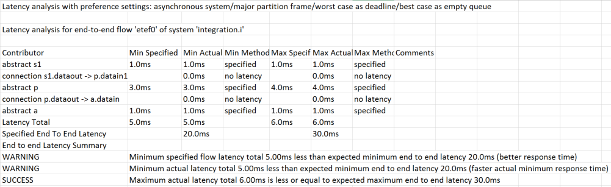

<!--
Copyright (c) 2004-2020 Carnegie Mellon University and others. (see Contributors file). 
All Rights Reserved.

NO WARRANTY. ALL MATERIAL IS FURNISHED ON AN "AS-IS" BASIS. CARNEGIE MELLON UNIVERSITY MAKES NO WARRANTIES OF ANY
KIND, EITHER EXPRESSED OR IMPLIED, AS TO ANY MATTER INCLUDING, BUT NOT LIMITED TO, WARRANTY OF FITNESS FOR PURPOSE
OR MERCHANTABILITY, EXCLUSIVITY, OR RESULTS OBTAINED FROM USE OF THE MATERIAL. CARNEGIE MELLON UNIVERSITY DOES NOT
MAKE ANY WARRANTY OF ANY KIND WITH RESPECT TO FREEDOM FROM PATENT, TRADEMARK, OR COPYRIGHT INFRINGEMENT.

This program and the accompanying materials are made available under the terms of the Eclipse Public License 2.0
which is available at https://www.eclipse.org/legal/epl-2.0/
SPDX-License-Identifier: EPL-2.0

Created, in part, with funding and support from the United States Government. (see Acknowledgments file).

This program includes and/or can make use of certain third party source code, object code, documentation and other
files ("Third Party Software"). The Third Party Software that is used by this program is dependent upon your system
configuration. By using this program, You agree to comply with any and all relevant Third Party Software terms and
conditions contained in any such Third Party Software or separate license file distributed with such Third Party
Software. The parties who own the Third Party Software ("Third Party Licensors") are intended third party benefici-
aries to this license with respect to the terms applicable to their Third Party Software. Third Party Software li-
censes only apply to the Third Party Software and not any other portion of this program or this program as a whole.
-->
# Latency Analysis

[TOC levels=2-4 bullet hierarchy]

Latency analysis is provided by the OSATE latency analysis plug-in. The latency 
analysis is performed on AADL models that include end-to-end flows and 
calculates minimum and maximum latency taking into a wide range of latency 
contributors. It does so based on latency budgets assigned to different 
architectural elements as well as based on design information as architectural 
designs evolve. The AADL model may range from a functional architecture with 
latency budgets at different levels of decomposition, to a task and 
communication architecture with execution rates mapped to a hardware platform 
supporting partitioning. The fidelity of the analysis is determined by the 
details in the AADL model. 

The results are reported in a common result format as well as in a spreadsheet 
format together with the details of each latency contributor. The latency 
analysis can be parameterized by some preference settings that allow users to 
explore architectural variations without having to change details in the model, 
e.g., whether the system behaves as an asynchronous or synchronous system.

## Usage, Result Reports, and Examples

The latency analysis plugin comes pre-installed with OSATE. In this section we 
describe how the latency analysis is invoked, how the latency results are 
presented, and a reference to example models. It also describes the preference 
settings supported by the latency analysis.

### Invoking the Latency Analysis

Latency analysis is performed on AADL instance models. You invoke the analysis 
by selecting the instance model of interest in the AADL Navigator and then 
selecting the **Check Flow Latency** command in the main menu 
**Analyses/Timing**, 

via the context menu by right-clicking on the instance model in the AADL 
Navigator - again under **Analyses/Timing**, 

or by selecting the instance model and then clicking on the toolbar button for 
flow latency analysis with the following icon 
().

The latency analysis calculates minimum and maximum latency for all end-to-end 
flows in the instance model. If the instance model has operational modes the 
analysis is performed for each mode. The latency analysis can be affected by 
preference settings that allow users 

#### Latency Analysis Preferences

When invoked, the analysis presents a configuration dialog for choosing settings that affect how latency 
is calculated. This allows users to perform studies along different dimensions without changing the model.

The body of the dialog contains five sets of radio buttons that are described below.  Clicking on
**OK** executes the analysis with the chosen settings.  The settings are remembered the next time the
analysis is run.  Clicking on **Cancel** discards the settings and does not run the analysis.  If
**Don't show this dialog again** is selected when **OK** is pressed, the dialog will not be shown 
on subsequent invocations and the the chosen settings are used for future invocations.  To get the 
dialog back, see below.

The **Restore Defaults** button returns the settings to the values set in the OSATE preferences (see below).
The **Save as Defaults** button makes the current settings the defaults values used the OSATE preferences.

The flow latency analysis supports the following settings:

- **System type**. Used to assess the sampling latency between periodic 
  components that are not inherently synchronous (threads or partitions on the 
  same processor) or explicitly specified as synchronous by referring to the same 
  *Reference_Time* property value.  
    - **Asynchronous system (AS)**: The components are not
      time synchronized, i.e., dispatches may have time shift.
    - **Synchronous system (SS)**: The components are time
      synchronized, i.e., periodic dispatches are aligned
      across systems.
- **Partition output policy**. Used to reflect latency contribution by 
  inter-partition communication due to different inter-communication policies 
  in partitioned systems.
    - **Partition end (PE)**: assume that inter-partitions connections
      are available at the end of the partition whose task sends data.
      If a task in partition A sends a data to a task in partition B,
      the later will receive the data in the same major frame if
      partition B is executed after partition A.
    - **Major frame delayed (MF)**: assume that
      inter-partitions connections are flushed/realized at the end of
      the major frame. If a task in partition A sends a data to a task
      in partition B, the fresh data will be available only after
      completion of all remaining partitions, regardless the execution
      order of partition A or partition B.
- **For worst-case processing time use**: Users can choose between deadline
  and worst-case compute execution time as worst case processing time. For best case 
  we always use compute execution time.  This setting is only relevant when no response time is available.
    - **Deadline (DL)**: Deadline represents the worst-case 
      completion time assuming the tasks are schedulable.
    - **Maximum compute execution time (ET)**: Maximum compute execution time 
      is useful when processing time is considered without resource scheduling. 
- **For best-case queuing latency on incoming ports**: Affects how the best 
    case queuing delay is determined. For worst-case we always use full queue.
    - **Assume empty queue (EQ)**: No delay as the queue
      is assumed to be empty.
    - **Assume full queue (FQ)**: Use minimum compute execution time
      times the queue size to determine the best case queuing time.
- **Disable queuing latency in the results**: Determines whether worst-case queuing delay is reported for asyncronous busses.
    - **Disable**: The worst-case queuing delay is always reported as 0.
    - **Enable**: The worst-case queuing delay is reported as calculated below.
 
The OSATE preference settings controlling the default values for flow latency analysis
are found in the **OSATE > Analysis > Flow Latency** preference pane.

This pane is almost identical to the dialog displayed by the analysis.  Here the 
setting **Don't show the settings dialog when analysis is executed** can be unchecked
to return the analysis to showing the dialog every time it is run.
 

### Latency Analysis Result Reports

Once the latency analysis is finished, a report is produced in a folder called 
**reports/latency**. The **reports** folder is found in the **instances** 
folder.

The latency analysis generates the report in spreadsheet format and a common 
**Result** format. The spreadsheet format is stored as a csv file and as a xls 
file. Both reports contain the same information but the xls file utilizes Excel 
formatting features (color-coding of results and separate sheets for different 
end to end flows).

> Note: If your installation of Eclipse (OSATE) does not recognize the xls 
  extension, you can add it yourself. Under **Window/Preferences** go to 
  **General/Editors/File** associations and add \*.xls as file type, and then for 
  this selected file type associate the editor by clicking on Add select External 
  programs and pick the Microsoft Excel Worksheet.

The **Result** XMI format provided by OSATE and uses the file extension 
**result**. That format is based on an Ecore model and facilitates 
post-processing by tools. It is described in a later section.

The report name consists of the name of the instance model, the label 
**latency** and an indication of the preference settings that were used to 
perform the latency analysis (using the two letter labels explained in the
**Latency Analysis Preference** section). 

> The inclusion of the preference settings in the file name allows users can 
compare results under different preference settings.

### Latency Analysis Report Content

The latency analysis result report consists of separate detailed reports for 
each end-to-end flow and for each operational mode if the AADL model includes 
mode specifications. An example of such a report in spreadsheet format is shown.

The header of each report identifies the name of the end-to-end flow being 
analyzed, the component implementation that contains the end-to-end flow 
declaration, the operational mode being analyzed (if modes are declared), and 
the preference settings used. 

Each report includes a separate entry for each latency contributor: 

- Components contribute processing latency and sampling or queuing latency. 
  Sampling latency is affected by whether connections are declared to be 
  immediate (mid-frame) or (frame) delayed.
- Connections contribute communication latency. It is determined by the 
  components (virtual bus, hardware components) that the connection is bound to.
- Partitions, if present, contribute partition output latency and latency in 
  terms of major frame offset.

Each contributor entry has a number of columns:

1. The type and name of the **contributor**.
2. The **minimum specified** latency as indicated by the latency property value 
   associated with the contributor. (The latency property takes a range value and 
   the lower bound is used as minimum).
3. The **minimum actual** latency value used by the analysis. This value is 
   determined by properties in the architecture design, e.g., the period and compute
   execution time of a thread, or the transmission time by a bus. If no actual 
   value can be determined the specified value is used.
4. The **minimum method** used to determine the minimum actual value. The 
   labels are:
    - **no latency**: Use value zero as no latency contribution was specified or 
      computed from the model.
    - **specified**: Use the specified latency property value.
    - **response time**: The response time of the component, if specified.
    - **processing time**: The processing related latency contribution of a component 
      based on compute execution time and deadline.
    - **transmission time**: Latency contribution for a connection. Uses on 
      binding to a virtual bus or bus using latency property values of those components or 
      based transmission time computation based on data size property values of the 
      data being transmitted if Transmission_Time and Data_Size have been specified
    - **queued**: Latency contribution due to queuing. Uses on queue size, compute
      execution time, and period property values.
    - **sampling**: Latency contribution due to a component sampling periodically. 
      Uses period property values. This value may differ in synchronous and 
      asynchronous system settings.
    - **delayed sampling**: Latency contribution due to delayed 
      connection. Uses period property values.
    - **sampling protocol/bus** latency contribution due to periodic bus protocol. 
      Uses period property values.
    - **partition major frame**: Latency contribution due to periodic execution of 
      a partition. Uses major frame from ARINC653 schedule or period property of 
      the virtual processor representing the partition.
    - **partition output**: Latency contribution due to delay in output to end of 
      partition (PE) or major frame (MF). Uses property values from ARINC653 
      partition schedule.
    - **partition offset**: Latency contribution due to partition offset in the 
      partition schedule, either from beginning of major frame or earlier partition 
      in the same schedule. Uses property values from ARINC653 partition schedule.
5. the **maximum specified**, **maximum actual**, and **maximum method** columns describe the maximum latency contribution
6. the **comments** column provides additional details on the calculations and 
   may give warnings or error messages to report inconsistencies.

> If connections are bound to virtual buses and buses, then those components 
  are shown in parentheses “()”. Their latency numbers add up to the latency number 
  shown as actual for the connection.

> Further details about how the actual latency value is calculated are provided 
  in the sections below.

Each end-to-end latency report entry shows the computed totals in a row 
labeled 
**Latency Total** (row 9 in the example). It shows the total for the specified 
values as well as the total for the actual values.  In the row labeled 
**Specified End To End Latency** the report shows the expected end-to-end 
latency as specified by the latency property value associated with the 
end-to-end flow.

This is followed by a summary of the results labeled **End to end Latency Summary**.
In the summary the computed totals of specified and actual latency 
contributions for the minimum and maximum latency are compared against the expected 
end to end latency and an appropriate message (success, warning or error message) 
is included. The summary also compares the actual latency variation between the 
minimum and maximum exceeds the variation in the expected end to end latency 
variation specified by the latency range value associated with the end to end 
flow.

### Examples

The latency case study example can be found at 
<https://github.com/osate/examples/tree/master/latency-case-study>. There is a paper 
describing this case study at 
<http://e-archivo.uc3m.es/bitstream/handle/10016/19688/incremental_REACTION_2014.pdf>. 
In this case study we go through a progression from a functional 
architecture with latency budgets to a task and communication architecture that 
represents the application using the sampled processing paradigm and its 
deployment on various hardware platforms.

The stepper motor case study example can be found at 
<https://github.com/osate/examples/tree/master/StepperMotor>. There is an SEI 
Technical Report that describes the case study in detail 
<http://repository.cmu.edu/cgi/viewcontent.cgi?article=1826&context=sei> and in 
a conference paper <https://hal.archives-ouvertes.fr/hal-01292322/>. In this 
case study latency analysis is used as one of the analytical tools to diagnose 
a problem in an engine control system and to evaluate several design alternatives.

Several other examples and references to their documentation can be found at 
<https://github.com/osate/alisa-examples>. 

The situational awareness system example illustrates the use of latency 
analysis 
to determine the latency contribution of two pull protocols to confirm the 
specified latency value in the virtual bus representation of the protocol.
The simple control system example has a multi-tier model of a control system 
application organized into two processes with two threads each and deploys it 
on a variety of hardware configurations.

The multi-tier aircraft example illustrates the evolution of an aircraft system 
across multiple tiers. The latency analysis highlights how design decisions in 
the evolving architecture affect end-to-end latency.

## Latency Contributors and Relevant Properties

Latency analysis takes a range of latency contributors into account when 
calculating minimum and maximum latency for an end to end flow. Latency 
contributions may be latency budgets assigned to different elements in an end 
to end flow, i.e., to flow specifications of components and to connections. Once 
the AADL model reflects aspects of an architecture design, latency contributions 
based on design decisions are taken into consideration. They include processing 
time by components, sampling delay in sampled processing scenarios or queuing 
delay in message based processing scenarios, partition delays when ARINC653 
partitions are used, communication latency contributions by buses/networks and 
protocols.

In this section we describe how different latency contributions are determined 
based on relevant property values in the AADL model.

### Latency Budgets Specified via Latency Property

The **latency** property allows user to associate a latency value with flow 
specifications of components and with connections that effectively represents a 
latency budget. It takes a time range value whose bounds represent minimum and 
maximum latency. It can be associated with

- flow specifications (flow sources, flow paths, and flow sinks) of 
  components to represent processing latency contributed by the component.
- connections to represent communication latency.

Users can perform end-to-end latency analysis on a system based on these 
latency budget specifications. They can do so for a system with one layer of 
subsystems, or subsystems expanded by additional layers of the architecture 
hierarchy. Different subsystems can be expanded to different levels of the hierarchy. 
Examples of such models are representing conceptual, functional, and task 
architectures. The analysis result ensures that latency budgets assigned to 
various components due not exceed expected end-to-end latencies as specified by 
the latency property on various end to end flows.

The analysis will calculate the minimum and the maximum end-to-end latency by 
adding up the specified latencies of all the component flow specifications and 
of the connections. Absence of a latency property on connections or flow 
specifications is interpreted as a latency value of zero (marked as **no 
latency** in the report). 

The latency analysis report will identify if a latency budget assigned at a 
flow specification of an enclosing component is exceeded by the budgets assigned 
to elements included in a flow implementation.

### Queuing Delay in Message-based Processing

An application may perform message based processing. In AADL terms this means 
that messages arrive at event data ports or events arrive at event ports. These 
ports are considered queued ports. The queue size is specified by the 
*Queue\_Size* property.

Latency analysis adds queuing delay as latency contribution only if the user 
has explicitly assigned a queue size to the destination port of a connection.

The worst-case queuing delay assumes a full queue, i.e., is the product of 
queue size and worst-case processing time. For worst-case processing time the 
deadline is used and if not present the latency value of the flow specification. 
A preference setting allows the user to specify that worst-case compute execution time 
should be used instead of deadline. 

The best-case queuing delay by default assumes an empty queue. However, in a 
preference setting the user can specify a full queue is to be assumed. In this 
case the queue size is multiplied by the best-case compute execution time.

Users may specify functional architectures with queuing ports, i.e., event 
ports and event data ports may be associated with system or abstract components. 
If the ports have a queue size property value greater than zero queuing latency 
is added by the latency analysis. 

>If users have not specified a deadline on the component the latency value 
  associated with the flow specification is multiplied by the queue size.

In a task and communication architecture users may have specified devices and 
threads with queuing ports. In this case the deadline or worst-case execution 
time is used 

> In the case of a periodic or sporadic task with a queue the period is used 
  instead of the worst-case or best-case compute execution time to reflect the fact that 
  queue processing is paced at the rate specified by the period.

###Sampling Delay in Periodic Sampled Processing

In embedded systems it is common to perform periodic sampled processing. 
Examples are displays refreshing at a specified rate, sensors sampling the 
physical environment at a given rate, application systems processing their 
input periodically (periodic threads). This can result in a sampling delay as 
latency contribution, i.e., the amount of time incoming data is in the incoming 
port until the component is dispatched.

The **Period** property allows users to specify the time interval at which a 
component executes. We can annotate a system, abstract, process, thread group, 
thread, device component with a period. 

We assume that the worst-case sampling latency contribution is the period, 
i.e., the recipient sampled just before the new value arrives, and the best-case 
sampling latency is zero, i.e., the new value arrives just before the recipient 
samples. 

Users can also refine their functional architecture by indicating periodic 
processing by certain components with a period property value. Alternatively, 
users may have developed a task and communication architecture ans associate 
period property values with threads and devices.

> In the case of sampled processing we distinguish between **synchronous** and 
  **asynchronous** system scenario when both the sender and receiver execute 
  periodically. In the synchronous case the sending and receiving periodic task 
  are dispatched by the same clock, thus, the sampling delay may be less than a 
  full period (see discussion below).  
  
> The first end to end flow element may be a periodic component. In this case, no sampling latency is added. However, succeeding periodic sampling components may be aligned in the synchronous use scenario. 

### Queuing Delay in Asynchronous Communication ###

As described above, when a bus is periodic (has a **Period** property association), the period is used to determine the worst-case sampling delay.  When a bus does not have a period, a sender may need to wait for other users of the bus to finish sending data on the bus before it can access it.  Analysis computes the worst-case queuing delay based on the **Transmission_Time** property of the bus and the **Data_Size** of the information that flows over the bus.  Specifically, the maximum queuing delay for a connection is the sum off all the maximum transmission times for any other connections bound to the bus.  The data sizes for the communication includes the data overhead imposed by the bus, connections, and any higher-level protocols (virtual buses) encountered.

> Buses with a period will always have a non-zero sampling delay and no queuing delay.
>
> Buses without a period will always have a queuing delay and no sampling delay.

### Processing Times as Latency Contributors

Users may have specified a **Deadline** property value for components. This 
property value represents the upper bound of worst-case completion time as long 
as the component is deemed as schedulable. 

Users can specify **SEI::Response\_Time** and **Compute\_Execution\_Time** property values for threads and devices.  Using response time is preferable to using the computation time because the compuation time does not account for preemption by other threads.  

The _best-case latency_ contribution is the lower bound of the response time, if specified (that is, has an explicit property association).  Otherwise it is the lower bound of the compute execution time, if specified.  If there is no compute execution time, then the lower bound of the expected latency is used.

The _worst-case latency_ contribution is the upper bound of the response time, if specified by the user.  Otherwise it depends on the analysis preference settings:

* If the preference is to use deadline, then the deadline is used.  _The latency analysis tool only considers explicitly set Deadline values. The 
default value of the Deadline is that of the Period value and is ignored by the 
latency analysis._  If the deadline is not available then the upper bound of the compute execution time is used.

* If the preference is to use the computation time, then the upper bound of the compute execution time is used.

In all cases, if none of the above property values are available then the upper bound of the expected latency is used.

Users can change the preference setting to use the worst-case 
Compute\_Execution\_Time (**ET** setting) instead of the Deadline (**DL** 
setting).

> The compute execution time value does not necessarily represent the worst-case 
  completion time. Users may specify a worst-case completion time through the 
  Deadline property. In the future we will interface with scheduling analysis 
  results to retrieve completion times.   
  
> The compute execution time is specified with respect to a particular processor type. 
  If the model uses more than one processor type the latency analysis scales the execution time accordingly.
  This is done by looking for a specification of a Reference_Processor property value on the thread (or enclosing component) 
  and taking the ratio between the Processor_Capacity of the physical processor the thread is bound to and the reference processor 
  as scaling factor.

The flow specification latency is used as processing latency contribution if 
the execution time (in ET) or deadline (in DL) is not set.

### Sampled Processing in Synchronous System Scenarios

We may have a **synchronous system** scenario where both the sending and 
receiving task are dispatched according to the same clock. In this case, the 
sampling latency can be smaller. The second sampling unit is dispatched at the 
same time as the first sampling unit, i.e., their dispatch times are aligned. 
In this case, the sampling latency contribution is the difference between any 
processing and communication latency since the first sampling unit and the next 
period of the second sampling unit - effectively rounding up to the next 
period. The first sampling unit may be followed by non-sampling units before 
the second sampling unit. In this case the sum of processing and communication 
latencies is rounded up.

> The effect of sampling in a synchronized system context is that the sampling 
  latency contribution evens out any variation in cumulative latency of incoming 
  data, i.e., it acts as jitter buffer. For example, a periodic (I/O) task is 
  sampling sensor input. The input is then processed by non-sampling tasks to 
  minimize latency. To manage the cumulative latency variation (jitter) the 
  output is sent to the actuator by the same I/O task at the beginning of the 
  next frame. 

> The cumulative processing and communication latency for the best case and 
  worst case may round up to different multiples of sampling frames (period of 
  the second sampling task). This results in frame-level jitter even if the min/max 
  cumulative processing latency differs only by a few microseconds, e.g., if one 
  value just below and the other just above a multiple of the sampling frame.

Different physical components, e.g., devices, processors, and buses are 
considered to operate asynchronously unless they have assigned the same 
**Reference_Time** property value. 

Software components bound to the same processor are considered to operate 
synchronously. Software components bound to different processor are considered 
to operate synchronously if the two processors have the same value for the 
**Reference_Time** property.

A preference setting lets users choose whether components that have no 
indication of being synchronized, i.e., on the same processor, or are 
inherently asynchronous, i.e., different hardware components, should be handled 
as if synchronous or asynchronous. This setting applies only to components that 
have not been explicitly identified as synchronous via the **Reference_Time** 
property, or software components bound to the same processor.

### Mid-frame and Frame-delayed Communication

The AADL thread model supports specification of immediate, and delayed 
connections between periodically sampling components.

- An immediate connection means that although both tasks have the same 
  dispatch time the second tasks waits for the completion of the first task. This 
  corresponds to mid-frame communication in a Simulink control model.
- A delayed connection means that the second task always receives the output 
  in the next sampling period, i.e., it is always frame-delayed. This ensures 
  that for both the minimum latency and maximum latency we have a sampling latency 
  of the second task period.

> Immediate and delayed connection assure deterministic up and down sampling of 
  tasks with harmonic periods. This means that a sensor providing readings at 
  50ms to a processing task operating at 100ms, the processing task will always 
  see every other signal (or if the signals are queued will always see two signals 
  in the queue). The effect is that this sampling pattern does not introduce 
  additional noise into the signal.

In a sequence of periodic tasks with immediate connections the deadline of the 
last task becomes the deadline of the sequence. For worst-case latency 
contribution this deadline is used. For best-case latency contribution the sum 
of minimum compute execution times is used. 

> The cumulative completion times must be within the deadline.

If the deadline or compute execution time is not specified, the sum of maximum 
flow specification latencies is used for best/worst-case latency contribution.

> A sequence of periodic tasks with immediate connections is similar to a 
  periodic task followed by data-driven (aperiodic) tasks. The difference is that 
  in the case of a sequence of aperiodic tasks each task execution time has to 
  meet its own deadline, i.e., the cumulative maximum processing latency is 
  bounded by the sum of task deadlines rather than the deadline of the last task.

Delayed connections always add a delay to the next frame as latency 
contribution. 

> Connections between periodic tasks are considered to be sampling connections 
  if not specified as immediate or delayed connection. This means that a receiving 
  periodic task may sample the old or the new value depending on the 
  completion/send time of the sender. This may lead to frame-level latency jitter.

### Communication Latency Contribution by Networks/Buses and Protocols

In this section we discuss how latency contributions can be associated with 
communication transfer mechanisms that connections are bound to, i.e., virtual 
buses, buses, device, systems, and abstract components.

#### Communication Latency Specifications for Protocols and Networks/Buses

Users can indicate the intended transport mechanism via the 
**Actual\_Connection\_Binding** property or **Required\_Virtual\_Bus\_Class** 
property.

The latency analysis will take into account every element of an 
*Actual\_Connection\_Binding* as latency contributor. In the case of a virtual 
bus the analysis also includes the entities that the virtual bus is bound to 
according to its *Actual\_Connection\_Binding* property value. If the virtual 
bus or connection does not have a specified *Actual\_Connection\_Binding* 
property value, then the *Required\_Virtual\_Bus\_Class* property values are 
interpreted as latency contributors.

A bus or virtual bus can have a **Transmission_Time** property value. It 
specifies a fixed time and a per byte time latency contribution. If this 
property is present and the sending port has a data type with a *Data_Size* 
property value, then the communication latency contribution is calculated from 
these values. 

The *Transmission_Time* property on a hardware component indicates the actual 
transfer time. For a virtual bus the transmission time represents any 
computational latency by the protocol, which may be dependent on the size of 
the data being processed.

>The fixed time portion of Transmission_Time can be used to reflect worst-case 
queuing delays in the transfer.

A virtual bus or bus may add protocol wrapper data to be transmitted, which is 
specified by a **Data_Size** property on the virtual bus or bus. This will be 
added to the size of the application data when used in computing the 
transmission time.

If *Transmission_Time* is not present, the **Latency** property value 
associated with the virtual bus, bus, or other component the connection is bound 
to, is used.

If neither *Transmission_Time* nor *Latency* property is specified for the bus 
or virtual bus then no latency contribution is assumed. 

More than one protocol may be involved in the connection communication, e.g., 
one protocol may use a second protocol to perform its transfer. The latency 
analysis adds each of the protocol latency contributions to the total. This 
allows users to specify latency overhead being added by each protocol. 

>If the connection has no binding, but the connection end points are bound or 
are devices, then the latency analysis attempts to determine the buses that 
connect the two hardware components between the end points.

If the connection has no connection binding or required virtual bus, or those 
contributions are zero, then the **Latency** property value attached to a 
connection is used as latency contribution.

#### Periodically Sampling Buses and Protocols (virtual buses)

Buses and virtual buses may operate periodically. For example, a CANBus 
operates on a static time line with fixed slots for different transfer actions. 
This is specified by associating a **Period** property value with a virtual bus, 
bus, or other component acting as transfer mechanism. In this case a sampling 
latency is added for every connection that is bound to such a bus.

> When reflecting the sampling effect of communication the rules for 
  asynchronous and synchronous sampling latency calculation and for determining 
  whether synchronous sampling occurs apply here as well. In the synchronous 
  case sampling latency contribution may be reduced from the full sampling period.

> When several protocols or the bus have a sampling period specified, the 
  largest sampling period is used as it determines the transmission rate.

### Partitioned Systems

Partitioned systems use the concept of virtual machine (represented by AADL 
virtual processor) to enforce address space protection of processes at runtime. 
The user can use virtual processors to represent partitions. Virtual processors 
can be declared as subcomponents of processors, or they can be bound to 
processor. The latency analysis tools handles both modeling styles.

The user can specify **ARINC653::Module\_Major\_Frame** on a processor to which 
partitions are bound to indicate the rate at which partitions are scheduled. 

> If not specified, the **Period** property on the virtual processor indicates the rate of execution for the partition.

The user can also specify a full partition schedule using the 
**ARINC653::Module\_Schedule** property, whose value is a list of records with 
the **Partition** field referring to the partition and the **Duration** field 
indicating the window size.

> If there is no ARICN653 schedule that identifies the partition duration, the **Execution_Time** property on the virtual processor indicates the duration of the partion execution.

The latency analysis will use the ARINC653 partition schedule information, or 
the ARINC653 major frame information if the schedule is absent.

Partitions contribute two types of latency: **partition output delay**, and 
**partition start delay**.

*Partition output delay* is due to the partition flushing its output at the 
**major frame** or at **partition end**.

*Partition start delay* is due to a partition being scheduled in a particular 
partition schedule window, or because of the alignment of the partition major 
frame. In the latter case the latency analysis distinguishes between 
synchronous and asynchronous cross-partition communication. The same rules 
about alignment calculation as for sampled processing apply.

A preference setting lets the user choose the partition *major frame* or the 
*partition end* as the time at which the output is flushed.

The latency of tasks within a single partition are calculated as before. 
However, when communication occurs across a partition boundary, communication 
is delayed until the next frame - determined by the partition period, or until 
the partition end output and the alignment between the sending and receiving 
partition - using the partition schedule or major frame property values.

> A thread may have a period that is a multiple of the partition major frame. 
  The latency analysis takes into account the additional sampling delay of the thread.

> Choosing the major frame as partition output assures that end to end latency 
  is not affected by a change in the order in which partitions are allocated to a 
  processor.

### Latency Analysis and Modes

Latency analysis takes into account modes. It executes the analysis for each of 
the modes. If you have mode-specific end-to-end flows or mode-specific property 
values you will get mode-specific results.

> The analysis is currently not smart enough to avoid executing for all possible 
  modes if and end-to-end flow is not affected by modes.
  
## Latency Analysis Result Format

Latency analysis records its results in the AnalysisResult format as provided by the org.osate.results plug-in.
A run of the plug-in produces one instance of AnalysisResult stored as a file with the extension result in the reports/latency folder.

### AnalysisResult

The AnalysisResult object contains the following information:

 - **ModelElement**: reference to the root of the instance model (SystemInstance) 
 - **Analysis**: "latency"
 - **Parameter**: list of 4 boolean parameters to latency analysis stored in XMI as Objects
 - **Message**: 4 parameters to latency analysis as single string. Each parameter is a 2 character label separated by "-", e.g., "SS-DL-WC-EQ". The labels are explained in the preference documentation (SS/AS, DL)

The AnalysisResult object contains a collection of Result objects, one for each end to end flow and system operation mode combination.

Each end-to-end flow latency Result object contains a collection of subResults that represent latency contributions. 

### End To End Flow Result

The Result object representing the latency results for one end to end flow contains the following information:

- **ModelElement**: reference to the end to end flow instance object in the instance model 
- **Message**: "Latency results for " <end to end flow instance name>
- **Values**: list of values representing the results
- **Diagnostics**: list of observations about the values represented as Diagnostic 
- **SubResults**: list of latency contributions as sub-results

The values of the result are stored in the following order:

1. System operation mode name as String
2. Minimum actual latency total as real/double in milliseconds (ms)
3. Maximum actual latency total as real/double in milliseconds (ms)
4. Minimum latency spec total as real/double in milliseconds (ms)
5. Maximum latency spec total as real/double in milliseconds (ms)
6. Minimum expected end-to-end flow latency as real/double in milliseconds (ms)
7. Maximum expected end-to-end flow latency as real/double in milliseconds (ms)

Actual latency total is the sum of latency contributions by the actual design.

Latency spec total is the sum of latency values associated with flow specifications.

Expected end-to-end flow latency is the latency value specified by the Latency property associated with the end to end flow being analyzed.

ResultUtil provides methods to retrieve the values by index starting with index zero.

### Latency Contribution Result

The Result object representing a latency contribution contains the following information:

- **ModelElement**: reference to the instance model that contributes to the latency. This may be a component or a connection instance.
- **Values**: list of values representing details of the contribution
- **Diagnostics**: list of observations about the contribution 

The values of the contribution are stored in the following order:

1. Minimum actual latency value as real/double in milliseconds (ms)
2. Maximum actual latency value as real/double in milliseconds (ms)
3. Minimum latency spec value as real/double in milliseconds (ms)
4. Maximum latency spec value as real/double in milliseconds (ms)
5. Method to determine best-case actual latency (String)
6. Method to determine worst-case actual latency (String)
7. The name of the flow specification being followed through the contributor.  If the contributor is a connection, this is the empty string.  If the contributor is a component, the string is `fs.getKind() + " " + fs.getName()` where `fs` is the `FlowSpecification` object.

For details on methods to determine actual latency see section [Latency Analysis Report Content](latency.html#latency-analysis-report-content).

In the case of connections a contributor can have sub-contributors (protocols, buses that the connection is bound to). They are represented by subResult objects for each contributor Result object.
 
