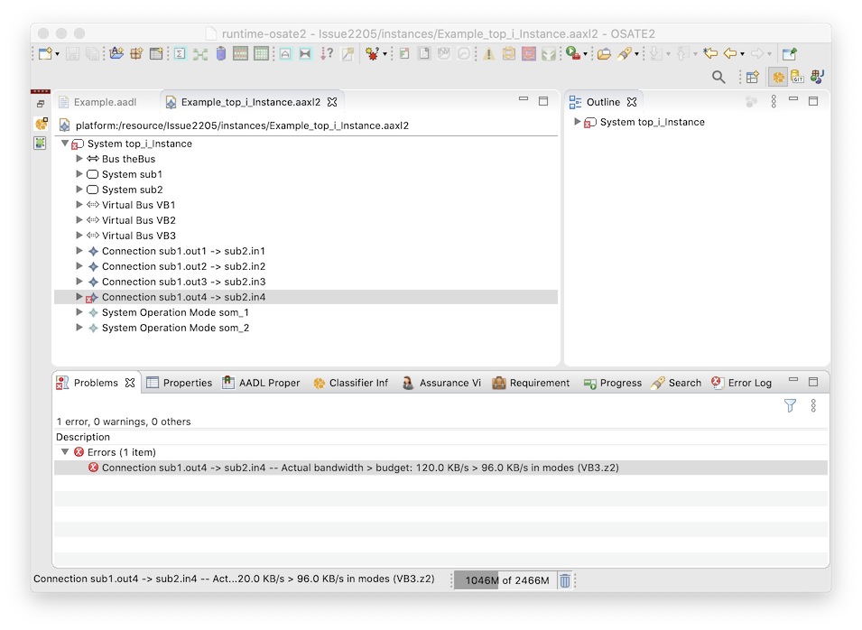
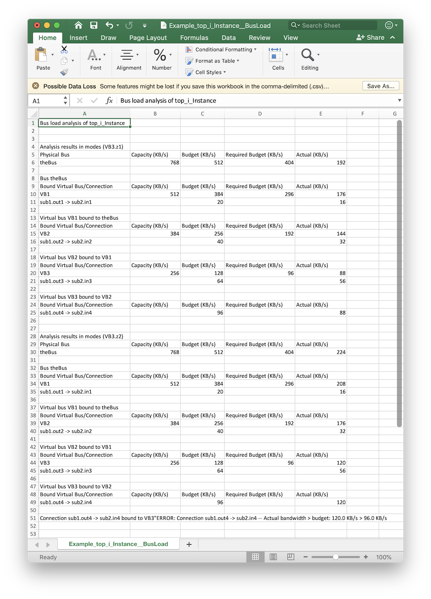

<!--
Copyright (c) 2004-2020 Carnegie Mellon University and others. (see Contributors file). 
All Rights Reserved.

NO WARRANTY. ALL MATERIAL IS FURNISHED ON AN "AS-IS" BASIS. CARNEGIE MELLON UNIVERSITY MAKES NO WARRANTIES OF ANY
KIND, EITHER EXPRESSED OR IMPLIED, AS TO ANY MATTER INCLUDING, BUT NOT LIMITED TO, WARRANTY OF FITNESS FOR PURPOSE
OR MERCHANTABILITY, EXCLUSIVITY, OR RESULTS OBTAINED FROM USE OF THE MATERIAL. CARNEGIE MELLON UNIVERSITY DOES NOT
MAKE ANY WARRANTY OF ANY KIND WITH RESPECT TO FREEDOM FROM PATENT, TRADEMARK, OR COPYRIGHT INFRINGEMENT.

This program and the accompanying materials are made available under the terms of the Eclipse Public License 2.0
which is available at https://www.eclipse.org/legal/epl-2.0/
SPDX-License-Identifier: EPL-2.0

Created, in part, with funding and support from the United States Government. (see Acknowledgments file).

This program includes and/or can make use of certain third party source code, object code, documentation and other
files ("Third Party Software"). The Third Party Software that is used by this program is dependent upon your system
configuration. By using this program, You agree to comply with any and all relevant Third Party Software terms and
conditions contained in any such Third Party Software or separate license file distributed with such Third Party
Software. The parties who own the Third Party Software ("Third Party Licensors") are intended third party benefici-
aries to this license with respect to the terms applicable to their Third Party Software. Third Party Software li-
censes only apply to the Third Party Software and not any other portion of this program or this program as a whole.
-->
# Bus Load Analysis

[TOC levels=2-4 bullet hierarchy]

The bus load analysis looks at the connections and virtual buses bound to buses in a system and checks that the bus has the capacity to carry the necessary data.  

## Running the Analysis

The analysis can be run over multiple models at the same time:

1. Select one or more working set, project, directory, or instance model `.aaxl` file in the `AADL Navigator`. 
2. Select `Analyses > Budget > Analyze Bus Load` from the menu bar or navigator context menu, or select the "Analyze bus load for bound connections" icon in the toolbar.

The analysis finds all the instance models (`.aaxl` files) in the selected items and runs over each one.

*  _The analysis runs for each system operation mode in each model._  
* An output comma-separated-values (`.csv`) file is generated for each analyzed model.  The file is located in the `reports/BusLoad` folder.  The file has the same name as the model file, but with `__BusLoad` appended to the end.
* If the analysis finds inconsistencies, it will produce error or warning markers on the instance model file.

## Using the Analysis

For each bus component, the analysis finds each virtual bus and connection bound to the bus.  Virtual buses are recursively explored to find all the virtual buses and connections bound to them.  Analysis checks that the capacity of each bus is sufficient for the data requirements for all the bound virtual buses and connections.  This check  recursively applies to all the bound virtual buses.  The specifics of this analysis are elaborated in the following subsections.

### Specifying Bindings

The analysis builds a model based on

* the connections bound to buses and virtual buses
* the virtual buses and connections bound to bus 
 
A connection is bound to a bus or virtual bus component by associating a value with the connection's `Actual_Connection_Binding` property. 

A virtual bus can be bound to a bus or another virtual bus in two ways:

1. By associating a value with the virtual bus's `Actual_Connection_Binding` property, or
2. By making the virtual bus a subcomponent of the bus or virtual bus that it should be bound to

### Broadcasting

A bus or virtual bus can be marked as supporting broadcast communication by associating `true` with the property `SEI::Broadcast_Protocol` on the component.  When this is the case, all the connections bound to the bus/virtual bus that share the same source feature instance are merged into a single communication.  That is, analysis acts as if a single message is sent over all the connections simultaneously, instead of counting a single message for connection.  

When a bus/virtual bus supports broadcasting, analysis creates a "broadcast group" for each set of bound connections that share a source feature.  In what follows, connections are considered separately from broadcast groups.  That is, the connections in a broadcast group are replaced by the single broadcast group for analysis purposes.  The treatment of broadcast groups is further elaborated in the following sections.

### Specifying Budget and Capacity

Every connection is expected to declare its bandwidth budget via the `SEI::BandWidthBudget` property.

Every bus and virtual bus is expected to

* Declare its bandwidth budget via the `SEI::BandWidthBudget` property.
* Declare its bandwidth capacity via the `SEI::BandWidthCapacity` property.

The _capacity_ represents the limit of how much data the bus/virtual bus is capable of carrying.  The _budget_ represents the maximum amount of data the connection/bus/virtual bus is intended to carry.  The purpose of analysis is to determine the _actual_ amount of data carried by each connection/bus/virtual bus.  Ideally, we should have

* _actual_ < _budget_ for each connection and broadcast group, and
* _actual_ < _budget_ < _capacity_ for each bus and virtual bus

The _actual_ data rate is discussed in more detail in the next section.

The _budget_ for a broadcast group is the maximum of the budgets of the connections in the group.  (Ideally, all the connections have the same budget in which case this is a trivial operation.)

For each bus/virtual bus, the _required budget_ is computed.  This is the sum of

1. The _budget_ of each connection bound to the bus/virtual bus.
2. The _budget_ of each broadcast group in a bus/virtual bus.  (Remember, the connections in a broadcast group are not counted in the list of connections bound to the bus/virtual bus.)
3. The _required budget_ of each virtual bus bound to the bus/virtual bus.

(This is a straightforward bottom-up calculation.)

Analysis produces a **warning** when

* A connection/bus/virtual bus does not specify a budget.
* The connections in a broadcast group do not all have the same budget.
* A bus/virtual bus does not specify a capacity

Analysis produces an **error** when

* _budget_ > _capacity_ for a bus/virtual bus
* _required budget_ > _budget_ for a bus/virtual bus   

### Calculating the _Actual_ Data Usage

As stated above, the purpose this analysis to determine the _actual_ amount of data carried by each connection/bus/virtual bus.  This is computed bottom-up from the connections/broadcast groups through the buses they are bound to.  The data volume is determined from values bound to properties on the connections and the features used as connection sources.

#### Specifying Connection Data Usage

There are two components to specifying the data usage of a connection:

1. The size of each message sent over a connection
2. The rate at which message are sent over a connection

The product of these values determines the data rate requirements of the connection.

For each connection, the message size is determined by the source of the connection.  The value associated with the `Memory::Data_Size` property is the preferred way to specify this.  (This association may be inherited from the data classifier named in the feature.)  If no value is found for the `Data_Size` property, then the `Memory::Source_Data_Size` property association is used.  Otherwise the value 0 is used.

For each connection, the preferred way to specify the data rate is via the `Communication_Properties::Output_Rate` property on the connection's source.  However, for backwards compatibility reasons, the data rate is retrieved by checking property associations in the following manner:

1. The source's `SEI::Data_Rate` property.
2. The source's `SEI::Message_Rate` property.
3. The source's `Communication_Properties::Output_Rate` property.
4. The `Timing_Properties::Period` property of the source's containing classifier.

Analysis produces an **error** when

* `actual` > `budget` for a connection.

##### Data Overhead

The size of each message is additionally influenced by the data overhead of bus and virtual the connection is (recursively) bound to.  The data overhead of each such bus is added to the connection's message size.  

For each bus/virtual bus, the data overhead is determined by the component's property associations.  The value associated with the `Memory::Data_Size` property is the preferred way to specify this.  If no value is found for the `Data_Size` property, then the `Memory::Source_Data_Size` property association is used.  Otherwise the value 0 is used.

#### Broadcast Group Data Usage

A broadcast group is associated with a feature that is the source of the broadcast.  The _actual_ data usage of
the broadcast group is computed in the same manner as a connection from that data source.

####  Bus/Virtual Bus Data Usage

The _actual_ data usage for a bus/virtual bus is the sum of

1. The _actual_ data usage of each connection bound to the bus/virtual bus.
2. The _actual_ data usage of each broadcast group in a bus/virtual.
3. The _actual_ data usage of each virtual bus bound to the bus/virtual bus.

(This is a straightforward bottom-up calculation.)

Analysis produces an **error** when

* `actual` > `capacity` for a bus/virtual bus.

## The CSV File

For each analyzed model a comma-separated-values (`.csv`) file is generated in the `reports/BusLoad` folder.  The file has the same name as the model file, but with `__BusLoad` appended to the end.

The content is organized in a top-down manner, sorted in the following order

1. System operation modes
2. Physical buses
3. The virtual buses, broadcast groups, and connections bound to that bus, with virtual buses and broadcast groups being recursively output.

The output follows the general format, that for each system operation mode/bus/virtual bus/broadcast group, first a summary of the data (_capacity_, _budget_, _required budget_, and _actual_) for that level is displayed in tabular form, and then particular contained items are recursively visited.

Any warnings or errors associated with a bus/virtual bus/connection are output after the summary information for that item.

## Example

Here we analyze the system instance made from instantiating the classifier `Example::top.i` :

    package Example
        public
            with SEI;
    
        -- Some basics
    
        data D8
            properties
                Data_Size => 8 Bytes;
        end D8;
	
        -- buses
    
        bus MyBus
            properties
                Data_Size => 8 Bytes;
                SEI::BandWidthBudget => 512.0 KBytesps;
                SEI::BandWidthCapacity => 768.0 KBytesps;
        end MyBus;

        virtual bus MyVB1
            properties
                Data_Size => 16 Bytes; 
                SEI::BandWidthBudget => 384.0 KBytesps;
                SEI::BandWidthCapacity => 512.0 KBytesps;
        end MyVB1;
    
        virtual bus MyVB2
            properties
                Data_Size => 24 Bytes; 
                SEI::BandWidthBudget => 256.0 KBytesps;
                SEI::BandWidthCapacity => 384.0 KBytesps;
        end MyVB2;

        virtual bus MyVB3
            modes
                z1: initial mode;
                z2: mode;
            properties
		    	Data_Size => 32 Bytes in modes (z1), 64 Bytes in modes (z2);
			    SEI::BandWidthBudget => 128.0 KBytesps;
            SEI::BandWidthCapacity => 256.0 KBytesps;
        end MyVB3;
    
        system S1
            features
                out1: out data port D8;
                out2: out data port D8;
                out3: out data port D8;
                out4: out data port D8;
        end S1;
    
        system S2
            features
                in1: in data port D8;
                in2: in data port D8;
                in3: in data port D8;
                in4: in data port D8;
        end S2;

        -- assembled system
	
        system top
        end top;
	
        system implementation top.i
            subcomponents
                sub1: system s1;
                sub2: system s2;
                theBus: bus MyBus;
                VB1: virtual bus MyVB1;
                VB2: virtual bus MyVB2;
                VB3: virtual bus MyVB3;
            connections
                conn1: port sub1.out1 -> sub2.in1 {
                    Actual_Connection_Binding => (reference (theBus));
                    SEI::BandWidthBudget => 20.0 KBytesps;
                };
                conn2: port sub1.out2 -> sub2.in2 {
                    Actual_Connection_Binding => (reference (VB1));
                    SEI::BandWidthBudget => 40.0 KBytesps;
                };
                conn3: port sub1.out3 -> sub2.in3 {
                    Actual_Connection_Binding => (reference (VB2));
                    SEI::BandWidthBudget => 64.0 KBytesps;
                };
                conn4: port sub1.out4 -> sub2.in4 {
                    Actual_Connection_Binding => (reference (VB3));
                    SEI::BandWidthBudget => 96.0 KBytesps;
                };
            properties
                -- Bind the remaining virtual buses
                Actual_Connection_Binding => (reference (theBus)) applies to vb1;			
                Actual_Connection_Binding => (reference (vb1)) applies to vb2;			
                Actual_Connection_Binding => (reference (vb2)) applies to vb3;			
			
                -- Communication rates
                Communication_Properties::Output_Rate => [Value_Range => 800.0 .. 1000.0; Rate_Unit => PerSecond;] applies to sub1.out1;
                Communication_Properties::Output_Rate => [Value_Range => 800.0 .. 1000.0; Rate_Unit => PerSecond;] applies to sub1.out2;
                Communication_Properties::Output_Rate => [Value_Range => 800.0 .. 1000.0; Rate_Unit => PerSecond;] applies to sub1.out3;
                Communication_Properties::Output_Rate => [Value_Range => 800.0 .. 1000.0; Rate_Unit => PerSecond;] applies to sub1.out4;
        end top.i;
    end Example;

The system `top.i` has two subsystems that communicate across four connections.  There is one physical bus, and three layers of virtual buses.  Analysis operates over the following communication model:

* Bus `theBus`

    * Connection `conn1`
    * Virtual bus `VB1`
    
	    * Connection `conn2`
	    * Virtual bus `VB2`
	    
	        * Connection `conn3`
	        * Virtual bus `VB4`
	        
	            * Connection `conn4`
	            
In addition, the bus `VB3` (from classifier `MyVB3`) has two modes, giving the overall system instance two system operation modes.

Analysis gives a single error on the fourth connection in the system operation mode `(VB3.z2)`.  This error marker is visible in the `Problems` view:

The image below shows output file `Example_top_i_Instance__BusLoad.csv` opened in Excel.  Note how the output order follows the structure of communication model above.  

## Invoking Programmatically

The analysis can be invoked programmatically by other tools by calling the method

        AnalysisResult invoke(IProgressMonitor, SystemInstance)

on an instance of the class `NewBusLoadAnalysis` in the package `org.osate.analysis.resource.budgets.busload`.  This is found in the plug-in `org.osate.analysis.resource.budgets`.

As the signature indicates, the method takes a possibly-`null` progress monitor, and the `SystemInstance` object of the model to analyze.  All the system operation modes of the model are analyzed.

A new instance of the class `NewBusLoadAnalysis` should be used for each system instance.   

### Result format

The format for the `AnalysisResult` tree returned by `invoke()` is as follows: 

`AnalysisResult`

* `analysis` = "Bus Load"
* `modelElement` = `SystemInstance` being analyzed
* `resultType` = `SUCCESS`
* `message = `"Bus load analysis of _name of system instance_"`
* `diagnostics` = _empty list_
* `parameters` = _empty list_
* `results` = one `Result` for each system operation mode

    * `modelElement` = `SystemOperationMode` instance object
    * `resultType` = `SUCCESS`
    * `message` = `""` if the SOM is `null` or the empty som, otherwise `"(xxx, ..., yyy)"`
    * `values` = _empty list_
    * `diagnostics` = _empty list_
    * `subResults` = one `Result` for each `ComponentInstance` with `category` of `Bus`
    
        * `modelElement` = `ComponentInstance` instance object
        * `resultType` = `SUCCESS`
        * `message` = The component's name from `getName()`
        * `values[0]` = The capacity of the bus in KB/s as specified by the `SEI::BandwidthCapacity` property (`RealValue`)
        * `values[1]` = The budget of the bus in KB/s as specified by the `SEI::BandwidthBudget` property (`RealValue`)
        * `values[2]` = The required budget of the bus in KB/s (the sum of the budgets of all the bound buses and connections) (`RealValue`)
        * `values[3]` = The actual usage of the bus in KB/s (the sum of the actual usages of all the bound buses and connections) (`RealValue`)
        * `values[4]` = The number of virtual buses bound to this bus (`IntegerValue`)
        * `values[5]` = The number of connections bound to this bus (`IntegerValue`)
        * `values[6]` = The number of broadcast sources bound to this bus (`IntegerValue`)
        * `values[7]` = The data overhead of the bus in bytes as computed by the analysis (`IntegerValue`)
        * `diagnostics` = Diagnostics associated with this bus.
        * `subResults` = indexes `0` through (`values[4]` - 1) refer to `Result` objects for virtual buses.

            * `Result` objects for virtual buses are the same as for buses

        * `subResults` = indexes `values[4]` through (`values[4]` + `values[5]` - 1) refer to `Result` objects for connections.  

            * `modelElement` = `ConnectionInstance` instance object
            * `resultType` = `SUCCESS`
            * `message` = The connection's name from `getName()`
            * `values[0]` = The budget of the connection in KB/s as specified by the `SEI::BandwidthBudget` property (`RealValue`)
            * `values[1]` = The actual usage of the bus in KB/s as computed by the multiplying the connection's data size by the connection's message rate.  This takes into account any messaging overhead by the bus hierarchy the connection is bound to.  (`RealValue`)
            * `diagnostics` = Diagnostics associated with this connection
            * `subResults` = _empty list_

        * `subResults` = indexes (`values[4]` + `values[5]`) through (`values[4]` + `values[5]` + `values[6]` - 1) refer to `Result` objects for broadcast sources.  

            * `modelElement` = `ConnectionInstanceEnd` instance object
            * `resultType` = `SUCCESS`
            * `message` = `"Broadcast from <src name>"` where _<src name>_ is the value of `modelElement.getInstanceObjectPath()`
            * `values[0]` = The budget of the broadcast source in KB/s (`RealValue`)
            * `values[1]` = The actual usage of the bus in KB/s (`RealValue`)
            * `diagnostics` = Diagnostics associated with this broadcast source
            * `subResults` = The `Result` objects for the connections that are part of the broadcast:

                * See above

