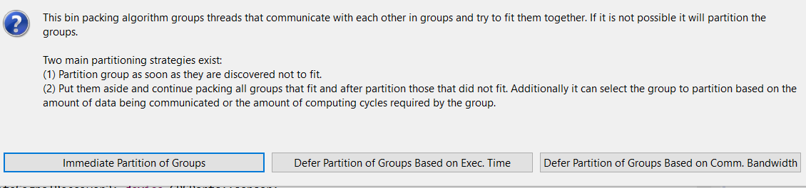

<!--
Copyright (c) 2004-2020 Carnegie Mellon University and others. (see Contributors file). 
All Rights Reserved.

NO WARRANTY. ALL MATERIAL IS FURNISHED ON AN "AS-IS" BASIS. CARNEGIE MELLON UNIVERSITY MAKES NO WARRANTIES OF ANY
KIND, EITHER EXPRESSED OR IMPLIED, AS TO ANY MATTER INCLUDING, BUT NOT LIMITED TO, WARRANTY OF FITNESS FOR PURPOSE
OR MERCHANTABILITY, EXCLUSIVITY, OR RESULTS OBTAINED FROM USE OF THE MATERIAL. CARNEGIE MELLON UNIVERSITY DOES NOT
MAKE ANY WARRANTY OF ANY KIND WITH RESPECT TO FREEDOM FROM PATENT, TRADEMARK, OR COPYRIGHT INFRINGEMENT.

This program and the accompanying materials are made available under the terms of the Eclipse Public License 2.0
which is available at https://www.eclipse.org/legal/epl-2.0/
SPDX-License-Identifier: EPL-2.0

Created, in part, with funding and support from the United States Government. (see Acknowledgments file).

This program includes and/or can make use of certain third party source code, object code, documentation and other
files ("Third Party Software"). The Third Party Software that is used by this program is dependent upon your system
configuration. By using this program, You agree to comply with any and all relevant Third Party Software terms and
conditions contained in any such Third Party Software or separate license file distributed with such Third Party
Software. The parties who own the Third Party Software ("Third Party Licensors") are intended third party benefici-
aries to this license with respect to the terms applicable to their Third Party Software. Third Party Software li-
censes only apply to the Third Party Software and not any other portion of this program or this program as a whole.
-->
# Scheduling Analysis
The built-ins plug-in of OSATE supports three types of analysis related to scheduling:

* **Bind and Schedule Threads**: A binpacking resource allocation tool that ensures schedulability and binding constraints are satisfied. 
* **Schedule Bound Threads**: A rate monotonic analysis of periodic threads that are bound to processors.
* **Check Rate Monotonic Priority Assignment**: For periodic threads with assigned priority ensure the assigned priority adheres to RMA rules.

Other forms of scheduling analysis are provided by external tools. Examples are Cheddar <http://beru.univ-brest.fr/~singhoff/cheddar/> (available through AADL Inspector <https://www.ellidiss.com/products/aadl-inspector/>) and FASTAR <https://www.adventiumlabs.com/demonstration-framework-analysis-schedulability-timing-and-resources-fastar>.

# Invoking the Analyses
 * Select an instance model in the **AADL Navigator**
 * In the main menu, select **Analyses** -> **Timing** -> (**Bind and Schedule Threads** **Schedule Bound Threads** **Check Rate Monotonic Priority Assignment** 

# Results

The results of the analysis are shown in a report found in a subfolder of *instances/reports/*.

Any problems that the analysis finds are also reported in the **Problems** view.

# Bind and Schedule Threads Analysis

This analysis uses a binpacking technique developed as part of the Ph.D. thesis by Dio DeNiz. It allows the user to choose one of three allocation strategies. It takes into account RMA and EDF.

Once the analysis is complete the user can see the results in a dialog and has the choice of having the binding stored in the instance model.

In addition the results are kept in a report in the subfolder *BinPacking*. 

# Schedule Bound Threads Analysis

This analysis considers only periodic threads that are bound to processors.

The results are kept in a report in the subfolder *SchedulingAnalysis*. They are also shown in the **Problems** view.

# Check Rate Monotonic Priority Assignment

This analysis considers only periodic threads that are bound to processors and have an explicit priority assigned. The analysis reports any priority inversion. 

The results are shown in the **Problems** view.

# Execution Time Scaling across Processor Types
  
The compute execution time is specified with respect to a particular processor type. 
If the model uses more than one processor type the latency analysis scales the execution time accordingly.
This is done by looking for a specification of a Reference_Processor property value on the thread (or enclosing component) 
and taking the ratio between the Processor_Capacity of the physical processor the thread is bound to and the reference processor 
as scaling factor.

