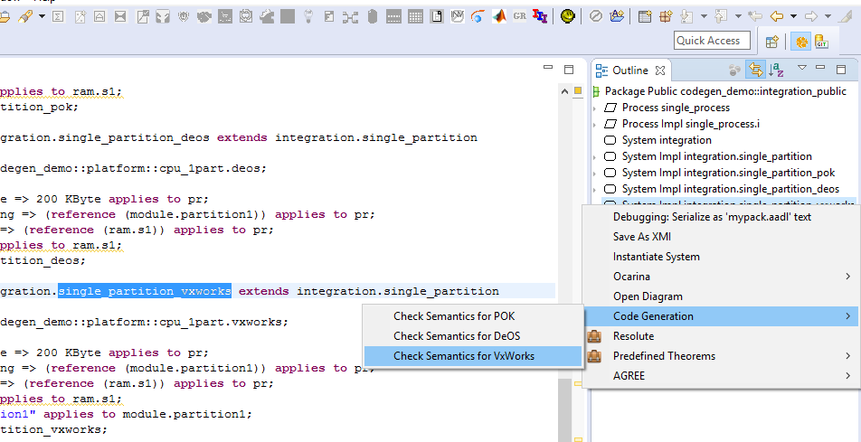
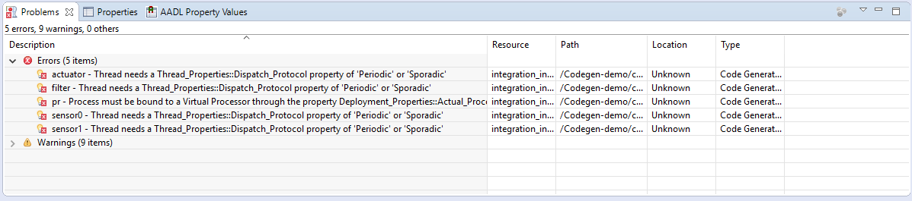

<!--
Copyright (c) 2004-2020 Carnegie Mellon University and others. (see Contributors file). 
All Rights Reserved.

NO WARRANTY. ALL MATERIAL IS FURNISHED ON AN "AS-IS" BASIS. CARNEGIE MELLON UNIVERSITY MAKES NO WARRANTIES OF ANY
KIND, EITHER EXPRESSED OR IMPLIED, AS TO ANY MATTER INCLUDING, BUT NOT LIMITED TO, WARRANTY OF FITNESS FOR PURPOSE
OR MERCHANTABILITY, EXCLUSIVITY, OR RESULTS OBTAINED FROM USE OF THE MATERIAL. CARNEGIE MELLON UNIVERSITY DOES NOT
MAKE ANY WARRANTY OF ANY KIND WITH RESPECT TO FREEDOM FROM PATENT, TRADEMARK, OR COPYRIGHT INFRINGEMENT.

This program and the accompanying materials are made available under the terms of the Eclipse Public License 2.0
which is available at https://www.eclipse.org/legal/epl-2.0/
SPDX-License-Identifier: EPL-2.0

Created, in part, with funding and support from the United States Government. (see Acknowledgments file).

This program includes and/or can make use of certain third party source code, object code, documentation and other
files ("Third Party Software"). The Third Party Software that is used by this program is dependent upon your system
configuration. By using this program, You agree to comply with any and all relevant Third Party Software terms and
conditions contained in any such Third Party Software or separate license file distributed with such Third Party
Software. The parties who own the Third Party Software ("Third Party Licensors") are intended third party benefici-
aries to this license with respect to the terms applicable to their Third Party Software. Third Party Software li-
censes only apply to the Third Party Software and not any other portion of this program or this program as a whole.
-->
# Code Generation Checker
The objective of this plug-in is to check the model
semantics to generate code using the following
platforms:

 * POK
 * DeOS
 * VxWorks

# Invoking the Checker
 * Right-click on a System Implementation in the Outline view
 * Select **Code Generation** in the context menu
 * Select the appropriate checker for your system: POK, DeOS, or VxWorks

# Results
Any problems that the checker finds are reported in the Problems view:

# List of Rules

## Common Rules
 * **Data**: All data components must define the property *Memory_Properties::Data_Size*
 * **Process**: All process components must contain at least one thread subcomponent
 * **Process**: All process components must be bound to a virtual processor through the property *Deployment_Properties::Actual_Processor_Binding*
 * **Process**: All process components must define the property *Deployment_Properties::Actual_Memory_Binding*
 * **Thread**: All thread components must have a *Thread_Properties::Dispatch_Protocol* of *Periodic* or *Sporadic*
 * **Thread**: All thread components must define the property *Timing_Properties::Period*
 * **Thread**: All thread components must define the property *Timing_Properties::Deadline*
 * **Thread**: All of each thread's called subprograms must define the property *Programming_Properties::Source_Name*
 * **Thread**: All of each thread's called subprograms must define the property *Programming_Properties::Source_Text*
 * **Thread**: All of each thread's called subprograms must define the property *Programming_Properties::Source_Language*

## POK Specific Rules
 * **Memory**: All memory subcomponents contained within a memory component must define the property *Memory_Properties::Byte_Count*
 * **Processor**: All processor components must list all virtual processor subcomponents in the property *POK::Slots_Allocation*
 * **Processor**: For all processor components, the size of the property *POK::Slots_Allocation* must equal the size of the property *POK::Slots*

## DeOS Specific Rules
 * **Processor**: All processor components must define the property *ARINC653::Module_Schedule*
 * **Virtual Processor**: All virtual processor components must define the property *Timing_Properties::Execution_Time*
 * **Virtual Processor**: All virtual processor components must define the property *Timing_Properties::Period*

## VxWorks Specific Rules
 * **Processor**: All processor components must define the property *ARINC653::Module_Schedule*
 * **Virtual Processor**: All virtual processor components must define the property *Programming_Properties::Source_Name*