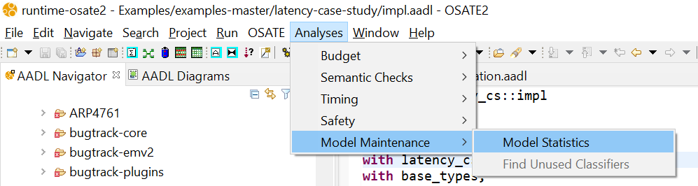
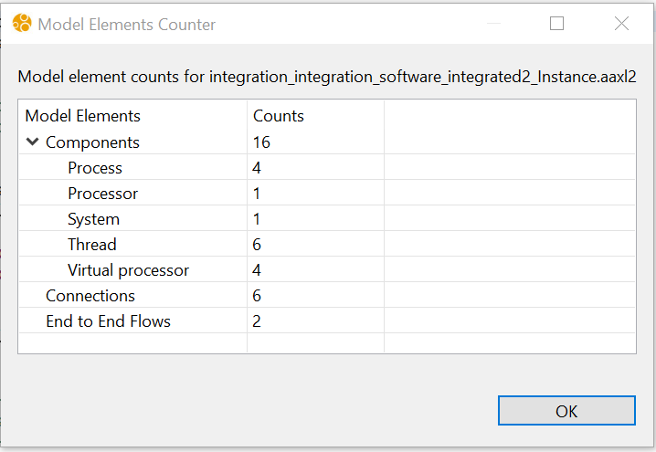

# Model Statistics

The Analysis > Model Maintenance submenu in the main menubar contains analyses for simplifying, understanding, or otherwise "cleaning up" AADL models. **Model Statistics** is one of the tools located in the **Model Maintenance** submenu.

## Executing Model Statistics

The *Model Statistics* analysis returns basic statistics about your system. The counts of AADL components (i.e. systems, threads, etc.), end-to-end flows, and connections are displayed when the analysis is run. To run the analysis, follow these steps:

1. Create an instance model of a system implementation.

2. In the **AADL Navigator**, make sure you have that instance model selected.

3. Find the **Analyses** menu located in the toolbar

4. Navigate to **Model Maintenance** in the **Analyses** toolbar menu

5. **Model Statistics** should appear in solid black text, if the text is gray then an instance model is not currently selected in the **AADL Navigator**.

After running the analysis, a window will be displayed with the counts from your instance model. The **Components** category can be expanded to see more specific counts, as demonstrated in the image below.

Click 'OK' to close the window.