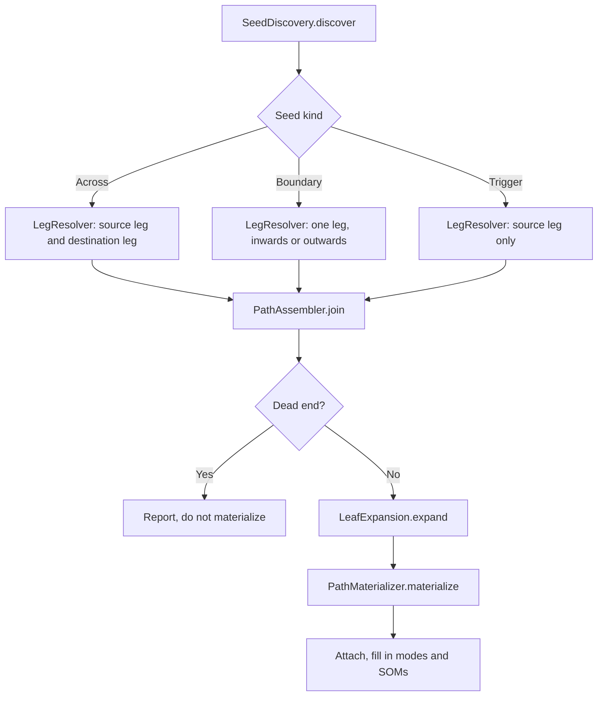

# Connection Instantiation

This document describes how OSATE turns declarative AADL connections into
`ConnectionInstance` objects in the instance model.

Unless another file is named, all types mentioned here live in
`core/org.osate.aadl2.instantiation/src/org/osate/aadl2/instantiation/internal/`, the
traversal's own unexported package, or in `CreateConnectionsSwitch` beside it. References are
by type and method name only — no line numbers, since those move.

---

## 1. Terms

The traversal has its own vocabulary. These are the words used throughout the code and the
rest of this document.

One word is deliberately absent. The AADL standard's *semantic connection* is the complete case
only: a connection between two connection-ending components, thread to thread for instance. What
this traversal enumerates and what `CreateConnectionsSwitch` materializes is a `ConnectionInstance`,
which may be complete or incomplete — a boundary connection at a feature of the instantiation root
is neither thread-to-thread nor invalid. The code therefore says *connection instance* for the
thing produced and *path* for the route it is enumerated from, and leaves *semantic connection* to
the standard.

| Term | Meaning |
|---|---|
| **connection instance** | The thing being instantiated: one end-to-end route from an ultimate source to an ultimate destination, made of one or more declarative `Connection`s. One `ConnectionInstance` is one such route, and it is *complete* when it crosses between peers and *incomplete* when it does not. |
| **segment** | One declarative connection, resolved against the instance model and given an orientation: a `ResolvedSegment` of a declaration, the component instance it is declared in, its two resolved endpoints, and whether it is traversed against its declared direction. |
| **pivot** | The single segment of a complete connection instance that crosses between peers, that is, the one whose declaration `Connection.isAcross()` accepts. A connection instance travels up zero or more containment levels, crosses **once**, and travels down zero or more levels, so there is exactly one pivot. |
| **seed** | Where enumeration starts. A `TraversalSeed` is either an `Across` seed, which is a pivot, or a `Boundary` seed at a feature of the instantiation root, or a `Trigger` seed at an event port that triggers a mode transition. The last two exist because a connection can be incomplete: it has no crossing of its own. |
| **leg** | The part of a connection instance on one side of the pivot, resolved by descending containment away from it. A `LegResult` records where the leg stopped, the segments it traversed to get there, and why it stopped. A leg is *trivial* when the seed endpoint is already the end of the connection. |
| **role** | Which side of the pivot a leg descends towards: `LegRole.SOURCE_LEG` towards the ultimate source, `LegRole.DESTINATION_LEG` towards the ultimate destination. One operation resolves both; the role only decides which declared side of a candidate declaration the leg arrives from. |
| **join** | Pairing a source leg with a destination leg to make a whole path. Not every pair is a connection, see §5. |
| **path** | A joined source leg, pivot and destination leg: a `ConnectionInstancePath`, which is the whole route before any EMF object exists for it. |
| **expansion** | Narrowing a path's two ends to the leaf features that a connection instance can actually connect, because a path may end at a whole feature group. One path becomes one connection instance per leaf pair. |
| **dead end** | A path that arrives somewhere the connection can neither continue from nor end at. It is reported and not materialized. |
| **structural expansion** | A later, separate phase in `InstantiateModel`: replicating a materialized connection across component arrays and applying `Connection_Pattern` and `Connection_Set`. Not part of the traversal, see §7. |

---

## 2. Mental model

An AADL connection declaration is a *hop*, not a connection: it joins two things one
containment level apart. What the instance model needs is the whole route, and the route is
assembled from hops.

```text
Declarative AADL                          Instance model
----------------                          --------------
connections                               ConnectionInstance   (one whole route)
  c1: port a.p -> b.q          ------->     ConnectionReference (one per declarative hop,
  c2: port q -> inner.r        ------->     ConnectionReference  in source-to-destination
                                                                 order, each with the
                                                                 component it is declared in
                                                                 and a reverse flag)
```

The route has a fixed shape, and the traversal is built around it:

```text
    ultimate source                                        ultimate destination
          |                                                        |
          |   <-- source leg --      pivot      -- destination leg -->
          |          (down)         (across)           (down)       |
      c.inner.p  <---- c1 ----  c.p  ==== c2 ====  d.q  ---- c3 ---->  d.inner.q
```

Both legs *descend* containment from the pivot. Read from the ultimate source, the source leg
runs upwards; resolved from the pivot, it runs downwards, which is why one operation resolves
both and why neither leg has to guess when to turn around.

---

## 3. Where it sits in the pipeline

```text
InstantiateModel.fillSystemInstance(root)
 ┌────────────────────────────────────────────────────────────────────────┐
 │ 1. populateComponentInstance()   → ComponentInstance tree, features,   │
 │                                    modes, flow specifications          │
 │ 2. createSystemOperationModes()  → SystemOperationMode list            │
 │ 3. CreateConnectionsSwitch       → ConnectionInstances            ◄── us│
 │      seeds → legs → paths → expansion → materialization → modes/SOMs   │
 │ 4. cacheStructuralConnectionProperties() + processConnections()         │
 │      → array replication, Connection_Pattern, Connection_Set           │
 │ 5. ValidateConnectionsSwitch     → direction, classifier and           │
 │                                    duplicate-destination checks        │
 │ 6. CreateEndToEndFlowsSwitch     → EndToEndFlowInstances               │
 │ 7. cacheProperties(), annex instantiation                              │
 └────────────────────────────────────────────────────────────────────────┘
```

`InstantiateModel.prepareForAnnexes()` runs steps 3 to 7 for the system instance. Additional roots
that represent referenced classifiers skip connection and end-to-end-flow instantiation; only their
properties and annexes are instantiated because they have no system operation modes.

`CreateConnectionsSwitch` extends `AadlProcessingSwitchWithProgress` with
`PROCESS_PRE_ORDER_ALL`, so its `caseComponentInstance` fires for every component instance.
Enumeration is driven by seeds over the whole root rather than per component, so it runs once,
at the first component the traversal reaches, and every later visit returns immediately. The
class is `public` in the exported package `org.osate.aadl2.instantiation`, and it is the only
public surface of the connection phase: everything in §4 to §6 is unexported.

---

## 4. Enumeration



### 4.1 Seeds

`SeedDiscovery.discover` walks the instantiation root once and returns the seeds in a
deterministic key order.

- **Across seeds.** Every declaration of every component instance for which
  `Connection.isAcross()` holds, resolved in both orientations where the declaration is
  bidirectional. A declaration inside a component array is seeded at its first element only;
  the other elements are produced by structural expansion (§7). `SeedDiscovery.orientations`
  is the single definition of these legal choices — forward for every declaration and reverse
  only for a bidirectional declaration — and the outward-continuation check uses the same
  definition.
- **Boundary seeds.** Each top-level feature of the instantiation root, in both directions
  regardless of which way the feature faces. These carry the incomplete connections that enter
  or leave the model. Leaf expansion decides whether the resulting endpoint directions work,
  and validation reports a directly named endpoint whose direction does not work out.
- **Trigger seeds.** Each event port that triggers a mode transition of its component. A mode
  transition ends a connection instance, and the trigger is its consumer, so the connection
  has a destination but no crossing.

Endpoint resolution is `EndpointResolver`, which walks the whole `ConnectedElement` chain of a
declaration's end, so `sub.group.member` resolves to the member and not to the group. Its
outcome is a `Resolution`: `Resolved`, `NotApplicable` for an end that can never have an
instance object, such as an internal or processor feature, or `Failed` with a target and a
message for an end the model should have had. Failures are collected in `ResolutionFailures`
and reported once each after every seed has been examined, so that a path can be explored and
discarded without leaving a diagnostic behind.

### 4.2 Legs

`LegResolver.resolve` descends from a seed endpoint. At each step it asks which declarations of
the component that owns the current feature continue the leg: a candidate must arrive at that
feature on the side the role dictates, and its far end must be inside a subcomponent, which is
what keeps this a descent rather than a graph walk. Branching produces several `LegResult`s
from one seed, each with its own segment list, feature chain, mode constraint and visited set,
so extending one branch cannot disturb another. A declaration already traversed in the same
orientation on the same branch is skipped, so a cyclic model terminates.

A leg stops at the first terminal policy that applies, and the reason is recorded on the
result:

| Stop reason | Why |
|---|---|
| `endpoint is a component` | An access connection ends at a shared data, bus, virtual bus, subprogram or subprogram group. |
| `connection ending component` | A thread, device, processor or virtual processor ends a connection instance at a port or feature group. It does not end one at an access feature: shared access reaches through such a component into what it contains, so the leg both stops and continues when a feature group holds both. |
| `component type only` | A component with no implementation has no internals to descend into. |
| `no continuing declaration` | Nothing inside routes the feature onwards. Such a stop is only the ultimate source if the component does not route the feature internally, which is what `mayBeUltimateSource()` decides. |
| `nothing continues this member` / `member triggers a mode transition` | Asked member by member of a feature group: a member nothing continues ends the connection if it triggers a mode transition, and is a dead end otherwise. |

### 4.3 Join

`PathAssembler.join` builds a path per compatible leg pair. For a complete path the source
leg's segments are reversed and re-oriented, because the finished path traverses each
declaration the opposite way from the leg that discovered it; the pivot goes in the middle; the
destination leg's segments follow as they are.

Two legs pair when the members of the pivot they cover correspond. Each leg's *footprint* is
its terminal mapped back up through every segment it traversed, and the two footprints must
agree at every level both reach, under the pivot's own feature group mapping — by name, or by
position where an inverse feature group renames its features. Comparing the legs' whole feature
chains instead does not work: those chains describe features of different components and never
match.

Paths are deduplicated by `ConnectionInstanceKey`, which is built from stable data — endpoint
paths, ordered declaration identity, contexts and reverse flags — never from object identity or
a display name. Legs, resolved segments and deduplicated paths are returned in stable key order.
`PathKeys.sortedByStableKey` implements the shared decorate-sort-undecorate operation, so each
stable key is computed once rather than once per comparison.

### 4.4 Expansion and materialization

`LeafExpansion.expand` narrows a path's ends to leaf pairs, reproducing AADL feature group
semantics: direction filtering inside a group, name-then-index matching for inverse groups,
subset matching by name, and positional pairing when neither end is a leaf. Direction decides
which members pair *inside* a feature group; two features a declaration names directly are
connected whatever they face, and `ValidateConnectionsSwitch` reports it if that does not work
out. Finding which member a path reached uses one `findReachedFeature` operation parameterized
by the source or destination end; the two descriptive wrappers differ only in which way they
walk the segment list.

`PathMaterializer.materialize` builds the `ConnectionInstance` for one leaf pair: the name from
the container-relative endpoint paths, the ordered `ConnectionReference` chain with each
intermediate destination narrowed to the member matching the source it came from, the kind from
the endpoint categories, and completeness from the path. `ConnectionInstance.bidirectional` is
left at its default `false`; a path records whether every segment could also be followed the
other way, and that state deliberately does not reach the instance model.

`CreateConnectionsSwitch.attachAcrossFirst` attaches the result, then fills in modes and mode
transitions. Nothing is suppressed as a duplicate: paths are already unique by structured
identity, so a duplicate would be an enumeration defect, and it throws.

---

## 5. Invariants

The traversal holds these by construction, and the characterization tests assert them:

- A complete path contains exactly one pivot; an incomplete path contains none.
- Enumeration creates no EMF object. Only materialization does.
- One connection instance exists per legal endpoint orientation. Two orientations of one
  bidirectional pair are two connections, and they are never collapsed into one.
- Enumeration order and therefore the connection collection order is deterministic, and
  derived from stable keys only.
- A connection instance's endpoints match the first and last of its references, and its
  references form a continuous chain.

---

## 6. Diagnostics

| Condition | Target | Reported by |
|---|---|---|
| A feature a declaration names that the component does not have | the instantiation root | `EndpointResolver` via `ResolutionFailures` |
| A subcomponent a declaration names that the instance model does not have | the instantiation root | `EndpointResolver` via `ResolutionFailures` |
| Source and destination are both components | the instantiation root | `SeedDiscovery` |
| A path that can neither continue nor end | the feature it arrives at | `CreateConnectionsSwitch.reportDeadEnd` |
| A connection active in no system operation mode | the containing component, and the connection is deleted | `CreateConnectionsSwitch.fillInModes` |
| A direction that does not work out along a segment | the connection instance | `ValidateConnectionsSwitch.checkSegmentDirections` |
| A source or destination boundary feature that a component with subcomponents does not continue | the connection instance; a destination mode-transition trigger is exempt | `ValidateConnectionsSwitch.checkUncontinuedBoundaryEnds` |
| Incompatible endpoint classifiers | the connection instance | `ValidateConnectionsSwitch.checkEndPointClassifiers` |
| More than one connection ending at one in data port | the port, and each connection | `ValidateConnectionsSwitch` |

Enumeration itself reports nothing while a path is under construction. That is what lets a
candidate be explored and dropped silently, and it is the reason the diagnostics of the
traversal are attached to the model or to a materialized connection rather than to a partial
path.

---

## 7. What the traversal does not do

- **Arrays, `Connection_Pattern` and `Connection_Set`.** A materialized connection is
  *provisional* until `InstantiateModel.processConnections()` replicates it across arrays and
  applies the structural properties, deleting the provisional instances it replaces. Those
  properties are cached on connection instances, so they cannot constrain a join that happens
  before any instance exists.
- **Mode and SOM assignment.** A topologically valid path is materialized even when its modes
  have no compatible system operation mode; `fillInModes` then finds none, warns and deletes
  it. A `ModeConstraint` is carried through the traversal for identity and diagnostics, not as
  an earlier filter.
- **Validation.** Direction and classifier rules run over materialized connections in
  `ValidateConnectionsSwitch`, so a rejected connection is reported once, against something the
  reader can see in the instance model.
- **End-to-end flows.** A flow refers to connection instances without containing them, which
  is why structural expansion has to finish before `CreateEndToEndFlowsSwitch` runs: a flow
  would otherwise keep a reference to a deleted provisional connection. Flow instantiation is
  described separately, in `e2e_instantiation.md` once the work on issue #3005 lands.

---

## 8. Reading order for the code

1. `CreateConnectionsSwitch.instantiateAcrossFirst` — the whole pipeline in one method.
2. `TraversalSeed` and `SeedDiscovery` — what enumeration starts from, and the array rule.
3. `EndpointResolver` and `Resolution` — how a declaration's end becomes an instance object,
   and how the three outcomes differ.
4. `LegResolver.descend` — the terminal policies, then `continuations` for the descent rule.
5. `PathAssembler.join` — leg pairing, then `ConnectionInstanceKey` for deduplication.
6. `LeafExpansion.expand` — feature group semantics.
7. `PathMaterializer` — names and reference chains, which are the externally visible part.

The characterization tests in
`core/org.osate.core.tests/src/org/osate/core/tests/issues/Issue3037*Test.java`, with models in
`core/org.osate.core.tests/models/issue3037/`, are the executable specification;
the utilities in `core/org.osate.core.tests/src/org/osate/core/tests/instantiation/` hold the
behavior they share. `InstanceCharacterization` owns connection-name and integrity assertions,
`InstanceRoots` supplies the system and referenced-classifier roots to both `InstanceSnapshot`
and `InstanceIntegrity`, and `InstanceReport` renders descriptors through common ordered and
sorted line helpers. `ArraysAndFeatureGroups.aadl` and `AccessAndEndings.aadl` are the two most
instructive models.

---

## 9. Behavior accepted as changed

Issue #3037 replaced the traversal, and eight differences from 2.18.0 were reviewed and
approved rather than reproduced. This is the list, and it is the reason a test asserts an
absent diagnostic or a set instead of a sequence. Tests refer to these by number as
"allowlist entry N"; the numbering is the review's own, and entry 4 was approved and then
withdrawn, so its number is not reused.

Nothing else about a connection instance was allowed to change. In particular: names,
source and destination, the count where two orientations exist, `bidirectional`, membership
in flows, and mode-transition connections are all unchanged.

| Entry | What may differ | 2.18.0 | now | Why |
|---|---|---|---|---|
| **1** | Per-container `connectionInstances` order | insertion order of the old traversal | deterministic key order (§5) | The old order was an artifact of per-component enumeration. Nothing documented it, and the new order is derived from stable keys, so it can be pinned. |
| **2** | Per-container sibling `endToEndFlows` order | followed entry 1 | follows entry 1 | A consequence of entry 1. The ordered element sequence *inside* each flow is unchanged. |
| **3** | Diagnostic set | warning `Connection to <path> could not be instantiated.` for a destination that is an internal feature | no diagnostic | Redundant with the declarative error added by issue #3028, and unreachable for a model that validates. An internal feature is never instantiated, so the segment can only be ignored. |
| **5** | Diagnostic text and target | warning `No connection declaration from feature <f> of component <c> to subcomponents. Connection instance ends at <c>` on the system instance | warning `Connection ends at <c> because feature <f> has no continuing connection declaration.` on the connection instance | Both traversals observe the same fact and build the same model. Issue #3047 moved the report to connection validation, where it is emitted once against the materialized connection; validation also reports the symmetric source-side condition and exempts a destination that triggers a mode transition. |
| **6** | Diagnostic text and target | one error on the destination component, `Destination feature <f> not found. No connection created.` | one error per unresolvable end, on the instantiation root, `Feature <f> not found in <component>` | Endpoints are now resolved before any path exists, so the report can name which feature of which component is missing, and can name both ends. The old text needs information the resolver does not have: which end a partial path was heading for. |
| **7** | Diagnostic text | `Instantiation error: no component instance for subcomponent <s>` | `No component instance for subcomponent <s>` | Same fact, same severity, same target. The prefix said only that instantiation noticed, which the target already says. |
| **8** | Diagnostic set | warning `Could not continue connection from <src>  through <dst>. No connection instance created.` (two spaces) for a path travelling up that the level above does not continue | no diagnostic | Neither traversal creates the connection. The old one was extending that path when it found out, so it had a candidate to report; nothing seeds such a path now, and reproducing the warning would mean seeding every uncontinued boundary feature of every subcomponent purely to report and discard it. The information is worth having and is follow-up work, not a regression. |
| **9** | The connection instances of an implementation whose pivot names a feature group member | references pinned to the enclosing group, which crosses member pairs and loses one orientation | references narrowed to the member the declaration names | The only entry that changes connection instances. The old behavior resolved an end from the first link of its `ConnectedElement` chain, so `o.ofg.of1` resolved to `o.ofg`; the crossed pairs connect members the model does not connect, and the lost orientation is a connection the model has. Filed as [#3046](https://github.com/osate/osate2/issues/3046) and accepted rather than fixed in 2.18.0. |

Entries 1 and 2 also account for changes outside this bundle: `Serializer1Test` compares whole
serialized instance models, `Issue2205Test` reads a broadcast group's connections by position,
and two flow-latency `.result` fixtures reference connections as `@connectionInstance.N`.

---

## Appendix: referenced issues

| Issue | Title | Where it appears above |
|---|---|---|
| [#3028](https://github.com/osate/osate2/issues/3028) | Internal feature allowed only at the source end of a connection | §9 — allowlist entry 3 |
| [#3037](https://github.com/osate/osate2/issues/3037) | Use across-first connection traversal | the traversal this document describes |
| [#3038](https://github.com/osate/osate2/issues/3038) | Crash instantiating a nested boundary feature group member | §4.1 — boundary seeds and their members |
| [#3040](https://github.com/osate/osate2/issues/3040) | Nested boundary feature group loses the inward connection instance | §4.1 — seeding both boundary directions |
| [#3042](https://github.com/osate/osate2/issues/3042) | Direction check on the connection instance | §4.4, §6 — direction is validated after materialization |
| [#3044](https://github.com/osate/osate2/issues/3044) | Port sharing a feature group with a connected access feature gets no connection instance | §4.2 — stopping at uncontinued members |
| [#3046](https://github.com/osate/osate2/issues/3046) | Connection end naming a feature group member is instantiated against the enclosing group | §4.1 — why `EndpointResolver` walks the whole chain |
