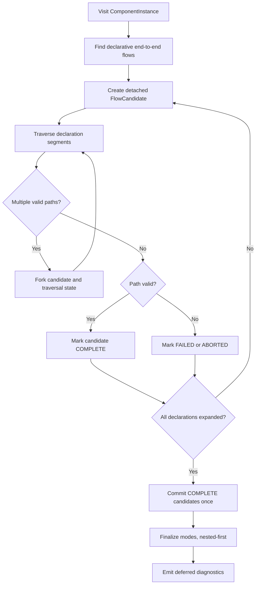
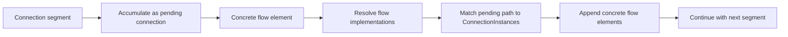
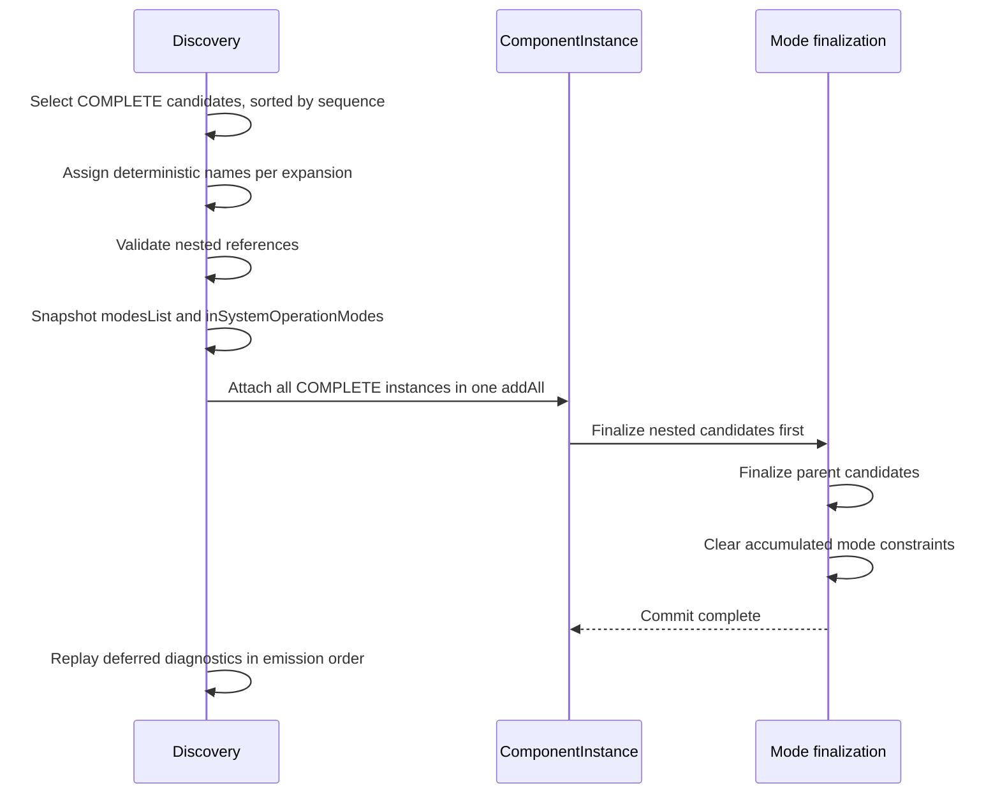

# End-to-End Flow Instantiation

This document describes how OSATE turns declarative AADL end-to-end flows into
`EndToEndFlowInstance` objects in the instance model.

All types mentioned here live under
`core/org.osate.aadl2.instantiation/src/org/osate/aadl2/instantiation/`, one per file, in the
package shown below. References are by type and method name only — no line numbers, since those
move.

| Type | Package | Responsibility |
|---|---|---|
| `CreateEndToEndFlowsSwitch` | `instantiation` | the traversal adapter: component callbacks, classifier lookup, cancellation, the compatibility entry point, and every protected extension point |
| `EndToEndFlowSession` | `instantiation.internal` | one component instance's discovery: candidates, traversal state, expansion, deferred diagnostics, and the atomic commit |
| `FlowConnectionMatcher` | `instantiation.internal` | stateless connection lookup and compatibility predicates |
| `EndToEndFlowModes` | `instantiation.internal` | mode resolution and system-operation-mode computation |
| `FlowInstantiationHost` | `instantiation.internal` | the adapter's extension points as the session sees them |
| `FlowIterator` | `instantiation.internal` | branch-local cursor over one declaration |
| `ETEInfo` | `instantiation.internal` | the legacy per-variant view published on request |

Issue #3055 split these out of what was one class; the ownership boundaries are §4.1 and the
decomposition is not observable in the instance model.

---

## 1. Mental model

An AADL end-to-end flow declaration is a *path template*: a route through connections,
component flow specifications, accesses, and possibly other end-to-end flows.
Instantiation resolves that template against a concrete instance model.

```text
Declarative AADL                         Instance model
----------------                         --------------
end to end flow                          EndToEndFlowInstance
  connection declaration      ------->     ConnectionInstance   (a *semantic* connection:
                                                                 an ordered chain of
                                                                 declarative Connections)
  subcomponent flow spec      ------->     FlowSpecificationInstance
  subcomponent (implicit)     ------->     ComponentInstance
  data/subprogram access      ------->     accessed ComponentInstance
  nested end to end flow      ------->     EndToEndFlowInstance
```

A single declaration may produce **several** instances, because each resolution step can be
one-to-many.

---

## 2. Where it sits in the pipeline

End-to-end flow (ETE) instantiation is the **last structural phase** of instance-model
construction. It depends on everything before it — component instances, flow specification
instances, system operation modes, and especially semantic connection instances.

```text
InstantiateModel.fillSystemInstance(root)
 ┌────────────────────────────────────────────────────────────────────────┐
 │ 1. populateComponentInstance()                                         │
 │      → ComponentInstance tree, FeatureInstances, ModeInstances,        │
 │        provisional FlowSpecificationInstances (instantiateFlowSpecs)   │
 │ 2. createSystemOperationModes()      → SystemOperationMode list        │
 │ 3. CreateConnectionsSwitch           → provisional ConnectionInstances,│
 │                                        each with an ordered            │
 │                                        ConnectionReference chain of    │
 │                                        declarative Connections         │
 │ 4. cacheStructuralProperties()       → Connection_Pattern and          │
 │                                        Connection_Set on both kinds of │
 │                                        provisional instance            │
 │ 5. ConnectionArrayExpander           → final ConnectionInstances       │
 │ 6. FlowSpecArrayExpander             → final FlowSpecificationInstances│
 │ 7. ValidateConnectionsSwitch                                           │
 │ 8. CreateEndToEndFlowsSwitch         → EndToEndFlowInstances   ◄── us  │
 │ 9. cacheProperties(), annex instantiation                              │
 └────────────────────────────────────────────────────────────────────────┘
```

Steps 5 and 6 are why a flow sees only final instances. Both replace the provisional instances
they expand, and a flow refers to connection instances and flow specification instances without
containing them, so a flow built before either expansion would keep instances that no longer exist.

`InstantiateModel` invokes the switch as `new CreateEndToEndFlowsSwitch(...).processPreOrderAll(root)`
for the system instance. Additional roots that represent referenced classifiers bypass steps 3, 5, 7
and 8 because they have no system operation modes; they do go through steps 4, 6 and 9, so their flow
specification instances mean the same thing as the system instance's.

The switch extends `AadlProcessingSwitchWithProgress` and is constructed with
`PROCESS_PRE_ORDER_ALL`, so its `InstanceSwitch.caseComponentInstance` fires for **every**
component instance in pre-order. It creates one `EndToEndFlowSession` per visited component,
instantiates the ETEs declared in *its own* implementation — obtained via
`ComponentImplementation.getAllEndToEndFlows()` — into that session, and commits it.

`org.osate.aadl2.instantiation` is an exported package (see the bundle `MANIFEST.MF`), so the
`public`/`protected` members of this class — the constructor, `instantiateEndToEndFlow`,
`processETE`, `processETESegment`, `processSubcomponentFlow`, `processFlowImpl`, `processFlowStep`,
`setCloneName`, `resetETECloneCount`, `getModeInstances`, `fillinModes` — are external API.
`org.osate.aadl2.instantiation.internal` is **not** exported, which bounds what a subclass outside
the bundle can actually reach: `instantiateEndToEndFlow`, `processETESegment`,
`processSubcomponentFlow`, and both `processFlowStep` overloads name `ETEInfo` or `FlowIterator` in
their signatures, so they are overridable only from inside the bundle. That was already true when
both types were package-private members of the switch. The hooks reachable from another bundle are
`processETE`, `processFlowImpl`, `setCloneName`, `resetETECloneCount`, `getModeInstances`, and
`fillinModes`.

---

## 3. The core problem: one declaration → N instances

```text
DECLARATIVE                                    INSTANCE
───────────────────────────────────────────────────────────────────────────
end to end flow
  producer.fsrc  ──── flow spec ──────────────►  FlowSpecificationInstance
  enter          ──── connection ─────────────►  ConnectionInstance
                      (one declarative conn        (a semantic connection —
                       may participate in many      a chain of declarative
                       semantic connections)        connections)
  choice.fpath   ──── flow spec ──────────────►  expanded through the
                      (may have SEVERAL             subcomponent's
                       flow implementations)        FlowImplementations,
                                                    each followed recursively
  leave
  consumer.fsnk
```

Six sources of multiplicity:

1. **Multiple flow implementations** for one flow specification — in the test model
   `BasicAndBranching.aadl`, `Choice.two_paths` declares `fpath` twice, once through `upper` and
   once through `lower`.
2. **Multiple semantic connection instances** matching the same declarative connection — feature
   group expansion, arrays, fan-out.
3. **Multiple access targets** behind one data or subprogram access.
4. **Multiple instances of a nested ETE** referenced by an outer ETE.
5. **Multiple flow specification instances** for one flow specification — a specification whose in or
   out end is a feature array was expanded by `FlowSpecArrayExpander` into one instance per pair of
   array elements that `Connection_Pattern`, `Connection_Set` or the default `One_To_One` pairs up
   (issue #2787).
6. **Multiple component instances** for one subcomponent named by a segment — a subcomponent array has
   one component instance per element, and each of them continues a flow of its own (issue #1833).
   A nested ETE replicated this way replicates the flow that contains it, through source 4.

Each multiplicity point **forks** the traversal. Surviving branches are named `<flow>_1`,
`<flow>_2`, … at commit time.

---

## 4. Architecture: detached discovery, one atomic commit

This is the defining property of the implementation. Discovery may freely branch, copy, and discard
candidates; the live component model changes exactly once, after discovery finishes.

```text
                  Detached discovery
                         |
       +-----------------+-----------------+
       |                 |                 |
    COMPLETE          FAILED            ABORTED
       |                 |                 |
       +--------+        `------X----------'
                |
                v
       Atomic component commit
                |
                v
        Final instance model
```



### Why detached construction works

`EndToEndFlowInstance.getFlowElements()` is a **non-containment** reference (see
`core/org.osate.aadl2/model/instance.ecore` — the `flowElement` reference of
`EndToEndFlowInstance` has no `containment` flag). Elements can therefore be appended to an
instance that is not yet in a resource, and `EcoreUtil.copy` of a candidate is cheap and safe.

What does *not* work while detached: `getSystemInstance()`, `getInstanceObjectPath()`,
`isActive(som)`, and error reporting all navigate `eContainer()` / `eResource()`.
`AnalysisErrorReporterManager.error(Element, String)` resolves its reporter through
`obj.eResource()`, so reporting against a detached candidate would fail. Hence two design
consequences:

- `FlowCandidate` carries an explicit `owner` field instead of relying on `eContainer()`.
- Every diagnostic is queued and replayed after commit (§8).

### 4.1 Who owns what

```text
CreateEndToEndFlowsSwitch                     ← public, exported, the compatibility promise
  visits component instances, resolves their implementation through the classifier cache,
  watches the progress monitor, reports errors, counts clone names,
  declares every protected extension point, and holds activeSession
        │                                     ▲
        │ creates one per                     │ every traversal step and both mode
        │ component instance                  │ computations leave the session through
        ▼                                     │ FlowInstantiationHost, never around it
EndToEndFlowSession                           ← internal, one component instance
  candidates, expansions, traversal state, deferred diagnostics, atomic commit
        │ uses
        ├─► FlowConnectionMatcher   stateless: which connection instance can continue this flow
        ├─► EndToEndFlowModes       mode instances and system operation modes
        ├─► FlowIterator            branch-local cursor over one declaration
        └─► ETEInfo                 legacy per-variant view, only when a caller asks for one
```

The session never calls its own traversal steps directly and never computes modes directly. Both go
out through `FlowInstantiationHost`, whose methods are the switch's protected ones seen from inside,
implemented by a private inner class of the switch that forwards to them. That indirection is the
reason an override still decides an outcome no matter how deep in the traversal the step is reached
from — `ExtensionHookEndToEndFlowInstantiationTest` pins exactly that. `FlowConnectionMatcher` and
`EndToEndFlowModes` hold no state and are reached statically; the matcher's predicates are pure
questions about a connection instance, so they can be read without knowing how the flow got there.

The switch resolves the session for a protected step from `activeSession` and throws
`IllegalStateException("No active end-to-end flow instantiation context")` when there is none, so
calling a hook outside an instantiation fails instead of touching an unrelated component.

---

## 5. Data structures

Three nested scopes, plus one branch-local cursor. All of them are private to
`EndToEndFlowSession`; nothing outside it sees a candidate:

```text
EndToEndFlowSession                           ← per ComponentInstance
  host               : FlowInstantiationHost  (the switch's extension points)
  owner              : ComponentInstance      (explicit; no eContainer() reliance)
  initialFlows       : List.copyOf(owner.getEndToEndFlows())  ← commit precondition
  expansions         : EndToEndFlow → FlowExpansion   (IdentityHashMap, memoized)
  expansionOrder     : List<FlowExpansion>            (declaration order)
  candidates         : List<FlowCandidate>            (global creation order)
  candidatesByInstance : EndToEndFlowInstance → FlowCandidate
  activeDeclarations : List<EndToEndFlow>              ← DFS stack, cycle detection
  diagnostics        : List<PendingDiagnostic>         ← sealed; deferred, replayed at commit
  nextCandidateSequence, nextDiagnosticSequence, canceled

   └── FlowExpansion                          ← per declarative EndToEndFlow
         declaration : EndToEndFlow
         candidates  : List<FlowCandidate>
         status      : EXPANDING | COMPLETE | FAILED

          └── FlowCandidate                   ← per prospective instance (a branch)
                owner           : ComponentInstance
                expansion       : FlowExpansion
                instance        : EndToEndFlowInstance   ← DETACHED EObject
                preConnections  : List<Connection>   decl conns before the 1st element
                postConnections : List<Connection>   decl conns left over at the end
                sequence        : long               ← creation order, drives naming
                status          : ACTIVE | COMPLETE | FAILED | ABORTED

TraversalState                                ← branch-local cursor, held in a session field
  candidate           : FlowCandidate
  continuations       : Deque<FlowIterator>   ← descent stack
  connections         : List<Connection>      ← pending connection filter
  flowImplementations : List<FlowImplementation>  ← source/destination feature constraints
```

Two fields hold the current scope, one in each class:

- `CreateEndToEndFlowsSwitch.activeSession` — the session of the component being visited
- `EndToEndFlowSession.activeState` — the `TraversalState` of the branch currently advancing

`caseComponentInstance` and `instantiateEndToEndFlow` save and restore `activeSession` around their
bodies, and `expand` does the same for `activeState`, so re-entrant calls nest cleanly. Restoring the
session restores its traversal state with it, since the state belongs to the session. `session()`,
`getCandidate(etei)`, and `getState(etei)` are the guarded accessors: they throw
`IllegalStateException` if there is no instantiation in progress, if an instance is not part of the
active session, or if a branch tries to advance while it is no longer the active one.

A session belongs to one component instance. `instantiateEndToEndFlow` enforces that by throwing
`IllegalStateException("End-to-end flow expansion crossed component contexts")` when it is asked to
expand a declaration in a component other than the active session's owner, which is why `expand`
can use the session's `owner` as the component context.

`FlowIterator` is a uniform cursor over either `EndToEndFlow.getAllFlowSegments()` or
`FlowImplementation.getOwnedFlowSegments()`. It holds a single `List<? extends Element> segments`
plus an `index`, and its `copy()` returns a new iterator over the same list at the same position —
that is how a fork resumes exactly where its sibling was.

`ETEInfo` is the legacy per-variant view (`preConns`, `etei`, `postConns`) that
`EndToEndFlowSession.compatibilityInfo` builds from a declaration's candidates, in creation order,
for the `HashMap<EndToEndFlow, List<ETEInfo>>` that `instantiateEndToEndFlow` accepts. It exists for
API compatibility and is built only when a caller supplies a map; internal calls pass `null` because
traversal uses `FlowCandidate` directly.

---

## 6. Traversal

Entry is `processETE`, which creates a `FlowIterator` over the declaration and hands its first
segment to `processETESegment`. From there the shape is a dispatch plus a driver loop.



### 6.1 Segment dispatch

`processETESegment` unwraps the segment — `FlowSegment` and `EndToEndFlowSegment` are handled by a
pattern-matching switch, and any other segment kind raises `IllegalArgumentException` — then
dispatches on the flow element:

```text
processETESegment(ci, etei, segment, iter, errorElement)
  fe = segment.getFlowElement()
  │
  ├─ Connection ─────────────► if the instance has no elements yet:
  │                                candidate.preConnections += fe
  │                            else:
  │                                traversal.connections += fe   (pending filter)
  │
  ├─ FlowSpecification ──────► scis = subcomponentInstances(ci, segment.getContext(), …)
  │                            FORK PER ELEMENT → processSubcomponentFlow(element, …)
  │                            scis empty → owner error, "Could not find component
  │                                         instance for subcomponent …"
  │
  ├─ Subcomponent ───────────► scis = subcomponentInstances(ci, fe, …)
  │                            FORK PER ELEMENT → processFlowStep(element, …)
  │                            (implicit flow: the whole component)
  │
  ├─ DataAccess / SubprogramAccess ─► processAccess(…)
  │
  └─ EndToEndFlow ───────────► processEndToEndFlow(…)   (nested flow)
```

A declaration names a subcomponent, not one of its elements, so `subcomponentInstances` returns all
of them and `forkOverElements` continues a flow per element (issue #1833). It **narrows** them first:
with pending connections, only the elements some matching connection instance ends in survive.
Forking into an element no connection reaches would create a branch that can only die, and
§6.4 would report that death as a missing semantic connection — so issue 1984's filter-first rule
has to be applied one fork earlier. When nothing reaches any element, one element is kept, so the
report is made once, the way it was when a declaration resolved to the first element only.

### 6.2 Descent and ascent

`processSubcomponentFlow` decides whether a flow specification is a **leaf** or must be **refined**:

```text
processSubcomponentFlow(ci, etei, fs, iter)
  flowImpls = subImpl.getAllFlowImplementations() where spec name matches fs (ignoring case)
  │
  ├─ empty  →  LEAF: processFlowStep(ci, etei, fs, iter)
  │            then, if subImpl != null && AadlUtil.hasPortComponents(subImpl)
  │                 && no new diagnostic was queued by that step:
  │                     owner error (issue #2872)
  │                     "… has subcomponents but no flow implementation for flow 'x'"
  │
  └─ non-empty → push `iter` onto continuations; then FORK PER IMPLEMENTATION:
       │
       ├─ subImpl is a ThreadClassifier && impl has owned segments → issue 1953:
       │     keep the impl's mode constraints, pop the continuation,
       │     and treat the specification as an atomic leaf
       │
       └─ processFlowImpl(ci, etei, flowImpl):
            etei.getModesList().add(getModeInstances(ci, flowImpl))
            if flowImpl.getOwnedFlowSegments().size() < 2:
                 pop the continuation; return false
                 → caller falls back to processFlowStep(ci, etei, fs, flowImpl, iter)
            else continueFlow(ci, etei, new FlowIterator(flowImpl), ci)   → DESCEND
```

`AadlUtil.hasPortComponents(ComponentImplementation)` returns true when the implementation has any
subcomponent of a category that *can* have ports — abstract, system, process, thread group, thread,
device, or processor. It is not a test for subcomponents that happen to declare ports.

The empty-implementation case deliberately follows the normal path: an implementation with no
segments may still refine a feature-group endpoint to one of its features.

### 6.3 The driver loop

`continueFlow` is the engine; the `continuations` deque is what makes descent and ascent work.

```text
continueFlow(ci, etei, iter, errorElement):
  candidate = getCandidate(etei)
  loop:
    if monitor canceled                → session canceled = true; return
    if activeState is null or its candidate != candidate
                                       → return       (a fork took over)
    if ci == null                      → ElementError diagnostic
                                          "Flow instance leaves system instance for flow …";
                                          clear pending connections; return
    while iter.hasNext():
        processETESegment(ci, etei, iter.next(), iter, errorElement)
        if candidate ABORTED/FAILED or branch switched → return
    if candidate COMPLETE              → return
    if continuations.isEmpty():
        if candidate is still ACTIVE:
            if candidate has no flow elements:
                clear pending connections; candidate.status = FAILED
            else:
                candidate.postConnections += leftover pending connections
                clear pending connections
                candidate.status = COMPLETE        ← normal termination
        break
    iter = continuations.pop()                     ← ASCEND
    ci   = ci.getContainingComponentInstance()
```

For `branched: producer.fsrc -> enter -> choice.fpath -> leave -> consumer.fsnk`, where `choice`
refines `fpath` internally:

```text
level: BranchingTop.i           [ETE iter]  fsrc  enter  choice.fpath  leave  fsnk
                                                            │            ▲
                              push ETE iter ────────────────┘            │ pop
level: choice (Choice.two_paths) [impl iter] to_upper  upper.fpath  from_upper
                                                            │            ▲
                                                    leaf; no impl ───────┘
level: upper (Endpoint)                     FlowSpecificationInstance upper.fpath
```

### 6.4 The pending-connection filter

This is the heart of connection resolution. Declarative connections encountered between two flow
elements accumulate in `traversal.connections`; when the next flow element arrives, that
*sequence* is matched against real connection instances.

```text
processFlowStep(ci, etei, leaf, nextFlowImpl, iter)
 │
 │  flowSpecs = flowSpecInstances(ci, leaf)      ← every instance of the leaf's spec
 │
 ├─ pending connections EMPTY  (start of the flow)
 │    FORK PER FLOW SPECIFICATION INSTANCE:      (one step when the leaf has none)
 │       if addLeafElement(ci, etei, leaf, flowSpec):
 │           push nextFlowImpl onto flowImplementations
 │           continueFlow(ci.getContainingComponentInstance(), …)
 │           pop flowImplementations
 │       else:
 │           abortCandidate
 │
 └─ pending connections NON-EMPTY
      connis = collectConnectionInstances(ci, etei, traversal.connections)
      │
      ├─ connis empty  →  clear pending; failCandidate; and if the preceding flow
      │                   implementation is known, owner error
      │                   "… no semantic connections that continue the flow 'f'
      │                    from feature 'x'"
      │
      └─ build the match list — issue 1984: filter first, report only if none survive
           flowFilter (previous impl's out end) → startsAtFlowOutput(fimpl, conni)
           subcomponent leaf                   → matches with no flow spec
           otherwise, per flow spec instance   → reaches(conni, flowSpec, nextFlowImpl, …)
                nextFlowImpl known → endsAtFlowInput(conni, fimpl), and
                                     endsAtFlowSource(conni, flowSpec) when the spec
                                     has more than one instance
                otherwise          → endsAtFlowSource(conni, flowSpec)
           │
           ├─ no match → owner error
           │             "… no semantic connections that connect to the start of
           │              the flow 'f' at feature 'x'"
           │             clear pending; failCandidate
           │
           └─ FORK PER MATCH (connection instance × flow specification instance):
                 push nextFlowImpl onto flowImplementations
                 etei.getFlowElements() += match.connection()
                 if addLeafElement(ci, etei, leaf, match.flowSpec()):
                     clear pending; peek `iter` for the next Connection → pending
                     continueFlow(ci.getContainingComponentInstance(), …)
                 else:
                     clear pending; abortCandidate
                 pop flowImplementations
```

Connection resolution itself is `FlowConnectionMatcher`, which asks nothing about how the flow was
reached. Its three endpoint predicates are pure:

| Predicate | Question |
|---|---|
| `endsAtFlowInput(conni, fimpl)` | does the connection end at the implementation's in-end feature? |
| `startsAtFlowOutput(fimpl, conni)` | does the connection start at the implementation's out-end feature? |
| `endsAtFlowSource(conni, fsi)` | does the connection end at *this* flow specification instance's source feature, or at a feature nested inside it? (walks up the `FeatureInstance` containment chain) |

`endsAtFlowSource` takes the instance, not the specification, because a specification over feature
arrays has one instance per pair of array elements and each has a source feature instance of its own.
Asking about one of them is what decides which array element a flow goes through. The **outgoing**
side of a hop needs no element test of its own: `carriesConnectionPath` already requires the next
connection instance to start exactly at the previous element's destination feature instance, so a
branch that entered `inp[2]` cannot leave through `outp[1]`. That holds inside a flow implementation
too, which is why descent needs nothing added (issue #2787).

`collectConnectionInstances` iterates `ci.allEnclosingConnectionInstances()` and keeps those for
which `carriesConnectionPath` holds. That test matches the pending declarative sequence against the
connection instance's `ConnectionReference` chain:

```text
ConnectionInstance (semantic connection producer.output → upper.input)
  connectionReferences:  [ enter ]───[ to_upper ]
                            ▲            ▲
pending filter:          [ enter ,    to_upper ]      → contiguous subsequence match

match rules:
  • isSameOrRefinedConnection — walks Connection.getRefined() in both directions, so
    refinements match while unrelated same-named connections do not          (#2988)
  • single-connection filter → direction check: the connection instance's source
    component must lie inside the component of the flow's last element
  • source-feature check → isSameOrContains(lastFeature, connSource): accepts
    connection instances produced by feature-group expansion
```

`getLastFeature` supplies that last feature, recursing into a trailing nested
`EndToEndFlowInstance`, taking a `FlowSpecificationInstance`'s destination, or a
`ConnectionInstance`'s destination when it is a `FeatureInstance`.

`carriesConnectionPath`, `isSameOrRefinedConnection`, `isSameOrContains`, `getLastFeature`,
`containsConnectionPath`, and `getFirstConnectionEnd` are private to the matcher; discovery only
calls `collectConnectionInstances`, the three endpoint predicates, and
`isCompatibleNestedConnection`.

### 6.5 Leaf elements

`addLeafElement` maps a declarative leaf to a concrete instance object and returns whether it
succeeded:

- `FlowImplementation` → its specification; `FlowSpecification` → itself. Either way, append the
  `FlowSpecificationInstance` the caller chose among the instances of that specification. If the caller
  had none to choose from, queue an owner error ("Could not find flow spec …") and return false.
  `flowSpecInstances(ci, leaf)` is the plural lookup, matching `findFlowSpecInstance`'s
  `isSameOrRefined` test so that a refined specification still resolves.
- `Subcomponent` → append `ci` itself. If the candidate already has elements, the preceding element
  must be a `ConnectionInstance` whose destination is a component instance, or whose destination
  lies inside `ci`; otherwise queue an owner error ("Connection … continues into component …") and
  return false.

A false return causes the caller to `abortCandidate` — issue #612.

### 6.6 Accesses

`processAccess` adds the *accessed component instance*, not the access feature, as the flow element.
When there are pending connections it first collects the matching connection instances whose
destination is a data or subprogram `ComponentInstance`, then forks once per valid match. If no valid
matches remain, the candidate fails instead of being committed without traversing the access.
Destinations that are not such a proxy produce a single candidate-targeted error ("Access feature …
is not a proxy for a data or subprogram component."), reported at most once per step.

The next connection filter here is reconstructed rather than just cleared: the branch walks the
matched connection instance's references backwards from the end until it reaches the last pending
declarative connection, adding the intervening connections, then appends the next declarative
connection from the iterator. That preserves the remainder of a multi-hop access connection.

### 6.7 Nested end-to-end flows

`processEndToEndFlow` handles an ETE referenced inside another ETE, in the same component context.

```text
① cycle check: activeDeclarations.indexOf(ete) >= 0
     → mark every expansion from cycleStart..end FAILED, and all their candidates FAILED
       candidate error "Cyclic dependency between end to end flows involving …"   (#2987)
       clear pending; return

② memoize: if not yet expanded → host.expandNestedFlow(ci, ete)
     (that is instantiateEndToEndFlow(ci, ete, null) on the switch, which is what makes
      forward references work and routes them through the same expansion bookkeeping
      and commit-time naming as declared-order flows)                            (#2985)
   nested expansion FAILED → parent expansion FAILED, all its candidates FAILED
   nested expansion has no COMPLETE candidates → candidate error
       "No nested end to end flows instantiated for …"

③ nestedETEs = the nested expansion's COMPLETE candidates
   │
   ├─ pending connections EMPTY (the nested flow starts the parent):
   │     push iter; fork per nested candidate;
   │     pending := nested.postConnections + the next declarative connection
   │
   └─ pending connections NON-EMPTY:
         connis = collectConnectionInstances(...)
         connis empty → candidate error "Missing connection instance to …"
         otherwise build the full match list:
             record NestedMatch(ConnectionInstance connection, FlowCandidate nested)
             for each conni × each nested where
                 isCompatibleNestedConnection(conni, nested.preConnections,
                                              nested.instance)                    (#2986)
         matches empty → candidate error
             "No compatible nested end to end flow instance for …"; clear pending; return
         otherwise FORK PER MATCH:
             etei.getFlowElements() += match.connection()   (path order: conn precedes nested)
             etei.getFlowElements().add(match.nested().instance)
             pending := match.nested().postConnections + the next declarative connection
             continueFlow(...)
```

```text
Parent candidate
    |
    +-- ordinary flow elements
    +-- incoming ConnectionInstance
    +-- nested candidate's EndToEndFlowInstance
    `-- remaining flow elements

Nested declaration
    +-- Nested candidate 1   (preConnections: [enter],  postConnections: [cross])
    `-- Nested candidate 2   (preConnections: [enter2], postConnections: [cross])
```

The `preConnections` / `postConnections` pair exists precisely for this handshake: a nested flow's
*leading* declarative connections identify which parent connection instance can reach it, and its
*trailing* ones seed the parent's next filter. `FlowConnectionMatcher.isCompatibleNestedConnection`
asks two things of a pairing: that the connection instance contains the nested variant's leading
declarative path as a contiguous sequence of its references — that is `containsConnectionPath`, and
an empty path matches trivially — and that its destination reaches the nested flow's first endpoint.

Matching is materialised as a list rather than counted, so every compatible
`(connection, nested)` pair produces exactly one parent branch — including the case where one
connection instance is compatible with several nested variants. `InvalidFlows.aadl`'s
`NestedCompatibilityTop.i` is the fixture for the incompatible case.

---

## 7. Forking

```text
forkState(source)
  instance = EcoreUtil.copy(source.candidate.instance)      ← detached copy
  instance.getModesList().addAll(source.candidate.instance.getModesList())
  preConnections = source.candidate.instance.getFlowElements().isEmpty()
                     ? new ArrayList<>()
                     : new ArrayList<>(source.candidate.preConnections)
  candidate = createCandidate(source.candidate.expansion, instance, preConnections)
                                                            ← fresh sequence number
  return source.copy(candidate)   ← copies the continuations deque (each FlowIterator
                                    copied), the pending connections, and the
                                    flowImplementations stack
```

`getModesList()` has to be copied by hand because it is a plain Java field on
`EndToEndFlowInstanceImpl` and not a modelled EMF feature — it does not appear in `instance.ecore`,
so `EcoreUtil.copy` does not carry it.

The idiom at every fork point is identical: fork *before* processing the first alternative, then
swap `activeState` to the fork for the next iteration.

```text
loop over alternatives A, B, C:
    prepareNext = there are more alternatives
    if prepareNext:  stateClone = forkState(getState(etei)); iterClone = iter.copy()
    …process this alternative to completion (may recurse arbitrarily deep)…
    if prepareNext:  activeState = stateClone
                     etei        = stateClone.candidate.instance
                     iter        = iterClone
```

`continueFlow` and the inner segment loop both check `activeState.candidate != candidate` and bail
out — that is how a deeply recursive alternative unwinds cleanly once a sibling takes over.

Resulting candidate tree for `BranchingTop.i`:

```text
                    branched (FlowExpansion)
                          │
              ┌───────────┴───────────┐
        C0 (seq 0)                C1 (seq 1)
    impl via upper              impl via lower
    fsrc,[enter,to_upper],      fsrc,[enter,to_lower],
    upper.fpath,                lower.fpath,
    [from_upper,leave],fsnk     [from_lower,leave],fsnk
        COMPLETE                    COMPLETE
          ↓                            ↓
      branched_1                   branched_2
```

---

## 8. Candidate lifecycle

```text
                    createCandidate
                          │
                       ACTIVE ──────────────────────────► COMPLETE
                       │    │      (continuations exhausted in continueFlow)
                       │    │
      addLeafElement   │    │  · no matching connection instance
      returned false   │    │  · no connection instance survives the filter
          (#612)       │    │  · nested flow unavailable / incompatible
                       │    │  · member of a declaration cycle
                       ▼    ▼
                    ABORTED  FAILED
                       └──────┴──────► excluded from commit
```

`abortCandidate` sets `ABORTED` unconditionally; `failCandidate` only downgrades a candidate that is
still `ACTIVE`. Both statuses stop `continueFlow` from extending that branch, preventing cascaded
diagnostics after the first failure; sibling branches are unaffected.

At the *expansion* level, `EndToEndFlowSession.expand`'s `finally` block resolves status: if the
expansion is `FAILED`, every candidate of that declaration becomes `FAILED`; otherwise every
still-`ACTIVE` candidate with at least one flow element becomes `COMPLETE`, while an empty candidate
becomes `FAILED`. The `finally` block also pops `activeDeclarations`, restores `activeState`, sets
the session's `canceled` flag if the monitor was cancelled, and leaves compatibility-map publication
to the protected entry point when a caller supplied one.

---

## 9. Commit

Nothing touches the instance model until `EndToEndFlowSession.commit()`, which runs once per
component instance. The switch calls it after the last declaration of a component has been expanded.



```text
commit():
  if session canceled or monitor canceled  → attach nothing                     ①
  if owner.getEndToEndFlows() != initialFlows → IllegalStateException
       "End-to-end flow list changed during candidate discovery"                ②

  ┌ NAMING — per expansion, in declaration order ─────────────────────────────┐
  │ successful = that expansion's COMPLETE candidates, sorted by sequence     │
  │   exactly 1 → name = the declaration's name          ("branched")         │
  │   more than 1 → resetETECloneCount(); setCloneName each ("branched_1", …) │
  └───────────────────────────────────────────────────────────────────────────┘

  ┌ VALIDATE ─────────────────────────────────────────────────────────────────┐
  │ every nested EndToEndFlowInstance referenced by a survivor must itself be │
  │ a COMPLETE candidate of this context, else IllegalStateException          │
  │   "Candidate references an unavailable end-to-end flow"                   │
  └───────────────────────────────────────────────────────────────────────────┘

  snapshot each survivor's modesList and inSystemOperationModes               ③

  owner.getEndToEndFlows().addAll(instances)   ← THE ONLY MUTATION (sequence order)

  ┌ MODE FINALIZATION — post-order over the nesting graph ────────────────────┐
  │ finalizeModes(candidate, finalized, finalizing):                          │
  │   recurse into nested COMPLETE candidates FIRST, so a parent reads        │
  │   already-computed nested inSystemOperationModes                          │
  │   `finalizing` guard → IllegalStateException                              │
  │       "Cyclic committed end-to-end flow graph"                            │
  │   fillinModes(instance)   ← now attached, so getSystemInstance() works    │
  │   instance.getModesList().clear()                                         │
  └───────────────────────────────────────────────────────────────────────────┘
      on RuntimeException/Error → removeAll the attached instances,
                                  restore snapshot ③, rethrow

  ┌ DIAGNOSTICS — replayed sorted by sequence ───────────────────────────────┐
  │ OwnerError     → error(candidate.owner, msg)               always        │
  │ CandidateError → COMPLETE: error(candidate.instance, msg)                │
  │                  otherwise: error(candidate.owner,                       │
  │                      candidate.name + " could not be instantiated: "     │
  │                      + msg)                                              │
  │ ElementError   → error(element, msg)                       always        │
  └──────────────────────────────────────────────────────────────────────────┘
```

The `IllegalStateException` checks are deliberate fail-fast guards for internal consistency, not
validation errors in an AADL model. They propagate to the caller because continuing after one of
these invariants is broken could return an untrustworthy instance model. Discovery remains
detached, and an exception during mode finalization removes the newly attached instances and
restores their mode snapshots before it is rethrown.

`PendingDiagnostic` is a sealed interface with one record per target, so the replay switch is
exhaustive without a default. Only `CandidateError` is status-filtered. Diagnostics about discarded branches are
therefore **not** lost — they are simply reported against the owning component instead of against a
flow instance that does not exist.

`CancellationEndToEndFlowInstantiationTest` pins points ①–③: a pre-cancelled monitor attaches
nothing, cancellation after expansion attaches nothing, and a `fillinModes` that throws leaves
`getEndToEndFlows()` exactly as it was.

### Mode and SOM computation

The arithmetic is `EndToEndFlowModes`; the protected `getModeInstances` and `fillinModes` are thin
delegates to `modeInstances` and `assignSystemOperationModes` there, and discovery reaches them only
through those delegates, so an override still decides the result. The protected names are the
historical ones and stay, because renaming an overridable method would silently stop calling an
existing subclass's override.

`fillinModes` reduces the candidate system operation modes in three passes. It returns immediately
if the system instance has one SOM or fewer.

```text
soms := new ArrayList(systemInstance.getSystemOperationModes())

① for each ConnectionInstance and nested EndToEndFlowInstance element that has a
   non-empty inSystemOperationModes:
       soms.removeIf(som -> !element.getInSystemOperationModes().contains(som))

② for each FlowSpecificationInstance / ComponentInstance element:
       soms.removeIf(som -> !element.isActive(som))

③ for each remaining som:
       if containsModeInstances(som, etei.getModesList())
           etei.getInSystemOperationModes().add(som)

etei.getModesList().clear()
```

`modesList` holds one `EList<ModeInstance>` per contributing declaration:

- the ETE declaration's `in modes`, added when the expansion is created
- each `FlowImplementation`'s `in modes`, added on every descent step (including the
  thread-classifier shortcut, which keeps the constraint even though it discards the segments)

`getModeInstances(ci, e)` resolves `e.getAllInModes()` against `ci.findModeInstance(m)`; when the
element declares no modes it inherits from the nearest containing component instance that has
`inModes`. `containsModeInstances` requires every non-empty list to intersect
`som.getCurrentModes()`, so an unconstrained declaration never narrows the result.

`ModalEndToEndFlowInstantiationTest` covers the observable consequences: nested flow modes constrain
the parent, distinct flow-implementation modes yield distinct clones each active in one SOM, and
`getModesList()` is empty on committed instances.

---

## 10. Diagnostics reference

| Condition | Target | Reported when |
|---|---|---|
| Missing subcomponent instance for a segment | owner component | always |
| Component has subcomponents but no flow implementation (#2872) | owner component | always, unless the leaf step already queued a diagnostic |
| No semantic connections continue the preceding flow | owner component | always |
| No semantic connections reach the start of the next flow (issue 1984) | owner component | always |
| `findFlowSpecInstance` returned nothing | owner component | always |
| Connection continues into the wrong component | owner component | always |
| Flow instance leaves the system instance | the offending declarative element | always |
| Missing connection instance to an access or nested ETE | completed flow instance, otherwise owner component with a `<name> could not be instantiated:` prefix | always |
| Access feature is not a data/subprogram proxy | completed flow instance, otherwise owner component with a `<name> could not be instantiated:` prefix | always |
| No nested ETE instantiated / no compatible nested instance (#2986) | completed flow instance, otherwise owner component with a `<name> could not be instantiated:` prefix | always |
| Cyclic ETE dependency (#2987) | owner component with a `<name> could not be instantiated:` prefix | always |

`InvalidEndToEndFlowInstantiationTest` asserts exactly this split: discarded-branch diagnostics land
on the containing instance, completed candidates retain diagnostics on their flow instances, and
cyclic declarations terminate without flows while reporting the cycle on the containing instance.

---

## 11. Reading order for the code

In `CreateEndToEndFlowsSwitch`:

1. `initSwitches` / `caseComponentInstance` — per-component scoping, where a session is created and
   where `commit` is called.
2. `instantiateEndToEndFlow` — the compatibility entry point, the one-component-per-session rule, and
   the standalone case.
3. the protected steps and `SessionHost` — how a traversal step leaves the session and comes back.

Then in `EndToEndFlowSession`:

4. `expand` — memoization, the DFS stack, and status resolution in the `finally` block.
5. `continueFlow` — the driver loop; understand `continuations` first.
6. `processFlowStep` — the pending-connection filter and the fork idiom.
7. `processEndToEndFlow` — nesting, cycles, and the pre/post-connection handshake.
8. `commit` / `finalizeModes` — materialization.

And finally the two stateless collaborators: `FlowConnectionMatcher.carriesConnectionPath` /
`isSameOrRefinedConnection` / `getLastFeature` for semantic-connection matching, and
`EndToEndFlowModes.assignSystemOperationModes` for system operation modes.

The characterization tests in
`core/org.osate.core.tests/src/org/osate/core/tests/instantiation/flows/`, with models in
`core/org.osate.core.tests/models/endToEndFlowInstantiation/`, are the executable specification.
`AbstractEndToEndFlowInstantiationTest` provides the shared helpers (`instantiate`,
`instantiateWithErrors`, `flowNames`, `flow`, `flowSpecification`, `connection`, `nestedFlow`, …),
and the suites are `Basic`, `Nested`, `Invalid`, `Modal`, `Access`, `FeatureGroupAndRefinement`,
`Cancellation`, and `ExtensionHook`. `BasicAndBranching.aadl` and `NestedFlows.aadl` are the two most
instructive models.

---

## Appendix: referenced issues

Only issues 1953 and 1984 are cited in the source itself, as comments explaining why the code
deviates from the obvious reading. The remaining entries identify behavior preserved and explained
by this rework; most of their original fixes predate this change. They are listed here so the
attributions in this document can be checked without relying on the source comments.

| Issue | Title | Where it appears above |
|---|---|---|
| [#612](https://github.com/osate/osate2/issues/612) | End to end flow instantiation continues after error | §6.5, §8 — `addLeafElement` failure aborts the candidate |
| 1953 | (cited in source) thread flow implementations treated as atomic | §6.2 — `ThreadClassifier` shortcut |
| 1984 | (cited in source) the endpoint predicates are a filter, not a reporter | §6.4, §10 — filter first, report only if none survive |
| [#2872](https://github.com/osate/osate2/issues/2872) | Flow instantiation silently fails when subcomponents have connections but not flow implementations | §6.2, §10 — `AadlUtil.hasPortComponents` check |
| [#2985](https://github.com/osate/osate2/issues/2985) | Forward-referenced nested end-to-end flows bypass cleanup and clone naming | §6.7 — memoized expansion of forward references |
| [#2986](https://github.com/osate/osate2/issues/2986) | Nested end-to-end flow composition combines incompatible path variants | §6.7, §10 — `containsConnectionPath` pairing |
| [#2987](https://github.com/osate/osate2/issues/2987) | Cyclic nested end-to-end flows create cyclic instance graphs | §6.7, §10 — `activeDeclarations` cycle check |
| [#2988](https://github.com/osate/osate2/issues/2988) | End-to-end flow connection matching ignores declarative connection context | §6.4 — `isSameOrRefinedConnection` |
| [#2787](https://github.com/osate/osate2/issues/2787) | Flow specifications need to be able to reference features in a feature array | §2, §3, §6.4, §6.5 — one flow specification instance per pair of array elements, and the fork over them |
| [#1833](https://github.com/osate/osate2/issues/1833) | Array ports and connections do not appear in flow instances | §3, §6.1 — a segment that names a subcomponent array resolves to every element, narrowed to the ones a connection reaches |
| [#3055](https://github.com/osate/osate2/issues/3055) | Refactor `CreateEndToEndFlowsSwitch` into focused collaborators | §1, §4.1 — where each type lives and what it owns |
