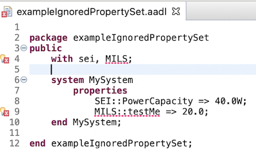
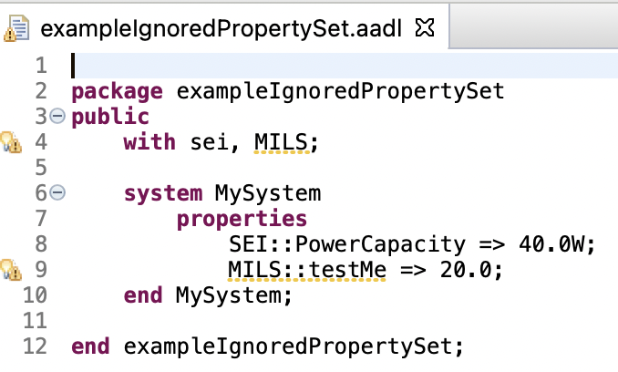
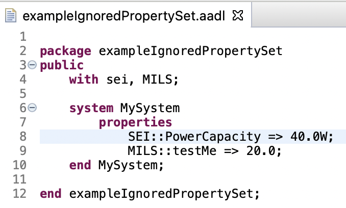
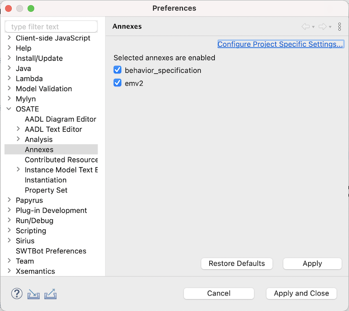
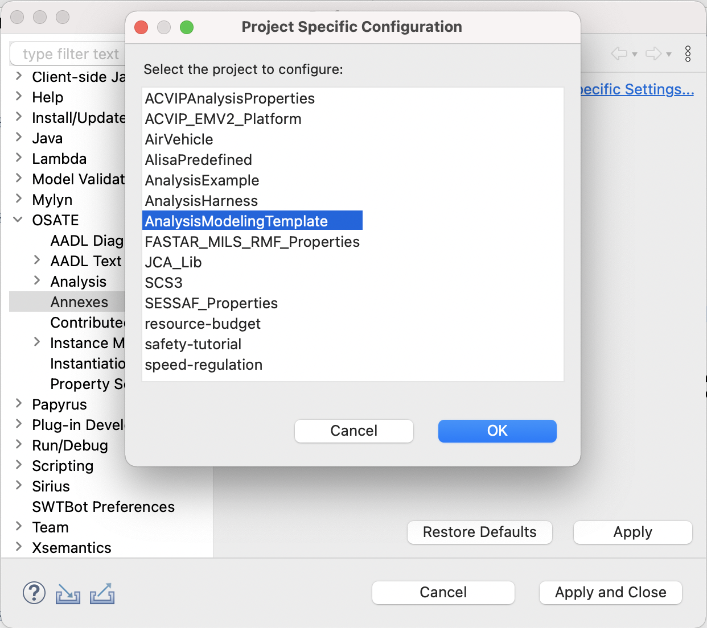
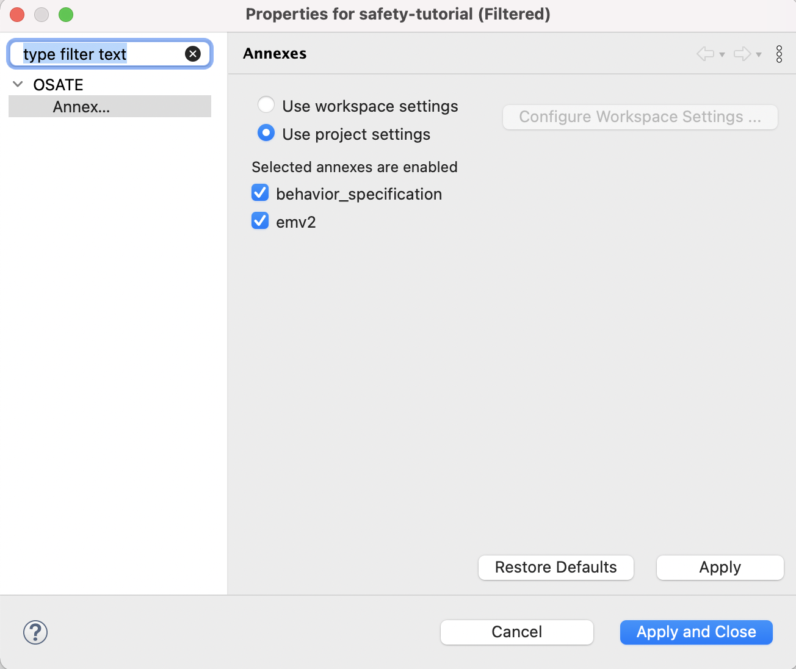
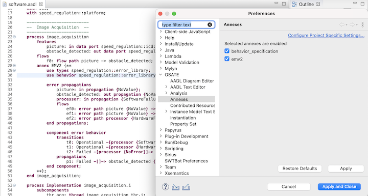
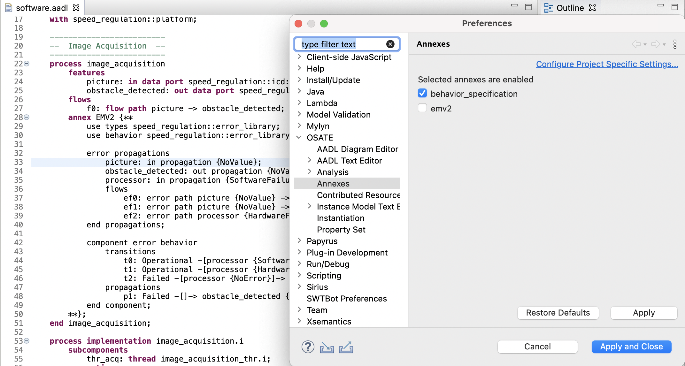

# Advanced OSATE Features

This guide covers advanced features that most users won't ever need to deal with.

## Managing Contributed Resources
	
The AADL standard defines several standard property sets, such as `AADL_Project` and `Timing_Properties`.  In OSATE these are made available in the workspace as plug-in contributions.  They are literally
provided to OSATE by an Eclipse plug-in.  They are globally available within the workspace, that is you do not need to explicitly copy them into your project to use them.  These contributions are visible in the `AADL Navigator` under the `Plug-in Contributions` heading.

Use **OSATE > Contributed Resources** in Preferences to choose which contributions are used throughout the workspace. The tree lists contributed property sets and packages. Its **Status** column shows each resource's current state:

- **Contributed by *plug-in***: the original resource supplied by that plug-in is enabled.
- **Disabled**: the contribution is excluded from processing in every project.
- **Overridden by */project/file.aadl***: the specified workspace file replaces the contribution.

Select a resource, then choose one of these actions:

- **Disable** excludes an unnecessary contribution. An overridden resource cannot be disabled; first use **Restore** to remove its override. `AADL_Project` cannot be disabled.
- **Override...** selects a workspace file to use instead of the original contribution, for example to customize property constants or correct errors. The replacement must have the same filename as the original resource. The selection dialog shows only matching files in open projects. Choosing a replacement also enables a previously disabled contribution. Double-clicking a resource opens the same dialog.
- **Restore** enables the original plug-in contribution and removes any workspace override. It is available for both disabled and overridden resources.

These actions apply to individual resources, not folders. **Restore Defaults** enables all original contributions and removes all overrides.

Changes take effect when you choose **Apply** or **Apply and Close**. OSATE closes and reopens the open projects to rebuild them with the updated contributions. **Cancel** discards changes made since the last Apply. The `AADL Navigator` also identifies overridden resources and shows disabled status in its status line.

When reading older workspace settings that both disable and override a resource, OSATE preserves the disabled state and discards the override. Any old setting that disables `AADL_Project` is ignored; its original resource or enabled workspace replacement remains available.

# Managing Ignored Property Sets

Property declarations, property types, and property constants belong to property sets. The **OSATE > Property Sets** preference page controls diagnostics for references to property sets that are not available in the workspace.

Use **Add** to enter the name of a missing, user-defined property set whose unresolved references should not be reported as errors. With **Show warnings** selected, those references produce warnings instead; clearing it suppresses the warnings as well. **Delete** removes a name from the list and restores normal diagnostics.

This setting does not disable or replace contributed resources. Use **OSATE > Contributed Resources** for that purpose. Predeclared property sets cannot be added to the ignored list.

For example, a reference to `MILS::testMe` produces an error when the `MILS` property set is unavailable:

Choose **Add**, enter `MILS`, and choose **OK**. With **Show warnings** selected, the error becomes a warning:

Clear **Show warnings** to suppress that diagnostic:

## Managing Annex Resources
	
Embedded sub-languages published as AADL annexes extend an AADL model to enhance analysis. Several such annexes have been defined, for example, the error modeling sub-language is used to define error states and fault propagation for an AADL model, and the behavior annex allows modeling of detailed component behavior as a state machine. 

Annexes are separate from the core AADL in the following sense: if all annex libraries, subclauses, and annex-related property associations are removed from an AADL model, the resulting model is a valid core AADL model. Also, the different annexes are assumed to be independent of each other. 

As different annexes are treated as independent of each other and the core language, it is possible to ignore an annex when processing a model. OSATE supports this by defining a default annex meta-model, parser, and unparser. The default annex meta-model simply stores the source text of an annex library or subclause as a string, and the default parser and unparser are trivial as they don’t process the annex content. This allows processing of AADL models with annex elements even if the plug-ins for a particular annex are not installed. OSATE enables this via the `OSATE > Annex` preference pane:

Default settings is to use workspace preferences with all annexes turned on. There's also an option to configure annex settings per each project:

1. Click `Configure Project Specific Settings...`
2. Select a project to set a preference for and click ok

3. Click `Use project settings`
4. Select the annexes that should be turned on for selected project

Example with EMV2 Annex turned ON - line 28-50 is parsed

Example with EMV2 Annex turned OFF - line 28-50 is not parsed

A complete description of AADL Annexes is available in [An Implementation of the Behavior Annex in the AADL-toolset Osate2](https://resources.sei.cmu.edu/library/asset-view.cfm?assetid=74852)