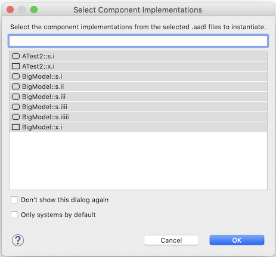

<!--
Copyright (c) 2004-2020 Carnegie Mellon University and others. (see Contributors file). 
All Rights Reserved.

NO WARRANTY. ALL MATERIAL IS FURNISHED ON AN "AS-IS" BASIS. CARNEGIE MELLON UNIVERSITY MAKES NO WARRANTIES OF ANY
KIND, EITHER EXPRESSED OR IMPLIED, AS TO ANY MATTER INCLUDING, BUT NOT LIMITED TO, WARRANTY OF FITNESS FOR PURPOSE
OR MERCHANTABILITY, EXCLUSIVITY, OR RESULTS OBTAINED FROM USE OF THE MATERIAL. CARNEGIE MELLON UNIVERSITY DOES NOT
MAKE ANY WARRANTY OF ANY KIND WITH RESPECT TO FREEDOM FROM PATENT, TRADEMARK, OR COPYRIGHT INFRINGEMENT.

This program and the accompanying materials are made available under the terms of the Eclipse Public License 2.0
which is available at https://www.eclipse.org/legal/epl-2.0/
SPDX-License-Identifier: EPL-2.0

Created, in part, with funding and support from the United States Government. (see Acknowledgments file).

This program includes and/or can make use of certain third party source code, object code, documentation and other
files ("Third Party Software"). The Third Party Software that is used by this program is dependent upon your system
configuration. By using this program, You agree to comply with any and all relevant Third Party Software terms and
conditions contained in any such Third Party Software or separate license file distributed with such Third Party
Software. The parties who own the Third Party Software ("Third Party Licensors") are intended third party benefici-
aries to this license with respect to the terms applicable to their Third Party Software. Third Party Software li-
censes only apply to the Third Party Software and not any other portion of this program or this program as a whole.
-->
# System Instantiation

[TOC levels=2-4 bullet hierarchy]

Analyses are run over instantiated systems, which are typically generated from system implementation classifiers, but can be generated from any implementation classifier except for `subprogram` and `subprogram group`.

The semantics of instantiating from a declarative model are described section 13, "Operational System," of the AADL standard.

## Instantiating a Model

An instance model can be created in 3 ways:

1. **From the context menu of the AADL editor `Outline` view.**  Select one or more component classifiers in the view.  The command is active in the context menu as long as none of the classifiers is `subprogram` or `subprgram group`.
  
2. **From the context menu of the `AADL Navigator` view.**  Select one or more component classifiers or `.aadl` files in the view.  The classifiers/files can be from different projects.  The command is active in the context menu as long as none of the classifiers is `subprogram` or `subprogram group`.  

3. **From the `OSATE > Instantiate` menu.**  Select one or more component classifier or `.aadl` file in the view.  The classifiers/files can be from different projects.  The command is active in the context menu as long as none of the classifiers is `subprogram` or `subprogram group`.  

If only classifiers are selected then the instantiation process continues without any more user interaction.  

### Choosing the Components to Instantiate

If any `.aadl` files are selected, a dialog might be displayed (depending on the workspace preferences) asking you to choose the component implementations in the selected `.aadl` files to instantiate:

  

The dialog shows all the component implementation classifiers from the selected `.aadl` files excluding the `subprogram` and `subprogram group` classifiers.  By default, all the classifiers are selected.  The dialog has a filter field on top to help find specific classifiers.

Click on `OK` to add the selected classifiers to the list of classifiers to be instantiated.  Click on `Cancel` to avoid instantiating any of the classifiers in the selected `.aadl` files.  

> _Clicking `Cancel` does not cancel instantiation of any classifiers that were selected in the workspace when the operation was selected._ 

#### Only Systems by Default

Checking `Only systems by default` changes the preferences so that in the future the dialog will only preselect `system implementation` classifiers.  You must click on `OK` for this change to take effect.

#### Hiding the Selection Dialog

Checking `Don't show this dialog again` changes the preferences so that this dialog will not be shown in the future.  You must click `OK` to make this change.  A second dialog will appear asking you to confirm the change:

  

Click `Yes` to proceed with updating the preferences, click `No` to leave them unchanged.

The preference can be returned to the default setting via the `OSATE > Instantiation` preference pane (see below).

When the dialog is not displayed, the "only systems" preference controls which component implementations are instantiated:

* If the "only systems" preference is not set (the default case), then all the non-`subprogram`, non-`subprogram group` implementations in the selected `.aadl` files are instantiated.

* If the "only systems" preference is set, then only the `system` implementation classifiers in the selected `.aadl` files are instantiated.

### Instantiation Results Dialog

Each classifier is instantiated as a separate Eclipse task, and (assuming the instantiation runs long enough) is visible in the `Progress` view.  By default (but see below), when all the models have been processed a result dialog is displayed.  

  

For each classifier, it gives the result of instantiation:

* **OK.** The classifier was instantiated successfully.

* **Cancelled.** The user cancelled the instantiation from the `Progress` view or progress dialog.  

* **Error.** There was an error during instantiation.  The error message is shown in the `Error Message` column.

* **Exception.** There was a Java exception during instantiation.  The exception's message is shown in the `Error Message` column.  More information about the exception itself can be found in the `Error Log` view.

#### Hiding the Results Dialog

If you do not want to see the results dialog when all of the instantiations are successful, click the checkbox for `Don't show this dialog when successful`.  

When you click the `OK` button, you will be shown another dialog to confirm your decision:

  

Click `Yes` to proceed with updating the preferences, click `No` to leave them unchanged.

The preference can be returned to the default setting via the `OSATE > Instantiation` preference pane (see below).

### Name and Location of Instance Models

An instance model is created and placed in a directory called `instances` in the same directory as the `.aadl` file that contains the root component classifier.  This directory is created if it does not already exist.  The file is only created if the result status is "OK".

The instance model built from system implementation `my::package::system.impl` is named `my_package_system_impl_Instance.aaxl2`.  This is an XML-based model description that is not readily readable by people.  It can be opened and viewed in a hierarchical manner in OSATE. 

## Reinstantiating a Model

If you update the declarative model it is necessary to reinstantiate the instance model.

Existing instance models can be reinstantiated by selecting one or more `.aaxl` files, folders, projects, or working sets in the `AADL Navigator` view and then either

* Choosing `Reinstantiate` from the view's context menu, or

* Choosing `OSATE > Reinstantiate` from the OSATE menu bar.

OSATE will find all the instance models in the selected resources (ignoring duplication) and create an instantiation task for each one.  

If there is an error then the results dialog will be displayed.  If all the models are reinstantiated successfully the results dialog will only be displayed if the workspace preference is set to always show the dialog.

## Workspace Preferences

As mentioned already, the behavior of instantiation is controlled by several workspace preferences.  These are accessed via the `OSATE > Instantiation` preference pane:

  

There are four preferences:

* **Maximum number of system operation modes to generate.**. This is the maximum number of system operation modes that are created for any one system instance.  The default value is **1000**.  This limit exists to prevent combinatorial explosion.

* **Always show instantiation results dialog, even when successful.**  When checked, the results dialog is always displayed.  When uncheck, the results dialog is only displayed when there is an error or exception.  The default value is **true** (checked).

* **Always show the AADL component implementation selection dialog.** When checked, the component selection dialog is shown when `.aadl` files are selected for instantiation.  When unchecked, the dialog is not shown.  When the dialog is not shown then the selected components are controlled by the next preference.  The default value is **true** (checked).

* **Only instantiate system implementations.** When checked, only only system implementations are preselected in the component implementation dialog box.  When unchecked, all the component implementions are preselected.  The default value is **false** (unchecked).  When the component implementation dialog box is not shown, then this preference controls the implementations that are instantiated.  As you would expect, when checked all system implementations from the selected `.aadl` files are instantiated only; when unchecked, all the non-`subprogram` non-`subprogram group` implementations in the selected `.aadl` files are instantiated.

The top of the pane has a link to set the properties of a project.  Clicking the link brings up a dialog box to select an AADL project.

  

Choosing a project and selecting `OK` will bring up the `OSATE > Instantiation` project properties pane for the selected project.

## Project Properties

Project-specific properties can be used to control instantiation behavior as well.  These are accessed via the `OSATE > Instantiation` properites pane:

  

The only property concurrently avaiable is a project-specific version of the **maximum number of system operation modes to generate**.  By default, the propject-specfiic version is ignored.  By clicking on `Use project settings`, you can enable the property and change its value to be customized for the project.  Click on `Use workspace settings` to return to using the system-wide value.

Clicking the `Configure Workspace Settings...` button to open the `OSATE > Instantiation` workspace preferences pane.
