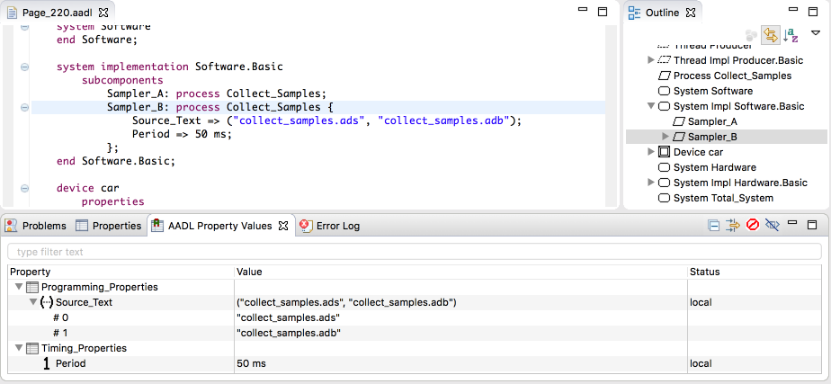
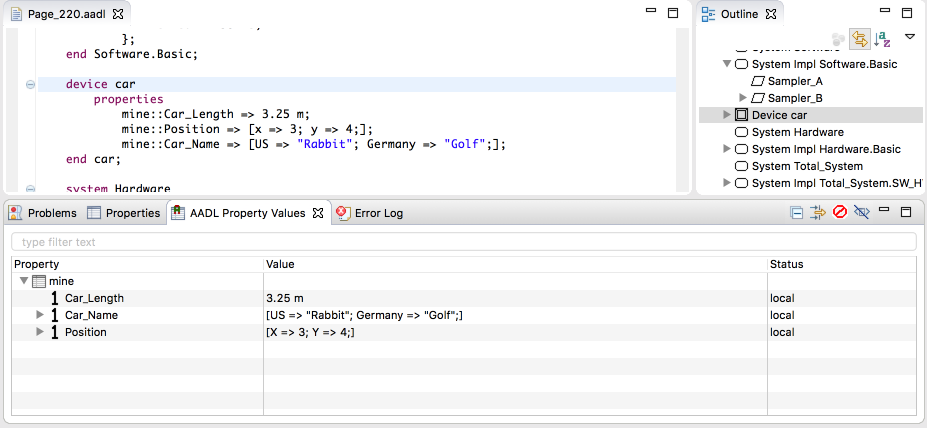
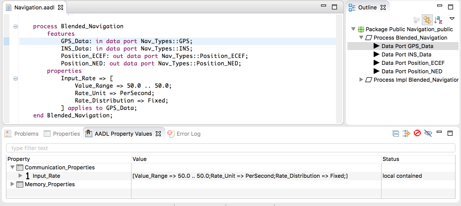
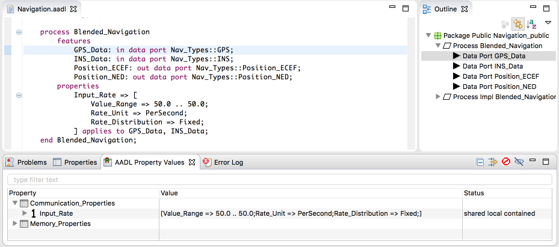

<!--
Copyright (c) 2004-2020 Carnegie Mellon University and others. (see Contributors file). 
All Rights Reserved.

NO WARRANTY. ALL MATERIAL IS FURNISHED ON AN "AS-IS" BASIS. CARNEGIE MELLON UNIVERSITY MAKES NO WARRANTIES OF ANY
KIND, EITHER EXPRESSED OR IMPLIED, AS TO ANY MATTER INCLUDING, BUT NOT LIMITED TO, WARRANTY OF FITNESS FOR PURPOSE
OR MERCHANTABILITY, EXCLUSIVITY, OR RESULTS OBTAINED FROM USE OF THE MATERIAL. CARNEGIE MELLON UNIVERSITY DOES NOT
MAKE ANY WARRANTY OF ANY KIND WITH RESPECT TO FREEDOM FROM PATENT, TRADEMARK, OR COPYRIGHT INFRINGEMENT.

This program and the accompanying materials are made available under the terms of the Eclipse Public License 2.0
which is available at https://www.eclipse.org/legal/epl-2.0/
SPDX-License-Identifier: EPL-2.0

Created, in part, with funding and support from the United States Government. (see Acknowledgments file).

This program includes and/or can make use of certain third party source code, object code, documentation and other
files ("Third Party Software"). The Third Party Software that is used by this program is dependent upon your system
configuration. By using this program, You agree to comply with any and all relevant Third Party Software terms and
conditions contained in any such Third Party Software or separate license file distributed with such Third Party
Software. The parties who own the Third Party Software ("Third Party Licensors") are intended third party benefici-
aries to this license with respect to the terms applicable to their Third Party Software. Third Party Software li-
censes only apply to the Third Party Software and not any other portion of this program or this program as a whole.
-->
# AADL Property Values
This view can be used to display and edit property values in a structured manner which is often easier than navigating and manipulating the aadl text files directly.  Below is an example of the view in action.  It is displaying the properties of the process subcomponent `Sampler_B`.

## Opening AADL Property Values
From the main menu, select **Window** -> **Show View**.  If OSATE is currently in the AADL perspective, then you can select **AADL Property Values**.  Otherwise, select **Other...** and choose **AADL** -> **AADL Property Values**.

## Selecting the Model Element
The view displays all of the properties of the AADL model element that is currently selected in the AADL text editor or in the instance model elditor.  Selections can be made in the editor or in the outline view.

## Structure
The properties displayed are organized by their property sets. In the previous screenshot, the property `Period` is displayed under its property set `Timing_Properties`.  The view also provides these additional groupings:
* **Lists**: A list value can be expanded to show its individual list elements.  This is shown in the screenshot above for the property `Source_Text`.
* **Records**: A record value can be expanded to show its fields.
* **Ranges**: A range value can be expanded to show the minimum, maximum, and delta values.
* **Modes**: A modal property value can be expanded to show the different values for each mode.

## Status Column
The status column in the view indicates where the property value comes from.  The status can be **local**, **local contained**, **shared local contained**, **inherited**, **default**, or **undefined**.

### Local Property Values
A **local** property value is defined directly on the AADL model element in either its properties subclause or in curly braces.  In the previous screenshot, the properties `Source_Text` and `Period` are both **local** because they are defined in curly braces.  In the next screenshot, the properties `Car_Length`, `Car_Name`, and `Position` are all **local** because they are defined in the properties subclause of the device `car`.

### Contained Property Values

A **local contained** property value is defined in the properties subclause of the containing classifier and is assigned to the selected model element with the applies to clause.  This status is only applicable to model elements which are immediate members of a classifier such as features, subcomponents, connections, flows, etc.  In the following screenshot, the view is showing the properties of the data port `GPS_Data`.  The property `Input_Rate` is **local contained** because its value is defined in the properties subclause of the containing process type `Blended_Navigation`.  Note the "applies to `GPS_Data`" at the end of the property value.

**Shared local contained** is the same as **local contained** except that the property value is shared with other property holders.  In the following screenshot, the property value is applied to both `GPS_Data` and `INS_Data`.  The property `Input_Rate` is **shared local contained** because its value is not exclusive to `GPS_Data`, but it is also shared with `INS_Data`.

Contained property values are defined in a properties subclause and are applied to a model element using the `appies to` clause. In general, the property can be applied to an element nested several layers down in the containment hierarchy, e.g., to a sub sub sub component. The AADL property view does not display these deeply nested property applications. To view the property values resulting from all contained property associations in a model, an instance model must be created. The instantiation evaluates the applicable contained property associations and copies the resulting values as local associations into the instance model.

### Inherited Property Values
**Inherited** indicates that the property value is defined in an extended classifier or in the component type if the selected model element is a component implementation.  Inherited property values can also come from a refined element. In the following screenshot, the thread `Prime_Reporter_One` is selected.  The property `Dispatch_Protocol` is **inherited** because it is defined in `Prime_Reporter` which is extended by `Prime_Reporter_One`.

### Default Property Values
**Default** indicates that the property value is not defined on any model element, but instead comes from the property's default value declaration in the property set.  In the following screenshot, the properties `Active_Thread_Handling_Protocol`, `Active_Thread_Queue_Handling_Protocol`, `Deactivation_Policy`, and `Synchronized_Component` are all **default** because the values come from the property declaration.  This can be seen in the upper editor showing the property set `Thread_Properties`.  There the property `Active_Thread_Handling_Protocol` has the default value of `abort`.

Properties that take the default value are normally not shown in the view.  The toolbar button  can be used to toggle the display of **default** properties.

### Undefined Property Values
**Undefined** indicates that the property has no value for the selected model element.  These properties are applicable to the selected element, so these properties could potentially have values for the selected property holder.  In the following screenshot, the properties `Criticality`, `Dispatch_Able`, `Dispatch_Trigger`, `POSIX_Scheduling_Policy`, and `Priority` are all **undefined** because they have no value.

Properties without a value are normally not shown in the view.  The toolbar button  can be used to toggle the display of **undefined** properties.

## Property Filters
The toolbar contains three buttons that influence which properties are displayed in the view:
* : Show only properties in property sets which are included in the package's with statements.
* : Show **undefined** properties.
* : Show **default** properties.

## Editing Values
Properties with the status of **local**, **local contained**, or **shared local contained** can be edited directly in the view.  To begin editing, simply click on the property value in the view's table.  The table cell then becomes editable and you can type in the new value.  If there are syntax errors in your new value, then the error will be underlined in red and you can hover over the cell to see an error message.  Content assist is also available while editing by pressing Ctrl + Space.  This can be especially userfull when entering enumeration literals, unit literals, classifier values, or reference values.  When you are finished editing, press enter or click outside of the table cell and the new value will be updated in the AADL model.  Note that if you edit a property that is **shared local contained** then you will be editing the properties for all model elements that are listed in the applies to clause of the property association and share this value.

## Context Menu
There are several actions available in the view's context menu when you right-click on a row in the view's table.

### Open Property Definition
This action opens the declaration of the selected property set, property, or record field in the AADL text editor.

### Open Property Association
This action opens the property association that provides the deisplayed property value in the AADL text editor.  This action is enabled for properties that are **local**, **local contained**, or **inherited**.  If the action is executed on an **inherited** property, then the view will be updated as well such that the selected property is shown as a **local** property.

This action is especially useful in an instance model to find out which contained property association in the declarative model is used to provide an instance property value.

### Create Local Property Association
This action is enabled for **inherited**, **default**, and **undefined** properties.  Executing this action will creates a new **local** value for the selected property and begins the editing process. The new property association is inserted in curly braces with the current model element in the AADL text editor.

### Create Local Contained Property Association
This action is enabled for **inherited**, **default**, and **undefined** properties.  Executing this action creates a new **local contained** value for the selected property and begins the editing process.

### Make Local
This action is enabled for **inherited**, **local contained**, **shared local contained**, and **default** properties.  Executing this action creates a new **local** property association with the same value as was displayed in the view when the action was executed.  In other words, the existing value is copied into the new **local** value.

### Make Local Contained
This action is enabled for **inherited**, **local**, **shared local contained**, and **default** properties.  Executing this action creates a new **local contained** property with the same value as was displayed in the view when the action was executed.  In other words, the existing value is copied into the new **local contained** value.

### Remove
This action is enabled for **local**, **local contained**, and **shared local contained** properties.  It can be used to do one of the following:
* Remove the selected property value.
* Remove the selected record field from the record property value.
* Remove the selected delta from the range property value.
* Remove the selected item from the list property value.
Note that executing this action on a **shared local contained** property impacts all model elements that share the selected property value.
