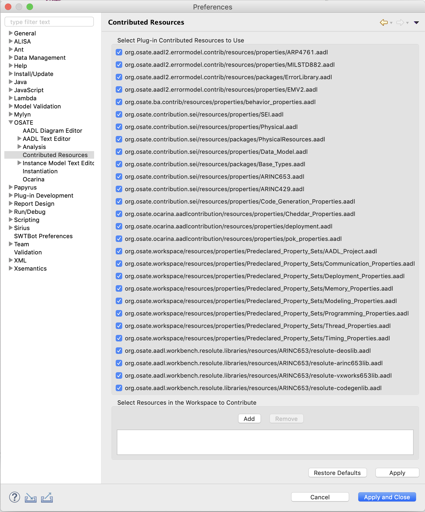

# Advanced OSATE Features

This guide covers advanced features that most users won't ever need to deal with.

## Managing Contributed Resources
	
The AADL standard defines several standard property sets, such as `AADL_Project` and `Timing_Properties`.  In OSATE these are made available in the workspace as plug-in contributions.  They are literally
provided to OSATE by an Eclipse plug-in.  They are globally available within the workspace, that is you do not need to explicitly copy them into your project to use them.  These contributions are visible in the `AADL Navigator` under the `Plug-in Contributions` heading.

Occasionally it may be necessary to "override" a contribution, for example to customize property constant values or to correct errors.  OSATE enables this via the `OSATE > Contributed Resources` preference pane.  

The pane is divided into two sections:

1. _A section listing all the plug-in contributions._  Here you can uncheck those contributions that you wish to ignore.
2. _A section allowing the management of workspace contributions._  Here you can add and remove files from the workspace.  Files listed here become global contributions to the workspace, and do not need to be copied to your project to be referenced.

The idea is that if you need to override a plug-in contribution, you would

1. Copy it into a new project in your workspace.
2. Modify the copy as necessary.
3. Uncheck the plug-in contribution in the preferences.
4. Add the workspace copy to the workspace contributions in the preference pane.

The preference pane will not allow you contribute multiple resources with the same name.

The preference pane below shows that the `AADL_Projects` property set has been been replaced by a copy in the workspace, and that an additional property set `Other` has been contributed.

The changes to the contributed resources are reflected in the `AADL Navigator` view.  The list of resources under `Plug-in Contributions` no longer shows the resource `AADL_Project.aadl` (it would be under the `Predeclared_Property_Sets` folder).  Additionally, a new heading `Workspace Contributions` is present, and it shows the contributed `AADL_Project.aadl` and `Other.aadl` resources.  (The `Workspace Contributions` heading is only visible when such contributions exist.)

 