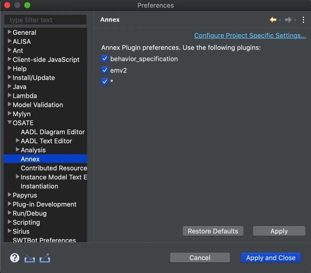
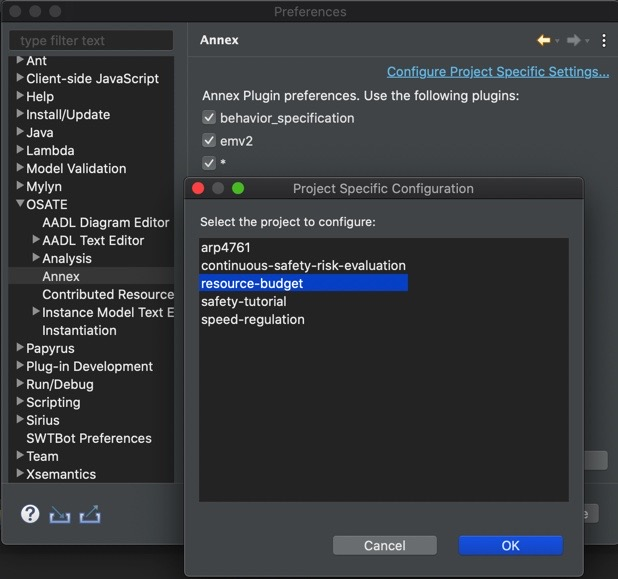
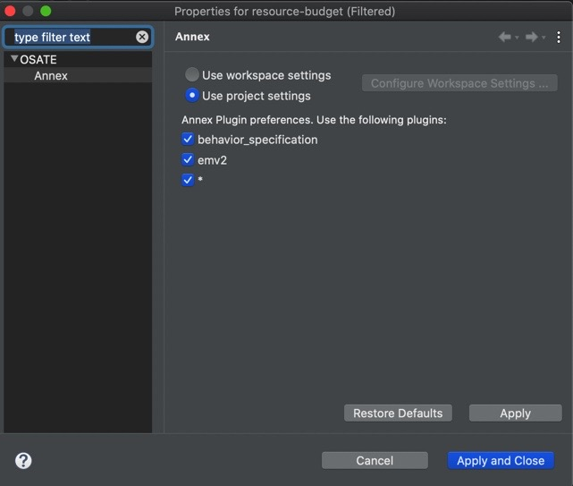

# Advanced OSATE Features

This guide covers advanced features that most users won't ever need to deal with.

## Managing Contributed Resources
	
The AADL standard defines several standard property sets, such as `AADL_Project` and `Timing_Properties`.  In OSATE these are made available in the workspace as plug-in contributions.  They are literally
provided to OSATE by an Eclipse plug-in.  They are globally available within the workspace, that is you do not need to explicitly copy them into your project to use them.  These contributions are visible in the `AADL Navigator` under the `Plug-in Contributions` heading.

Occasionally it may be necessary to "override" a contribution, for example to customize property constant values or to correct errors.  OSATE enables this via the `OSATE > Contributed Resources` preference pane.  

The top of the pane shows a tree that closely mimics the sub-tree shown below the `Plug-in Contributions` item in the `AADL Navigator`.  Selecting an item in the tree shows the Xtext URI of the contributed resource.  
Double-clicking on an item or pressing the `Override` button brings up a selection dialog box.  This dialog is used to select an resource in the workspace that will be used to override the plug-in contributed resource.
The overriding resource must have the same filename as the original resource; the selection dialog only shows those files in the workspace that have the same name.  The below selection dialog shows the replacement 
resource for `AADL_Project` being selected:

When a contributed resource is overridden, the tree marks it as such, and the URI shows the workspace URI of the overriding resource:

To restore an overridden resource to its original contributed URI, select it in the tree and press the "Restore" button. 

## Managing Annex Resources
	
Embedded sub-languages published as AADL annexes extend an AADL model to enhance analysis. Several such annexes have been defined, for example, the error modeling sub-language is used to define error states and fault propagation for an AADL model, and the behavior annex allows modeling of detailed component behavior as a state machine. 

Annexes are separate from the core AADL in the following sense: if all annex libraries, subclauses, and annex-related property associations are removed from an AADL model, the resulting model is a valid core AADL model. Also, the different annexes are assumed to be independent of each other. 

As different annexes are treated as independent of each other and the core language, it is possible to ignore an annex when processing a model. OSATE supports this by defining a default annex meta-model, parser, and unparser. The default annex meta-model simply stores the source text of an annex library or subclause as a string, and the default parser and unparser are trivial as they don’t process the annex content. This allows processing of AADL models with annex elements even if the plug-ins for a particular annex are not installed. OSATE enables this via the `OSATE > Annex` preference pane:

Default settings is to use workspace preferences with all annexes turned on. There's also an option to configure annex settings per each project:

1. Click `Configure Project Specific Settings...`
2. Select a project to set a preference for and click ok

3. Click `Use project settings`
4. Select the annexes that should be turned on for selected project

A complete description of AADL Annexes is available in [An Implementation of the Behavior Annex in the AADL-toolset Osate2](https://resources.sei.cmu.edu/library/asset-view.cfm?assetid=74852)