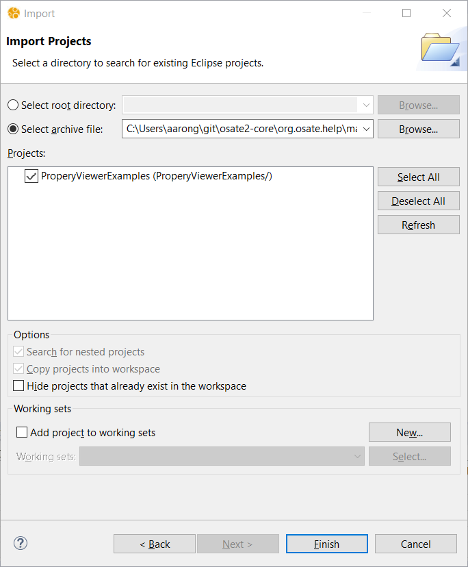

# How To Import a Project Into Eclipse

Eclipse projects that have been exported as `.zip` files can be imported into an Eclipse workspace.  This is an easy way to use a project developed by another user.  Here we show how to import an AADL project containing `.aadl` model files, but these instructions are not specific to OSATE or working with AADL source files.

> **Example**
>
> In this section we import a project into the workspace from the archive file [PropertyViewerExamples.zip](examples/PropertyViewerExamples.zip).  Please use the link to download the file to follow along with the instructions below.

## Open the Import Wizard

Open the import wizard by selecting `Import...` from the context menu of the `AADL Navigator` view:

You should see a dialog like this:

Select `General > Existing Projects into Workspace`, and click on the `Next >` button.

## Select the Project Archive

An `Import Projects` wizard dialog will open.  (An archive may contain more than one project, although in our example it contains just one.)

1. Select the `Select archive file` radio button.
2. Click one the associated `Browse...` button to bring up a file selection to choose the archive file to import.  In this case, select the `PropertyViewerExamples.zip` that you downloaded earlier.  
   The wizard dialog should look like the image below, except with your local pathname showing.  The projects contained in the archive are listed in the `Projects` section.  Here you can select which projects to import.  Our example has only one project, and we leave it selected.
3. Click on the `Finish` button to begin the import process.

### Use Your New Project

The wizard dialog will close when the import process finishes.  The imported project (or projects) will be visible in your workspace.  In the case of our example, you should see a project named `PropertyViewerExamples` that contains 8 `.aadl` files.

