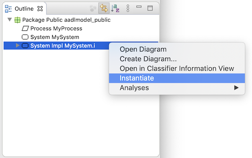
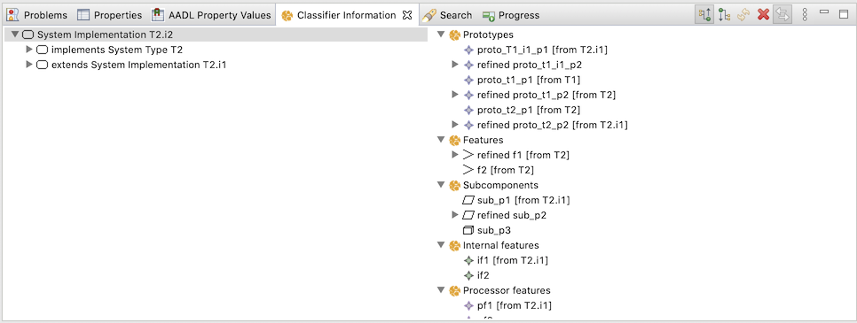

# OSATE User Guide

OSATE is a complete modeling environment providing support for describing AADL models. It is composed of many features to model and analyse systems.  Also, a user can build their own tools based on OSATE and extend its initial capability.

This manual provides an overview of the basic features of OSATE and describes how to work with AADL models:

* [Eclipse Basics](#basics)
* [Creating an AADL Project](#project)
* [Navigating an AADL Model](#navigation)
* [Instantiating Your Model](#instance)
* [Importing and Exporting Models](#in_out)
* [Analyzing a Model](#analysis)
* [Viewing AADL Property Values](#properties)
* [Viewing Classifier Members])(#classifierView)


## <span id="basics">Eclipse Basics</span>

OSATE is built on the Eclipse framework.  You may be familiar with Eclipse from using it for Java development.  OSATE inherits many concepts from Eclipse including

* **The Workbench.**  The main UI.
* **Projects.**   Work is divided into projects that group together related files.  Projects may be closed when they are not in use to prevent then from taking up OSATE resources and to prevent accidental modification.
* **Views.**  A view is a read-only display of information.  A view may be connected to a specific object in the OSATE workspace (often times the currently selected element).
* **Editors.**  Not surprisingly, an editor provides write access to information in a project.  For example, OSATE has both a textual and graphical editor for AADL packages.
* **Perspectives.**  A perspective is a prearranged collection of views, editors, and toolbars focused around a particular task.  In OSATE, you mainly use the `AADL` perspective.
* **Markers.**   A marker is a piece of information attached to a location in a file.  They are commonly used to report errors and warnings about files.  For example, OSATE uses markers to report syntax errors in AADL files.  Ananlysis plug-ins often use markers to communicate their results.  Markers are visible in several ways.  They are most commonly interacted with as annotations within editors and as a list in the `Problems` view.


### Eclipse Help

If you are unfamiliar with Eclipse, the "Workbench User Guide" in the Eclipse help system is an excellent introduction.  This can be accessed in OSATE by going to the `Help` menu in the main OSATE window and selecting `Help Contents`:


A new browser window will open with a table of contents on the left-hand side.  The `Workbench User Guide` is the first document in the list:


### The Workbench

All work in the OSATE is done through a _Workbench_.  This is the main window, and it generally fills most or all of your screen.  The look and contents of the workbench are highly customizable, but it is uncommon to deviate too much from its default layout.  Generally it has 

* A row of toolbars along the top.
* A _navigator_ view along the left-hand side.  This view displays all the available projects and their contents.  OSATE uses a customized `AADL Navigator` that also displays globally available AADL property sets provided by plug-ins.
* An _outline_ view on the right-hand side.  This view interacts with the active editor window and displays a structured semantic or syntactic outline of the contents of the editor.  It can be used to quickly navigate the contents of the editor.
* The `Problems` view along the bottom.  This view is used to interact with markers.

The rest of the center space of the workbench is used to hold editor windows.  This layout can be seen in the workbench window below that is set to the OSATE `AADL` perspective:


There are several other features of the workbench visible in the above image:

* Views can have their own toolbars.
* Views can be stacked into tabbed layouts.  This is visible along the bottom of the workbench where there are tabs for the `Problems`, `Properties`, and `AADL Property Values` views.
* Views can have their own menus.  The menu is accessible by clicking on the downward facing triangle in the top right of the toolbar of the view: .
* Views can be minimized or maximized within the workbench window using the toolbar buttons .
* Views can be closed by clicking on the "x" icon on their tab.


#### Commands

As an Eclipse-based application, OSATE makes its commands available in multiple modalities.  A single command is usually available

* In an OSATE menu.
* In a toolbar.
* In a context menu, when appropriate to the currently selected object.  (A context menu is uaually opened with a right-click in Windows, or a `CTRL` + click in MacOS.)


#### Missing Views

If you accidently close a view or simply want to add an additional view to the workbench, you can open a view by using the `Window > Show View` submenu in the main OSATE menubar:


This menu is populated with views specific to the current perspective.  Here we see the `AADL Navigator` and `AADL Property Values` views specific to the `AADL` perspective.  If you do not see the view you need listed, choose the `Other...` option to bring up the `Show View` dialog:


This dialog lists all the views available.  Views are grouped by category.  Above we see the `Error Log` view in the `General` category being selected for use.


#### Reseting the Perspective

If you open/close too many views, rearrange your views, or otherwise put the workbench in a state that you find unusable, you can bring it back to good state by resetting the perspective.  In the case of OSATE, you should reset the `AADL` perspective by bringing up the _context menu_ on the `AAADL` perspecitive icon on the right side of the workbench toolbar, and selecting `reset`:


This returns the arrangement of views and editors to a the default layout defined by the perspective.


### OSATE Preferences

OSATE (via its Eclipse underpinnings) has an exhaustive set of preferences that can be changed.  These are accessed via the `Preferences` window.  Access to preferences follows the host operating system standards:

* For windows, the preferences are under `Window > Preferences`.
* For MacOS, the prefernece are under `OSATE > Preferences...`.

This brings up a window with a hierarchical list of settings on the left-hand side.

One setting of immediate interest is found under `General > Startup and Shutdown`.  By default the setting `Refresh workspace on startup` is not enabled.  Enabling it ensures that when starting up, OSATE updates its records to reflect any changes to the files in the workspace that may have occurred outside OSATE.


### Manual Refresh

You can manually initiate a refresh by selecting projects, folders, or files in the `AADL Navigator` and invoking `File > Refresh` in the main menu or `Refresh` in the navigator's context menu.


## <span id="project">Creating an AADL Project</span>

Let us create an AADL Project in OSATE.  To create a new AADL project in the workspace, click on the `New AADL Project` button  in the OSATE toolbar.  A new project wizard will open:


Enter `MyFirstAADLProject` as the project name and click on the `Finish` button.  The wizard creates a new project.  It is visible in the `AADL Navigator` view.  Note the small `A` on the project that indicates it is an AADL project:


### Built-in Property Sets

Also visible in the view is a library icon labeled `Plugin_Contributions`.  This view element collects all the AADL property sets available by default in OSATE:


The `Predeclared_Property_Sets` are those that are specified by the AADL standard document and are provided by the core OSATE environment.  The others are specified in other documents and provided by plug-ins to OSATE.  For example `ARINC653` contains property sets specified in the ARINC653 annex to AADL and is provided by a plug-in.

Property sets in `Plugin_Contribution` may be used by any project in the workspace by providing the appropriate `with` clause in the package specification.  In particular, _they do not need to be copied into a project to be used_.


### Creating an AADL Package

Now that we have an AADL project in the workspace, we can populate it with an AADL Package:

1. Select the project `MyFirstAADLProject`.
2. Click on the `New AADL Package` button  in the OSATE toolbar to bring up the AADL package wizard:

3. Enter`aadlmodel` for the package name and click on `Finish`.

OSATE creates the file `aadlmodel.aadl` in the project, populates it with a skeleton package declaration, and opens it in the AADL text editor:


Note that the wizard has radio buttons that allow you to specify whether the package should be opened in the text editor or the diagram editor.  By default the text editor is selected.

Replace the contents of the editor with the simple model below:

```
package aadlmodel
public
	process MyProcess
	end MyProcess;
	
	system MySystem
	end MySystem;
	
	system implementation MySystem.i
		subcomponents
			sub1: process MyProcess;
	end MySystem.i;
end aadlmodel;
```

You can use copy-and-paste to copy the above into the editor, but if you type it directly, you can experience some of the syntax-directed features of the aadl editor:

* The editor automatically closes blocks.  For example, when you type `process MyProcess` and enter a new line, the editor automatically inserts `end MyProcess;`.

* You can access the automatic completion (a.k.a. _autocomplete_) feature by typing `CTRL + Space` in Windows or `Command + Space` in MacOS.  This brings up a small context menu displaying options for how the current string in the editor can be completed.  For example, below shows the result of activating autocomplete after typing `syst`:

The menu shows that `syst` can be completed with the keywords `system` or `system implementation`.  In this case, we want `system implementaton`.  You can select the completion with the mouse or by using the arrow keys and hitting `return`.

  The list of completions also shows two more options.   These are _templates_ that insert a more complete system type or system implementation declaration into the text.

* Autocompletion also works with declared names.  For example, below shows the result of activating autocomplete after typing `My`:

In this case, autocomplete suggests the system type name `MySystem`.  In particular, it _does not_ suggest the process type name `MyProcess` because it would be erroneous in the context of declaraing a system implementation.


#### Error Markers

As you type you will notice that the editor underlines syntax errors in red.  The right sidebar of the editor will also show a small red`x` indicating that an _error marker_ exists for that line of text.  For example, before the declaration of the system implementation is completed, the package has several errors:


The details of the error markers are visible in the `Problems` view.  This is a standard Eclipse view.  Despite the name _Problems_, not all markers necessarily mark problems or errors.  Some OSATE analsyses generate information markers (visible with a blue `i`) as output.

The details of a marker can also be seen by hovering over the icon in the editor sidebar.

Also note that the AADL project is marked in the navigator view to indicate that its contents have error markers.


#### <span id="save">Save the Package</a>

Once you have the package entered into the editor, save it.  It should be error-free, without any markers:


## <span id="navigation">Navigating a Model</span>

OSATE provides many mechanisms for navigating through a model.


### The `Outline` View

The `Outline` view shows the model in the text editor as a tree structure. Selecting an element in the outline view causes the editor to move to that object in the text. You can disable this synchronization between the outline and the text with the double arrow button in the view's toolbar. You can also have the view sorted alphabetically instead of the order in the text by selecting the "a to z" icon.


### Search: Basic Text Search

You can search the text of a model using the standard Eclipse search facility under `Search > Search...` in the menu bar.  This brings up a search window.  It can also be used for search and replace.  The scope of the search can also be specified.  In most cases you just want to make sure that the `File Search` tab is selected, and enter your search term in the `Containing text` field.  For example, the below will search for the string `end` in the project we created above:


When you click on the `Search` button, Eclipse performs the search.  The results are displayed in the `Search` view:


Double-clicking on a result in the view opens the editor to the location of the match.  All the matches are highlighted in the editor as well.


### Search: AADL Search

You can search for AADL classifiers and properties using the OSATE-provided `AADL Search` tab in the Eclipse search window.  


You can search for the declarations of or references to classifiers or properties whose name contains the given substring.  The above search looks for all classifier declarations and references where the the classifier name contains the substring `find`.  AADL names are case insensitive so the search is always case insensitive.  The scope of search (which resources are looked in) is also specified:
* It can be the entire workspace, in which all the AADL packages and property sets in the workspace, including plug-in contributions are searched.
* It can be the the selected resources in the `AADL Navigator` view.  This button is only enabled when there is a selection in the view.
* It can be the limited to the currently active editor window.  This button is only enabled when there is an active selected editor.

The search results are displayed grouped by the containing resource.  Resources are listed alphabetically by their workspace path.  Under each resource the results are listed in syntactic order.  Here we see the results of the above search:


There are two classifiers `FIND_ME` and `FIND_ME.impl` that contain the string `find`, and seven references to those classifiers.  Double-clicking on the results opens an editor to the site of the declaration/reference.

These view below shows the result of searching for property declaratiosn in the workspace that contain the string `time`.  Here we see that declarations are found in property sets contributed by plug-ins.


### Hyperlinks

All references to names in the AADL editor are linked to their declaration.  `CTRL`-clicking on the name will turn it into an active hyperlink and move the editor selection to the declaration of the name.  For example, `CTRL`-clicking on `MyProcess` in the subcomponent declaration of `MySystem` [above](#save), moves the selection to the declaration of `MyProcess` earlier in the package.


### Quick Outline

A _quick outline_ can be brought up in the AADL text editor by typing `CTRL + o`.  The package outline will appear in a small window with a search box.  You can filter the displayed outline elements by typing in the search box:


Selecting an item in the outline will move the editor to the selected element.


### Navigation History

Much like a web browser, when you navigate to different locations within a file, follow references/links to other files, go to the location of a marker, or go to the result of a search, Eclipse keeps a history. Yellow navigation arrow buttons in the toolbar let you move back and forth through the history:


## <span id="instance">Instance Models</span>

Most analyses are executed over the _instance model_ of a system.  The instance model represnts the complete nested architecture of a system, and is built from a root system implementation classifier.

To create an instance model of your system

1. Open the AADL package that conatins the system implementation you want to instantiate.  For this example, we open `aadlmodel` from [above](#save).
2. Select the system implementation in the `Outline` view.  Here we select `MySystem.i`.
3. Select `Instantiate` from the context menu.


The instance model is created and placed in directory called `instances` in the project.  This directory is created if it does not already exist.  The instance model built from system implementation `my::package::system.impl` is named `my_package_systemm_impl_Instance.aaxl2`.  This is an xml-based model description that is not readily readable by people.  It can be opened and viewed in a hierachical manner in OSATE.  Here we see the model we just generated:


### Back-links

Each element in the instance model links back to declarative model element that it is derived from.  You can follow this link by selecting an element of the instance model in the instance model editor or in the `Outline` view and choosing `Goto Instance Object Source` in the context menu.  For example, the process `sub1` element of the instance model links to the `sub1` subcomponent declaration in the declarative package:


### Errors

The instantiation process may generate error and warning markers on the instantiated model.  This occurs, for example, when the declarative model is underspecified or has inconsistencies.


## <span id="in_out">Importing and Exporting Projects</span>

Eclipse can import/export projects from/to `.zip` files.  This is a simple way to share your work with other users, but not the best approach for collaborative work where you would want to use a [version control system](#git).  


### <span id="import">How To Import a Project</span>

Here we show how to import an AADL project containing `.aadl` model files, but these instructions are not specific to OSATE or working with AADL source files.

> **Example**
>
> In this section we import a project into the workspace from the archive file [PropertyViewerExamples.zip](examples/PropertyViewerExamples.zip).  Please use the link to download the file to follow along with the instructions below.


#### Open the Import Wizard

Open the import wizard by selecting `Import...` from the context menu of the `AADL Navigator` view:


You should see a dialog like this:


Select `General > Existing Projects into Workspace`, and click on the `Next >` button.


#### Select the Project Archive

An `Import Projects` wizard dialog will open.  (An archive may contain more than one project, although in our example it contains just one.)

1. Select the `Select archive file` radio button.
2. Click on the associated `Browse...` button to bring up a file selection dialog to choose the archive file to import.  In this case, select the `PropertyViewerExamples.zip` that you downloaded earlier.

   The wizard dialog should look like the image below, except with your local pathname showing.  The projects contained in the archive are listed in the `Projects` section.  Here you can select which projects to import.  Our example has only one project, and we leave it selected.
3. Click on the `Finish` button to begin the import process.


#### Use Your New Project

The wizard dialog will close when the import process finishes.  The imported project (or projects) will be visible in your workspace.  In the case of our example, you should see a project named `PropertyViewerExamples` that contains five `.aadl` files.


### How To Export a Project

Here we show how to export an AADL project containing `.aadl` model files, but these instructions are not specific to OSATE or working with AADL source files.

> **Example**
>
> In this section we export the project that we imported into the workspace in the [previous](#import) section.  Below it is assumed that you have a project named `PropertyViewerExamples` in your workspace.


#### Open the Export Wizard

Open the export wizard by 

1. Selecting the project `PropertyViewerExamples` in the `AADL Navigator`.
2. Selecting `Export...` from the context menu.


You should see a dialog like this:


Select `General > Archive File`, and click on the `Next >` button.


#### Create the Archive

An `Archive file` wizard dialog will open.

* The top section of the wizard allows you to choose the exact contents of the project to export.  In this case, as in most cases, you do not need to change the default selections; the whole project will be exported.
* The bottom section of the wizard allows to control how the archive file is created.  Again, usually the default values are fine.  In this case, just make sure that `Save in zip format` is selected.
* In the center of the wizard enter the pathname of the archive file to create, or use the `Browse...` button to use the file selection dialog to specify the pathname.
* Click on the `Finish` button to begin the export process.


#### Use Your New Archive

The wizard dialog will close when the export process finishes.  The new archive file will be created where you specified.  You can now share this archive with other users.


### <span id="git">Importing a Project from a Git Repository</span>

While archive files provide a quick-and-dirty mechanism for sharing projects, this becomes problematic when you want to collaborate.  It is better to store projects in a version control system (VCS) so that changes to the models can be coordianted.  Eclipse (and thus OSATE) supports all the popular VCS, including **svn** and **git**.  In this section, we show how to import a project from a git repository.


#### Clean Up Your Workspace (Removing a Project)

We are going to reimport the `PropertyViewerExamples` project, but this time using git.  So if you already have the project in your workspace from the [previous section](#import), you will need to delete it:

1. Select the project in the `AADL Navigator`.

2. Select `Delete` in the context menu.
   
   (You can also use the `Delete` key as a shortcut.)

3. OSATE presents a confirmation dialog box.  Make sure to check `Delete project contents on disk`:
   

4. Click on `OK`.

OSATE removes the project from the workspace and deletes the contents of the workspace from the file system.


### Adding a Git Repository

#### Open the Git Perspective

Work with git repositories is performed in the `git` perspective.  Open and switch to the perspective by

1. Clicking on the `Open Perspective` button  on the top right of the toolbar.

2. Choose `Git` in the `Open Perspective` dialog:
   

3. Click on `Open`.

The OSATE workbench reconfigures to show an (empty) list of repositories on the left-hand side:


#### Clone a Repository

You need to clone a repository before you can import a project from it.  In this case, we are going to clone the AADL examples repository.

1. Click on the `Clone repository`  button in the toolbar of the `Git Repositories` view.

2. The clone wizard opens.  Enter the URI of the repository in the `URI` field.  In this case we use `https://github.com/osate/examples`.  The wizard automatically fills in the `Host` and `Repository path` fields.

  Because you only need read access to the examples, you do not need to enter a user name or password.  In general, however, your repositories will probably require authentication and you would enter the credentials here.
  
  Click on `Next >`

  

3. The wizard now asks which branches to clone.  Here there is only one: `master`.  

   Leave it selected and click on `Next >`.
   
  

4. The wizard now asks where to store the cloned repository.  The default location is in the `git` directory in the the root of your user directory.  There is generally no reason to change this.

  Click on `Finish`.
  
  

OSATE now clones the repository.  This may take a few minutes.  When it is finished, the repository appears in the `Git Repositories` view.


### Import a Project

Now that the repository is cloned, we can import a project from it into the workspace:

1. Select the project to import in the `Git Repositories` view.  In this case we select `PropertyViewerExamples` under the `Working Tree`.

2. Open the context menu and choose `Import Projects...`.

  

3. The import projects wizard opens.  Just click on `Finish`.

  

OSATE imports the shared project into your workspace.


### Return to the AADL Perspective

Return to the `AADL` perspective by clicking on the `AADL Perspective` button  on the top-right of the workbench toolbar.


The imported project is visible in the `AADL Navigator` view.  It is annotated with a small orange cylinder that indicates the contents are under version control.  The project label itself is also annotated indicating the the contents come from the _example_ repository and are from the _master_ branch.

You can now proceed to use the project in your workspace. 


## <span id="analysis">Analyzing Models</span>

Once you have a system model, you can use OSATE to analyze the model to confirm that the design meets your intended criteria.  In this section we run a latency analysis over the end-to-end flows of a system.  This section is not meant to be a tutorial on using any specific analysis, but instead is a demonstration of

* How to execute a typical analysis over a model.
* Typical ways an analysis may report results.


> **Example**
>
> This section uses the project [`latency-case-study`](https://github.com/osate/examples/tree/master/latency-case-study) found in the `examples` git repository.  Follow the [instructions above](#git) to import the project into your workspace.


### Instantiate the Model

The latency analysis operates on the system instance model, so we first need to create an instance model:

1. Open the package `integration`.
2. Use the `Outline` view to create an instance model from the system implementation `integration.software_integrated`.


### Analyze the Model

3. Select the new `.aaxl2` instance model file in the project.
4. Select `Analyses > Timing > Check Flow Latency` from the main menu to execute the latency analysis:
 

The analysis executes and you may see a progress bar at the bottom of the OSATE workbench.


### Analysis Results

The analysis generates results in two ways:

* As warning and errors markers.
* As files in the `reports/latency` directory of the project.

The analysis reports 4 error markers and 2 warning markers:


Here we see that the end-to-end flows `etef0` and `etef1` fail to meet the expected latency contraints.

* Double-clicking on the markers will open the flow element in the instance model editor.
* From there you can use the `Goto Instance Object Source` command to jump to the AADL source where the flows are declared.

The files in the `reports` directory contain more specific results (in three different formats).  Below shows a portion of the `.csv` file opened in a spreadsheet application:


Here we see the full results for the end-to-end flow `etef0`, includingng individual components' contributions to the latency.


## <span id="properties">AADL Property Values</span>

The `AADL Property Values` view is used to display and edit property values in a structured manner, which is often easier than navigating and manipulating the AADL text files directly.

> **Example**
>
> The packages used as examples in this section can be imported into your workspace from the [`PropertyViewerExamples`](https://github.com/osate/examples/tree/master/ProperyViewerExamples) project in the `examples` git repository.  Please see the help section on [importing projects into the Eclipse workspace](#git).

Below is an example of the view in action.  It is displaying the properties of the process subcomponent `Sampler_B` of system implementation `Software.Basic` in project `Page_220`.

<span id="values1"></span>


### Opening the AADL Property Values View

From the main menu, select `Window > Show View`.  If OSATE is currently in the `AADL perspective`, then you can select `AADL Property Values`.


If you are not in the `AADL Perspective`, select `Other...` to bring up the `Show View` dialog box:


Choose `AADL > AADL Property Values` and click on the `Open` button.


### Selecting the Model Element

The view displays all of the properties of the AADL model element that is currently selected in the worksapce.  Selections can be made in the editor or in the outline view.  For example, to show the properties of the process subcomponent `Sampler_B` of system implementation `Software.Basic` in project `Page_220` as shown above, you can 

* Open `Page_220` in the editor and move the text cursor to be within the syntax for subcomponent `Sampler_B`.

or

* Select `Sampler_B` in the `Outline` view.


### Property Value Structure

The displayed properties are organized by property set.

> **Example**
> 
> In the [previous screenshot](#values1), the property `Period` is displayed under its property set `Timing_Properties`.

The view also provides additional structure for certain types of property values:

* **Lists**: A list value can be expanded to show its individual list elements.
* **Records**: A record value can be expanded to show its fields.
* **Ranges**: A range value can be expanded to show the minimum, maximum, and delta values.
* **Modes**: A modal property value can be expanded to show the different values for each mode.

> **Example**
>
> The [screenshot above](#values1) shows the expanded list value for the property `Source_Text`.


### The Property Status Column

The `Status` column in the view indicates where the property value comes from based on the semantics of AADL.  The status is one of

* **local**
* **local contained**
* **shared local contained**
* **inherited**
* **default**
* **undefined**

The following sections describe property status in more detail.


#### _Local_ Property Values

A **local** property value is defined directly on the AADL model element in either its `properties` subclause or in curly braces.

> ** Example **
>
> In the [previous screenshot](#values1), the properties `Source_Text` and `Period` are both **local** because they are defined in curly braces.

> ** Example **
>
> In the screenshot below, the properties `Car_Length`, `Car_Name`, and `Position` are all **local** because they are defined in the properties subclause of the device `car`.
>
> 

> ** Example **
>
> The above screenshot also shows the expanded structure of the record values for properties `Car_Name` and `Position`.


#### Contained Property Values

Contained property values are those defined in a `properties` subclause and are applied to a nested model element using the `appies to` clause. In general, the property can be applied to an element nested several layers down in the containment hierarchy, e.g., to a sub-sub-subcomponent. _The `AADL Property Values` view only displays contained property values for the immediate children of a classifier._   To view the property values resulting from all contained property associations in a model, a system instance model must be created. The instantiation evaluates the applicable contained property associations and copies the resulting values as local associations into the instance model.

The view distinguishes between a **local contained** and **shared local contained** property association:

* A **local contained** property value is one that is applied to a single element.
* A **shared local contained** property value is one that is applied to multiple elements in the same clause.  (See the example below).

> **Example**
>
> In the following screenshot, the view is showing the properties of the data port (feature) `GPS_Data`.  The property `Input_Rate` is **local contained** because its value is defined in the `properties` subclause of the containing process type `Blended_Navigation`.  Note the syntax `applies to GPS_Data` at the end of the property value.
>
> 

> **Example**
>
> Edit `Blended_Navigation` from the above example so that first property association `applies to GPS_Data, INS_Data` (see below).  Now the property `Input_Rate` on feature `INS_Data` (and `GPS_Data`) is **shared local contained**.
>
> 


#### _Inherited_ Property Values

The **inherited** status indicates that the property association is declared 

* In an ancestor of the selected classifier

or

* On an element that is refined by the selected element

> **Example**
> 
> In the following screenshot, the thread `Prime_Reporter_One` is selected.  The property `Dispatch_Protocol` is **inherited** because it is defined in `Prime_Reporter` which is extended by `Prime_Reporter_One`.
>
> 


#### _Default_ Property Values

The **default** status indicates that the property value for the selected element is not defined on any model element, but instead comes from the property's default value declaration.

Properties with the **default** status are normally not shown in the view.  The toolbar button  can be used to toggle the display of **default** properties.

> **Example**
>
> In the following screenshot, the properties `Active_Thread_Handling_Protocol`, `Active_Thread_Queue_Handling_Protocol`, `Deactivation_Policy`, and `Synchronized_Component` are all **default** because their values come from the property declaration.  This can be seen in the upper editor showing the property set `Thread_Properties`.  There the property `Active_Thread_Handling_Protocol`, for example, has the default value of `abort`.
>
> 


#### _Undefined_ Property Values

The **undefined** status indicates that the property has no value for the selected model element.  These properties are applicable to the selected element, so they could potentially have values for the selected property holder.

Properties without a value are normally not shown in the view.  The toolbar button  can be used to toggle the display of **undefined** properties.

> **Example**
>
> In the following screenshot, the properties `Criticality`, `Dispatch_Able`, `Dispatch_Trigger`, `POSIX_Scheduling_Policy`, and `Priority` are all **undefined** because they have no value.
>
> 


### Property Filters

The toolbar contains three buttons that influence which properties are displayed in the view:

* : Show only properties in property sets which are included in the package's with statements.
* : Show **undefined** properties.
* : Show **default** properties.


### Editing Values

Properties with the status of **local**, **local contained**, or **shared local contained** can be edited directly in the view.  To begin editing, simply click on the property value in the view's table.  The table cell becomes editable and you can type in the new value.  If there are syntax errors in your new value, then the error will be underlined in red and you can hover over the cell to see an error message.  Content assist is also available while editing by pressing `Ctrl + Space`.  This can be especially useful when entering enumeration literals, unit literals, classifier values, or reference values.

When you are finished editing, press enter or click outside of the table cell and the new value will be updated in the AADL model.  _If you edit a property that is **shared local contained** then you will be editing the value for all model elements that are listed in the `applies to` clause of the property association._


### Context Menu

There are several actions available in the view's context menu when you right-click on a row in the view's table.


#### Open Property Definition

This action opens the declaration of the selected property set, property, or record field in the AADL text editor.


#### Open Property Association

This action opens the property association that provides the displayed property value in the AADL text editor.  This action is enabled for properties that are **local**, **local contained**, or **inherited**.  If the action is executed on an **inherited** property, then the view will be updated as well such that the selected property is shown as a **local** property.

This action is especially useful in an instance model to find out which contained property association in the declarative model is used to provide an instance property value.


#### Create Local Property Association

This action is enabled for **inherited**, **default**, and **undefined** properties.  Executing this action will creates a new **local** value for the selected property and begins the editing process. The new property association is inserted in curly braces with the current model element in the AADL text editor.


#### Create Local Contained Property Association

This action is enabled for **inherited**, **default**, and **undefined** properties.  Executing this action creates a new **local contained** value for the selected property and begins the editing process.


#### Make Local

This action is enabled for **inherited**, **local contained**, **shared local contained**, and **default** properties.  Executing this action creates a new **local** property association with the same value as was displayed in the view when the action was executed.  In other words, the existing value is copied into the new **local** value.


#### Make Local Contained

This action is enabled for **inherited**, **local**, **shared local contained**, and **default** properties.  Executing this action creates a new **local contained** property with the same value as was displayed in the view when the action was executed.  In other words, the existing value is copied into the new **local contained** value.


#### Remove

This action is enabled for **local**, **local contained**, and **shared local contained** properties.  It can be used to do one of the following:

* Remove the selected property value.
* Remove the selected record field from the record property value.
* Remove the selected delta from the range property value.
* Remove the selected item from the list property value.

Note that executing this action on a **shared local contained** property impacts all model elements that share the selected property value.


## <span id="classifierView">Viewing Classifier Members</span>

The `Classifier Information` view makes it easy to see the complete ancestry of an AADL classifier (component type, component implementation, or feature group type), and to see the full list of members of the classifier.   To use the view, simply select a component classifier in the `AADL Navigator`.  The view becomes populated with information about the classifier:



The view is split in half:
1. The left half shows the extension hierarchy
2. The right half shows the members of the classifier grouped by kind.

In the above, the view shows information about the classifier `T2.i2`.  From the hierarchy tree we see that 
* It implements `T2` which extends `T1`. 
* It extends `T2.i1`.

Double-clicking on any of the ancestors opens the AADL source text for the ancestor in an editor.

The members tree shows all the members of `T2.i2`.  If a member is not declared locally it is annotated with the ancestor that declares it, e.g., the feature `f2 [from T2]`.  If a member is a refinement it is annotated with the prefix `refined` and lists the refined member as a child in the tree.  These annotations interact, for example, the feature `refined f1 [from T2]` indicates that a refinement of feature `f1` is inherited from type `T2`.  The child `f1 [from T1]` indicates that the feature was originally declared in type `T1`.

Feature group types may have the additional annotation `inverse of` indicating that the feature is the inverse of given feature.  For example, in the screenshot below, the features groups `IG1` and `IG2` are declared to be inverses of the feature groups `FG1` and `FG2`, respectively.  Neither declares any explicit features.  The `Classifier Info` view shows that feature group type `IG2` has two features:
1. A feature that is the inverse of the feature `f1` declared in `FG1`.
2. A feature that is the inverse of the feature `f2` declared in `FG2`.


Double-clicking on any of the members opens the AADL source text for the member in an editor.


### Synchronizing with the Editor

The view's toolbar contains a single button that controls whether the view's selection is synchronized with the editor:
*  When the action is selected, simply selecting an item in the view is enough to open an editor to the associated AADL source text.
*  When the action is deselected, an item in the view must be double-clicked on to open the AADL source in an editor.


