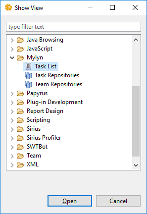
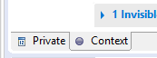
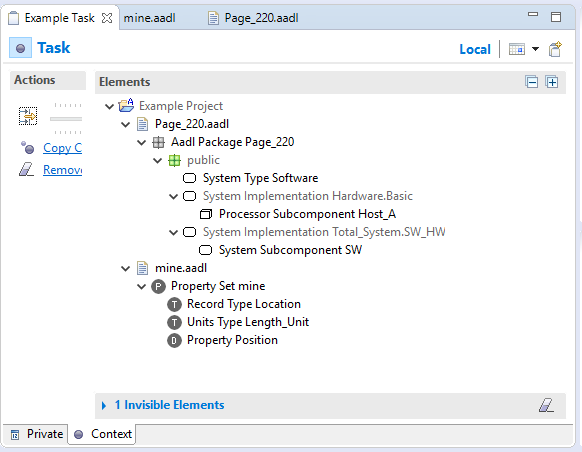
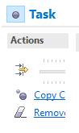
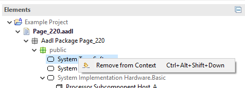
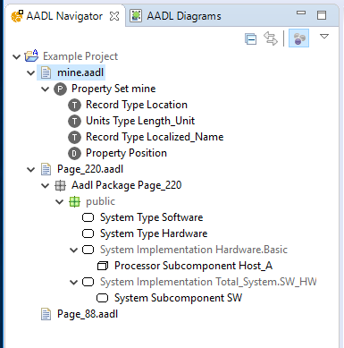
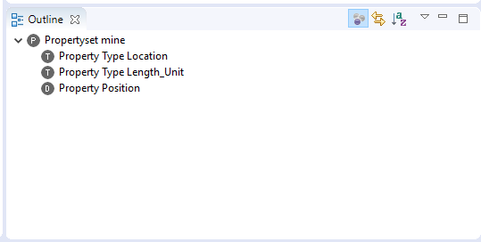

# OSATE and Mylyn

Mylyn is a task-management plug-in that tracks the workspace relevant to the task. Tasks can be created manually by the user, or OSATE can be connected to a task repository such as github issues or bugzilla. 
Mylyn associates with each task a set of resources that were edited while that task was active and also the AADL files that were open in in the text editor. This 'task context' is restored whenever the task is activated to work on it.
In addition, the AADL navigator and outline views can be filtered to show only elements that are part of the task context, i.e., are relevant to the active task.

Below are links to several tutorials on how to use Mylyn:

* [Mylyn Tutorial from Tasktop Technologies](https://www.tasktop.com/mylyn-tutorial)
* [Task management with Eclipse Mylyn](https://www.vogella.com/tutorials/Mylyn/article.html)

OSATE extends Mylyn to understand textual AADL models (`.aadl` files).  AADL packages, property sets, classifiers, features, subcomponents, modes, mode transitions, property declarations, property constant declarations, and property type declarations are added to task contexts as they become interesting.  

## The Task List

The Mylyn `Task List` view is not part of the `AADL` perspective, so it needs to added to the workspace manually: 

1. Select `Window > Show View > Other...` to bring up the dialog box to select views.
  

2. Select `Mylyn > Task List` and click on `Open`.

The tutorials listed above give a good introduction on how to use the `Task List` view to create and manage Mylyn tasks.  There are no OSATE-specific changes made to this view.

## Building a Context

As you navigate the workspace and edit AADL files, Mylyn builds a context for the active task.  You can view the context for a task by opening the editor for the task via the `Task List` view, and then switching to the `Context` pane of the task editor by clicking on the tab at the lower left of the editor:
  

The image below shows an example context built from browsing an AADL project.

The context contains

* The system type `Software` in the package `Page_220`
* The processor subcomponent `Host_A` of the system implementation `Hardware.Basic` in the package `Page_220`
* The system subcomponent `SW` of the system implementation `Total_System.SW_HW` in the package `Page_220`
* The property set `mine`
* The property type `Location` in property set `mine`
* The property type `Length_Unit` in property set `mine`
* The property declaration `Position` in property set `mine`

Note that the system implementations `Hardware.Basic` and `Total_System.SW_HW` **are not** part of the context.  This can be determined by the fact that they are "grayed out" in the tree.

### Editing the Context

The entire context of a task can be cleared by clicking on the `Remove` (eraser) action in the `Context` pane of the task editor.

Individual elements can be removed from the context by using the `Remove from Context` action in the pop-up menu in the `AADL Navigator` or in the `Context` pane itself.

## Focusing on the Task

The `AADL Navigator` view and the `Outline` view for AADL documents support focusing on the task (as described in the tutorials above).  Toggle the `Focus on Active Task` action  in the toolbar of either view to activate or deactivate this feature.

