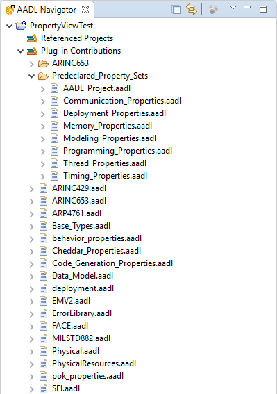

# Included Property Sets and Packages

[TOC levels=2-4 bullet hierarchy]

## Viewing Included AADL Files

All of the property sets and packages which are included by default in OSATE can be shown in the AADL Navigator. If you
expand an AADL project in the Navigator, you will see an item called `Plugin Contributions`. Expand this item and you
will see all of the property sets and packages contributed by the various plugins in OSATE. An included file can be
opened by double clicking on it.

## List of Property Sets and Packages Included in Core OSATE

The following are all of the property sets and packages included in a basic OSATE installation. Other property sets and
packages may be available in your installation if you have installed other plugins.

* `Predeclared_Property_Sets`: All of the property sets in this folder are specified by the AADL standard.
* `property set ARINC429`: Supplied for the **Check A429 Connection Consistency** analysis.
* `property set ARINC653`: Specified by the ARINC 653 annex to the AADL standard.
* `property set ARP4761`: Specified by the Error Model Language annex to the AADL standard.
* `package Base_Types`: Specified by the Data Modeling annex to the AADL standard.
* `property set Behavior_Properties`: Specified by the Behavior Model annex to the AADL standard.
* `property set Cheddar_Properties`: Supplied by the Ocarina plugin.
* `property set Code_Generation_Properties`: Specified by the Programming Language annex to the AADL standard.
* `property set Data_Model`: Specified by the Data Modeling annex to the AADL standard.
* `property set Deployment`: Supplied by the Ocarina plugin.
* `property set EMV2`: Specified by the Error Model Language annex to the AADL standard.
* `package ErrorLibrary`: Specified by the Error Model Language annex to the AADL standard.
* `property set MILSTD882`: Specified by the Error Model Language annex to the AADL standard.
* `property set Physical`: Supplied by the ALISA plugin.
* `package PhysicalResources`: Supplied by the ALISA plugin.
* `property set POK`: Supplied for the **Check Codegen Prerequisites For POK**, **Check Codegen Prerequisites For DeOS**, and **Check Codegen Prerequisites For VxWorks** analyses.
* `property set SEI`: Supplied for various analyses included in OSATE.