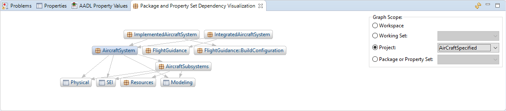
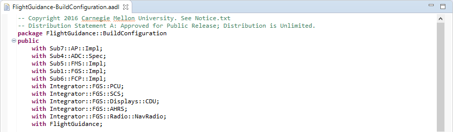
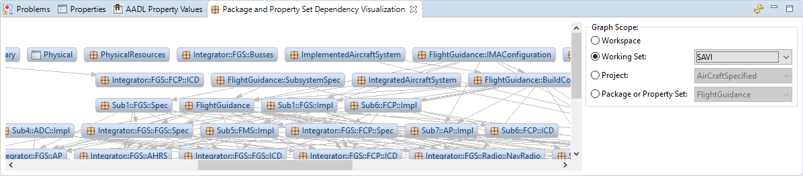
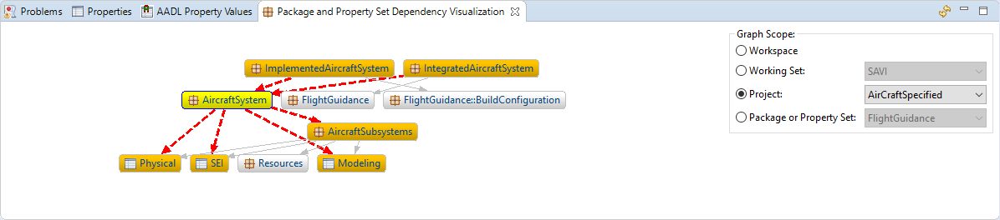

# Package and Property Set Dependency Visualization View

[TOC levels=2-4 bullet hierarchy]

## Introduction

The Package and Property Set Dependency Visualization View displays a directed graph showing the dependencies between
packages and property sets in your workspace. This can be helpful when you have many packages which refer to each other
and it is difficult to understand their dependencies. Packages in the graph are indicated with the package icon
() and property sets are indicated with the property set icon
().

## With Statements

The view analyzes package and property set dependencies by looking at their **with** statements.

## Opening the View

To open the Package and Property Set Dependency Visualization View, click on **Window** -> **Show View** -> **Other...**
in the main menu. Select **AADL** -> **Package and Property Set Dependency Visualization** and click **Open**.

## Graph Scope

The view can display all packages and property sets in the workspace or limit its contents to a specific scope. If the
scope is limited, it can be limited to a specific working set, project, package, or property set. These options are
displayed in the controls on the right side of the view.

### Workspace

When **Workspace** is selected, all packages and property sets are shown in the graph. Packages that do not refer to any
other package nor have other packages refer to it are shown as unconnected nodes in the graph.

### Working Set

When **Working Set** is selected, all packages and property sets in the selected working set are shown in the graph. In
addition to that, any package outside of the working set that has a direct or indirect dependency connection to a
package in the working set is also shown. These additional packages are considered to be outside of the scope, but are
still displayed in the graph. Packages in the working set are shown with a light blue background color while packages
outside of the scope are shown with a gray background color.

### Project

When **Project** is selected, all packages and property sets in the selected project are shown in the graph. In addition
to that, any package outside of the project that has a direct or indirect dependency connection to a package in the
project is also shown. These additional packages are considered to be outside of the scope, but are still displayed in
the graph. Packages in the project are shown with a light blue background color while packages outside of the scope are
shown with a gray background color.

### Package or Property Set

When **Package or Property Set** is selected, only the selected package or property set is considered to be in scope.
The graph consists of that package plus any package that has a direct or indirect dependency connection to the selected
package. The selected package is shown with a light blue background color while the other packages are shown with a gray
background color.

### Setting the Scope

The graph scope can be set from the controls on the right side of the graph, the AADL Navigator's context menu, or the
graph's context menu. If the scope is set from a context menu, then the state of the controls in the view will be
updated to reflect the currently selected scope.

In the AADL Navigator, the scope can be set by right-clicking on a working set or a project and clicking
**Visualize Package and Property Set Dependencies**. This will set the scope to the selected working set or project.

The scope can also be set by right-clicking in the graph. This will bring up a context menu that allows the scope to be
set to the workspace. If the right-click was on a package or property set in the graph, then there will be an option for
setting the scope to that package.

### Refreshing the Scope

Changes to working sets, projects, packages, or property sets are not immediately reflected in the graph. Use the
Refresh button () in the view's toolbar to rebuild the graph based
upon the currently selected scope.

## Interacting with the Graph

Nodes of the graph can be rearranged by dragging them around.

When clicking on a node in the graph, that selected node will be highlighted along with any other node directly
connected to it as well as the connections. This can be helpful for understanding complicated graphs. The selected node
will have a yellow background color. Nodes directly connected to the selected node will have an orange background color.
Connections in which one endpoint is the selected node will be red in color and dashed.

