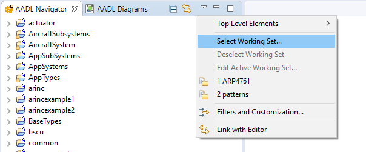
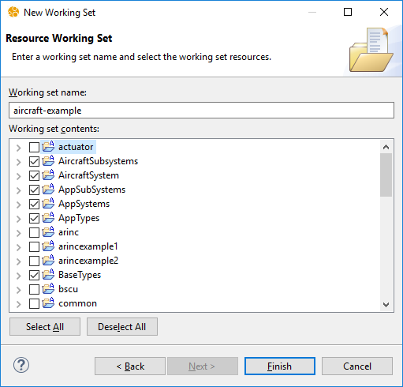
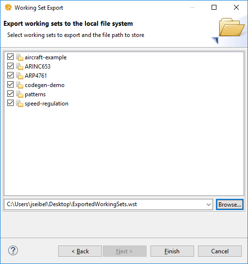
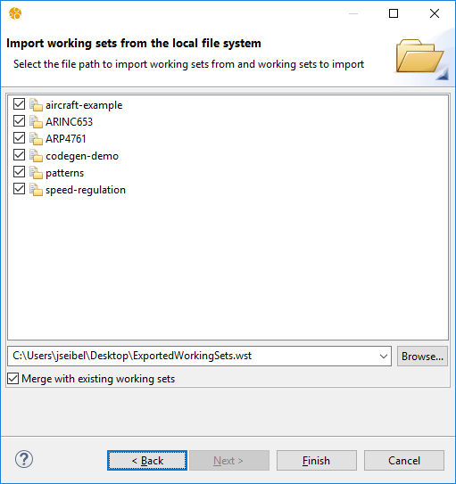

# Working Sets

[TOC levels=2-4 bullet hierarchy]

## Introduction

When working with a large set of projects, it can become difficult to keep track of and navigate all of these projects
in the AADL Navigator. Working sets allow you to group related projects in the Navigator. The following two images show
examples of the AADL Navigator with many projects. The first shows the list of projects without using working sets and
the second shows the same projects grouped by working set.

## Creating a Working Set

To create a working set, start by opening the AADL Navigator's menu. This is accessed by clicking on the small downward
pointing triangle icon in the top-right of the navigator. From the menu, click **Select Working Set...**

In the dialog that opened, click on the **New...** button. For the type of working set, select **Resource**, then click
**Next >**.

Specify the name of the new working set and check the projects that it should contain. Note that a project can be
contained in multiple working sets. Click **Finish** to create the working set. Once created, a working set can be
modified by clicking on the **Edit...** button in the **Select Working Set** dialog.

## Showing the Working Sets in the AADL Navigator

Once the working sets are created, the navigator can then be configured to display the working sets. To do this, first
configure the navigator to display working sets as the top level elements instead of projects. Open the AADL
Navigator's menu and click **Top Level Elements** -> **Working Sets**.

Second, the working sets that should be displayed must be selected. Open the navigator's menu again and click
**Select Working Set...** Use this dialog to check which working sets should be shown as top level elements in the
navigator. Once you have made your selection, click **OK**.

It is also possible to show the contents of the selected working sets without showing the working set name itself. This
can be useful if you want to focus on one working set and ignore all others. To do this, open the navigator's menu and
click **Top Level Elements** -> **Projects**. Then open the **Select Working Set** dialog and select the working sets
you want to display. Here is an example of the navigator showing the projects of only one working set:

If you want to return the navigator to showing all projects, simply open the navigator's menu and click
**Deselect Working Set**.

## Exporting and Importing Working Sets

You can export and import working sets to share working set configurations among various workspaces. This can be useful
if you have a team of people that have the same projects in their workspaces. This can be used to share the same
working set definitions among every member of the team. To export your working sets, click on **File** -> **Export...**
in the main menu. Select **General** -> **Working Sets** and click **Next >**. Check the working sets you want to
export and select the file where this should be stored. Click **Finish** to export the working sets.

To import working sets, click on **File** -> **Import...** in the main menu. Select **General** -> **Working Sets** and
click **Next >**. Select the file to import from and the working sets from that file to import. If
**Merge with existing working sets** is selected, then for any working set that already exists in the workspace, after
import, the working set will contain all projects that it previously contained and all projects from the import. If
**Merge with existing working sets** is not selected, then the import skips any working sets that already exist.

