<!--
Copyright (c) 2004-2020 Carnegie Mellon University and others. (see Contributors file). 
All Rights Reserved.

NO WARRANTY. ALL MATERIAL IS FURNISHED ON AN "AS-IS" BASIS. CARNEGIE MELLON UNIVERSITY MAKES NO WARRANTIES OF ANY
KIND, EITHER EXPRESSED OR IMPLIED, AS TO ANY MATTER INCLUDING, BUT NOT LIMITED TO, WARRANTY OF FITNESS FOR PURPOSE
OR MERCHANTABILITY, EXCLUSIVITY, OR RESULTS OBTAINED FROM USE OF THE MATERIAL. CARNEGIE MELLON UNIVERSITY DOES NOT
MAKE ANY WARRANTY OF ANY KIND WITH RESPECT TO FREEDOM FROM PATENT, TRADEMARK, OR COPYRIGHT INFRINGEMENT.

This program and the accompanying materials are made available under the terms of the Eclipse Public License 2.0
which is available at https://www.eclipse.org/legal/epl-2.0/
SPDX-License-Identifier: EPL-2.0

Created, in part, with funding and support from the United States Government. (see Acknowledgments file).

This program includes and/or can make use of certain third party source code, object code, documentation and other
files ("Third Party Software"). The Third Party Software that is used by this program is dependent upon your system
configuration. By using this program, You agree to comply with any and all relevant Third Party Software terms and
conditions contained in any such Third Party Software or separate license file distributed with such Third Party
Software. The parties who own the Third Party Software ("Third Party Licensors") are intended third party benefici-
aries to this license with respect to the terms applicable to their Third Party Software. Third Party Software li-
censes only apply to the Third Party Software and not any other portion of this program or this program as a whole.
-->
# Safety Analysis with Error Model V2

[TOC levels=2-4 bullet hierarchy]

## Introduction

In this write-up, we demonstrate on an example how functional hazard assessment (FHA), fault impact 
analysis (FMEA like), and fault tree analysis (FTA) of a safety-critical system can be performed 
through the use of AADL, Error Model V2 (EMV2), and the analysis capabilities of OSATE. 

In fault impact analysis the impact of fault occurrences on a system is determined through forward 
reasoning from an error source. One such form of inductive impact analysis is known as failure mode 
and effect analysis (FMEA). In OSATE it is supported by a Fault Impact Analysis capability.

In fault tree analysis fault occurrences are identified as contributors to a critical failure 
effect, such as an accident through backward reasoning. One such form of deductive fault impact 
analysis is known as fault tree analysis (FTA). In OSATE the Fault Tree Analysis capability supports 
the generation of fault contributor traces with identification of dependent events, i.e, , component 
failures that affect multiple other components, fault trees that are flattened and transformed fault 
traces with occurrence probability calculation, and minimal cut sets with occurrence probability 
calculation. It supports event and gate types defined in the NRC Fault Tree Handbook (NUREG-0492). 

> The objective of flattening and transformations is to simplify the fault tree and to move dependent 
  (shared) events up, potentially eliminating its replication in the tree.

We will show how AADL and EMV2 can be used in this process. In terms of notation, we will 
demonstrate the use of EMV2 at three levels of abstraction:

1. Error propagations and flows: early for FHA, for impact analysis (FMEA) typically single source 
   tracing forward to identify impact; backward propagation to identify all potential contributors to a 
   catastrophic or major event (in FTA result presentation); and events that affects multiple 
   components, thus, represent common causes (part of FTA result presentation). The level of 
   specification detail corresponds to that of the Fault Propagation and Transformation Calculus (FPTA) 
   of York University.
2. Component error behavior specifications: identification of failure modes, types of component 
   failures (error events), error behavior logic to reflect redundancy of external input and redundancy 
   of subcomponents. This level can take into account any safety system/fault management design such as 
   redundant input or parts. 
3. Compositional error behavior (failure modes) in terms of subcomponent error behavior to 
   determine initial system reliability based on a parts model. It can be used to generate a composite 
   parts fault tree.

## The Example Model

We will demonstrate the capability on a GPS system. The model example is available on Github as 
[Safety Tutorial](https://github.com/osate/examples/tree/master/SafetyTutorial). A second model 
example that illustrates the use of ARP4761 hazards specifications can be found at 
[ARP4761 Example](https://github.com/osate/examples/tree/master/ARP4761).

First, we introduce the GPS in the context of its operational setting, a flight system. Given the 
safety requirements of the flight system we determine a safety requirement on the GPS in terms of 
likelihood of failure. We do so on a functional architecture of the flight system. This becomes 
basis for the design process of the GPS. Initially, a system engineer determines the functional 
architecture and the physical architecture of the GPS. For the physical architecture, the system 
engineer identifies physical components and assesses whether they are able to achieve the required 
failure occurrence probability. Design alternatives are considered to see if the target probability 
can be achieved, or whether the architect of the flight system has to accommodate a lower 
reliability GPS. The functional architecture determines the data and control flow it becomes the 
basis for inductive and deductive fault impact analysis. Once allocation decisions have been made, 
the impact of physical component faults on the services provided are analyzed.

We proceed by first providing a summary of functional hazard assessment, fault impact analysis and 
fault tree analysis, and then walking through a series of development phases to illustrate the use 
of these analyses on models with different levels of detail.

## Functional Hazard Assessment

Functional hazard assessment allow people to identify hazards in a system  by annotating an AADL 
model of the system with **Hazards** property values. This can be done on a functional architecture, 
a physical architecture, the deployment of a functional architecture to a physical architecture. It 
can also be done on a task and communication architecture deployed on a hardware platform.

We first provide details of the property, show an example of its use, describe how generation of FHA 
reports is invoked, and show an example of such a report. FHA can be performed in a generic Error 
Model V2 (EMV2) format, in ARP4761 format, or on MIL STD 882 format.

### Hazards Property and Its Use

The Error Model V2 Annex standard introduces several properties to model hazards. Hazards exists in 
a generic format (EMV2::Hazards), in ARP4761 format (ARP4761::Hazards), and MIL STD 882 format 
(MILSTD882). The property allows users to associate hazards descriptions with error propagations, 
error sources and paths, error events, error behavior state, and error types. The value of the 
property is a list of hazard description records.

> Typically you would annotate an AADL model with EMV2 outgoing error propagations and associate 
  hazards property values with them. You may also add error source declarations or error path 
  declarations and attach hazard descriptions with those. You may have represented failure modes 
  through an error behavior state machine. In this case you have identify a failure mode as hazard by 
  attach a hazard description to it. Finally, You may have specified a component error behavior that 
  includes error events and attached a hazard description with those events. In this case, the report 
  includes the hazard descriptions of all events that are referenced in error behavior transitions. 

The generic version of the hazard description record has the following fields:

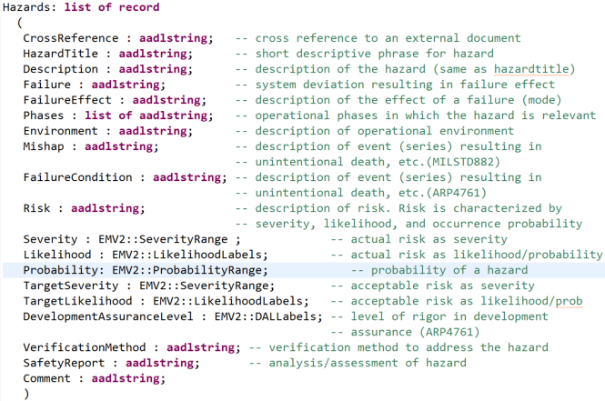

with the following labels:

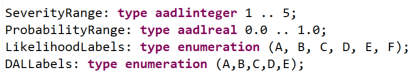

The ARP4761 version of the record has the following fields:

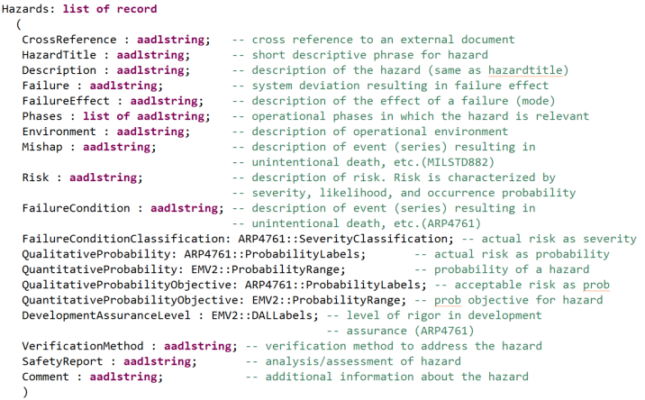

with the following labels:

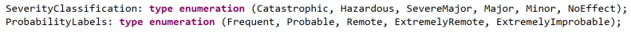

The MILSTD882 version of the record has the following fields:

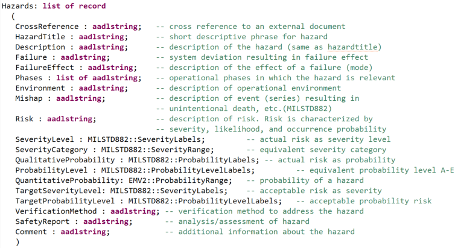

with the following labels:

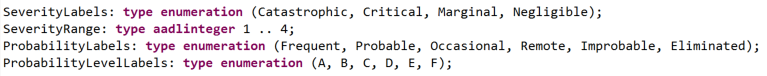

Below is an example of a hazards property associated with an error source. The example is taken from 
the GPS system of the safety tutorial.

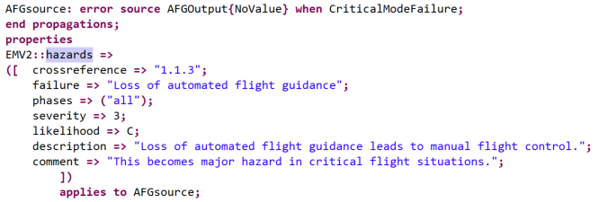

The second example illustrates the use of the ARP4761 hazards property and is taken from the ARP4761 
example model.

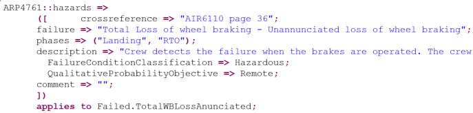

### Generating the FHA Report 

The FHA report is generated by selecting an instance model and invoking the command via the main 
menu, the context menu, or the tool bar. The figure below illustrates the command via the main menu. 
It is in the same location under the context menu, which you get by right clicking on the instance 
model. The same icon is used in the tool bar to identify the command.

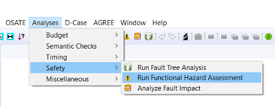

The **Functional Hazard Assessment** command uses one of three property sets.  The set that it uses is 
controlled by the `OSATE > Analysis > Functional Hazard Assessment` pane in the OSATE
preferences window:

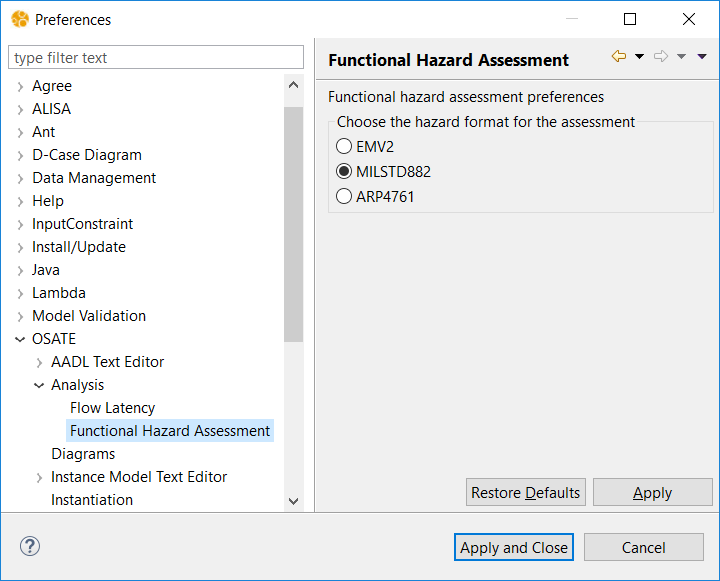

The radio button has three settings:
* **EMV2** to use the `EMV2::Hazards` property set
* **MILSTD882** to use the `MILSTD882::Hazards` property set
* **ARP4761** to use the `ARP4761::Hazards` property set

The FHA report is a cvs file that can be found in the **reports** folder under the **FHA** 
sub-folder.

It lists the component by name, the error model element, e.g., error source and error type, and all 
entries in the hazard description record. A sample of such a report is shown below.

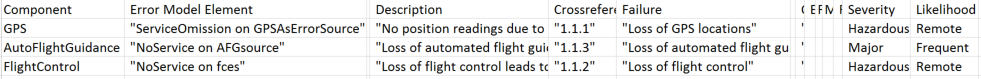

> If you have annotated the AADL model with EMV2::Hazards properties and run the 
  **Functional Hazard Assessment (ARP4761)** command (or MIL Std 882 command), you will get an empty report. Currently we 
  do not automatically map hazard descriptions of one format into one of the other two formats.

## Fault Impact Analysis

The fault impact analysis works with AADL models annotated with EMV2 at various levels of detail. At 
a minimum, users have to specify outgoing and incoming error propagations and error source, error 
path, or error sink declarations. OSATE will ensure that the incoming propagated error types match 
up with those that are propagated from other components.

### Fault Impact Trace

Fault impact analysis starts with each error source and the optional **when** condition associated 
with it. The element of the condition become the original fault and the out propagation identified 
by the error source the first level effect. If the error source has multiple error types, i.e., a 
type set, the impact trace is generated for each error type.  

> If the component has a component error behavior specification that includes error events, then the 
  error event is considered an error source if it triggers a transition to an error behavior state 
  that itself results in an out propagation, i.e., is identified in an out propagation condition 
  declaration.

For each component the outgoing propagations follow the connections or bindings to their destination 
component until an error sink, an outgoing error propagation external to the outermost system, or a 
cycle in the propagation are detected. For each incoming propagation error paths are used to 
identify outgoing propagations. If no error paths are specified for an incoming error propagation 
then all outgoing propagations are assumed to be affected by it.

Fault impact analysis also generates impact traces for incoming error propagations from sources 
external to the system. In this case, the incoming error propagations of the top-level system are 
the starting point.

> The fault impact analysis does not require any properties to be set.

> If no error flow exists for an incoming error propagation then a flow path specification in the 
  core model is interpreted as error path. If neither are present propagation through all outgoing 
  propagation points are assumed.

> When the user has added component error behavior, i.e., error events, error states, and 
  transitions, they are interpreted as part of the fault impact analysis, giving the user a higher 
  fidelity result. In this case, error events that trigger transitions and result in outgoing 
  propagations are used as starting points of a fault impact trace. 

### Fault Impact Analysis Invocation and Report

The fault impact analysis generates a report and is invoked by selecting an instance model and 
invoking the command via the main menu, the context menu, or the tool bar. The figure below 
illustrates the command via the main menu. It is in the same location under the context menu, which 
you get by right clicking on the instance model. The same icon is used in the tool bar to identify 
the command.

The fault impact report is a cvs file that can be found in the **reports** folder under the 
**FaultImpact** sub-folder.

The fault impact report first lists the impact traces for all error sources declared within the 
system instance, and then impact traces for external error sources identified by incoming error 
propagations of the top-level system.

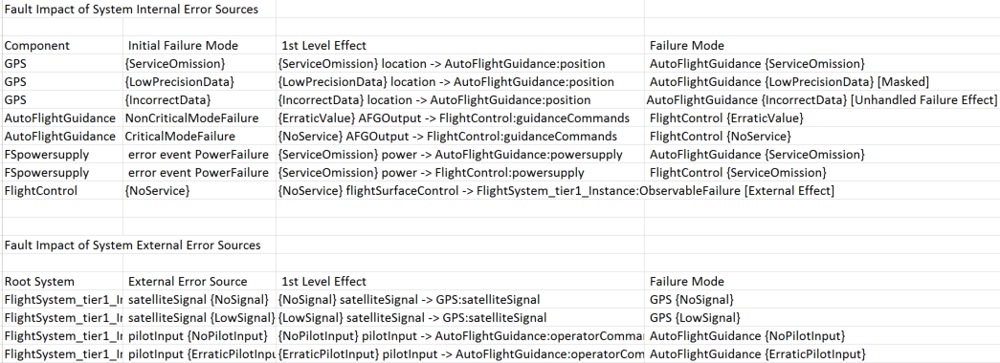

Each row in the report represents an impact trace. 

- The first element of a row identifies the component of the error source or the top-level component 
  for external error sources. 

- The second element identifies the initial failure mode, i.e., the error type shown in "{}" or 
  error state (without "{}") as specified in the **when** condition of the error source or as the 
  error event type if the component has a component error behavior declaration. 

- The third element describes the first level effect by identifying the outgoing error propagation, 
  the error type being propagated, and the target component and incoming propagation that will be 
  affected.

The next pairs of elements represent the failure mode and next level of effect as the impact is 
traced along error propagation paths as determined by connections, bindings, or user declared 
propagation paths in EMV2 subclauses.

When an impact trace terminates a label indicates the reason for the end of the trace. The labels are:

- **Masked**: An indication that an error sink has been reached.

- **Unhandled Type**: The outgoing propagated error type is not listed as an error type in the 
  incoming error propagation at the receiving end of the propagation path (connection, binding, or 
  user declared propagation path).

- **Unhandled Failure Effect**: An incoming failure effect that is not handled as sink or by an 
  outgoing error propagation, i.e., the incoming propagated error type is not listed in any error 
  paths or outgoing error propagations.

- **External Effect**: Impact to the operational environment of the system, i.e., the impact trace 
  reached an outgoing propagation of the top-level system.

- **Propagation Cycle**: The impact trace reaches an element in the trace that has previously 
  propagated the same error type on the same outgoing propagation point.

- **No feature with out propagation**: An outgoing propagation has an outgoing connection to a 
  feature of the top-level system, where that feature does not have an error propagation declared. The 
  out propagation of the connection source represents the external effect.

- **No Outgoing Connection**: We have an outgoing propagation on a feature that is not connected to 
  another component.

- **No In Propagation**: The destination feature of a connection does not have an incoming 
  propagation declared.

- **No Binding**: The outgoing propagation is for a binding point, but the binding has not been 
  specified yet. 

Additional labels may be used for intermediate elements of the impact trace to indicate when an 
incoming type or type set is propagated as separate subtypes (**Subtype**), whether flow 
declarations in the core model are used when error flows are missing (**flowpath**), or when an 
incoming propagation is mapped to all outgoing propagations (**All out props**).

> Users can associate EMV2 specifications at several levels of a system architecture. The fault 
  impact analysis interprets the lowest level components with EMV2 subclauses to determine the 
  propagation paths and generate the impact trace. 

## Fault Tree Analysis

Fault tree analysis operates with the same AADL model annotated with EMV2. Again users can specify 
the model at different levels of detail. Users can specify error propagations and error flows. Users 
may also specify component error behavior, in which case it is interpreted instead of the error 
flows. Finally, users can declare composite error behavior, where an error behavior state of a 
system is declared in terms of error behavior states of its subsystem. 

### Assignment of Occurrence Probability 

The occurrence probability is represented by the *EMV2::OccurrenceDistribution* property. It takes a record value with one field specifying the value and a optional second field specifying the distribution. 

> Examples: 
EMV2::OccurrenceDistribution => [ ProbabilityValue => 3.85e-7 ;] applies to ErrorSrc.BadData ;
EMV2::OccurrenceDistribution => [ ProbabilityValue => 1.85e-7 ; Distribution => Poisson;] applies to SErrorEvent;

The property is specified in the *properties* section of the EMV2 annex subclause for the component classifier.
The property can be associated with 

- an *error source*. It is a leaf event in the fault tree if the user has not specified component error behavior with an outpropagation condition for the propagation identified in the error source.

- an *outgoing error propagation*. 

- an *incoming error propagation*. The in propagation of a top-level component or the incoming propagation of a binding point without a specified binding is a leaf event in the fault tree. In the first case it represents error propagated into the system from external sources. In the second case is represents a propagation from a platform to the application.

- an *error event*. The error event is included as a leaf event in the fault tree if it triggers a transition to an error state that is reachable via an outpropagation condition declaration. 

- an *error state*.

If the error model element has an error type, you can specify a different occurence value for each of the error types by including the error type name as the last element of the *applies to* path (see *ErrorSrc.BadData* in the example above).

When associated with the leaf event in the fault tree the specified value is used in the computation of the occurrence probability of the fault tree. 

When associated with error model elements that are not translated into fault tree leaf events, they represent an expected occurrence probability value that the computed value should match. In the result presentation we show both the specified and the computed values. 

### Fault Tree Analysis Invocation 

Fault tree analysis is invoked on an instance model through the main menu, context, menu, or tool 
bar. By default the top level component instance becomes the root of the fault tree analysis. The 
main menu is shown below.

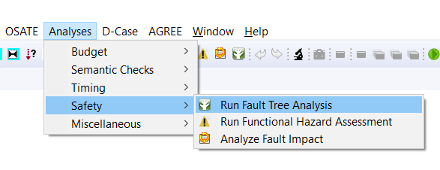

> Note that users select a component instance other than the root component instance (system 
  instance) as starting point of fault tree analysis.  

Fault tree analysis uses an error state or outgoing error propagation of the selected component 
instance as starting point. The analysis produces fault trees reflecting error states by 
interpreting composite error state declarations, or fault trees by tracing the flow of propagated 
errors backwards by interpreting propagation paths between components based on connections and 
bindings as well as error flows or component error behavior within components. These fault trees are 
shown to the user in graphical or table views. The figure below shows the dialog box through which 
the user can select an error state or outgoing propagation as well as an example fault tree in 
graphical view. 

Users can choose one of three variants of error flow-based fault trees or error state based fault 
trees:

* Fault tree with computed occurrence probability: A fault tree based on backward trace of the 
  propagation graph with contributors shown as fault tree events. The fault tree is compacted to 
  remove intermediate steps of the trace to focus on actual contributors, such as error events, error 
  sources, or external effects propagated into the system of interest. Occurrence probability is 
  calculated from occurrence probability values of the leaf events in the fault tree. Replication of 
  dependent (common) events is minimized through fault tree transformation. 

* Minimal cut sets with computed occurrence probability: Minimal cut sets of contributors are 
  generated from the propagation graph and occurrence probability is calculated from assigned 
  occurrence probability values of the leaf events in the fault tree. 

* Fault Contributor Trace: A fault tree is generated that shows the full backward trace to 
  contributors. This concludes intermediate steps such as outgoing and incoming error propagations, and 
  error states. Dependent (common) fault tree events and event subtrees are identified by a "*" in the 
  graphical view and by a column in the table view. 

* Parts fault tree with computed occurrence probability: A composite fault tree of system parts 
  recursively identified by composite error state declarations. In this case the propagation graph 
  representing error flow is not taken into account. Occurrence probability is computed from the 
  occurrence probability values assigned to error states of the leaf components. 

> On startup of OSATE **fault tree with computed occurrence probability** and **table view** are 
  selected. Users can explicitly select the graphical view instead.  If users change these two 
  selections they are remembered for the next fault tree analysis invocation.

### Fault Tree Analysis Results

The stored fault trees are stored in an XMI format based on a FaultTree.ecore specification (for 
details see 
https://github.com/osate/ErrorModelV2/tree/develop/org.osate.aadl2.errormodel.faulttree/model). They 
are kept in the **FTA** folder under the **reports** folder and their faile names reflect the 
instance model root as well as the type of fault tree being generated.  

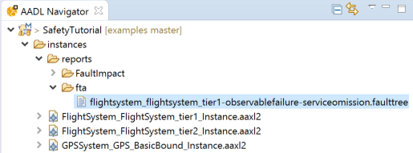

We support the following fault tree elements:

Events: Basic , External , Undeveloped 
, and Intermediate .

Basic events represent error sources or error events within the system, External events represent 
Events that come from outside the system of interest, and Undeveloped events represent incoming 
propagations of binding points without bindings or incoming propagations of features that are not 
connected.

Intermediate events represent events whose sub-events are combined by logic gates. An intermediate 
event with a single sub-event the intermediate event symbol is shown. For multiple sub-events one of 
the following gate symbols is shown: OR , AND , XOR 
, PriorityAnd , KOrMore , 
KOf, KOrLess. 

> Note that **Kof(1)** is the same as **Xor** of single elements, and **KOrMore(1)** is the same as 
  **Or** of single elements.

Eclipse Sirius is automatically invoked to visualize the fault trees in table or graphical view. 

> Occurrence probabilities are shown in the graphical and table view with a single digit after the decimal point. In the actual fault tree representation the values are stored with greater precision.

An example graphical view of a fault tree (shown below) illustrates the different event types. The 
graphical view uses a compact presentation of events and gates by showing events as rectangles and 
the gate type as part of an event with multiple sub-events. 

Each fault tree event rectangle contains an icon reflecting the event type or gate logic type as 
well as three lines of text: 

* The first line shows the name of the component instance and incoming or outgoing feature or 
  binding point. 

* The second line identifies the error model element represented by the fault tree event. Typically 
  this is the error type of an error propagation, an error event, or error state, and in the case of 
  an intermediate event that represents a logic condition, the gate logic and construct containing the 
  logic condition.

* The third line shows the computed or specified occurrence probability. In case of a computed 
  probability the specified probability value is shown in parentheses if present.

The example graphical view shows the following:

* The top level fault tree event shows the outgoing features and propagated error type representing 
  the outgoing error propagation selected by the user in the dialog. 

* The basic events for components **GPS**, **FlightControl**, and **AutoFlightGuidance** show an 
  error type from an error source as effect through an outgoing features. 

* For **powersupply** the basic event shows an error event as the source due to the fact that its 
  specification has an error behavior specification with a transition triggered by an error event. 

* Finally, two **external** events for component **flightsystem_tier1** shows incoming effects 
  (error types) from outside the flight system via the satellite signal and pilot input .

An example table view is shown below for a different fault tree, that of the GPS with two sensors. 
The example shows a top level event with three basic sub-events and one intermediate event as **and** 
gate with two sub-events representing the redundant sensors.

* The first column shows the fault tree events hierarchically nested. The icon and the text in this 
  column is the same as the first line of the graphical fault tree representation. 

* The second column shows error model element represented by the event (line 2 of the event in the 
  graphical view).  

* The third column shows the computed occurrence probability. 

* The fourth column shows the specified occurrence probability as assigned by the 
  **OccurrenceDistribution** property. 

* The fifth column indicates the event type, or in the case of an intermediate event with more than 
  one sub-event the gate logic. 

* The sixth column indicates whether the fault tree event is a dependent event, i.e., common 
(shared) sub-event to multiple events. 

> If the event represents a transition branch, then the computed or assigned probability is shown together with the branch probability, e.g., 2.3e-5 * 0.6. Note that the branch probability is pushed to all of the leaf events representing the transition trigger. This is necessary as in the fault tree and cut set representations the transition trigger may not have an explicit fault tree event. Note also that transition branch probabilities are cumulative if more than one error state machine with transition branches is involved.

### Composite Error State-based Parts Fault Tree Generation

One use early in the process is a composite parts fault tree generation. In this case users define a 
parts model, i.e., identify the parts of each system, and specify how the error states of the parts 
relate to the error states of the enclosing system through composite state declarations. Note that 
user can define such a model with error state machines at multiple level of a system architecture. 
Users also do not have to specify an error state machine for each level. Instead a higher level 
state can be expressed in terms of subsystems more than one level down by identifying a subcomponent 
inside a subcomponent as the condition element. If the identified subcomponent also has composite 
error behavior specifications, then the generated fault tre recursively includes the identified 
composite error states. 

An example of a composite error behavior state declaration is shown here. 

> In EMV2 the **1 ormore** operator is used to indicate **inclusive Or**, while the EMV2 **Or** 
operator represents **exclusive or**.

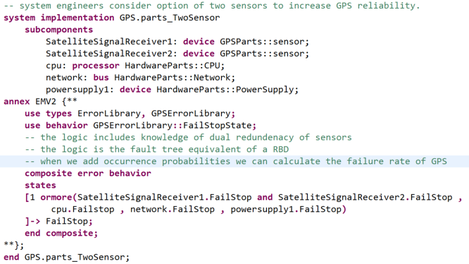

In our example, the package *GPSSystem* contains the top level GPS system with a number of 
implementations with different levels of detail and configurations. The parts model is represented 
by the system implementation *gps.parts_TwoSensor*. The composite error behavior specifies that the 
state **FailStop** for **GPS** holds if both of the replicated satellite signal receivers fail 
(AND), or any of the other parts fail. 

> This is similar to specifying reliability block diagrams (RBD) in a compositional manner, where the 
  logic of the composite error behavior state corresponds to the logic represented graphically by 
  parallel (AND) and sequenced (OR) blocks. The **parts fault tree** replaces the RBD command from 
  earlier versions of OSATE.

> Users can also achieve the effect of RBD by modeling components with error flows and connections. 
  In the case of components with multiple incoming error propagations representing replication users 
  declare an out propagation condition declaration that specifies which incoming error propagations 
  represent input from replicated component with AND logic (see Flow-based Fault Tree Generation 
  below).

Occurrence probability of the system error state (failure mode) is computed from the occurrence 
probability values assigned to the error states of the leaf nodes. The figure below shows the 
assignment of the occurrence probability value to the power supply.

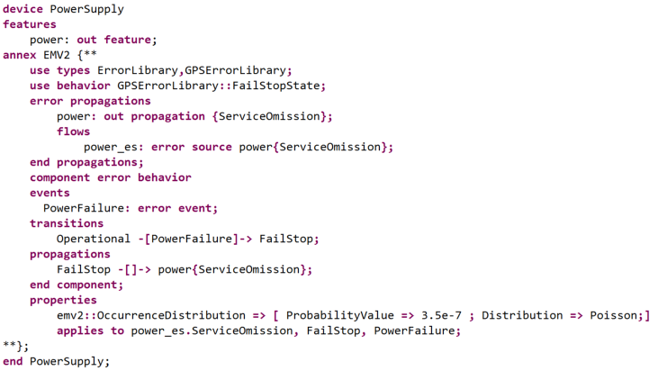

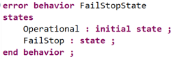

> Occurrence probability is computed from the occurrence probability on error states of the parts. 
This allows you to use of an error state machine with states only, i.e., without specification of 
error events and transitions. If an error state machine has been included with error events and 
transitions, and you want the error event included in the generated fault tree, then use the 
propagation graph based fault tree generation.

The resulting graphical fault tree looks like this.

### Flow-Based Fault Trees Generated from Backward Trace of Error Propagations

A flow-based backward trace traverses propagation paths along connections, bindings, and error flows 
from incoming propagations to outgoing propagations are interpreted. If component error behavior 
specifies error behavior state machines with error events, states, transitions, and outgoing 
propagation conditions, then they are interpreted resulting in a higher fidelity fault tree.

The starting point of a flow-based fault tree generation is an outgoing error propagation and error 
type of interest for the system instance, to which the fault tree analysis command is applied. This 
outgoing propagation represents the external effect a system function or service can have on its 
operational environment. The backward trace proceeds along propagation paths and error 
flows/component error behaviors until it encounters an error source (basic event), an error event 
(basic event), or an incoming error propagation that does not have a propagation path due to an 
absent connection or binding (undeveloped event), or an incoming error propagation of the top-level 
system (external event). 

In the case of a **fault contributor trace** every stop of the backward trace is reflected in 
generated structure. The same component and error model element may be reached multiple times, i.e., 
it represents a dependent event. In this case, each copy of the shared event (or event subtree) is 
tagged accordingly. 

An example fault contributor trace is shown for the system **GPS.basic**. The example shows a trace 
to the error source of the **network** component and to the error event of the **powersupply1** 
component. Both are marked as dependent events as they are reached via both 
**SatelliteSignalReceiver1** and **SatelliteSignalReceiver2**. The trace also shows an exernal event 
in the form of a **satellitesignal** coming into the **GPS** system. Finally, the trace shows an 
undeveloped event in the form of a **processor** binding point for **processing**. It is shown as 
undeveloped because we do not have a binding specified from **processing** to **cpu**.

> Note that dependent events represent common cause as their failure affects multiple components.

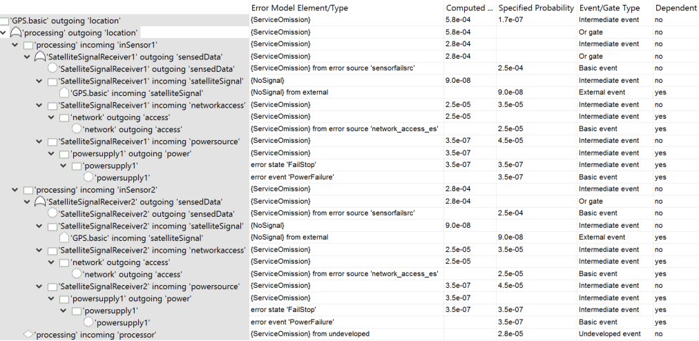

When the user selects **Fault tree with computed occurrence probability** the fault contributor 
trace is flattened by removing intermediate events with a single sub-event. In addition a set of 
transformations are applied to reduce the presence of dependent events by moving events and event 
subtrees up until they are no longer shared. 

The generated fault tree for our **GPS.basic** example is shown below. The **powersupply1** and 
**network** components contribute an **error event** and **error source** respectively, which were 
shown in the trace as dependent events. Those events have been moved up to become sub-events under 
the top-level system event connected via an OR gate. 

> Note that in a flow-based fault tree the occurrence probability of an outgoing error propagation 
  consists of the occurrence probability of all error events within the the root system parts as well 
  as any incoming error propagation.

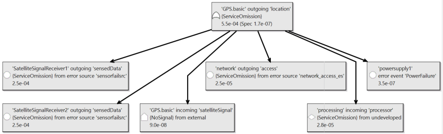

When the user selects **Minimal Cutsets with computed occurrence probability** the analysis 
generates a set of minimal cutsets for the system. The collection of cutsets is represented as an 
**OR**, while the elements in each cutset are added together. In our example each cutset has only a 
single element.

### Mapping of EMV2 Constructs into Fault Tree Elements

The fault tree generator maps EMV2 constructs into fault tree Events and Gates as follows:

* EMV2 conditions have AND, OR, ORMORE, ALL as logical operators

* EMV2 AND maps to FTA AND

* EMV2 OR maps to FTA XOR (exclusive OR)

* EMV2 1 ORMORE maps into FTA OR (inclusive OR) 

* EMV2 X ORMORE maps into a FTA KOrMore

* EMV2 ALL maps into FTA AND

In the case of state-based fault tree generation, the condition logic of composite error state 
declarations are reflected according to the above mapping. For each subcomponent state its composite 
state declaration is interpreted if present. 

In the case of flow-based FTA, an outgoing error propagation or error state and the selected system 
instance or subcomponent instance is the starting point.  

For an outgoing error propagation we follow OutgoingPropagationConditions (OPC) backwards with 
multiple OPCs combined as OR. If OPCs are absent we follow the propagation path from the outgoing 
error propagation of the outer component to the outgoing error propagation of a subcomponent 
instance.

> Note that if the root system instance is selected we typically expect to find a propagation path 
  to a subcomponent instance. Otherwise, the user may select a subcomponent instance with an error 
  model as starting point and apply the fault tree analysis command to it.  

If OPCs and propagation paths are absent, we follow error flow declarations. When following error 
flows to incoming error propagations, we combine error paths and error sources as OR.

For OPC, the condition expression and the error state are interpreted and combined as a PRIORITY_AND 
with the state related event occurring before the trigger condition). If the outgoing propagation 
condition applies to all states (all keyword on left) only the condition is interpreted.

The OPC condition, if not empty, identifies incoming error propagations. They are followed to 
outgoing propagations of connected/bound components by following propagation paths. Multiple paths 
are combined as an OR.

From the error state of the OPC we trace backwards via transitions to identify the error events or 
error propagations (incoming from the enclosing component or outgoing from a subcomponent) that 
trigger transition to the state by interpreting the transition condition. The source state of such a 
transition is recursively traced backwards until we reach a state without transitions triggered by 
error events (an operational error state). Multiple transitions with the same target error state are 
combined by an OR while recursive transitions across states are reflected by a PRIORITYAND.

Error events and error sources are BASIC events. Incoming propagation that represent bindings, but 
are not bound, are represented by UNDEVELOPED events. Similarly, incoming propagations that do not 
have a propagation path to a sending component are UNDEVELOPED events.

If an error state is selected to flow-based fault tree analysis on the root system instance then a 
composite error state declaration is examined to identify one or more subcomponent instances to 
start the flow-based backward tracing. Alternatively, the user can select a subcomponet instance and 
error state to start the backward trace from the error state according to transitions into the 
state.

> Note that as we trace backwards, we start with the error type identified by the user and perform 
  the appropriate filtering and mappings according to the specified type set constraints. Incoming 
  propagations that trace back to an incoming propagation of the top system, are represented by 
  EXTERNAL events.

### Fault Tree Transformations

When generating a fault tree, parts fault tree, or minimal cutset, we flatten nested OR, XOR, AND, 
PRIORITYAND in the generated EMFTA tree (Idempotent Law). For example, if an OR gate has events that 
themselves contain OR gates, we move their events into the upper OR. The effect is that although the 
backwards trace traverses multiple components, if all are based on an OR, the events contributed by 
each component are placed under a single OR gate instead of a right recursively nested OR structure.

When creating the fault tree or parts fault tree, we identify dependent events, e.g., events that 
represent shared hardware components that multiple functional or software components are bound to, 
or a power supply that is physically connected to (supplies) multiple sensors. A single instance of 
this event is maintained in the fault tree structure with multiple gates pointing to this instance 
instead of replicating it. A reference count greater than one on the shared event indicates that it 
is referenced by more than one gate. This effectively represents a directed graph. This allows for 
simple identification of common cause events.

We apply transformations to move the shared event up towards the root. In particular we apply the 
Law of Absorption to remove sub-gates with dependent events if they also exist as directly under the 
enclosing gate. We also apply the Distributive Law to move dependent events found in multiple 
sub-gates to the enclosing gate.
