<!--
Copyright (c) 2004-2020 Carnegie Mellon University and others. (see Contributors file). 
All Rights Reserved.

NO WARRANTY. ALL MATERIAL IS FURNISHED ON AN "AS-IS" BASIS. CARNEGIE MELLON UNIVERSITY MAKES NO WARRANTIES OF ANY
KIND, EITHER EXPRESSED OR IMPLIED, AS TO ANY MATTER INCLUDING, BUT NOT LIMITED TO, WARRANTY OF FITNESS FOR PURPOSE
OR MERCHANTABILITY, EXCLUSIVITY, OR RESULTS OBTAINED FROM USE OF THE MATERIAL. CARNEGIE MELLON UNIVERSITY DOES NOT
MAKE ANY WARRANTY OF ANY KIND WITH RESPECT TO FREEDOM FROM PATENT, TRADEMARK, OR COPYRIGHT INFRINGEMENT.

This program and the accompanying materials are made available under the terms of the Eclipse Public License 2.0
which is available at https://www.eclipse.org/legal/epl-2.0/
SPDX-License-Identifier: EPL-2.0

Created, in part, with funding and support from the United States Government. (see Acknowledgments file).

This program includes and/or can make use of certain third party source code, object code, documentation and other
files ("Third Party Software"). The Third Party Software that is used by this program is dependent upon your system
configuration. By using this program, You agree to comply with any and all relevant Third Party Software terms and
conditions contained in any such Third Party Software or separate license file distributed with such Third Party
Software. The parties who own the Third Party Software ("Third Party Licensors") are intended third party benefici-
aries to this license with respect to the terms applicable to their Third Party Software. Third Party Software li-
censes only apply to the Third Party Software and not any other portion of this program or this program as a whole.
-->
# Safety Analysis of a GPS System

[TOC levels=2-4 bullet hierarchy]

## Introduction

We will demonstrate the safety analysis capability on a GPS system. The model example is available 
on Github as [Safety Tutorial](https://github.com/osate/examples/tree/master/SafetyTutorial). 

First, we introduce the GPS in the context of its operational setting, a flight system. Given the 
safety requirements of the flight system we determine a safety requirement on the GPS in terms of 
likelihood of failure. We do so on a functional architecture of the flight system. This becomes 
basis for the design process of the GPS. Initially, a system engineer determines the functional 
architecture and the physical architecture of the GPS. For the physical architecture, the system 
engineer identifies physical components and assesses whether they are able to achieve the required 
failure occurrence probability. Design alternatives are considered to see if the target probability 
can be achieved, or whether the architect of the flight system has to accommodate a lower 
reliability GPS. The functional architecture determines the data and control flow it becomes the 
basis for inductive and deductive fault impact analysis. Once allocation decisions have been made, 
the impact of physical component faults on the services provided are analyzed.

The AADL model for the GPS system and its operational context consists of two EMV2 error libraries 
(AFGErrorLibrary and GPSErrorLibrary), the HardwareParts package with hardware platform components, 
the GPSParts package with the sensor device and GPSProcessing function, the GPSSystem package with 
the specification and various implementations of the GPS system that we will instantiate for 
analysis. In addition we have the packages FlightControl and AutomatedFlightGuidance defining other 
subsystems, and the FlightSystem package with a flight system whose implementation defines the 
operational context of the GPS, i.e., its interactions with flight control and automated flight 
guidance. Three flight system implementations with different levels of detail are provided.

## Elements of a Safety Analysis

With the GPS example system we demonstrate how functional hazard assessment (FHA), fault impact 
analysis (FMEA), and fault tree analysis (FTA) of a safety-critical system can be performed through 
the use of AADL, Error Model V2 (EMV2), and the analysis capabilities of OSATE. 

In **functional hazard assessment** a report is generated for all system components that have been 
annotates with **Hazards** specifications in EMV2.

In **fault impact analysis** the impact of fault occurrences on a system is determined through 
forward tracing from an error source. One such form impact analysis is known as failure mode and 
effect analysis (FMEA). The OSATE Fault Impact Analysis capability generates a report in  generic 
format of forward traces of all error sources and error events.

In **fault tree analysis** (FTA), fault occurrences are identified as contributors to a critical 
failure effect, such as an accident through backward tracing. In OSATE the Fault Tree Analysis 
capability supports the generation of fault trees that reflect fault graphs with common events, 
transformed fault trees eliminating those common events and occurrence probability calculation, and 
minimal cut sets with occurrence probability calculation. It supports event and gate types defined 
in the NRC Fault Tree Handbook (NUREG-0492). The fault trees are viewed graphically and the minimal 
cut set results in tabular form.

We will show how AADL and EMV2 can be used in this process. We demonstrate the use of EMV2 at three 
levels of abstraction:

1. Error propagations and flows: early for FHA, forward impact analysis (FMEA) typically single 
   source to identify impact; backward propagation to identify all potential contributors to a 
   catastrophic or major event (in FTA format); common cause analysis to identify shared resources or 
   functions (CMA/CCA). This level does not take into account any safety system/fault management 
   design. The level of specification detail corresponds to that of the Fault Propagation and 
   Transformation Calculus (FPTA) of York University.
2. Component error behavior specifications: identification of failure modes, Types of component 
   failures (error events), error behavior logic to reflect redundancy of external input and redundancy 
   of subcomponents.
3. Compositional error behavior in terms of subcomponent behavior to determine initial system 
   reliability based on a parts model, and to identify the starting point for a deductive fault impact 
   analysis of safety systems.

## The GPS System and its External Interface

The GPS is shown as a location provider in the architecture of the flight system. Other functions of 
the flight system are an automated flight guidance service, a flight control service that 
manipulates the flight surfaces, and a power supply that feeds flight guidance and flight control. 
GPS is assumed to have its own internal power supply. 

The flight system itself has a target probability of failure as a safety requirement, which was 
derived from an aircraft level system safety assessment. Similarly, severity and likelihood levels 
are assigned to the four functions the flight system utilizes.

The AADL specification of the flight system uses an abstract feature to represent an observable 
failure point of the flight system. The specification indicates observable failure in the form of 
service omission and erratic control of the flight surfaces. The flight system also accepts input 
from the pilot. The pilot may not provide input when expected or erratic input due to external 
circumstances.

The required (target) occurrence probability is shown as property on the error source declaration, 
indicating that this is the occurrence probability contributed by the flight system. The total 
probability of the flight system not providing service also takes into account assumed probability 
of pilot error.

The following figure shows the flight system architecture.  It is declared in the AADL model as a 
tier1 architecture (FlightSystem.Tier1). 

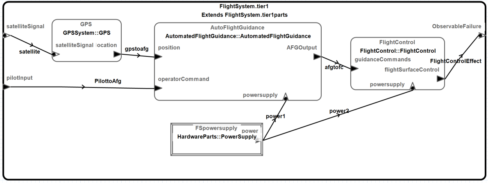

The components of the flight guidance system have been annotated with hazard information to reflect 
a functional hazard assessment at this aircraft subsystem level. Hazard information is associated 
with the error sources of each subsystem using an EMV2 property. Users can execute a functional 
hazard assessment to generate a FHA report. This is done by instantiating FlightSystem.Tier1 and 
selecting the file containing the generated system instance (found in the instances folder), and 
invoking the **Functional Hazard Assessment** command in the **Analyses/Safety** menu. The resulting 
report is found under the reports folder in the sub-folder FHA and is shown below. 

> Note that we support three variants of FHA, generic (EMV2), ARP4761, and MIL STD 882. Please use 
  the appropriate Hazards properties. In our example we use the generic Hazards specification defined 
  in the EMV2 property set.

Users can also determine the impact of the identified hazards through a fault impact analysis. In 
this case, a table is generated that traces a fault occurrence from its error sources through the 
error flows within components, as determined by error flow declarations, and by propagation paths 
between components as determined by AADL connection declarations. The **Analyze Fault Impact** 
command is also invoked on the selected instance model with the resulting report in 
reports/FaultImpact. 

In the fault impact analysis report we see two tables: 

The first table reports on the impact of 
failures that occur within the flight system and its subsystems. Its traces a failure from its error 
source or error event. Each effect column indicates the path of the outgoing propagation of one 
component to another component being affected by the propagation. The resulting failure mode of the 
receiving component is indicated in the next column. The trace terminates as an external effect, 
i.e., impact to the operational context of the top-level system, as being masked, or a number of 
other indicators (see the online help for safety analysis for a complete list of indicators). In our 
example we see traces from failures in all three subsystems.

The second table reports the impact of failures external to the top-level system that are propagates 
into the system. In our example, we trace the effect of error propagations associated with the 
satellite signal and those associated with pilot input.

Users can determine all contributors to a flight system failure and assess whether the failure 
occurrence probabilities assigned to each subsystem and assumed by the context are sufficient to 
meet the maximum failure occurrence requirement for the flight system. Users can generate a fault 
tree by applying the Analyze Fault Tree command to the FlightSystem.Tier1 instance. Users identify 
ObservableFailure of error type ServiceOmission of FlightSystem as the fault tree root. The 
resulting fault tree is displayed graphically or in table view as chosen by the user. Both views are 
illustrated below for FlightSystem.Tier1.

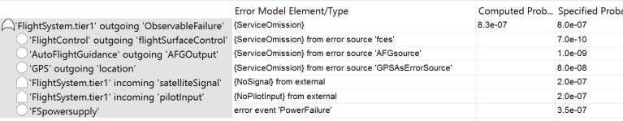

> Note that the fault tree analysis command lets users choose to generate a **fault tree**, a **fault 
  contributor trace**, a **minimal cutset**, and a **parts fault tree**. A fault tree shows all 
  potential failures (error events and error sources). A fault contributor traces shows all steps in 
  the backward trace from the system failure to each of the contributors including incoming and 
  outgoing propagations and error behavior states reached by transitions. A minimal cutset generates 
  the smallest sets of contributors resulting in the sected system failure. The parts fault tree 
  generates a fault tree from a parts model of a system with composite error state specification in 
  terms of subcomponent error states.

## The GPS System Specification

The GPS provides location information based on signals received by a sensor, reflected in a system 
type specification shown in Figure 3. The specification include annotations that capture system 
requirements and assumptions including those about fault behavior.

These include requirements for service availability and assumptions about the availability of 
satellite signals. Using the EMV2 notation we associate error propagations and error flows to 
specify the GPS as an error source and the expected response of the GPS of failures in the satellite 
signals.

Note that the reliability requirement for the GPS is reflected by an occurrence probability on the 
error source declaration. This indicates the probability of failure to provide service by the GPS 
itself.

We also document the assumption about the occurrence probability of incoming error propagations from 
signal loss. Finally, we can document the expected total probability of no GPS service as [property 
on the outgoing error propagation. The OSATE analysis capability can then compute the failure 
probability of the GPS service and compare it against the specified value. The initial calculation 
is simply the addition of the error source and error path values.

# Early Physical System Analysis

## Initial Physical System Design

At this stage a system engineer can do a quick sketch of the GPS system as a physical system design. 
Initially, we focus on the GPS in terms of its parts. For that purpose the user defines an 
implementation of the GPS that consists of subcomponents that represent the physical parts. This is 
expressed in the system implementation GPS.parts_SingleSensor. Initially the GPS is specified to 
consist of a sensor to receive satellite signals, a processor to perform computations, a network to 
support communication, and a power supply local to the GPS.

Each of the parts has an EMV2 specification that includes failure occurrence probabilities 
associated with the physical components. For the parts model we include an error state machine 
through use behavior and associate an occurrence probability with the FailStop state.

For the GPS system implementation, the user adds an EMV2 specification to indicate how the parts are 
combined for the system to provide a service. In this case, all the parts are needed for the GPS to 
operate, as seen in the composite error state declaration in Figure 5. An inclusive or is expressed 
as *1 ormore (list of subcomponents with Failed state)*. In this case, we consider individual 
component failures as well as combinations of failures. An exclusive or would be expressed by the or 
operator.

## Analyzing the GPS Parts Model

Once we instantiate the GPS parts model, we can run FHA, Fault Impact Analysis, and Fault Tree 
Analysis.

An FHA report only shows the hazard specified for the GPS as a whole.

The Fault Impact Analysis shows no results since he have not added any connections a propagation 
paths.

In the Fault Tree Analysis we generate a parts fault tree with the GPS FailStop state as the root. 
In this case, the composite state logic is used to determine the structure of the fault tree. The 
resulting fault tree directly reflects the composite state logic. If we had specified multiple 
levels of a system architecture, the fault tree would be a composite of the fragments specified in 
composite state declarations at each layer of the architecture.

From the computed fault occurrence probability on the fault tree, we can see that computed 
occurrence probability for GPS exceeds the the specified value.

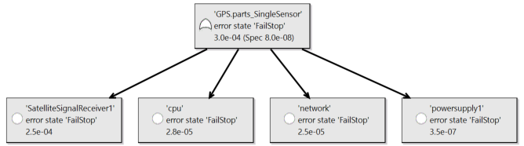

## Transient and Persistent Faults in the Sensor

Note that a revised version of the Sensor specification has been provided. It takes into account 
transient errors, which is reflected in a transition specification with transition branches (see 
Figure 6). The first branch represents persistent failure to FailStop. The second branch loops back 
to the Operational state to indicate transient failure behavior.

We can configure this specification into our physical parts design – see the system implementation 
GPS.parts_SingleTransient. By analyzing this specification we can see whether this revised 
specification results in differences in the occurrence probability numbers. In this case, the error 
event probability is multiplied with the branch probability to go into the FailStop state.

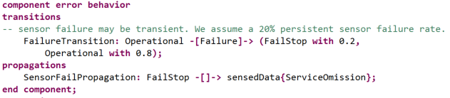

As a result of distinguishing between transient and persistent failures the occurrence probability 
for GPS is reduced due to the reduction in the sensor occurrence probability, but still well above the desired value.

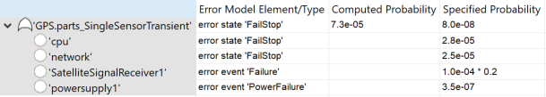

## Exploring Two Redundancy Options

In this section we consider two ways of achieving reduced FailStop occurrence probability for the 
flight system. First, we explore improving the GPS reliability by replicating its sensor. Then we 
consider replicating the GPS within the design of teh flight system.

We define an alternative design of GPS with two sensors (GPS.parts_TwoSensor) to assess if this is 
sufficient for reaching the target failure occurrence probability. We are replicating the sensor 
because it had the highest occurrence probability of all the GPS parts. We add a second sensor as a 
subcomponent to the GPS system implementation, and change the composite state declaration to specify 
the two sensor failure with an AND operator. This indicates that the two sensors are assumed to be 
operating redundantly and one sensor is sufficient for operation (GPS.parts_TwoSensor).

The resulting fault tree reduces the occurrence probability to 8.8e-5. Note that the redundant 
sensors have an occurrence probability of 6.3e-8, but the other parts limit the overall occurrence 
probability to e-5.

We can quickly explore a  flight system architecture with a replicated GFPS and determine whether it 
provides a better solution with respect to the target occurrence probability for the flight system. 

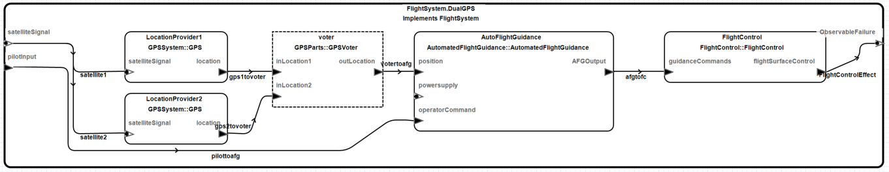

FlightSystem.DualGPSSingleSensor is a model of such a design using the GPS single sensor parts 
implementation. The resulting fault tree shows that the computed occurrence probability is smaller 
than the specified occurrence probability for the flight system.

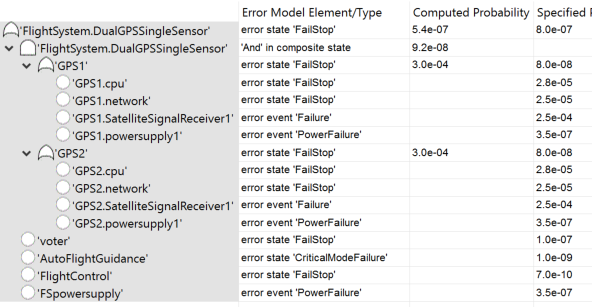

# GPS Functional Architecture and Physical System Binding

## Initial GPS System Architecture

The initial architecture of the GPS system is represented by the system implementation GPS.Basic.

The functional aspect of the sensor is captured by the device type declaration. For GPS processing 
we introduce an abstract component GPSProcessing that takes input from two sensors and produces the 
location as output. The diagram below shows these three elements of the functional architecture.

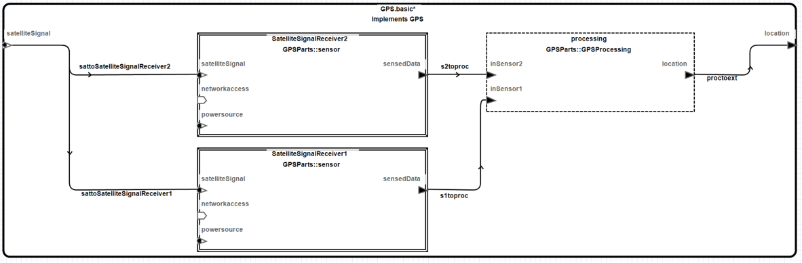

Both sensors are supplied with power and both are connected to a network to communicate to the CPU. 
This physical system configuration is shown in the next diagram.

The GPSProcessing component type specification includes error flow specifications: Two error paths 
from the sensors input to the location output. Since this function will be executed on the 
processor, we also define an error path from its processor binding point to the location output to 
indicate that a processor ServiceOmission error affects sensor output, while a ValueError is masked 
(represented by an error sink).  

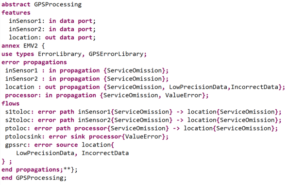

Note that we have defined an outgoing error propagation condition for GPS.Basic as shown in the 
listing below. It identifies the subcomponent whose output is used as GPS location output as the 
propagation source. 

In addition, we elaborate the specification of the hardware parts to include a mapping from an error 
state to an outgoing error propagation as shown .  This will result in the inclusion of the error 
event triggering a transition to FailStop and its probability in the generated fault tree. We have 
done so for the CPU and the network. In case of the power supply we have identified an error source. 
In this case the probability of the error source specification is included in the generated fault 
tree. This illustrates that the tool supports error behavior specifications of mixed fidelity.

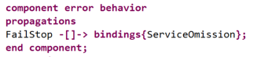

We can now perform both fault impact analysis and FTA. 

Fault Impact Analysis starts with each error source and traces the effect through forward 
propagation along error flows and propagation paths.  The propagation paths are represented by the 
connections. In our example, the error sources of the sensors, the power supply and the network are 
considered. The processor is not included as without a binding declaration there is no propagation 
path from the CPU to GPS processing.

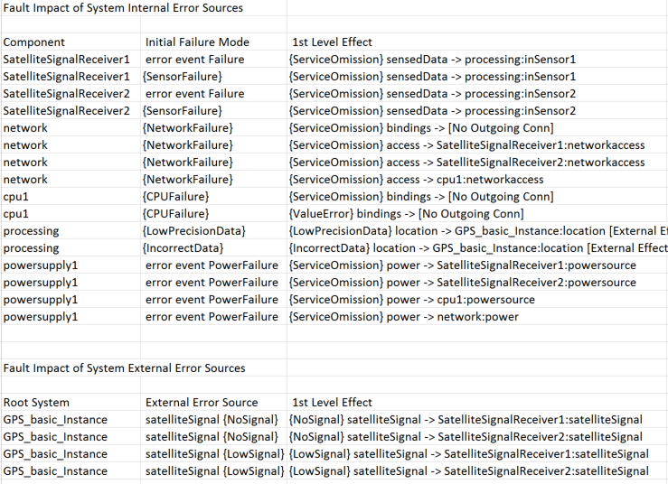

FTA starts with an undesirable effect GPS can have on its operational environment, in our case out 
propagation of ServiceOmission from the GPS location port. We specify the undesirable effect as 
starting point for the generation of the fault tree by identifying the out propagation as the 
starting point in a dialog box after invoking the **Fault Tree Analysis** command. From that out 
propagation point the analysis traces backwards along connections as propagation paths, error flows 
through components, and state transitions triggers, if provided. Bindings will be included as 
propagation path once the binding is specified by the user (see next section).

The resulting fault tree in its graphical view is shown below). The two instances of the sensor show 
up in the fault tree as an OR since the specification only includes error paths. The power supply 
and the network are included in the fault tree because the affect the performance of the sensors. 
The GPS processing unit itself is not shown as a contributor as the model does not include a 
specification of software as an error source. However, GPS processing is dependent on executing on a 
processor. This is indicated by an incoming error propagation point whose propagation path is not 
known until a deployment binding is specified (Undeveloped Event). In this case the fault tree event 
shows the incoming propagation with an expected occurrence probability that was specified with the 
incoming propagation.

Note that some components become contributors to more than one fault subtree. For example, the power 
supply contributes to the sensors, network, and CPU. In the fault trace this is reflected as a 
Dependent Event node that is sub-event to multiple events. Several dependent events can be seen in 
the Fault Contributor Trace for the same system (shown below). When a fault tree is generated from 
the trace structure the analysis flattens the structure by removing single sub-events, by combining 
sub-events under a single gate when both the event and the sub-event have the same gate type, and by 
removing duplicate events under the same gate. In addition transformations are applied to cause common 
event to migrate up towards the fault tree root and become non-shared events (as shown in the fault 
tree above).

In the next step we add a component behavior specification that indicates specific logic as to how 
redundant input is mapped to output for the processing unit. This done in GPS.BasicRedundancy. We 
indicate that processing only fails to produce output if both inputs are missing (an AND operator in 
the outgoing propagation condition declaration). 

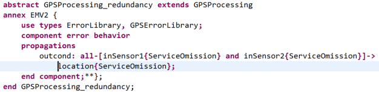

In a second variant (GPS.BasicState) the incoming sensor errors are mapped into an error state, and 
the outgoing propagation condition is determined by this state.

The fault tree generated from an instance of GPS.BasicRedundancy reflects the AND for both sensors 
needing to fail. In this case, the network, power, and satellite signal are shown once under the 
outer OR gate as result of the transformation.

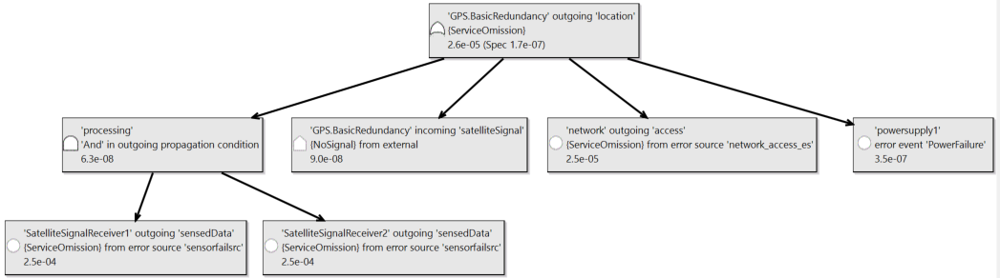

The fault tree for an instance of GPS.BasicState is the same – as expected.

## Functional Architecture Bound to Physical Architecture

We add binding information to the model, i.e., the binding of the GPS processing function to the 
processor (see GPS.BasicBound).

As a result of this binding the fault tree includes the processor *cpu1* in *FailStop* error state 
as contributor instead of the **undeveloped** processor binding point in the earlier fault tree. 

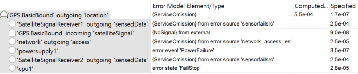

# Computational Error in Functional GPS System Architecture

The next step is to refine the functional (application) architecture of the GPS to reflect the fact 
that computation error may occur. We also consider the effect of one failing sensor. This is 
reflected in GPSProcessing_ComputeError, which now generates NoService, IncorrectData, and 
LowPrecisionData as outgoing propagations.

We can now generate a fault tree from the instance model of GPS.ComputeError for 
Location{NoService}, Location{LowPrecision}, and Location{IncorrectData).

> Note that the fault tree can be generated for the specific error type of interest.

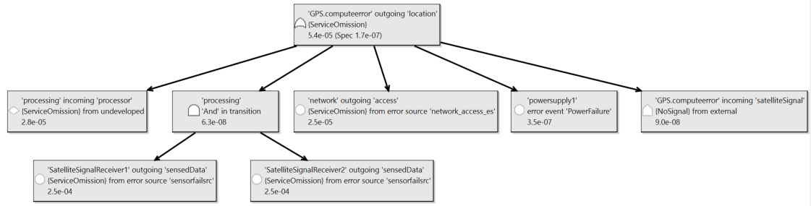

Note also, that in the case of low precision data, we have an XOR gate that only includes the two 
sensor failures. Power or network failure affects both sensors, thus does not satisfy the XOR.

We also have a variant where the software function with compute errors is bound to the processor 
(GPS.CEBound). As before in this case the processor *cpu1* with the *FailStop* error state is 
included as contributor instead of the processor binding point.

# Redundant Processors within GPS System Architecture

The final GPS system configuration GPS.Dual consists of two processors and two copies of the GPS 
processing unit. The output of the processing units is fed to a voter. The processing units are 
bound to a processor each, while the voter is bound to one of the processors. The resulting fault 
tree is shown below. Due to the fact that a single voter instance is bound to one processor (cpu1) 
only that processor is included in the fault tree. The other processor is eliminated according to 
the law of absorption.

