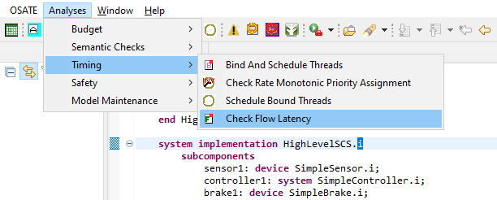

# ACVIP Example

This example is the first example of the AADL/ACVIP tutorial.
It is the first iteration of creating a Sensor Control System (SCS).
It was originally designed by the Software Engineering Institute (SEI) at
Carnegie Mellon University (CMU) to demonstrate the following
capabilities of OSATE:

* Check Flow Latency

This model will be incrementally built upon to demonstrate multiple levels of complexity within an AADL model, as well as the ability to run an analysis on a model early in the development process. As the model becomes more complex, the same analysis can be rerun to ensure the project is staying on track and more analyses will become valuable to be run on the model.

More information on the Architecture Centric Virtual Integration Process (ACVIP) can be found via a conference paper from [SEI's Digital Library](https://resources.sei.cmu.edu/library/asset-view.cfm?assetid=634965). 

This model and README is based on OSATE 2.9.1.

### Organization of the example

There is one model contained within this project, along with two diagrams of the HighLevelSCS implementation. The model used for this example will be built upon in subsequent examples.

### Creating a diagram

Although two diagrams are already contained inside of this example project, additional ones can be generated. To generate additional diagrams, open InitialSCS.aadl, right click on the HighLevelSCS implementation in the Outline perspective and select "Create Diagram...". The resulting diagram may be somewhat different in appearance to the provided diagrams in the example if using a newer version of OSATE.

### Conducting analysis

To analyze the model start by right clicking on the HighLevelSCS implementation in the Outline perspective and select "Instantiate". The instantiation is placed in the instance folder within the model in the AADL Navigator. Click the instantiation (e.g., InitialSCS_HighLevelSCS_i_Instance.aaxl2) and then select the Check Flow Latency (e.g., from the Analyses menu under the Timing submenu).

