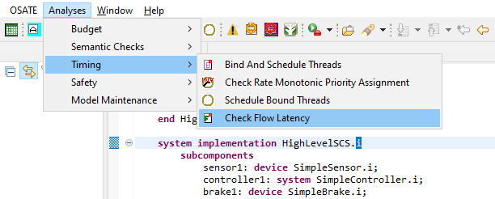

# ACVIP Example with Error Annex & Software Platform

This example is the second example of the AADL/ACVIP tutorial.
It is the second iteration of creating a Sensor Control System (SCS).
It was originally designed by the Software Engineering Institute (SEI) at
Carnegie Mellon University (CMU) to demonstrate the following
capabilities of OSATE:

* Check Flow Latency

This model is the second implementation of the Sensor Control System demonstrating the next level of complexity within an AADL model. Within this model, a software platform has been added for each of the three components, as well as an error model using EMV2. 
Each platform contains a processor and memory. Various buses have been added to the model for communication between components. The error model shows how errors can be propogated up through the hierarchy of the system. On top of error propagation, it shows that an error can change the state of the system. 

More information on the Architecture Centric Virtual Integration Process (ACVIP) can be found via a conference paper from [SEI's Digital Library](https://resources.sei.cmu.edu/library/asset-view.cfm?assetid=634965).
For more information on EMV2, please refer to OSATE's help contents.

This model and README is based on OSATE 2.9.1.

### Organization of the example

There is one model contained within this project, along with one instance and two diagrams of the new HighLevelSCS implementation. The model used for this example is built upon the previous exampe and will be continue to be built upon in subsequent examples.

### Creating a diagram

Although two diagrams are already contained inside of this example project, additional ones can be generated. To generate additional diagrams, open InitialSCS.aadl, right click on the HighLevelSCS implementation in the Outline perspective and select "Create Diagram...". The resulting diagram may be somewhat different in appearance to the provided diagrams in the example if using a newer version of OSATE.

### Conducting analysis

To analyze the model start by right clicking on the HighLevelSCS implementation in the Outline perspective and select "Instantiate". The instantiation is placed in the instance folder within the model in the AADL Navigator. Click the instantiation (e.g., SecondSCS_HighLevelSCS_i_Instance.aaxl2) and then select the Check Flow Latency (e.g., from the Analyses menu under the Timing submenu).

