<!--
Copyright (c) 2004-2020 Carnegie Mellon University and others. (see Contributors file). 
All Rights Reserved.

NO WARRANTY. ALL MATERIAL IS FURNISHED ON AN "AS-IS" BASIS. CARNEGIE MELLON UNIVERSITY MAKES NO WARRANTIES OF ANY
KIND, EITHER EXPRESSED OR IMPLIED, AS TO ANY MATTER INCLUDING, BUT NOT LIMITED TO, WARRANTY OF FITNESS FOR PURPOSE
OR MERCHANTABILITY, EXCLUSIVITY, OR RESULTS OBTAINED FROM USE OF THE MATERIAL. CARNEGIE MELLON UNIVERSITY DOES NOT
MAKE ANY WARRANTY OF ANY KIND WITH RESPECT TO FREEDOM FROM PATENT, TRADEMARK, OR COPYRIGHT INFRINGEMENT.

This program and the accompanying materials are made available under the terms of the Eclipse Public License 2.0
which is available at https://www.eclipse.org/legal/epl-2.0/
SPDX-License-Identifier: EPL-2.0

Created, in part, with funding and support from the United States Government. (see Acknowledgments file).

This program includes and/or can make use of certain third party source code, object code, documentation and other
files ("Third Party Software"). The Third Party Software that is used by this program is dependent upon your system
configuration. By using this program, You agree to comply with any and all relevant Third Party Software terms and
conditions contained in any such Third Party Software or separate license file distributed with such Third Party
Software. The parties who own the Third Party Software ("Third Party Licensors") are intended third party benefici-
aries to this license with respect to the terms applicable to their Third Party Software. Third Party Software li-
censes only apply to the Third Party Software and not any other portion of this program or this program as a whole.
-->
---
title: OSATE Graphical Editor User Guide
linkReferences: true
figPrefix:
- figure
- figures
tblPrefix:
- table
- tables
secPrefix:
- section
- sections
---

# Tutorial: Getting Started{#sec:getting_started}
This tutorial will show the basic functionality of using the graphical editor. In this tutorial we will create a simple model of an alarm system. The alarm system will consist of a controller which receives data from a single door sensor and controls an alarm.

1. **Create a New Project**
	1. Select *File->New->Other…->AADL->AADL Project*.  
	2. Enter project name: "Alarm".
	3. Select *Finish*. This will create a new project for our AADL model.

2. **Create an AADL Package**
	1. Right-click the *Alarm* project in the *AADL Navigator*.
	2. Select *New->Other…->AADL->AADL Package*.
	3. Enter package name: "AlarmModel".  
  
	4. Select *Finish*.
	
3. **Create Package Diagram**
	1. Right-click *Alarm->AlarmModel.aadl* in the *AADL Navigator*.
	2. Select *Create Diagram...*  
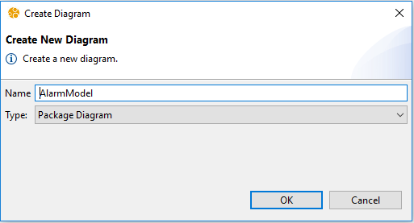  
	3. Select *OK* on the *Create Diagram* dialog.

4. **Create AADL Types**  
	Add AADL types to the model by editing the AlarmModel package diagram:  
	1. Expand the *Classifiers* section in the palette.
	2. Select *Device Type*.  
  
	3. Click inside the AlarmModel package diagram element, the device will appear on the diagram.
	4. Rename the new device type (See @sec:renaming).
		1. Select the device type diagram element.  
  
		2. Select the name label, a editable field will appear.  
  
		3. Enter: "Alarm".
		4. Press the *Enter* key.
	5. Repeat the previous steps with the appropriate palette entries to create the following types:
		1. Device type named "DoorSensor".
		2. Data type named "SensorData".
		3. System type named "Controller".  
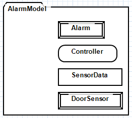  

5. **Create a system type and implementation.**
	1. Using the *System Implementation* item from the palette, create a system implementation for the security system. The *Create Component Implementation* dialog will appear.
	2. Enter the implementation's identifier: "Impl".
	3. Select *New Component Type*.
	4. Enter the type's identifier: "SecuritySystem".  
  
	5. Right-click the diagram and select *Layout->Layout Diagram* for easier viewing (See @sec:diagram_layout and @sec:layout_preferences).
	
6. **Open Diagram for the Security System Implementation**
	1. Right-click *SecuritySystem.Impl*.
	2. Select *Open->Implementation Diagram*, a *Create New Diagram?* dialog will appear.
	3. Select *Yes*, a *Create Diagram* dialog will appear.
	4. Select *OK*.

7. **Create Subcomponents**
	1. Create a device subcomponent using the palette and rename it to "DoorSensor".
	2. Double click the *DoorSensor* subcomponent to open the *Properties* view (See @sec:properties_view).
	3. Select the *AADL* tab in the *Properties* view.  
  
	4. In the *Classifier* section, select *Choose...*, a *Select a classifier.* dialog will appear.
	5. Select *AlarmModel::DoorSensor*.  
  
	6. Select *OK*.
	7. Repeat the previous steps for create the following subcomponents:
		1. Device subcomponent named *Alarm*, Classifier: *AlarmModel::Alarm*.
		2. System subcomponent named *Controller*, Classifier: *AlarmModel::Controller*.  

  
8. **Create Features**
	1. Use the palette to create a data Port named "DataOut" in *DoorSensor*.
	2. Use the *AADL* section in the *Properties* view to:
		1. Set *DataOut* to *Output*.
		2. Set the classifier to *AlarmModel::SensorData*
	3. Create an input data port named "DataIn" in *Controller* and set the classifier to *AlarmModel::SensorData*.
	4. Create two additional output event ports, "TriggerPortOut" and "SilencePortOut" in *Controller*.
	5. Create two additional input event ports, "TriggerPortIn" and "SilencePortIn" in *Alarm*.

	
9. **Create Connections**
	1. Select *Port Connection* from the palette.
	2. Select the connection source, *DoorSensor.DataOut*.
	3. Select the connection destination, *Controller.DataIn*.
	4. Right-click the connection in the *Outline* view.
	5. Select *Rename...*, the *Rename* dialog will appear.
	6. Enter *SensorDataConnection*
	7. Select *OK*.
	8. Repeat the previous steps to create the following connections:
		1. Port connection named "TriggerPortConnection", with Source: *Controller.TriggerPortOut* and Destination: *Controller.TriggerPortIn*.
		2. Port connection named "SilencePortConnection", with Source: *Alarm.TriggerPortOut* and Destination: *Alarm.TriggerPortIn*.

# Tutorial: Advanced
This tutorial will show more advanced features of the graphical editor.  These features include binding configuration and visualization, setting and viewing AADL properties, and system instantiation. In this tutorial we will create a simple climate control system which controls an actuator based on the state of two temperature sensors. Our model will be divided into execution platform components and software components.

See @sec:getting_started for an introduction to the basics.

Start by creating an AADL project named "ClimateControl".

## Define the Execution Platform
We will begin by defining the execution platform. The execution platform will consist of a two sensors, an actuator, a CPU, and an Ethernet network.

  

1. **Create a new AADL Package**  
	Start by creating a new package named "Hardware" and open with diagram editor.

2. **Create Classifiers**
	1. Create a bus type named "Ethernet".  
	2. Create a device type named "EthernetSwitch".
		1. Create Features:
			1. Requires bus access named "Eth1".
			2. Requires bus access named "Eth2".
			3. Requires bus access named "Eth3".
			4. Requires bus access named "Eth4".
		2. Set the classifier of the four bus access features to *Hardware::Ethernet*.  
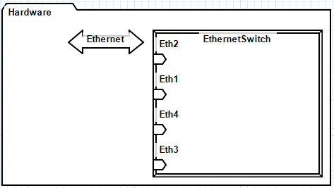  
	3. Create a device type named "Sensor" that contains:
		1. Requires bus access named "Eth" with classifier set to *Hardware::Ethernet*.
		2. Output data port named "Sensor".  
		  
	4. Create a device type named "Actuator" that contains:
		1. Requires bus access named "Eth" with classifier set to *Hardware::Ethernet*.
		2. Input data port named "Command".  
		  
	5. Create a processor type named "CPU" that contains a requires bus access named "Eth" with classifier set to *Hardware::Ethernet*.  
	  
	6. Create a system and system implementation named "ExecutionPlatform" and "ExecutionPlatform.Impl", respectively, that contains:
		1. Input data port named "Command".
		2. Output data port named "Sensor1".
		3. Output data port named "Sensor2".  

		
3. **Set AADL Properties**
	AADL properties can be assigned to model elements using the *AADL Property Values* view while editing a diagram in the same way it can be used when using the textual editor. 
	1. Select *Window->Show View-> AADL Property Values*.
	2. Select *Show undefined properties* in the view menu.
	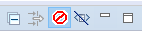  
	3. Select the *Ethernet* diagram element.
	4. Right-click *SEI::BandWidthCapacity*
	5. Select *Create Local Property Association*.
	6. Enter "100.0 MBytesps".  
	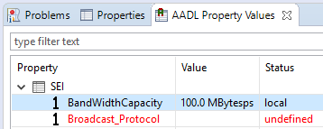  
	
4. **Show AADL Properties on Diagrams**
	AADL properties can be shown on the diagram.
	1. Right-click *Ethernet* diagram element.
	2. Select *Configure Diagram...*, the dialog will appear.
	3. Select *Add...* in the *AADL Properties* section.
	4. Select *SEI->BandWidthCapacity*.
	5. Select *OK*.
	
5. **Open Implementation Diagram**	
	Open the *ExecutionPlatform.Impl* implementation diagram.

6. **Create Subcomponents**
	1. Create a processor named "CPU" with classifier set to *Hardware::CPU*.
	2. Create a device named "TempSensor1" with classifier set to *Hardware::Sensor*.
	3. Create a device named "TempSensor2" with classifier set to *Hardware::Sensor*.
	4. Create a device named "Actuator" with classifier set to *Hardware::Actuator*.
	5. Create four buses named "Sensor1Ethernet", "Sensor2Ethernet", "ActuatorEthernet", and "CPUEthernet". Set their classifiers to *Hardware::Ethernet*.
	6. Create a device named "EthernetSwitch" with classifier set to *Hardware::EthernetSwitch*.  
	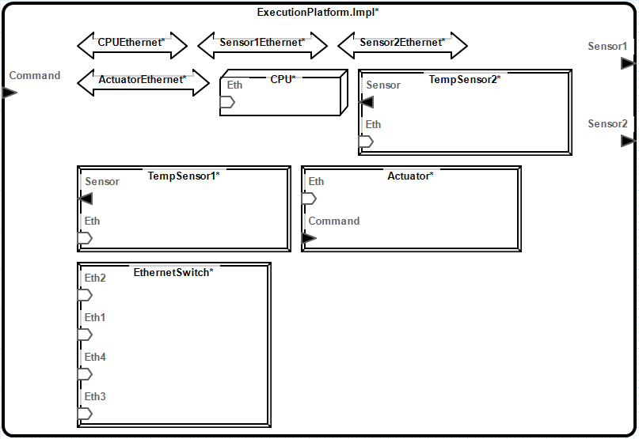  

7. **Create Connections**
	1. Create access connections:
		1. CPUEthernet -> EthernetSwitch.Eth1 named "CpuEth1".
		2. CPUEthernet -> CPU.Eth named "CpuEth2".		
		3. Sensor1Ethernet -> EthernetSwitch.Eth2 named "Sensor1Eth1".
		4. Sensor1Ethernet -> TempSensor1.Eth named "Sensor1Eth2".
		5. Sensor2Ethernet -> EthernetSwtich.Eth3 named "Sensor2Eth1".
		6. Sensor2Ethernet -> TempSensor2.Eth named "Sensor2Eth2".
		7. ActuatorEthernet -> EthernetSwitch.Eth4 named "ActuatorEth1".
		8. ActuatorEthernet -> Actuator.Eth named "ActuatorEth2".  
		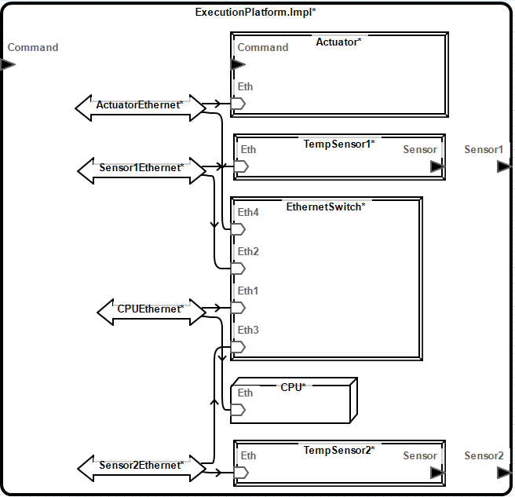  
	2. Create port connections:
		1. ExecutionPlatform.Impl.Command -> Actuator.Command.
		2. TempSensor1.Sensor -> ExecutionPlatform.Impl.Sensor1
		3. TempSensor2.Sensor -> ExecutionPlatform.Impl.Sensor2
		  
		
## Define the Application
Next, we will model the software application. The application will consist of two processes. One process will process data from both sensors and produce a single output. The other process will be responsible for sending commands to the actuator.

1. **Create Package**  
	Create a package named "Software" and open with diagram editor.

2. **Create Classifiers**
	1. Create a thread type named "ProcessData" that contains:
		1. Input data port named "DataIn".
		2. Output data port named "DataOut".  
			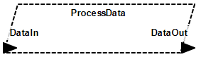
	2. Create a thread type named "ReadData" that contains:
		1. Input data port named "Sensor1DataIn".
		2. Input data port named "Sensor2DataIn".
		2. Output data port named "DataOut".  
		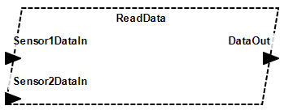  
	2. Create a process type and implementation named "Controller" and "Controller.Impl", respectively, that contains:
		1. Input data port named "ControllerIn".
		2. Output data port named ""ControllerOut".
		3. Thread named "ProduceCommand" with classifier set to *Software::ProcessData*.
		4. Right-click *Controller.Impl.ProduceCommand* and select *Show->Features->All*.
		5. Port connection: *Controller.Impl.Controller* -> *ProduceCommand.DataIn*.
		6. Port connection: *ProduceCommand.DataOut* -> *Controller.Impl.Command*.
				  
	4. Create a process type and implementation named "Fuser" and "Fuser.Impl", respectively, that contains:
		1. Input data port named "Sensor1".
		2. Input data port named "Sensor2".
		3. Output data port named "Fused".
		4. Thread named "ReadSensors" with classifier set to *Software::ReadData*.
		5. Port connection: *Fuser.Impl.Sensor1* -> *ReadSensors.Sensor1*.
		6. Port connection: *Fuser.Impl.Sensor2* -> *ReadSensors.Sensor2*.
		7. Port connection: *ReadSensors.DataOut* -> *Fuser.Impl.Fused*.
		  
	5. Create a system type and implementation named "Application" and "Application.Impl", respectively, that contains:
		1. Two input data ports named "Sensor1" and "Sensor2".
		2. Output data port named "Command".  
		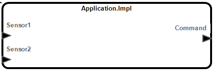
		
3. **Create Subcomponents and Connections**
	1. Start by opening the implementation diagram for *Application.Impl*. Although we can continue editing classifiers from the package diagram, editing classifiers using a structure diagram results in simpler diagrams.
	2. Create a process named "Fuser" with classifier set to *Software::Fuser.Impl*.
	3. Create a process named "Controller" with classifier set to *Software::Controller.Impl*.
	4. Create port connections:
		1. *Application.Impl.Sensor1* -> *Fuser.Sensor1*.
		2. *Application.Impl.Sensor2* -> *Fuser.Sensor2*.
		3. *Fuser.Fused* -> *Controller.Controller*.
		4. *Controller.Command* -> *Application.Command*.
		

## Define the Integrated System
Now that we will define an integrated system which contains both the execution platform and the software application. Then we will bind the application to the CPU. 
		
1. **Create Package**  
	Create a package named "Integration" and open with diagram editor.

2. **Create System Classifiers**  
	Create a system type and implementation named "ControlSystem" and "ControlSystem.Impl", respectively, that contains:  
	1. System named "ExecutionPlatform" with classifier set to *Hardware::ExecutionPlatform.Impl*.
	2. System named "Application" with classifier set to *Software::Application.Impl*.
	3. Port connection: *Application.Command* -> *ExecutionPlatform.Command*.
	4. Port connection: *ExecutionPlatform.Sensor1* -> *Application.Sensor1*.
	5. Port connection: *ExecutionPlatform.Sensor2* -> *Application.Sensor2*.
	

3. **Create Processor Binding** (See @sec:bindings)
	1. Right-click *ExecutionPlaform* diagram element.
	2. Select *Show->Subcomponents->Processors*.
	3. Select *Application* diagram element.
	4. Select *Bind...* from the toolbar.
	5. Select *Actual_Processor_Binding*.
	6. Select *CPU* in the diagram or outline view.
	7. Select *OK*.
	
4. **Create a Processor Binding Diagram**
	A *Processor Binding Diagram* is a type of diagram which is preconfigured to visualize the bindings. For more information about diagram types, see section @sec:diagram_types. Create the diagram using the following steps.
	1. Right-click *ControlSystem.Impl*.
	2. Select *Open->New Diagram...*.
	3. Select *Processor Binding Diagram* from the drop-down.  
		  
	4. Select *OK*. A new *Processor Binding Diagram* is created. The binding between the CPU and the application is shown. In the case of our system, the binding is not very interesting. However, this type of diagram is helpful when visualizing the bindings of a system with multiple processors.

## Instantiate System
1. Right-click *ControlSystem.Impl*.
2. Select *Instantiate*. Now that the system is instantiated, analysis can now be executed on the instance model. Depending on the desired analysis, additional properties may be needed.
	
# Creating Model Elements
Most elements are created by selecting the desired element from the palette and placing it on the diagram.

## Creating Classifier Implementations
Select the desired implementation from the palette and place it on the diagram or on an eligible type.

## Creating Mode Transitions
Select *Mode Transition* from the palette and select the starting mode then the ending mode.

## Creating Flow Implementations and End-To-End Flow Specifications
Flow implementations and end-to-end flow specifications can be created graphically by selecting the *Create Flow Implementation* and *Create End-To-End Flow Specification* tools from the toolbar and following the prompts to select a series of elements from the diagram or outline view.  The tools cannot be activated if there are existing errors or warnings in the model.  The dialog and colors of elements in the diagram will update as valid selections are made. The starting flow specification will be highlighted dark orange and flow elements will be highlighted purple. The *Undo* button will remove the elements in the order they were selected.

### Creating Flow Implementations
Select *Create Flow Implementation* from the toolbar, the dialog will appear. 

### Creating Source Flow Implementations
1. Select a source flow specification and feature.

2. Select a valid subcomponent flow specification, subcomponent, or data access.

3. Select valid flow segments leading to the source flow specification. Optionally, select modes or mode transitions.

4. Select *OK* when done.

### Creating Sink Flow Implementations
1. Select a valid sink flow specification and feature.

2. Select a valid connection.

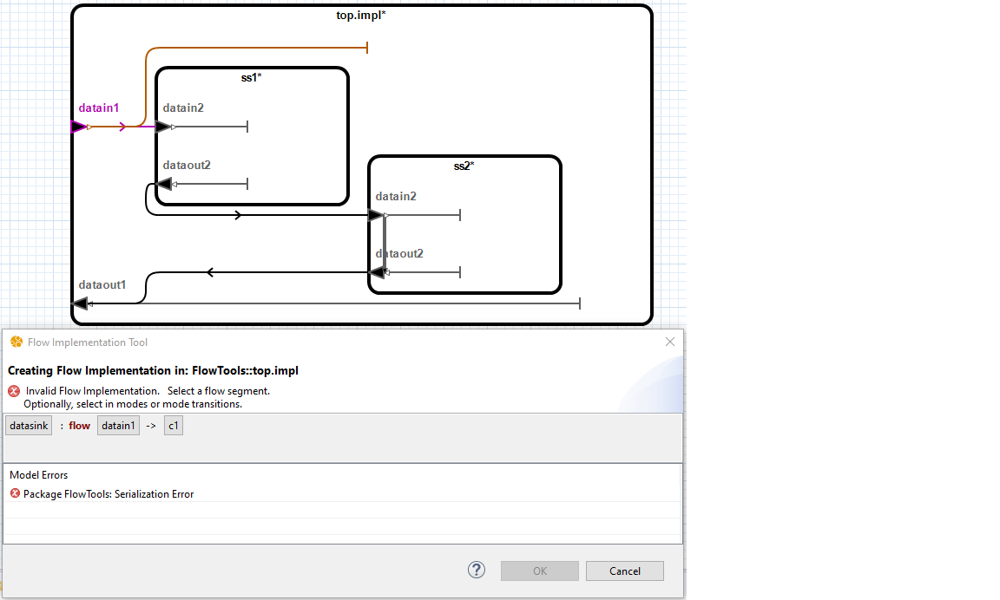

3. Select valid flow segments leading to the end subcomponent flow. Optionally, select modes or mode transitions.

4. Select *OK* when done.

### Creating Path Flow Implementations
1. Select a valid path flow specification and feature.

2. Select a valid connection.

3. Select valid flow segments leading to the path flow specification's out flow end. Optionally, select modes or mode transitions.

4. Select *OK* when done.

### Creating End-To-End Flow Specifications
Select *Create End-To-End Flow Specification* from the toolbar, the dialog will appear. 

1. Select a valid subcomponent source flow specification.

2. Select a valid connection.

3. Select valid flow segments. Optionally, select modes or mode transitions.

4. Specify a name for the End-To-End Flow Specification and select *OK* when done.

## Creating Subprogram Call Sequences{#sec:subprogram_call_seq}
When viewing a thread implementation diagram, subprogram call sequences can be created.

1. Select *Subprogram Call Sequence* from the palette and select inside the thread implementation diagram.
2. In the *Select Subprogram* dialog, select desired type and subprogram component.

3. Select *OK*. The new call sequence will appear.

### Adding Subprogram Calls
When viewing a thread implementation diagram that contains a subprogram call sequence, a subprogram call can be added to the sequence.

1. Select *Subprogram Call* from the palette and select inside the subprogram call sequence diagram.
1. In the *Select Subprogram* dialog, select desired type and subprogram component.
1. Select *OK*. The new subprogram call will appear.

# Editing Model Elements

## Properties View{#sec:properties_view}
The properties sheet contains properties for the currently selected diagram elements. The properties sheet can be opened by 
double-clicking on a diagram element in the diagram or in the outline. Alternatively, the properties sheet can be opened by 
right-clicking on a diagram element in the diagram or outline and selecting *Properties…* from the context menu.

## Renaming{#sec:renaming}
Elements can be renamed three ways:

1. Right click an element in the *Outline* view select *Rename…* from the context menu.
2. Right click an element on the diagram and select *Rename…* from the context menu.
3. Select an element on the diagram, then click and hover over the label.

## Deleting
Elements can be deleted three ways:

1. Right click an element in the *Outline* view select *Delete* from the context menu.
2. Right click an element on the diagram and select *Delete* from the context menu.
3. Selecting an element on the diagram and press the *Delete* key.

## Indirect Editing
To allow for easier editing, the editor allows editing classifiers in the context of related model elements. For example, a data port may 
be created inside a component implementation. Since AADL component implementations cannot contain data ports, the data port will be 
created inside the component implementation's type (See @sec:inherited_elements). In cases where there are multiple potential classifiers to edit, the editor will prompt to select a classifier.

## Setting the Initial Mode
A mode can be designated as the initial mode by using the *AADL* tab of the *Properties* view (See @sec:properties_view), and using the *Initial* section option.

## Arrays
A mode can be designated as the initial mode by using the *AADL* tab of the *Properties* view (See @sec:properties_view), and using the *Dimensions* section options.

|Menu Item                | Description                              |
|------------------|------------------------------------------|
| *Add* 					| Shows the *Modify Dimension* dialog to create a dimension. |
| *Modify...*                  | Shows the *Modify Dimension* dialog to make modifications to the selected dimension. |
| *Delete*                 | Deletes the selected dimension. |
| *Up* and *Down*                 | Changes the order of the dimensions. |

## Bindings{#sec:bindings}
When viewing a component implementation diagram, a binding property associations can be created using the toolbar.

## Prototypes
Prototypes can be edited by selecting a classifier and using the *AADL* tab of the *Properties* view (See @sec:properties_view).

Classifier prototype bindings can be edited using the *AADL* tab of the *Properties* view (See @sec:properties_view). Subcomponent prototype bindings can be edited when selecting the component classifier.

## Editing Flow Implementations and End-to-End Flows
Flow implementations and end-to-end flow can be edited using the flow editor.  The flow editor can be accessed by double-clicking a component implementation, selecting the *AADL* tab in the *Properties* view, and selecting *Edit...* from the *Flows* section.

## Refining Model Elements
Appropriate elements can be refined by using the *AADL* tab of the *Properties* view (See @sec:properties_view), and using the *Refined* section option.

## Specifying Modes in which Elements are Active {#sec:edit_in_modes}
The modes in which the selected elements are active can be specified selecting the *AADL* tab of the *Properties* view (See @sec:properties_view), and using the *In Modes* section options.

## Editing Subprogram Call Sequences
The subprogram call's order in the subprogram call sequence (See @sec:subprogram_call_seq) can be changed from the *AADL* tab of the *Properties* view (See @sec:properties_view), and using the *Call Order* section options.

## Extending

## Selecting a Diagram Element's Container
To select a diagram element's container, right click on the child element and select *Select Container* from the context menu.

## Selecting All Connections
All connections can be selected by selecting *Edit->Select All Connections*.

# Instantiating{#sec:instantiating}
Component implementations can be instantiated by right-clicking the implementation on the diagram or *Outline* view and selecting *Instantiate* from the context menu. The instance model will be created in that projects *instances* folder in the AADL Navigator.

# Copying and Pasting
Portions of a diagram can by copied and pasted using the menu items described in @tbl:copy_and_paste_menu_items.

|Menu Item                | Description                              |
|------------------|------------------------------------------|
| *Copy*                  | Copies the selected diagram elements along with the associated model elements. |
| *Copy Diagram Elements* | Copies the diagram elements without copying the associated model elements. Pasting will create a diagram element for each copied diagram element for which the selected diagram element has a matching child model element. Useful for copying diagram element layout to another diagram.|
| *Paste*                 | Pastes the previously copied content into the selected diagram element. |
 
Table: Copy and Paste Menu Items {#tbl:copy_and_paste_menu_items}

# Diagram Configuration{#sec:diagram_configuration}
Configuring a diagram allows customizing the contents of the diagram (See @sec:hidden_children). To configure a diagram, right-click in the diagram or an element in the *Outline* view and select *Configure Diagram…*. The diagram configuration dialog allows selecting which elements should appear in the diagram.

The diagram configuration dialog also allows selecting which AADL properties will be included in the diagram. The communication_properties::timing property is implicitly enabled and is represented by specialized graphical indicators. Delayed connections have a double bar indicator in the middle. Immediate connections have a double arrow in the middle.

Connections which are manually enabled will be removed if the connection ends are not also included in the diagram. Connections that have one connection end visible on the diagram are represented as abstracted connections. (See @sec:abstracted_connections) 

The Hide Connection Labels option can be used to set the default visibility of labels for connections between diagram elements. Label visibility for individual elements can be controlled using the properties view described in section 3.1.16.

## Diagram Types{#sec:diagram_types}
When creating a diagram, a type must be specified. A diagram's type determines the default contents of elements added to a diagram. The contents of elements are not updated as new elements are added to the model. The diagram type also determines which AADL properties are enabled by default. All diagram types are equally customizable. 

+-------------------+----------------------------------------------------------+-------------------------------------------------------------------------+--------------------------------------------------+
| Diagram Type      | Availability                                             | Default Contents                                                        | Properties                                       |
+===================+==========================================================+=========================================================================+==================================================+
| Custom            | Packages, Classifiers, System Instances, and Contextless | None                                                                    | None                                             |
+-------------------+----------------------------------------------------------+-------------------------------------------------------------------------+--------------------------------------------------+
| Package           | Packages, Contextless                                    | - Packages:  Classifiers                                                | None                                             |
|                   |                                                          | - Classifiers: Generalizations                                          |                                                  |
+-------------------+----------------------------------------------------------+-------------------------------------------------------------------------+--------------------------------------------------+
| Structure         | Classifiers and System Instances                         |- Classifiers: Features, Connections, Flow Specifications, Subcomponents | None                                             |
|                   |                                                          |- Subcomponents: Features, Connections, and Flow Specifications          |                                                  |
+-------------------+----------------------------------------------------------+-------------------------------------------------------------------------+--------------------------------------------------+
| Mode              | Component Classifiers                                    | - Classifiers: Modes and Mode Transitions                               | None                                             |
+-------------------+----------------------------------------------------------+-------------------------------------------------------------------------+--------------------------------------------------+
| Processor Binding | Component Implementation and System Instances            | - Classifiers: Systems, Processors, Virtual Processors,                 | Deployment_Properties::&#8203;Actual_Processor_Binding  |
|                   |                                                          | - Devices, Threads, Thread Groups, and Processes                        |                                                  |
+-------------------+----------------------------------------------------------+-------------------------------------------------------------------------+--------------------------------------------------+

Table: Diagram Types {#tbl:diagram_types}

## Showing and Hiding Diagram Elements
Menu options available in a diagram element's context menu can be used to show and hide contents of a selected element. Access the context menu by right-clicking on a diagram element in the diagram or in the outline.

|Menu Option                   | Description                                                                                    |
|------------------------------|------------------------------------------------------------------------------------------------|
| *Configure Diagram...*       | Opens the *Configure Diagram* dialog to allow customizing the contents of the current diagram. |
| *Show* (Outline Only)        | Adds the selected elements to the diagram.                                                     |
| *Show Contents -> All*       | Adds all available children to the selected elements.                                          |
| *Show Contents -> Default*   | Adds default set of children to the selected elements based on the diagram type.               |
| *Show Contents -> `<Subset>`*  | Adds a subset of children to the selected elements.                                          |
| *Hide*                       | Removes the selected element from the diagram.                                                 |
| *Hide Contents -> All*       | Removes all children from the selected elements.                                               |
| *Hide Contents -> `<Subset>`*  | Removes a subset of children from the selected elements.                                     |
 

Table: Menu Items for Showing and Hiding Elements {#tbl:show_hide_menu_items}

## Displaying Hidden Elements in Outline
By default, the *Outline* view shows hidden elements. Hidden elements are those which are not currently included in the diagram. Hidden elements are greyed out in the outline. Whether hidden elements are shown in the *Outline* view can be toggled using the *Show Hidden Elements* menu item in the view menu (). When displayed, hidden elements can be added to the diagram using the *Show* menu item which is available in the context menu.

## Showing Connected Elements
Elements that are directly connected to a subcomponent or feature can be shown by right-clicking on the subcomponent or feature and selecting *Show Connected Elements* from the context menu.

# Visualization
The following sections describe the diagram visualization capabilities of the graphical editor.

## Inherited Elements{#sec:inherited_elements}
Elements which are inherited from another model element have a gray color. This indicates that any changes made to the 
model element will result in a change to model element other than the one in which it is contained in graphically.

## Customizing an Element's Appearance{#sec:de_apperance}
The appearance of diagram elements can be edited by using the *Appearance* tab of the *Properties* view (See @sec:properties_view).
	- The *Label Visibility* option allows hiding or showing the diagram element's label.
	- Font size can be edited by selecting the font size drop-down menu.
	- Line width can be edited by selecting the line width drop-down menu.
	- Elements can be displayed as an image by selecting the set image button, selecting *Select…*, and then selecting the desired image. Only images contained in referenced projects may be selected. To reference other projects, edit the project's properties. Whether an element is displayed as an image or using standard notation can be toggled by selecting the *Show as Image* check box.  The editor supports the following image file types: bmp, png, jpg, gif.
	- Outline color can be edited by clicking the outline button and selecting the desired color.
	- Font color can be edited by clicking the font color button and selecting the desired color.
	- Background color can be edited by clicking the background color button and selecting the desired color.

## Hidden Children{#sec:hidden_children}
Diagram elements which have children that are hidden have an asterisk appended to their labels.

## Abstracted Connections{#sec:abstracted_connections}
In some cases a connection between diagram elements will be represented by a dotted connection. This indicates that the connection is an abstraction of one or more AADL model elements. A tooltip will provide additional information about the abstracted model elements. Cases in which this occurs are listed below.

- An AADL connection between subcomponents where one or more of the referenced features are hidden.
- A flow specification which references a hidden feature which is contained in a feature group.
- An AADL property reference value for which the model element to which the property value applies is hidden.
- An AADL property reference value for which the referenced model element is hidden.

## Highlighting Flow Implementations and End-to-End Flow Specifications
Selecting a Flow Implementation or End-to-End Flow specification from the flow drop-down in the toolbar will highlight the flow.

## Showing Flow Implementation and End-to-End Flow Specification Segments
Selecting the "Show" button on the toolbar shows the missing flow segments of the currently selected flow drop-down Flow Implementation or End-to-End Flow when the the flow contains segments which are missing from the diagram.

## Highlighting In Mode Elements
Selecting a Mode or Mode Transition from the mode drop-down in the toolbar will highlight the in mode elements in the diagram.

## Showing In Mode Elements
Right clicking a Mode or Mode Transition and selecting the "Show In Mode Elements" will show the elements within the mode's container which are active in the selected mode.

## Moving Shapes Using Arrow Keys
1. Select the element to be moved.

2. Press the **.** key.

3. Using the *Arrow* keys, move the element to desired location.

4. Press the *Enter* key.

## Restore Missing Diagram Elements{#sec:restore_missing_diagram_elements}
If a a model element is renamed from the AADL text editor without using the *Rename Element* menu option, the diagram element may disappear from diagrams in which it appears. In such cases it is possible to restore the diagram elements using the following steps. Note: if the diagram is saved after the diagram elements disappears, it will not be possible to restore the missing diagram elements.

1. Select *Edit->Restore Missing Diagram Elements*. A window containing diagram elements which have been removed from the diagram because the associated model element is missing will appear.
2. Update the desired model references in the *New Reference* column.
3. Select OK. The diagram elements will be restored.

# Navigating Between Diagrams
The graphical editor supports several methods for navigating between diagrams.

## Creating a New Diagram
Diagrams may be associated with an existing model element such as an AADL package or classifier. Diagrams which are not associated with a specific model element may also be created. Such diagrams are referred to as contextless diagrams and may contain multiple AADL packages. An AADL model element may have multiple diagrams associated it.

## Opening Diagrams
Diagrams can be opened by right clicking on the AADL diagram in the *AADL Navigator* view and selecting *Open* from the context menu.

### AADL Element Related Diagrams
Diagrams that are related to an element can be opened by right clicking the desired element from the *Outline* view and using the *Open* sub-menu of the context menu.

### AADL Instance Model Diagrams
Instance model diagrams (See @sec:instantiating) can be opened by right clicking on the AADL instance model in the *AADL Navigator* view and selecting *Open Diagram* from the context menu. The instance model may not be modified using the graphical editor.

## Diagrams View
The *AADL Diagrams* view shows the diagrams contained in the workspace. To open the *AADL Diagrams* view:

1. Select *Windows->Show View->Other…* from the top-level menu. The *Show View* window will appear.
2. Select *AADL/AADL Diagrams*.
3. Select *Open*. The *AADL Diagrams* view will be opened.

By default, the *AADL Diagrams* view will group diagrams by the diagram type and the diagram's context. Grouping can be customized using the *Group By Type* and *Group by Context* options in the view menu () for the *AADL Diagrams* view. Selecting *Show Decorations* from the view menu will toggle display of the context and type for diagrams which are not grouped.

## Diagram Context Adjustment
Diagrams are associated with model elements. Moving a model element between packages or renaming it or any of its containers from the AADL text editor without using the *Rename Element* menu option will break its association with diagrams. 

When opening a diagram, the *Missing Diagram Context* dialog will appear if the graphical editor is unable to find the model element associated with a diagram for any reason. If the element has been previously renamed, select the new name for the element and select *OK*.

# Diagram Layout{#sec:diagram_layout}
The following sections describe the diagram layout capabilities of the graphical editor.

## Layout Commands

Layout menu items are available from the *Edit->Layout* menu or by right clicking on the diagram or diagram element and using the *Layout* sub-menu. The behavior of the layout menu items are described in @tbl:layout_menu_items.

|Menu Option | Description|
|--------------------|--------------------------------------------------|
| *Layout Diagram* | Repositions and resizes the contents of the entire diagram. |
| *Layout Contents* | Repositions and resizes the contents of the selected element(s). |
| *Align Left* | Aligns the left of all selected elements with that of the primary selection. |
| *Align Center* | Aligns the horizontal center of all selected elements with that of the primary selection. |
| *Align Right* | Aligns the right of all selected elements with that of the primary selection. |
| *Align Top* | Aligns the top of all selected elements with that of the primary selection. |
| *Align Middle* | Aligns the vertical center of all selected elements with that of the primary selection. |
| *Align Bottom* | Aligns the bottom of all selected elements with that of the primary selection. |
| *Distribute Shapes Horizontally* | Moves the selected elements to produce equal horizontal spacing. |
| *Distribute Shapes Vertically* | Moves the selected elements to produce equal vertical spacing. |
| *Arrange in Grid* | Arranges the selected elements into a grid. |
| *Arrange in Circle* | Arranges the selected elements into a circle. |
| *Match Width* | Adjusts the width of all selected elements to match that of the primary selection. |
| *Match Height* | Adjusts the height of all selected elements to match that of the primary selection. |
| *Match Size* | Adjusts the width and height of all selected elements to match that of the primary selection. |
| *Remove Bendpoints* | Removes all bendpoints from the selected connections. | 

Table: Layout Menu Items {#tbl:layout_menu_items}

## Layout Preferences{#sec:layout_preferences}
The preferences dialog contains preferences which affect the layout behavior of the graphical editor. To edit layout preferences:

1. Select *Window->Preferences*

2. Select *OSATE->AADL Diagram Editor*

3. Modify the preferences as desired.

## Incremental Layout
When an element has been added to the diagram and needs to be positioned or sized, an incremental layout is performed. The behavior of the incremental layout can be configured by selecting a mode from the preferences dialog. From the preferences dialog select the desired *Incremental Layout Mode*. The modes are described in @tbl:incremental_layout_modes.

|Mode| Description|
|-------|--------------------------------------------------|
| *Diagram* | Each time the editor needs to position or size an element, a layout will be performed on the entire diagram. User adjustments to the diagram layout will be replaced. This reduces the amount of user control over the layout.|
| *Container* | When an element is found that has neither a size or position, a layout is performed on the diagram element's container. Any manual layout information in the diagram element's container will be replaced. If the shape is created and positioned using the palette, the layout will only be performed on the contents of the new element. If a connection is created using the palette, the layout will be performed on the connection's container. |
| *Contents* | This is the default setting. A layout is performed on the contents of any element which does not have a size or position. This option is the least disruptive to the existing layout. However, new elements may overlap with existing elements. The *Layout Contents* menu item can be used to manually layout the contents of a container as needed. If a feature is added, it will be positioned after other features on the appropriate edge. If none of the siblings of an element have a position or size, then the layout will be performed on the container instead. This is done to provide a better layout in cases when an element does not have a user specified layout. |

Table: Incremental Layout Modes {#tbl:incremental_layout_modes}

## Layout Feature Based on Direction
When the *Layout Features Based on Direction* preference is enabled, the graphical editor will position ports based on the feature's direction. Input features will be placed on the left side and output features will be placed on the right side. If the preference is disabled, the layout algorithm will decide the side on which to place the feature.

## Known Layout Issues and Limitations
* Connections between multiple levels of the diagram hierarchy are not automatically routed and must be routed manually. Such connections usually represent property values such as bindings.
* Mode transition triggers are not routed. The recommended workaround is to show the mode transition triggers as text labels.
* The automatic layout for flow path may produce unexpected routing and label placement for the flow path. To workaround this issue, it is recommended to disable labels for flow paths.	

# Annotations and Documentation
The following sections describe the graphical editors support for annotations and AADL documentation.

## Annotations
Diagrams can be annotated using the tools available in the *Annotation* section of the palette. The *Note* option allows adding text notes to the diagram. Notes are part of the diagram and are not part of the AADL model. The *Note Reference* option can be used to associate a note with another element in the diagram.

## AADL Documentation
AADL comments which begin with an extra hyphen are displayed by the diagram editor. They are displayed in the tooltips for the corresponding diagram element. Such comments are also displayed in the *Documentation* section of the *Properties* view. They cannot be modified using the graphical editor.

# Troubleshooting
The following section contains solutions to known issues as well as instructions for reporting problems with the graphical editor.

## Undo/Redo is Unavailable After Opening or Closing AADL Source Files
After opening or closing AADL source files, the undo and redo commands in the graphical editor are disabled. To workaround, either open the AADL source files before making changes or undo or redo operations as necessary before opening AADL source files.

## Build Automatically
*Project->Build Automatically* must be enabled.  If it is not enabled, the graphical editor will not function properly.

## Inconsistent Font Sizes Across Machines
To ensure diagrams have a consistent appearance across machines, the graphical editor attempts to produce consistent text sizes regardless of system settings. However, due to limitations in the underlying libraries on which the graphical editor relies, this is not always possible. On windows systems, the graphical editor produces consistent font sizes at 100%, 125%, and 200% system text scaling levels.

## Missing Diagram Elements After Modification of AADL Source
See @sec:restore_missing_diagram_elements.

## Reporting Issues
Issues should be reported using the [OSATE Issue Tracker](https://github.com/osate/osate2/issues){target="_blank"}.

# Notices
Development of portions of the OSATE Graphical Editor was sponsored by the Government of the United States under Contract Number FA8702-15-D-0002.

The view, opinions, and/or filings contained in this material are those of the author(s) and should not be construed as an official position, policy, or decision of the Government of the United States or Carnegie Mellon University or the Software Engineering Institute, unless designated by other documentation.
