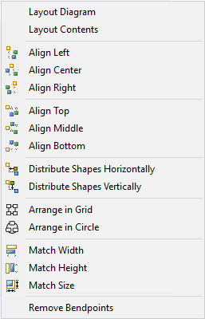
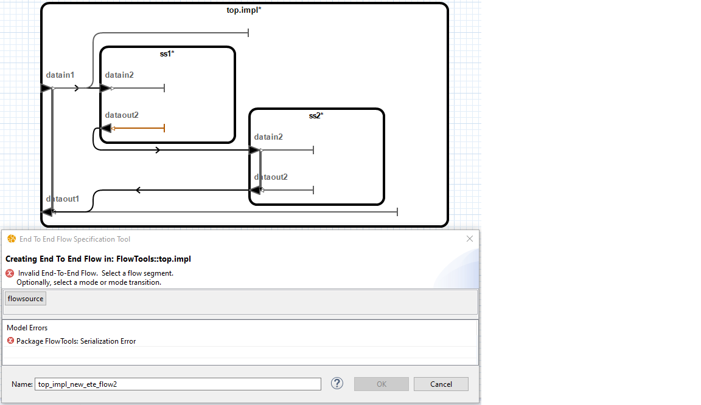

# Getting Started
The OSATE Graphical Editor allows viewing and manipulating AADL declarative models in a graphical way.

## Creating a New Diagram
The OSATE Graphical Editor allow creating AADL Diagrams. Diagrams may be associated with an existing model element such as an AADL package or classifier. Diagrams which are not associated with a specific model element may also be created. Such diagrams are referred to as contextless diagrams and may contain multiple AADL packages. An AADL model element may have multiple diagrams associated it.

### Creating an AADL Diagram using the AADL Diagram Wizard
The AADL Diagram wizard allows creating a new diagram. The created diagram may be associated with a new package or an existing package or classifier. It may also be a contextless diagram. Contextless diagrams are not associated with a specific model element and may be configured to display multiple existing AADL packages. 

1. Select *File->New->Other...*
2. Select *AADL->AADL Diagram*.
3. Select *Next*.
4. Select the context type for the AADL diagram.
5. Select *Next*.
6. Select the project in which to create the diagram.
7. Select *Next*.
8. __*Existing Package* and *Existing Classifier* diagrams only:__ Select the package or classifier which will be the top level model element in the diagram.
9. __*Existing Package* and *Existing Classifier* diagrams only:__ Select Next.
10. Enter a name for the diagram.
11. Select a diagram type.
12. Select *Finish*. The diagram will be created and opened.

### Creating a AADL Diagram from the AADL Diagram Editor
To create a new diagram from the diagram editor, right-click on an AADL package or classifier and select *Open->New Diagram...*.

### Creating a AADL Diagram from the AADL Text Editor
To create a new diagram from the AADL text editor, right-click on an AADL package or classifier and select *Create Diagram...*. 

## Opening a Diagram for an Existing AADL Model Element
An existing AADL model can be opened in the graphical editor. Changes made to either the AADL source or the diagram will be reflected in the other.

1. Open an existing AADL source file.
	
2. Right-click the AADL package or component in the *Outline* view.
	
3. Select *Open Diagram* to open the diagram for the selected classifier. If a classifier is not selected,
   *Open Diagram* opens the package diagram for the selected package. The diagram will be created if one does
   not already exist. The appropriate diagram will appear in the graphical editor.
	
4. You can also use the keyboard shortcut *Ctrl+Shift+V* to switch between the selected element in the
   diagram and the selected element in the source file.
  
# Navigating Between Diagrams
The graphical editor supports several methods for navigating between diagrams.

## Using the AADL Diagrams View
The *AADL Diagrams* view shows the diagrams contained in the workspace. To open the *AADL Diagrams* view:

1. Select *Windows->Show View->Other...* from the top-level menu. The *Show View* window will appear.
2. Select *AADL/AADL Diagrams*.
3. Select *Open*. The *AADL Diagrams* view will be opened.

By default, the *AADL Diagrams* view will group diagrams by the diagram type and the diagram's context. Grouping can be customized using the *Group By Type* and *Group by Context* options in the view menu () for the *AADL Diagrams* view. Selecting *Show Decorations* from the view menu will toggle display of the context and type for diagrams which are not grouped.

## Opening an Associated Diagram
Diagrams associated with a particular element can be opened by right-clicking on the element and selecting *Open->Associated Diagram* from the context menu. 

## Opening an Element's Package Diagram
The diagram associated with an element's package can be opened by right-clicking an element and selecting *Open->Package Diagram* from the context menu.

## Opening the Type Diagram for a Component Implementation or Subcomponent
The diagram for a component implementation's or subcomponent's component type can be opened by right-clicking on an element and selecting *Open->Type Diagram* from the context menu.

## Opening the Implementation Diagram for a Component Implementation or Subcomponent
The diagram for a component instance's or subcomponent's component implementation can be opened by right-clicking on an element and selecting *Open->Implementation Diagram* from the context menu.

## Opening an AADL Instance Model
An AADL instance model can be viewed in the graphical editor. The instance model may not be modified using the graphical editor.

1. Right-click on the AADL instance model in the *AADL Navigator* view.

2. Select *Open Diagram* to open the diagram for the selected component instance. The diagram will be created if one does not already exist.

# Editing AADL Diagrams
The graphical editor allows editing AADL models graphically. As changes are made to the diagram, the AADL model is updated automatically. Additionally, as the textual AADL model is editing using OSATE, the diagram is updated to reflect changes.

## Basics
Many of the operations in the graphical editor apply to multiple types of elements.

### Diagram Types
When creating a diagram, a type must be specified. A diagram's type determines the default filters used by the contents of the diagram. It also determines which AADL properties are enabled by default. All diagram types are equally customizable. A diagram element's filters determines the child elements that are shown on the diagram.

+-------------------+----------------------------------------------------------+-------------------------------------------------------------------------+--------------------------------------------------+
| Diagram Type      | Availability                                             | Default Filters                                                         | Properties                                       |
+===================+==========================================================+=========================================================================+==================================================+
| Custom            | Packages, Classifiers, System Instances, and Contextless | None                                                                    | None                                             |
+-------------------+----------------------------------------------------------+-------------------------------------------------------------------------+--------------------------------------------------+
| Package           | Packages, Contextless                                    | - Packages:  Classifiers                                                | None                                             |
|                   |                                                          | - Classifiers: Generalizations                                          |                                                  |
+-------------------+----------------------------------------------------------+-------------------------------------------------------------------------+--------------------------------------------------+
| Structure         | Classifiers and System Instances                         |- Classifiers: Features, Connections, Flow Specifications, Subcomponents | None                                             |
|                   |                                                          |- Subcomponents: Features, Connections, and Flow Specifications          |                                                  |
+-------------------+----------------------------------------------------------+-------------------------------------------------------------------------+--------------------------------------------------+
| Mode              | Component Classifiers                                    | - Classifiers: Modes and Mode Transitions                               | None                                             |
+-------------------+----------------------------------------------------------+-------------------------------------------------------------------------+--------------------------------------------------+
| Processor Binding | Component Implementation and System Instances            | - Classifiers: Systems, Processors, Virtual Processors,                 | Deployment_Properties::Actual_Processor_Binding  |
|                   |                                                          | - Devices, Threads, Thread Groups, and Processes                        |                                                  |
+-------------------+----------------------------------------------------------+-------------------------------------------------------------------------+--------------------------------------------------+

Table: Diagram Types {#tbl:diagram_types}

### Diagram Configuration
Configuring a diagram allows customizing the contents of the diagram. To configure a diagram, right-click in the diagram and select *Configure Diagram...*. The diagram configuration dialog allows enabling specific diagram elements. A diagram element may be enabled manually or by configuring the content filters for the containing element.

The diagram configuration dialog also allows selecting which AADL properties will be included in the diagram. The *communication_properties::timing* property is implicitly enabled and is represented by specialized graphical indicators. Delayed connections have a double bar indicator in the middle. Immediate connections have a double arrow in the middle.

Connections which are manually enabled will be removed if the connection ends are not also included in the diagram.

The *Hide Connection Labels* option can be used to set the default visibility of labels for connections between diagram elements. Label visibility for individual elements can be controlled using the properties view described in @sec:de_apperance.

### Showing and Hiding Diagram Element Contents
Menu options available in a diagram element's context menu will modify the diagram configuration to show and hide contents of a selected element. Access the context menu by right-clicking on a diagram element and selecting the *Show* menu. The *Show* menu allows toggling the filters enabled by the selected elements. Disabling a filter will not hide elements which been manually enabled.

|Menu Option | Description|
|------------|------------------------|
| *All Filters* | Enables all filters for the selected elements. |
| *Hide All Contents* | Disables all filters and disables all manually enabled elements inside the selected elements. |
| *Reset Manual Descendants* | Disables all manually enabled elements inside the selected elements. |
| *Custom...* | Allows elements to be manually enabled using the *Configure Diagram* dialog. |  

Table: Additional Menu Items in the Show Menu {#tbl:show_hide_menu_items}

### Hidden Children
Diagram elements which have children that are hidden have an asterisk appended to their labels.

### Abstracted Connections
In some cases a connection between diagram elements will be represented by a dotted connection. This indicates that the connection is an abstraction of one or more AADL model elements. A tooltip will provide additional information about the abstracted model elements. Cases in which this occurs are listed below. 

- An AADL connection between subcomponents where one or more of the referenced features are hidden.
- A flow specification which references a hidden feature which is contained in a feature group.
- An AADL property reference value for which the model element to which the property value applies is hidden.
- An AADL property reference value for which the referenced model element is hidden.

### Inherited Elements
Elements which are inherited from another model element have a gray color. This indicates that any changes made to the model element will result in a change to model element other than the one in which it is contained in graphically.

### Indirect Editing
To allow for easier editing, the editor allows editing classifiers in the context of related model elements. For example, a data port may be created inside a component implementation. Since AADL component implementations cannot contain data ports, the data port will be created inside the component implementation's type. In cases where there are multiple potential classifiers to edit, the editor will prompt to select a classifier.

### Editing Properties
The properties sheet contains properties for the currently selected diagram elements. The properties sheet can be opened by double-clicking on a diagram element in the diagram or in the outline. Alternatively, the properties sheet can be opened by right-clicking on a diagram element in the diagram or outline and selecting *Properties...* from the context menu.

### Deleting
An element can be deleted from the AADL model by selecting it and pressing the *Delete* key. An element can also be deleted by right-clicking on it and selecting *Delete* from the context menu.

Elements can only be deleted when viewing the element which contains it. For example, a feature defined in a system type cannot be deleted while editing the diagram of a system implementation.

### Renaming
An element can be renamed using the graphical editor.

1. Select the item to be renamed.

2. Click the name label.  An editable field will appear.

3. Adjust the name as desired.

4. Press the *Enter* key.

Elements can only be renamed when viewing the element which contains it. For example, a feature defined in a system type cannot be renamed while editing the diagram of a system implementation.

When renaming a model element from the AADL text editor, one should use the *Rename Element* menu option. Manually renaming model elements will result in broken linkages between AADL diagrams and the AADL model.

### Refining
Appropriate elements can be refined by double-clicking on the element and select the *AADL* tab of the *Properties* view.  Use the *Refined* section to refine the element.

### Instantiating
When viewing a package diagram, component implementations can be instantiated by right-clicking on them and selecting *Instantiate* from the context menu. The instance model will be created in that projects *instances* folder in the AADL Navigator.

### Moving Shapes Using Arrow Keys
1. Select the item to be moved.

2. Press the **.** key.

3. Using the *Arrow* keys, move the item to desired location.

4. Press the *Enter* key.

### Selecting a Diagram Element's Container
Under some circumstances, it is difficult to select the desired diagram element due to the location of child diagram elements. The desired shape can be selected using the following steps.

1. Right-click on the child of the diagram element to be selected.

2. Select *Select Container* from the context menu.

### Editing a Diagram Element's Appearance{#sec:de_apperance}
The appearance of diagram elements can be edited by using the *Appearance* tab of the *Properties* view.

An element's appearance can be changed using the following steps.

1. Open the *Properties* view by double-clicking on an element or by selecting *Properties...* from the context menu.

2. Select the diagram element(s) to be edited.

3. Select the *Appearance* tab.

4. Select desired appearance options.
	- The *Label Visibility* option allows hiding or showing the diagram element's label.
	- Font size can be edited by selecting the font size drop-down menu.
	- Line width can be edited by selecting the line width drop-down menu.
	- Elements can be displayed as an image by selecting the set image button, selecting *Select...*, and then selecting the desired image. Only images contained in referenced projects may be selected. To reference other projects, edit the project's properties. Whether an element is displayed as an image or using standard notation can be toggled by selecting the *Show as Image* check box.  The editor supports the following image file types: bmp, png, jpg, gif.
	- Outline color can be edited by clicking the outline button and selecting the desired color.
	- Font color can be edited by clicking the font color button and selecting the desired color.
	- Background color can be edited by clicking the background color button and selecting the desired color.

### Diagram Context Adjustment
Diagrams are associated with model elements. Moving a model element between packages or renaming it or any of its containers from the AADL text editor without using the *Rename Element* menu option will break its association with diagrams. 

When opening a diagram, the *Missing Diagram Context* dialog will appear if the graphical editor is unable to find the model element associated with a diagram for any reason. If the element has been previously renamed, select the new name for the element and select *OK*.

### Restore Missing Diagram Elements{#sec:restore_missing_diagram_elements}
If a a model element is renamed from the AADL text editor without using the *Rename Element* menu option, the diagram element may disappear from diagrams in which it appears. In such cases it is possible to restore the diagram elements using the following steps. Note: if the diagram is saved after the diagram elements disappears, it will not be possible to restore the missing diagram elements.

1. Select *Edit->Restore Missing Diagram Elements*. A window containing diagram elements which have been removed from the diagram because the associated model element is missing will appear.
2. Update the desired model references in the *New Reference* column.
3. Select OK. The diagram elements will be restored.

## Diagram Layout
The following sections describe the diagram layout capabilities of the graphical editor.

### Layout Commands

Layout menu items are available from the *Edit->Layout* menu or by right clicking on the diagram or diagram element and using the *Layout* sub-menu. The behavior of the layout menu items are described in @tbl:layout_menu_items.

|Menu Option | Description|
|--------------------|--------------------------------------------------|
| *Layout Diagram* | Repositions and resizes the contents of the entire diagram. |
| *Layout Contents* | Repositions and resizes the contents of the selected element(s). |
| *Align Left* | Aligns the left of all selected elements with that of the primary selection. |
| *Align Center* | Aligns the horizontal center of all selected elements with that of the primary selection. |
| *Align Right* | Aligns the right of all selected elements with that of the primary selection. |
| *Align Top* | Aligns the top of all selected elements with that of the primary selection. |
| *Align Middle* | Aligns the vertical center of all selected elements with that of the primary selection. |
| *Align Bottom* | Aligns the bottom of all selected elements with that of the primary selection. |
| *Distribute Shapes Horizontally* | Moves the selected elements to produce equal horizontal spacing. |
| *Distribute Shapes Vertically* | Moves the selected elements to produce equal vertical spacing. |
| *Arrange in Grid* | Arranges the selected elements into a grid. |
| *Arrange in Circle* | Arranges the selected elements into a circle. |
| *Match Width* | Adjusts the width of all selected elements to match that of the primary selection. |
| *Match Height* | Adjusts the height of all selected elements to match that of the primary selection. |
| *Match Size* | Adjusts the width and height of all selected elements to match that of the primary selection. | 

Table: Layout Menu Items {#tbl:layout_menu_items}

### Layout Preferences
The preferences dialog contains preferences which affect the layout behavior of the graphical editor. To edit layout preferences:

1. Select *Window->Preferences*

2. Select *OSATE->AADL Diagram Editor*

3. Modify the preferences as desired.

#### Incremental Layout
When an element has been added to the diagram and needs to be positioned or sized, an incremental layout is performed. The behavior of the incremental layout can be configured by selecting a mode from the preferences dialog. From the preferences dialog select the desired *Incremental Layout Mode*. The modes are described in @tbl:incremental_layout_modes.

|Mode| Description|
|-------|--------------------------------------------------|
| *Diagram* | Each time the editor needs to position or size an element, a layout will be performed on the entire diagram. User adjustments to the diagram layout will be replaced. This reduces the amount of user control over the layout.|
| *Container* | When an element is found that has neither a size or position, a layout is performed on the diagram element's container. Any manual layout information in the diagram element's container will be replaced. If the shape is created and positioned using the palette, the layout will only be performed on the contents of the new element. If a connection is created using the palette, the layout will be performed on the connection's container. |
| *Contents* | This is the default setting. A layout is performed on the contents of any element which does not have a size or position. This option is the least disruptive to the existing layout. However, new elements may overlap with existing elements. The *Layout Contents* menu item can be used to manually layout the contents of a container as needed. If a feature is added, it will be positioned after other features on the appropriate edge. If none of the siblings of an element have a position or size, then the layout will be performed on the container instead. This is done to provide a better layout in cases when an element does not have a user specified layout. |

Table: Incremental Layout Modes {#tbl:incremental_layout_modes}

#### Layout Feature Based on Direction
When the *Layout Features Based on Direction* preference is enabled, the graphical editor will position ports based on the feature's direction. Input features will be placed on the left side and output features will be placed on the right side. If the preference is disabled, the layout algorithm will decide the side on which to place the feature.

### Known Layout Issues and Limitations
* Connections between multiple levels of the diagram hierarchy are not automatically routed and must be routed manually. Such connections usually represent property values such as bindings.
* Mode transition triggers are not routed. The recommended workaround is to show the mode transition triggers as text labels.
* Flow source and sinks are not consider when laying out the diagram.
* The automatic layout for flow path may produce unexpected routing and label placement for the flow path. To workaround this issue, it is recommended to disable labels for flow paths.	
* Flow paths other than those which include a feature on the left side and a feature on the right side of the container will not layout correctly. To workaround this issue, it is recommended to adjust the location of the features.
	
## Connections
The graphical editor allows editing AADL connections such as access, feature, feature group, parameter, and port.

### Creating Connections
When viewing an implementation diagram, connections can be created by using the palette.

1. Select the appropriate connection type from the palette.

2. Select an appropriate feature as the start of the connection.

3. Select an appropriate feature as the end of the connection.  The new connection will appear.

### Editing Connections
The graphical editor supports refining, binding, configuring in modes, switching direction, and changing between unidirectional and bidirectional for appropriate AADL connections.

#### Using the *Properties* View to Edit Connections
Double-click on a connection and select the *AADL* tab from the *Properties* view.

### Connection_Pattern Property Visualization
When working with arrays, the graphical editor supports visualization of the connection_pattern property. See @sec:arrays.

## Classifiers
The graphical editor allows editing AADL classifiers such as component types, component implementations, and feature groups.

### Creating
When viewing a package diagram, classifiers can be created by using the palette.

1. Open a package diagram.

2. Drag the appropriate classifier type from the palette onto the diagram.

3. If a component implementation was dropped onto the diagram, select the classifier for the implementation to implement or extend.

### Extending
The editor allows classifier extensions to be specified in the package view. That is, the editor allows the specification of type extensions and implementation relationships.

#### Using the Palette to Extend a Classifier
1. While editing a package diagram, select *Extension* from the Palette.

2. Select on the classifier which will be the extension.

3. Select the classifier that is being extended. An arrow will now appear. The type of arrow is determined whether the extension is an implementation or type extension.

#### Using the *Properties* View to Set Extended Classifier
Specifying an extension using the context menu allows extending classifiers in other packages.

1. Double-click on the classifier which will be the extension and select the *AADL* tab in the *Properties* view.

2. Select *Choose...* from the *Extends* section.

3. Select the classifier to extend.

4. Select *OK*. The appropriate arrow indicating the extension will appear.

## Features
The editor allows editing AADL features. Features may be displayed on the left or the right of their container.

### Creating
Features can be created by using the palette.

### Setting the Feature Classifier
The classifier can be set on features such as feature groups, data ports, and access features.  Set the classifier by double-clicking on the feature, selecting the *AADL* tab of the *Properties* view, and selecting *Choose...* from the *Classifier* section.

### Setting the Feature Direction (Directional Features Only)
To set the direction of a directional feature, double-click on the feature and select the *AADL* tab of the *Properties* view.  Select *In*, *Out*, or *Bidirectional* of the *Direction* section.

### Setting Access Kind (Access Features Only)
To set the direction of an access feature, double-click on the feature and select the *AADL* tab of the *Properties* view.  Select desired access kind in the *Access Type* section.

### Setting a Feature Group as Inverse
To set a feature group as the inverse of the selected feature group type, double-click on the feature group and select the *AADL* tab of the *Properties* view.  Check the box in the *Inverse* section.

## Subcomponents
The graphical editor allows editing subcomponents when viewing a component implementation diagram.

### Creating
A subcomponent can be created by using the palette. Subcomponents can be added to component implementations or to subcomponents which have a component implementation defined. In the latter case, the subcomponent's component implementation will be modified.

### Setting the Classifier
Select the subcomponent classifier by double-clicking the subcomponent and selecting the *AADL* tab of the *Properties* view.  Select *Choose...* from the *Extends* section. 

### Opening the Type Diagram for a Subcomponent
When viewing a component implementation diagram, the diagram for a subcomponent's type can be opened by right-clicking the appropriate subcomponent and selecting *Go to Type Diagram* from the context menu.

### Setting Modes
To set the modes in which subcomponents are active, see @sec:selective_active_components.

## Flows
The graphical editor supports creating and editing flow specifications, flow implementations, and end-to-end flows.

### Creating Flow Specifications
Flow paths, flow sinks, and flow sources can be created using the palette when editing a component type.

#### Creating Flow Paths
1. Select *Flow Path* from the palette.
1. Select the feature to use as the start of the flow path.
1. Select the feature to use as the end of the path. The new flow path will appear.

#### Creating Flow Sinks
1. Select *Flow Sink* from the palette.
1. Select the feature to use as the sink. The new flow sink will appear.

#### Creating Flow Sources
1. Select *Flow Source* from the palette.
1. Select the feature to use as the source. The new flow source will appear.

### Creating Flow Implementations and End-To-End Flow Specifications
When editing a component implementation, flow implementations and end-to-end flow specifications can be created graphically by selecting the *Create Flow Implementation* and *Create End-To-End Flow Specification* tools from the toolbar and following the prompts to select a series of elements from the diagram. The dialog and colors of elements in the diagram will update as valid selections are made. The starting flow specification will be highlighted dark orange and flow elements will be highlighted purple. The *Undo* button will remove the elements in the order they were selected.

#### Creating Flow Implementations
Select *Create Flow Implementation* from the toolbar, the dialog will appear. 

#### Creating Source Flow Implementations
1. Select a source flow specification.

2. Select a valid subcomponent flow specification, subcomponent, or data access.

3. Select valid flow segments leading to the source flow specification. Optionally, select modes or mode transitions.

4. Select *OK* when done.

#### Creating Sink Flow Implementations
1. Select a valid sink flow specification..

2. Select a valid connection.

3. Select valid flow segments leading to the end subcomponent flow. Optionally, select modes or mode transitions.

4. Select *OK* when done.

#### Creating Path Flow Implementations
1. Select a valid path flow specification.

2. Select a valid connection.

3. Select valid flow segments leading to the path flow specification's out flow end. Optionally, select modes or mode transitions.

4. Select *OK* when done.

#### Creating End-To-End Flow Specifications
Select *Create End-To-End Flow Specification* from the toolbar, the dialog will appear. 

1. Select a valid subcomponent source flow specification.

2. Select a valid connection.

3. Select valid flow segments. Optionally, select modes or mode transitions.

4. Specify a name for the End-To-End Flow Specification and select *OK* when done.

### Editing Flow Implementations and End-to-End Flows
When editing a component implementation, flow implementations and end-to-end flow can be edited using the flow editor.  The flow editor can be accessed by double-clicking the component implementation, selecting the *AADL* tab in the *Properties* view, and selecting *Edit...* from the *Flows* section.

### Highlighting Flow Implementations and End-to-End Flow Specifications
Selecting a flow implementation or end-to-end flow specification from the flow drop-down in the toolbar will highlight the flow.  Flow Implementations and End To End Flows that have segments that are not shown in the diagram will be marked with an asterisk(*) in the drop-down.

## Modes
The graphical editor allows editing the modes and mode transitions defined in the AADL model.

### Creating Modes
When editing a component type, modes can be created by selecting *Mode* from the palette.

### Setting the Initial Mode
A mode can be designated as the initial mode by double-clicking on the mode, selecting the *AADL* tab of the *Properties* view, and using the *Initial* section option.

### Creating Mode Transitions
Mode transitions can be created using the palette.

1. Select *Mode Transition* from the palette.
2. Select the starting mode.
3. Select the destination mode. The *Select Trigger Ports* dialog will appear.

4. Select the ports to use as the triggers for the transition. Multiple ports can be selected by holding down *Ctrl*.
5. Select *OK*. The new mode transition will appear.

### Setting Mode Transition Triggers
A mode transition's trigger ports can be modified by double-clicking on the mode transition and selecting the *AADL* tab in the *Properties* view.  Select *Choose...* from the *Triggers* section to set the triggers.  Current port triggers are listed in the table located in the *Triggers* section.  Trigger ports that are not contained in all selected transitions are annotated with brackets("<*Port*>").

### Switching Between Derived and Non-derived Modes
The editor allows specifying whether modes declared inside the component type are derived from its containing component. The usage of derived modes corresponds to a component type with a *requires modes* declaration while non-derived modes correspond to a component type with a *modes* declaration. 

The component type can be swapped between using derived and non-derived modes by double-clicking the component type, selecting the *AADL* tab of the *Properties* view, and selecting the desired option in the *Derived Modes* section.

### Highlighting
Selecting a mode from the mode drop-down in the toolbar will highlight elements applicable to the mode.

### Selecting Active Components{#sec:selective_active_components}
The editor allows specifying the modes in which modal elements, such as subcomponents, are active as well as the mapping between modes in the case of derived modes.  The modes can be specified by selecting the element(s) in the editor and using the *AADL* tab of the *Properties* view.

## Bindings

### Creating Bindings
When viewing a component implementation diagram, a binding property associations can be created.

### Setting Bindings

#### Using the Toolbar to Set Bindings
1. Select the diagram element for which to set the binding.
2. Select the *Bind...* button from the toolbar. 

3. From the Bind dialog, select a binding property from the drop-down menu.

4. Select one or more elements from the diagram to bind to the initially selected element.
5. Select *OK*.

## Arrays{#sec:arrays}
The graphical editor supports creating arrays for appropriate features and subcomponents.

### Creating Arrays
When viewing a component type diagram or component implementation diagram, a feature or subcomponent array can be created, respectively.

1. Double-click on the appropriate element.
2. Select the *AADL* tab in the *Properties* view.
3. In the *Dimensions* section, select *Add...*.

4. From the Modify Dimension dialog, select desired type and value.

5. Select *OK*. The array dimensions will appear on the element.

### Editing Arrays
To edit an array, double-click on a feature or subcomponent, select the *AADL* tab in the *Properties* view, and use the *Dimensions* section options.

#### Add Dimension
1. From the *Modify Dimensions* dialog, select *Add*, then *Modify*.

2. From the *Modify Dimension* dialog, select desired type and value.

3. Select *OK*. The new array dimension will appear.

#### Change Dimension Order
From the *Dimensions* section of the *AADL* tab in the *Properties* view, select the desired dimension and select *Up* or *Down*.

#### Delete Dimension
From the *Dimensions* section of the *AADL* tab in the *Properties* view, select the desired dimension and select *Delete*.

## Subprogram Call Sequences
The graphical editor supports creating and editing subprogram call sequences.

### Creating Subprogram Call Sequences
When viewing a thread implementation diagram, subprogram call sequences can be created.

1. Select *Subprogram Call Sequence* from the palette and select inside the thread implementation diagram.
2. In the *Select Subprogram* dialog, select desired type and subprogram component.

3. Select *OK*. The new call sequence will appear.

#### Adding Subprogram Calls
When viewing a thread implementation diagram that contains a subprogram call sequence, a subprogram call can be added to the sequence.

1. Select *Subprogram Call* from the palette and select inside the subprogram call sequence diagram.
1. In the *Select Subprogram* dialog, select desired type and subprogram component.
1. Select *OK*. The new subprogram call will appear.

### Editing Subprogram Call Sequences
The subprogram call's order in the subprogram call sequence can be changed from the *AADL* tab of the *Properties* view.

1. Double-click on the desired subprogram call sequence.
1. Select the *AADL* tab of the *Properties* view.
1. Select the desired subprogram call in the table of the *Call Order* section.
1. Select *Up* or *Down*.

## Annexes
The graphical editor supports creating Annex Libraries and Annex Subclauses in appropriate AADL packages and classifiers, respectively.

### Creating Annex Libraries and Annex Subclauses
Annex Libraries and Annex Libraries can be created by using the palette.

1. Drag the appropriate annex type from the palette onto the diagram, a dialog will appear.

2. Type in a valid name for the new annex and select *OK*.

# Troubleshooting
The following section contains solutions to known issues as well as instructions for reporting problems with the graphical editor.

## Build Automatically
*Project->Build Automattically* must be enabled.  If it is not enabled, the graphical editor will not function properly.

## Inconsistent Font Sizes Across Machines
To ensure diagrams have a consistent appearance across machines, the graphical editor attempts to produce consistent text sizes regardless of system settings. However, due to limitations in the underlying libraries on which the graphical editor relies, this is not always possible. On windows systems, the graphical editor produces consistent font sizes at 100%, 125%, and 200% system text scaling levels.

## Unable to Set Properties Unless Text Model is Open
The AADL Property Values view does not support editing property associations unless the textual AADL model is open. To work around this issue, open the textual AADL file before attempting to create property assignments with the AADL Properties Values view.

## Updating the Diagram
In most cases the graphical editor will automatically update diagrams to reflect changes to the AADL Model. If a diagram has not been updated for any reason, it can be updated manually by right-clicking inside the diagram and selecting *Update Diagram* from the context menu.

## Missing Diagram Elements After Modification of AADL Source
See @sec:restore_missing_diagram_elements.

## Reporting Issues
Issues should be reported using the [OSATE Issue Tracker](https://github.com/osate/osate2-core/issues){target="_blank"}.

# Notices
Development of portions of the OSATE Graphical Editor was sponsored by the Government of the United States under Contract Number FA8702-15-D-0002.

The view, opinions, and/or filings contained in this material are those of the author(s) and should not be construed as an official position, policy, or decision of the Government of the United States or Carnegie Mellon University or the Software Engineering Institute, unless designated by other documentation.
