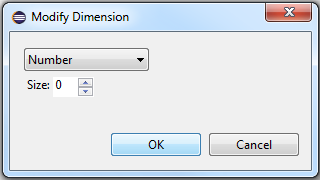

## Arrays
The graphical editor supports creating arrays for appropriate features and subcomponents.

### Creating Arrays
When viewing a component type diagram or component implementation diagram, a feature or subcomponent array can be created, respectively.

1. Right-click on the appropriate element.

2. Select *Modify Dimensions...* from the context menu.

3. From the Modify Dimensions dialog, select *Add*, then *Modify*.

4. From the Modify Dimension dialog, select desired type and value.

5. Select *OK*. The array dimensions will appear on the element.

### Editing Arrays
To edit an array, right-click on a feature or subcomponent array and select *Modify Dimensions...* from the context menu.

#### Add Dimension
1. From the *Modify Dimensions* dialog, select *Add*, then *Modify*.

2. From the *Modify Dimension* dialog, select desired type and value.

3. Select *OK*. The new array dimension will appear.

#### Change Dimension Order
From the *Modify Dimensions* dialog, select the desired dimension and select *Up* or *Down*.

#### Delete Dimension
From the *Modify Dimensions* dialog, select the desired dimension and select *Delete*.
