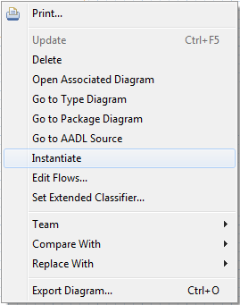

## Basics
Many of the operations in the graphical editor apply to multiple types of elements.

### Deleting
An element can be deleted from the AADL model by selecting it and pressing the ***Delete*** key. An element can also be deleted by right-clicking on it and selecting *Delete* from the context menu.

Elements can only be deleted when viewing the element which contains it. For example, a feature defined in a system type cannot be deleted while editing the diagram of a system implementation.

### Renaming
An element can be renamed using the graphical editor.

1. Select the item to be renamed.

2. Click the name label.  An editable field will appear.

3. Adjust the name as desired.

4. Press the ***Enter*** key.

Elements can only be renamed when viewing the element which contains it. For example, a feature defined in a system type cannot be renamed while editing the diagram of a system implementation.

### Refining
Appropriate elements can be refined by right-clicking on them and selecting *Refine* from the context menu. Once an element is refined. Deleting a refined element will only delete the refinement.

### Instantiating
When viewing a package diagram, component implementations can be instantiated by right-clicking on them and selecting *Instantiate* from the context menu. The instance model will be created in that projects *instances* folder in the AADL Navigator.

### Editing Property Associations
Property associations can be edited using OSATE's *AADL Property Values* view. Selecting an element in the diagram updates the view to show property values for that element.

### Moving Shapes Using Arrow Keys
1. Select the item to be moved.

2. Press the ***.*** key.

3. Using the ***Arrow*** keys, move the item to desired location.

4. Press the ***Enter*** key.

### Selecting a Diagram Element's Container
Under some circumstances, it is difficult to select the desired diagram element due to the location of child diagram elements. The desired shape can be selected using the following steps.

1. Right-click on the child of the diagram element to be selected.

2. Select *Select Container* from the context menu.

### Performing Diagram Layout
When creating a new diagram from an AADL model, the editor lays out the diagram automatically. The layout of the diagram can be redone by right-clicking inside the diagram and select *Layout Diagram*. Doing so will adjust the positions of all the shapes in the diagram.

