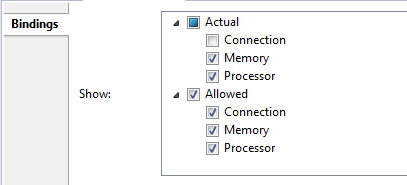

## Bindings

### Creating Bindings
When viewing a component implementation diagram, a binding property associations can be created.

### Setting Bindings

#### Using the Toolbar to Set Bindings
1. Select the diagram element for which to set the binding.

2. Select the *Bind...* button from the toolbar. 

3. From the Bind dialog, select a binding property from the drop-down menu.

4. Select one or more elements from the diagram to bind to the initially selected element.

5. Select *OK*.

#### Using the Context Menu to Set Bindings
1. Right-click on the diagram element for which to set the binding.

2. Select *Bind...* from the context menu.

3. From the Bind dialog, select a binding property from the drop-down menu.

4. Select one or more elements from the diagram to bind to the initially selected element.

5. Select *OK*.

### Bindings Diagram Properties
The *Properties* view can be used to customize which bindings are shown in a diagram. By default, all supported bindings are displayed.

1. Left-click the empty space outside of the elements in a diagram.

2. In the *Properties* view, select the *Bindings* tab.

3. Select the checkboxes to configure which bindings to show.

