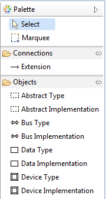

## Classifiers
The graphical editor allows editing AADL classifiers such as component types, component implementations, and feature groups.

### Creating
When viewing a package diagram, classifiers can be created by using the palette.

1. Open a package diagram.

2. Drag the appropriate classifier type from the palette onto the diagram.

3. If a component implementation was dropped onto the diagram, select the classifier for the implementation to implement or extend.

### Extending
The editor allows classifier extensions to be specified in the package view. That is, the editor allows the specification of type extensions and implementation relationships.

#### Using the Palette to Extend a Classifier
1. While editing a package diagram, select *Extension* from the Palette.

2. Select on the classifier which will be the extension.

3. Select the classifier that is being extended. An arrow will now appear. The type of arrow is determined whether the extension is an implementation or type extension.

#### Using the Context Menu to Set Extended Classifier
Specifying an extension using the context menu allows extending classifiers in other packages.

1. Right-click on the classifier which will be the extension and select *Set Extended Classifier...* from the context menu.

2. Select the classifier to extend.

3. Select *OK*. The appropriate arrow indicating the extension will appear.

### Performing Update Layout from Classifier Diagram
When extending a classifier, the editor lays out the extending classifier diagram automatically. The layout of the extending classifier diagram can be redone to match the extended classifier diagram by right-clicking the extending claissifier diagram and selecting *Perform Update Layout from Classifier Diagram* from the context menu. Doing so will change the height, width, and layout of elements of the extending classifier to match the extended classifier.
