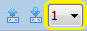

## Subcomponents
The graphical editor allows editing subcomponents when viewing a component implementation diagram.

### Creating
When viewing a component implementation diagram, a subcomponent can be creating by using the palette. Drag the appropriate subcomponent type from the palette to the desired location. A new subcomponent will appear.

### Setting the Classifier
Select the subcomponent classifier by right-clicking on the subcomponent and selecting *Set Classifier...* from the context menu. After selecting the classifier, the subcomponent will be updated to show the appropriate features.

### Setting Modes
To set the modes in which subcomponents are active, see [Section 7.7, "Selecting Active Components"](eam_m.html#selecting-active-components)

### Displaying Details
Internal details of subcomponents such as inner connections and subcomponents can be displayed within a diagram. The number of subcomponent levels to display is determined by the nesting depth. The nesting depth can be set to customize how many subcomponent levels to show. Anything beyond the specified nesting depth is hidden from the diagram.

#### Using the Increase and Decrease Nesting Depth Buttons to Select a Nesting Depth
Nesting depth can be set using the Increase and Decrease Nesting Depth buttons on the toolbar. 

#### Using the Depth Selector Drop-Down to Select a Nesting Depth
The nesting depth can be set using the depth selector on the toolbar.

1. Select the depth selector drop-down.

2. Select the preferred nesting depth.

