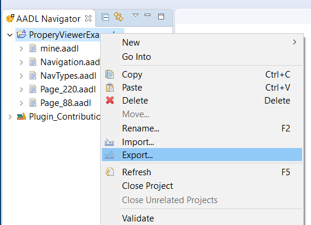
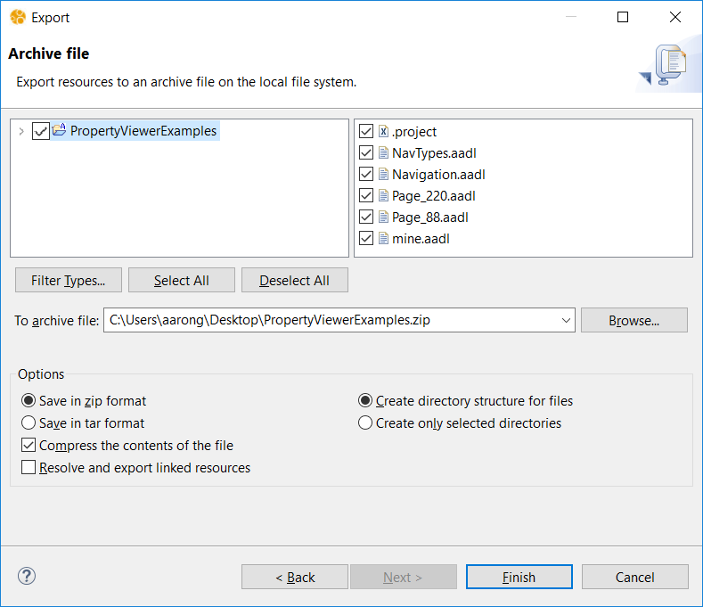

# How To Export a Project From Eclipse

Eclipse projects can be exported from an Eclipse workspace as `.zip` files.  This is an easy way to package a project so it  an be used by another user.  Here we show how to export an AADL project containing `.aadl` model files, but these instructions are not specific to OSATE or working with AADL source files.

> **Example**
>
> In this section we export the project that we imported into the workspace n the section [How to Import a project Into Exclipse]().  Below it is assumed that you have a project named `PropertyViewerExamples` in your workspace.

## Open the Export Wizard

Open the export wizard by 

1. Selecting the project `PropertyViewerExamples` in the `AADL Navigator`.
2. Selecting `Export...` from the context menu.

You should see a dialog like this:

Select `General > Archive File`, and click on the `Next >` button.

## Create the Archive

An `Archive file` wizard dialog will open.

* The top section of the wizard allows you to choose the exact contents of the project to export.  In this case, as in most cases, you do not need to change the default selections; the whole project will be exported.
* The bottom section of the wizard allows to control how the archive file is created.  Again, usually the default values are fine.  In this case, just make sure that `Save in zip format` is selected.
* In the center of the wizard enter the pathname of the archive file to create, or use the `Browse...` button to use the file selection dialog to specify the pathname.
* Click on the `Finish` button to begin the import process.

### Use Your New Archive

The wizard dialog will close when the export process finishes.  The new archive file will be created where you specified.  You can now share this archive with other users.
